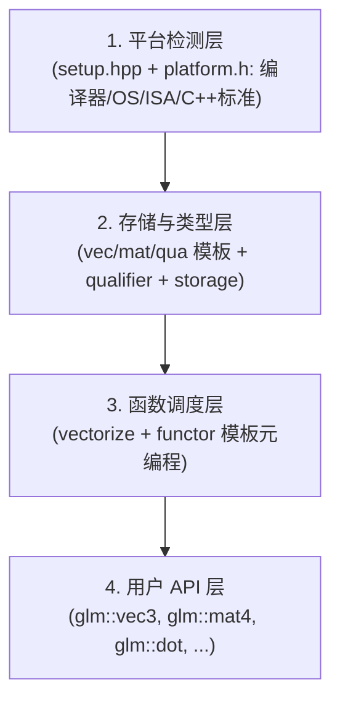
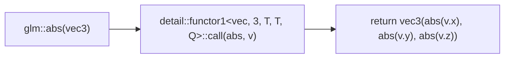
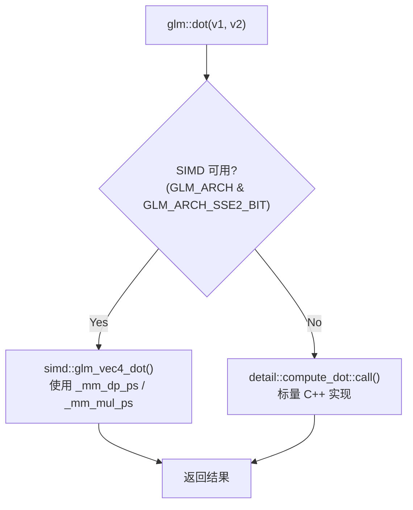
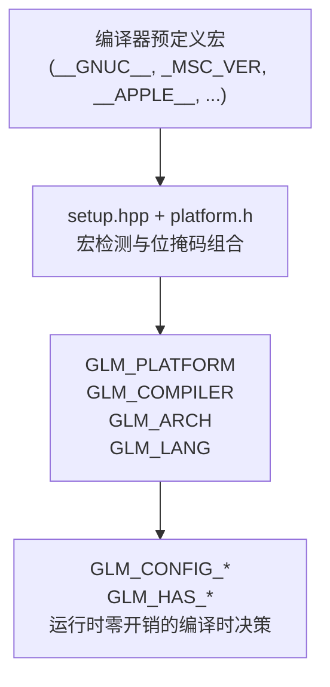

# GLM (OpenGL Mathematics) 源码深度分析

> 基于 glm-1.0.3 源码，对 GLM 的整体架构、设计哲学、核心实现原理和跨平台机制进行系统性剖析。

---

## 一、库概览与设计理念

### 1.1 什么是 GLM？

GLM 是一个 **C++ Header-Only 数学库**，专为 OpenGL 图形编程设计。它的核心设计目标是 **完全模仿 GLSL (OpenGL Shading Language) 规范**——包括类型系统、函数命名、函数签名和行为语义。

简单来说：**你在 shader 里怎么写 GLSL，在 C++ 里就怎么写 GLM**。

### 1.2 设计哲学核心

GLM 的设计遵循几个关键原则：

| 原则 | 说明 | 源码体现 |
|------|------|----------|
| **GLSL 兼容** | 类型名、函数名、参数顺序完全对标 GLSL 规范 | `glm/common.hpp` 中的 `floor()`, `mix()`, `clamp()` 等 |
| **Header-Only** | 全部实现在头文件中，无需编译链接 | 所有 `.inl` 文件通过 `#include` 被 `.hpp` 引入 |
| **编译时多态** | 通过 C++ 模板实现的静态分发，零运行时开销 | `vec<L, T, Q>` 模板参数化 |
| **渐进式增强** | 核心 → 稳定扩展(GTC) → 实验扩展(GTX) 三层架构 | 文件组织为 `core/`, `ext/`, `gtc/`, `gtx/` |
| **SIMD 自动利用** | 根据 CPU 架构自动选择最优指令集 | `glm/simd/` 目录下的 SSE2/AVX/NEON 实现 |

---

## 二、源码目录结构

```
glm-1.0.3/
├── glm/                          # 核心库 (所有头文件)
│   ├── detail/                   # 内部实现细节
│   │   ├── setup.hpp             # ★ 编译时平台/编译器/C++标准检测
│   │   ├── qualifier.hpp         # ★ 精度与对齐限定符 (lowp/mediump/highp, packed/aligned)
│   │   ├── type_vec1.hpp ~ type_vec4.hpp  # ★ 向量类型声明
│   │   ├── type_mat4x4.hpp 等   # ★ 矩阵类型声明
│   │   ├── type_quat.hpp         # ★ 四元数类型
│   │   ├── _vectorize.hpp       # ★ 向量化调度器 (functor 模板元编程)
│   │   ├── _swizzle.hpp         # Swizzle 操作 (结构体方式)
│   │   ├── _swizzle_func.hpp     # Swizzle 操作 (函数方式)
│   │   ├── _features.hpp         # C++ 特性标记
│   │   ├── _fixes.hpp            # 各平台/编译器的 workaround
│   │   ├── compute_*.hpp         # 计算层元编程
│   │   ├── func_*.inl            # 通用函数的 scalar 实现
│   │   ├── func_*_simd.inl        # 通用函数的 SIMD 实现
│   │   └── type_*.inl            # 类型成员函数实现
│   ├── simd/                     # SIMD 底层原语
│   │   ├── platform.h            # ★ 平台/编译器/指令集自动检测
│   │   ├── common.h              # ★ SSE2 通用数学运算
│   │   ├── geometric.h           # ★ SSE2 几何运算
│   │   ├── trigonometric.h       # SSE2 三角函数
│   │   ├── matrix.h              # SSE2 矩阵运算
│   │   ├── neon.h                # ARM NEON 支持
│   │   └── ...
│   ├── ext/                      # 稳定扩展 (GLM_EXT_*)
│   ├── gtc/                      # 推荐稳定扩展 (GLM_GTC_*)
│   ├── gtx/                      # 实验性扩展 (GLM_GTX_*)
│   ├── glm.hpp                   # ★ 总入口文件 (包含所有核心)
│   ├── ext.hpp                   # 包含所有 EXT + GTC + GTX 扩展
│   ├── common.hpp                # 通用函数 (floor, mix, clamp, ...)
│   ├── geometric.hpp             # 几何函数 (dot, cross, normalize, ...)
│   ├── trigonometric.hpp         # 三角函数
│   ├── exponential.hpp           # 指数函数
│   ├── matrix.hpp                # 矩阵函数
│   ├── integer.hpp               # 整数函数
│   ├── packing.hpp               # 数据打包函数
│   ├── vector_relational.hpp     # 向量关系运算
│   ├── fwd.hpp                   # ★ 前向声明和类型别名 (大量 typedef)
│   └── vec2.hpp ~ mat4x4.hpp    # 便捷 include
├── test/                         # 测试代码
├── util/                         # 工具脚本
├── cmake/                        # CMake 辅助
├── manual.md                     # 详细手册
└── CMakeLists.txt                # 构建配置
```

---

## 三、核心架构：四层抽象

GLM 的核心架构可以抽象为 **四个层次**，从底到顶依次为：



### 3.1 第一层：平台检测层

这是 GLM 跨平台能力的核心。由两个文件主导：

- **`glm/detail/setup.hpp`**：检测 C++ 标准版本、语言扩展、编译器特性
- **`glm/simd/platform.h`**：检测操作系统、编译器品牌版本、SIMD 指令集

#### 3.1.1 操作系统检测 (`glm/simd/platform.h` 第 1-42 行)

```cpp
// 通过预定义宏检测平台
#if defined(__APPLE__)
#   define GLM_PLATFORM GLM_PLATFORM_APPLE
#elif defined(_WIN32)
#   define GLM_PLATFORM GLM_PLATFORM_WINDOWS
#elif defined(__ANDROID__)
#   define GLM_PLATFORM GLM_PLATFORM_ANDROID
#elif defined(__linux)
#   define GLM_PLATFORM GLM_PLATFORM_LINUX
// ...
```

平台枚举用位掩码表示：`GLM_PLATFORM_WINDOWS = 0x00010000`, `GLM_PLATFORM_LINUX = 0x00020000` 等。

#### 3.1.2 编译器检测 (`glm/simd/platform.h` 第 44-280 行)

支持所有主流编译器：

| 编译器 | 宏标志 | 最小版本要求 |
|--------|--------|-------------|
| GCC | `GLM_COMPILER_GCC` | 4.6+ |
| Clang | `GLM_COMPILER_CLANG` | 3.4+ |
| MSVC | `GLM_COMPILER_VC` | VS2013 (VC12)+ |
| Intel ICC | `GLM_COMPILER_INTEL` | 2013 SP1+ |
| CUDA | `GLM_COMPILER_CUDA` | 7.0+ |
| HIP | `GLM_COMPILER_HIP` | 最新 |

检测方法是通过编译器预定义宏（如 `__GNUC__`, `__clang__`, `_MSC_VER`, `__INTEL_COMPILER`）来确定编译器和版本：

```cpp
// glm/simd/platform.h 第 222-240 行
#elif defined(__GNUC__) || defined(__MINGW32__)
#   if __GNUC__ >= 14
#       define GLM_COMPILER GLM_COMPILER_GCC14
#   elif __GNUC__ >= 13
#       define GLM_COMPILER GLM_COMPILER_GCC13
// ...
```

#### 3.1.3 SIMD 指令集检测 (`glm/simd/platform.h` 第 283-380 行)

这是 GLM 性能的关键。指令集采用层级式位掩码：

```
GLM_ARCH_X86 ──► GLM_ARCH_SSE ──► GLM_ARCH_SSE2 ──► GLM_ARCH_SSE3
    └──►   GLM_ARCH_SSSE3 ──► GLM_ARCH_SSE41 ──► GLM_ARCH_SSE42
    └──►   GLM_ARCH_AVX ──► GLM_ARCH_AVX2

GLM_ARCH_ARM ──► GLM_ARCH_NEON ──► GLM_ARCH_ARMV8
GLM_ARCH_PPC, GLM_ARCH_MIPS   (无 SIMD)
```

检测逻辑分为三种模式：

1. **强制模式** (`GLM_FORCE_SSE2/AVX/AVX2/NEON`)：用户显式指定
2. **自动检测模式** (`GLM_FORCE_INTRINSICS`)：根据编译器预定义宏 (`__AVX2__`, `__SSE4_2__`, `__ARM_NEON` 等) 自动选择
3. **纯 C++ 模式** (`GLM_FORCE_PURE`)：不使用任何 SIMD 指令

#### 3.1.4 C++ 标准检测 (`glm/detail/setup.hpp` 第 58-150 行)

```cpp
// C++ 标准用位掩码表示
#define GLM_LANG_CXX98_FLAG  (1 << 1)
#define GLM_LANG_CXX11_FLAG  (1 << 4)
#define GLM_LANG_CXX14_FLAG  (1 << 5)
#define GLM_LANG_CXX17_FLAG  (1 << 6)
#define GLM_LANG_CXX20_FLAG  (1 << 7)

// 自动检测或通过 GLM_FORCE_CXX** 强制指定
#if defined(GLM_FORCE_CXX20)
#   define GLM_LANG (GLM_LANG_CXX20 | GLM_LANG_EXT)
#elif defined(GLM_FORCE_CXX17)
// ...
```

#### 3.1.5 C++ 特性可用性检测 (`glm/detail/setup.hpp` 第 143-330 行)

对每个 C++11/14/17 特性逐一检测可用性：

```cpp
// 检测 static_assert - N1720
#if GLM_COMPILER & GLM_COMPILER_CLANG
#   define GLM_HAS_STATIC_ASSERT __has_feature(cxx_static_assert)
#elif GLM_LANG & GLM_LANG_CXX11_FLAG
#   define GLM_HAS_STATIC_ASSERT 1
// ...

// 检测 alignas - N2341
#if GLM_LANG & GLM_LANG_CXX11_FLAG
#   define GLM_HAS_ALIGNOF 1
// ...

// 检测 constexpr - N2235/N3652
// SIMD intrinsics 不支持 constexpr
#if (GLM_ARCH & GLM_ARCH_SIMD_BIT)
#   define GLM_HAS_CONSTEXPR 0      // 使用 SIMD 时禁用 constexpr
#elif (GLM_LANG & GLM_LANG_CXX14_FLAG)
#   define GLM_HAS_CONSTEXPR 1
// ...
```

**关键设计决策**：使用 SIMD intrinsics 时强制禁用 `constexpr`，因为编译器内置函数不是常量表达式。

---

### 3.2 第二层：存储与类型层

#### 3.2.1 核心类型模板参数化

GLM 的核心类型（`glm/detail/qualifier.hpp` 第 35-38 行，`glm/fwd.hpp`）：

```cpp
// 向量: L=维度, T=标量类型, Q=精度/对齐限定符
template<length_t L, typename T, qualifier Q = defaultp> struct vec;

// 矩阵: C=列数, R=行数
template<length_t C, length_t R, typename T, qualifier Q = defaultp> struct mat;

// 四元数
template<typename T, qualifier Q = defaultp> struct qua;
```

例如 `glm::vec3` 就是 `vec<3, float, defaultp>`，`glm::mat4` 就是 `mat<4, 4, float, defaultp>`。

#### 3.2.2 精度与对齐限定符 (`glm/detail/qualifier.hpp`)

GLSL 中有 `lowp`、`mediump`、`highp` 精度限定符和 `packed`、`aligned` 对齐限定符，GLM 通过 `qualifier` 枚举在 C++ 中模拟：

```cpp
enum qualifier
{
    packed_highp,    // 紧密打包 + 高精度
    packed_mediump,  // 紧密打包 + 中等精度
    packed_lowp,     // 紧密打包 + 低精度 (最高性能)

    aligned_highp,   // 对齐存储(支持 SIMD) + 高精度
    aligned_mediump, // 对齐存储(支持 SIMD) + 中等精度
    aligned_lowp,    // 对齐存储(支持 SIMD) + 低精度

    highp   = packed_highp,
    mediump = packed_mediump,
    lowp    = packed_lowp,
    packed  = packed_highp,
    aligned = aligned_highp,

    defaultp = highp  // 或 aligned_highp (取决于配置)
};
```

#### 3.2.3 存储策略分发 (`glm/detail/qualifier.hpp` 第 74-170 行)

GLM 通过 `storage<L, T, is_aligned>` 模板特化来控制向量和矩阵的底层内存布局：

```cpp
// 普通打包存储
template<length_t L, typename T, bool is_aligned>
struct storage {
    typedef struct type { T data[L]; } type;
};

// 对齐存储 (支持 SIMD)
template<length_t L, typename T>
struct storage<L, T, true> {
    typedef struct alignas(L * sizeof(T)) type { T data[L]; } type;
};

// vec3 特殊处理: 用 4 分量存储以支持 SIMD
template<typename T>
struct storage<3, T, true> {
    typedef struct alignas(4 * sizeof(T)) type { T data[4]; } type;
};

// SSE2 架构下直接用 SIMD 类型
template<>
struct storage<4, float, true> {
    typedef glm_f32vec4 type;  // 即 __m128
};
```

**关键点**：`vec3` 在内部分配 4 个分量的空间（第 4 个为 padding），以便 SSE `__m128` 能够高效处理。矩阵将每列视为一个 `vec4`。

#### 3.2.4 vec4 类型详解 (`glm/detail/type_vec4.hpp`)

以 `vec4` 为例看类型声明：

```cpp
template<typename T, qualifier Q>
struct vec<4, T, Q>
{
    // 匿名 union 提供多种分量访问方式
    // (在非 XYZW_ONLY 模式下)
    union {
        struct { T x, y, z, w; };
        struct { T r, g, b, a; };
        struct { T s, t, p, q; };
        // 实际数据存储
        typename detail::storage<4, T, detail::is_aligned<Q>::value>::type data;
    };

    // 提供完整的运算符重载
    vec& operator+=(vec const& v);
    vec& operator-=(vec const& v);
    vec& operator*=(T scalar);
    // ... 所有算术、位运算、比较运算符
};
```

这使得你可以用 `.x/.y/.z/.w` 或 `.r/.g/.b/.a` 或 `.s/.t/.p/.q` 访问分量，完全和 GLSL 一样。

#### 3.2.5 mat4x4 类型详解 (`glm/detail/type_mat4x4.hpp`)

矩阵以**列向量数组**方式存储（与 GLSL 的列主序一致）：

```cpp
template<typename T, qualifier Q>
struct mat<4, 4, T, Q>
{
    typedef vec<4, T, Q> col_type;
    typedef vec<4, T, Q> row_type;

private:
    col_type value[4];    // 4 个列向量 (GLSL 列主序!)

public:
    GLM_FUNC_DECL GLM_CONSTEXPR col_type & operator[](length_type i);
    // ... 构造、转换、运算符
};
```

**重要**：`value[0]` 是第一列（对应 `m00, m10, m20, m30`），`operator[]` 返回的是**列向量**。

---

### 3.3 第三层：函数调度层

#### 3.3.1 向量化 (Vectorize) 机制 (`glm/detail/_vectorize.hpp`)

GLM 使用**模板特化 + functor 模式**来实现"一个标量函数自动变向量函数"。

当用户写 `glm::abs(someVec3)` 时，实际调用路径为：



`functor1` 对维度 1~4 分别特化：

```cpp
// 单分量
template<template<length_t L, typename T, qualifier Q> class vec,
         typename R, typename T, qualifier Q>
struct functor1<vec, 1, R, T, Q> {
    static vec<1, R, Q> call(R (*Func)(T x), vec<1, T, Q> const& v) {
        return vec<1, R, Q>(Func(v.x));
    }
};

// 四分量
template<...>
struct functor1<vec, 4, R, T, Q> {
    static vec<4, R, Q> call(R (*Func)(T x), vec<4, T, Q> const& v) {
        return vec<4, R, Q>(Func(v.x), Func(v.y), Func(v.z), Func(v.w));
    }
};
```

类似地还有：
- `functor2`：二元函数向量化（如 `glm::min(a, b)`）
- `functor2_vec_sca`：一向量一标量的混合（如 `glm::step(edge, x)`）
- `functor2_vec_int`：返回整数向量的二元函数

#### 3.3.2 SIMD 与 Scalar 的双路径调度

GLM 的每个数学函数都有两个实现路径：



以 `dot` 函数为例的实现 (`glm/detail/func_geometric.inl`)：

```cpp
// Scalar 路径 (模板元编程)
template<typename T, qualifier Q, bool Aligned>
struct compute_dot<vec<4, T, Q>, T, Aligned> {
    GLM_FUNC_QUALIFIER GLM_CONSTEXPR static T call(
        vec<4, T, Q> const& a, vec<4, T, Q> const& b) {
        // VS 17.7.4 编译器优化差异处理
        #if defined(_MSC_VER)
            return a.x*b.x + a.y*b.y + a.z*b.z + a.w*b.w;
        #else
            vec<4, T, Q> tmp(a * b);
            return (tmp.x + tmp.y) + (tmp.z + tmp.w);
        #endif
    }
};
```

SIMD 路径 (`glm/simd/geometric.h`)：

```cpp
// SSE2/AVX 路径
GLM_FUNC_QUALIFIER glm_vec4 glm_vec4_dot(glm_vec4 v1, glm_vec4 v2) {
#   if GLM_ARCH & GLM_ARCH_AVX_BIT
        return _mm_dp_ps(v1, v2, 0xff);          // AVX: 一条指令
#   elif GLM_ARCH & GLM_ARCH_SSE3_BIT
        glm_vec4 hadd0 = _mm_hadd_ps(mul0, mul0); // SSE3: 水平加
#   else
        // SSE2: shuffle + add 组合
        glm_vec4 swp0 = _mm_shuffle_ps(mul0, mul0, _MM_SHUFFLE(2,3,0,1));
        glm_vec4 add0 = _mm_add_ps(mul0, swp0);
#   endif
}
```

#### 3.3.3 CUDA/HIP 支持

GLM 的所有函数都通过 `GLM_CUDA_FUNC_DEF` / `GLM_CUDA_FUNC_DECL` 宏标注 (`glm/detail/setup.hpp` 第 455-470 行)：

```cpp
// CUDA/HIP 编译器
#if (GLM_COMPILER & GLM_COMPILER_CUDA) || (GLM_COMPILER & GLM_COMPILER_HIP)
#   define GLM_CUDA_FUNC_DEF __device__ __host__
#   define GLM_CUDA_FUNC_DECL __device__ __host__
#else
#   define GLM_CUDA_FUNC_DEF
#   define GLM_CUDA_FUNC_DECL
#endif
```

这意味着同一个 GLM 函数可以**同时运行在 CPU (host) 和 GPU (device) 上**。通过 `GLM_CUDA_FORCE_DEVICE_FUNC` 或 `GLM_CUDA_FORCE_HOST_FUNC` 可以限制到单一端。

---

### 3.4 第四层：用户 API 层

#### 3.4.1 类型别名系统 (`glm/fwd.hpp`)

`glm/fwd.hpp` 包含了上千个 `typedef`，形成完整的类型别名体系。例如：

```cpp
// 基本向量类型
typedef vec<2, float, defaultp> vec2;
typedef vec<3, float, defaultp> vec3;
typedef vec<4, float, defaultp> vec4;

// 精度变体
typedef vec<3, float, highp>   highp_vec3;
typedef vec<3, float, mediump> mediump_vec3;
typedef vec<3, float, lowp>    lowp_vec3;

// 双精度
typedef vec<3, double, defaultp> dvec3;

// 整数向量
typedef vec<3, int, defaultp>    ivec3;
typedef vec<3, uint, defaultp>   uvec3;

// 布尔向量
typedef vec<3, bool, defaultp>   bvec3;

// 矩阵类型 (列主序)
typedef mat<4, 4, float, defaultp> mat4;
typedef mat<4, 4, double, defaultp> dmat4;

// 四元数
typedef qua<float, defaultp>  quat;
typedef qua<double, defaultp> dquat;
```

#### 3.4.2 函数声明 (以 geometric 为例)

`glm/geometric.hpp` 中的函数声明完全对标 GLSL：

| GLM 函数 | GLSL 函数 | 功能 |
|----------|----------|------|
| `length(v)` | `length(v)` | 向量长度 |
| `distance(p0, p1)` | `distance(p0, p1)` | 两点距离 |
| `dot(x, y)` | `dot(x, y)` | 点积 |
| `cross(x, y)` | `cross(x, y)` | 叉积 |
| `normalize(x)` | `normalize(x)` | 归一化 |
| `reflect(I, N)` | `reflect(I, N)` | 反射向量 |
| `refract(I, N, eta)` | `refract(I, N, eta)` | 折射向量 |
| `faceforward(N, I, Nref)` | `faceforward(N, I, Nref)` | 面朝向 |

---

## 四、扩展体系：三层扩展架构

GLM 的扩展分为三个层次：

| 层级 | 目录 | 前缀 | 稳定性 | 示例 |
|------|------|------|--------|------|
| **稳定扩展** | `glm/ext/` | `GLM_EXT_*` | 稳定，充分测试 | `GLM_EXT_matrix_transform` |
| **推荐扩展** | `glm/gtc/` | `GLM_GTC_*` | 稳定，有测试和文档 | `GLM_GTC_matrix_transform` |
| **实验扩展** | `glm/gtx/` | `GLM_GTX_*` | 可能变化，API 不稳定 | `GLM_GTX_euler_angles` |

### 4.1 稳定扩展 (EXT)

共计约 40+ 个模块，主要包括：

- **`GLM_EXT_matrix_transform`**: `translate()`, `rotate()`, `scale()` 等变换矩阵
- **`GLM_EXT_matrix_clip_space`**: `perspective()`, `ortho()`, `frustum()` 等投影矩阵
- **`GLM_EXT_quaternion_common`**: 四元数基本运算 (slerp, conjugate, inverse)
- **`GLM_EXT_scalar_common`**: 标量版本的通用函数
- **`GLM_EXT_vector_relational`**: `equal()`, `notEqual()`, `lessThan()` 等

### 4.2 推荐扩展 (GTC)

共计约 20 个模块：

- **`GLM_GTC_quaternion`**: 四元数与矩阵的相互转换，`quatLookAt()`
- **`GLM_GTC_matrix_inverse`**: `inverse()`, `affineInverse()`
- **`GLM_GTC_type_ptr`**: `value_ptr(mat4)` → `const float*`，用于 OpenGL `glUniform`
- **`GLM_GTC_random`**: `linearRand()`, `gaussRand()` 随机数
- **`GLM_GTC_noise`**: Perlin 噪声 `perlin()`, `simplex()`
- **`GLM_GTC_packing`**: `packUnorm4x8()`, `unpackSnorm2x16()` 等 GPU 数据打包
- **`GLM_GTC_constants`**: 常量定义 (`pi`, `e`, `sqrt2` 等)

### 4.3 实验扩展 (GTX)

共计约 50+ 个模块，需要通过 `GLM_ENABLE_EXPERIMENTAL` 宏启用：

- **`GLM_GTX_euler_angles`**: 欧拉角与矩阵/quaternion 互转
- **`GLM_GTX_matrix_decompose`**: 矩阵分解 (平移/旋转/缩放)
- **`GLM_GTX_dual_quaternion`**: 双四元数 (用于蒙皮动画)
- **`GLM_GTX_io`**: C++ iostream 输出支持
- **`GLM_GTX_hash`**: 向量/矩阵的 std::hash 支持
- **`GLM_GTX_color_space`**: 颜色空间转换 (RGB ↔ HSV/YCoCg)

### 4.4 扩展的包含方式

```cpp
#include <glm/glm.hpp>              // 只引入核心 (向量/矩阵/基本数学函数)
#include <glm/gtc/matrix_transform.hpp>  // 单独引入某个扩展
#include <glm/ext.hpp>              // 引入全部扩展 (不推荐)
```

---

## 五、跨平台机制深度解析

### 5.1 预处理器宏驱动的条件编译

GLM 完全依赖 C 预处理器实现跨平台，不需要任何运行时检测。整个机制的工作流程：



关键宏一览：

| 宏名 | 含义 | 示例值 |
|------|------|--------|
| `GLM_PLATFORM` | 目标操作系统 | `GLM_PLATFORM_LINUX` (0x00020000) |
| `GLM_COMPILER` | 编译器品牌+版本 | `GLM_COMPILER_GCC13` (0x02000A00) |
| `GLM_ARCH` | CPU 架构+指令集 | `GLM_ARCH_AVX2` (SSE4.2 + AVX + AVX2) |
| `GLM_LANG` | C++ 标准版本 | `GLM_LANG_CXX17` (C++14 + C++17 标志) |
| `GLM_MODEL` | 数据模型 | `GLM_MODEL_64` (64-bit) |

### 5.2 指令集架构 (ISA) 覆盖

GLM 支持的 CPU 架构和 SIMD 指令集：

| 架构 | SIMD 支持 | 数据类型映射 |
|------|-----------|-------------|
| **x86/x64 (SSE2)** | SSE2/SSE3/SSSE3/SSE4.1/SSE4.2 | `__m128` → `glm_f32vec4`, `__m128i` → `glm_i32vec4` |
| **x86/x64 (AVX)** | AVX | `__m256d` → `glm_f64vec4` |
| **x86/x64 (AVX2)** | AVX2 | `__m256i` → `glm_i64vec4` |
| **ARM (NEON)** | NEON, ARMv8 | `float32x4_t`, `int32x4_t` |
| **ARM (v8)** | ARMv8 NEON | 同上但用 v8 指令 (硬件除法、FMA 等) |
| **MIPS** | 无 SIMD | 纯 C++ 标量 |
| **PowerPC** | 无 SIMD | 纯 C++ 标量 |

SIMD 类型定义 (`glm/simd/platform.h` 第 400-440 行)：

```cpp
#if GLM_ARCH & GLM_ARCH_SSE2_BIT
    typedef __m128   glm_f32vec4;
    typedef __m128i  glm_i32vec4;
    typedef __m128i  glm_u32vec4;
    typedef __m128d  glm_f64vec2;
#endif

#if GLM_ARCH & GLM_ARCH_AVX_BIT
    typedef __m256d  glm_f64vec4;
#endif

#if GLM_ARCH & GLM_ARCH_NEON_BIT
    typedef float32x4_t   glm_f32vec4;
    typedef int32x4_t     glm_i32vec4;
    typedef uint32x4_t    glm_u32vec4;
#endif
```

### 5.3 编译器适配

GLM 需要处理各编译器之间的差异：

1. **`__forceinline` / `__attribute__((always_inline))`**：不同编译器的强制内联语法
2. **`#pragma` 警告控制**：GCC 用 `#pragma GCC diagnostic`，Clang 用 `#pragma clang diagnostic`，MSVC 用 `#pragma warning`
3. **匿名 struct/union**：MSVC 默认支持，GCC/Clang 需要 `-fms-extensions` 或忍受 `-Wpedantic` 警告
4. **`alignas`**：各编译器实现不同，GLM 通过 `GLM_HAS_ALIGNOF` 统一

### 5.4 constexpr 策略

GLM 使用了一个巧妙的 constexpr 降级策略：

```cpp
// glm/detail/setup.hpp 第 298-310 行
#if (GLM_ARCH & GLM_ARCH_SIMD_BIT)
#   define GLM_HAS_CONSTEXPR 0       // SIMD 路径: 禁用 constexpr
#elif (GLM_LANG & GLM_LANG_CXX14_FLAG)
#   define GLM_HAS_CONSTEXPR 1       // C++14+ 无 SIMD: 启用
// ...

#if GLM_HAS_CONSTEXPR
#   define GLM_CONSTEXPR constexpr
#else
#   define GLM_CONSTEXPR             // 空
#endif
```

这意味着：
- **纯 C++ 路径 + C++14+**：所有构造和运算都是 `constexpr`，可在编译期计算
- **SIMD 路径**：使用运行时 intrinsics，无 `constexpr`

---

## 六、关键设计模式与技术

### 6.1 模板元编程 (functor dispatch)

向量化引擎 (`glm/detail/_vectorize.hpp`) 是 GLM 最精妙的模板元编程实现。它让每个函数只需声明一次，就能自动生成 1~4 维向量的所有组合。

### 6.2 条件编译决策树

GLM 使用位掩码 (`&`, `|`) 而非 `<` `>` 比较做条件编译：

```cpp
// 可以组合多个条件:
if ((GLM_COMPILER & GLM_COMPILER_CLANG) && (GLM_ARCH & GLM_ARCH_SSE2_BIT))
    // Clang on x86 with SSE2
// 位掩码层级关系:
GLM_ARCH_AVX2 = GLM_ARCH_AVX2_BIT | GLM_ARCH_AVX
// 所以: (GLM_ARCH & GLM_ARCH_AVX_BIT) 对 AVX 和 AVX2 都为真
```

### 6.3 表达式模板的缺失

GLM **没有**使用表达式模板（与 Eigen 不同）。每个运算直接返回结果向量/矩阵。这避免了复杂的模板和延长临时对象生命周期的问题，代价是可能产生更多临时对象。

### 6.4 显式模板实例化

对于需要链接成库的场景，GLM 在 `glm/detail/glm.cpp` 中提供了所有常用类型的显式模板实例化：

```cpp
// glm/detail/glm.cpp
template struct vec<4, float32, highp>;
template struct mat<4, 4, float32, highp>;
template struct qua<float32, highp>;
// ... 覆盖所有维度 x 精度 x 类型的组合
```

---

## 七、数据流实例：追踪一次 `glm::cross()` 调用

让我们追踪一次完整的 `glm::cross(v1, v2)` 调用，看看层层分发的路径：

```
用户代码: glm::cross(vec3_a, vec3_b)
    │
    ├─► glm/geometric.hpp: 声明
    │   template<typename T, qualifier Q>
    │   GLM_FUNC_DECL GLM_CONSTEXPR vec<3, T, Q> cross(vec<3, T, Q> const& x, vec<3, T, Q> const& y);
    │
    ├─► glm/detail/func_geometric.inl: 标量实现
    │   template<typename T, qualifier Q, bool Aligned>
    │   struct compute_cross {
    │       static vec<3, T, Q> call(vec<3, T, Q> const& x, vec<3, T, Q> const& y) {
    │           return vec<3, T, Q>(
    │               x.y * y.z - y.y * x.z,
    │               x.z * y.x - y.z * x.x,
    │               x.x * y.y - y.x * x.y);
    │       }
    │   };
    │
    └─► (如果有 SIMD) glm/simd/geometric.h: SIMD 实现
        GLM_FUNC_QUALIFIER glm_vec4 glm_vec4_cross(glm_vec4 v1, glm_vec4 v2) {
            glm_vec4 swp0 = _mm_shuffle_ps(v1, v1, _MM_SHUFFLE(3, 0, 2, 1));
            glm_vec4 swp1 = _mm_shuffle_ps(v1, v1, _MM_SHUFFLE(3, 1, 0, 2));
            // ... 使用 SSE shuffle 一次性计算
        }
```

---

## 八、与 OpenGL 的互操作

### 8.1 value_ptr (`glm/gtc/type_ptr.hpp`)

这是使用 GLM 时最常用的互操作函数：

```cpp
glm::mat4 model = glm::mat4(1.0f);
// 传递给 OpenGL:
glUniformMatrix4fv(location, 1, GL_FALSE, glm::value_ptr(model));
```

`value_ptr` 直接返回底层数组指针（GLM 的内存布局与 GLSL/OpenGL 兼容），零拷贝。

### 8.2 替代已弃用的 OpenGL 函数

GLM 提供了对已弃用的 OpenGL 矩阵函数的替代：

| 旧 OpenGL/GLU 函数 | GLM 替代 |
|-------------------|---------|
| `glTranslatef()` | `glm::translate()` |
| `glRotatef()` | `glm::rotate()` |
| `glScalef()` | `glm::scale()` |
| `gluPerspective()` | `glm::perspective()` |
| `gluLookAt()` | `glm::lookAt()` |
| `glOrtho()` | `glm::ortho()` |
| `gluProject()` / `gluUnProject()` | `glm::project()` / `glm::unProject()` |

---

## 九、总结

### GLM 的优势

1. **与 GLSL 100% 一致**：学习成本极低，shader 怎么写 C++ 就怎么写
2. **真正的跨平台**：Windows/Linux/macOS/Android/iOS + x86/x64/ARM/PPC/MIPS
3. **全编译器覆盖**：GCC 4.6+、Clang 3.4+、MSVC 2013+、Intel ICC、CUDA、HIP
4. **编译时零开销**：通过模板和 preprocessor 实现的编译期多态
5. **自动 SIMD 优化**：检测到 SSE2/AVX/NEON 自动启用，无需用户干预
6. **Header-Only**：只需 include，无需编译链接
7. **CUDA/HIP 兼容**：同一套代码可以在 GPU kernel 中使用
8. **三层扩展体系**：从稳定到实验，按需引入

### 关键源文件索引

| 文件 | 作用 |
|------|------|
| `glm/detail/setup.hpp` | 编译时环境检测 (C++ 标准、编译器特性、配置宏) |
| `glm/simd/platform.h` | 平台/编译器/指令集检测和 SIMD 类型定义 |
| `glm/detail/qualifier.hpp` | 精度/对齐限定符、存储策略、前向声明 |
| `glm/detail/_vectorize.hpp` | 函数向量化调度器 (functor 模板) |
| `glm/detail/type_vec4.hpp` | vec4 类型完整声明 |
| `glm/detail/type_mat4x4.hpp` | mat4x4 类型完整声明 |
| `glm/detail/type_vec1.hpp` | vec1 类型声明 (含匿名 union/swizzle) |
| `glm/detail/func_geometric.inl` | 几何函数标量实现 |
| `glm/detail/glm.cpp` | 显式模板实例化 (library 模式) |
| `glm/simd/common.h` | SSE2 通用数学函数 SIMD 实现 |
| `glm/simd/geometric.h` | SSE2 几何函数 (dot/cross/normalize/reflect) |
| `glm/simd/neon.h` | ARM NEON 辅助函数 |
| `glm/fwd.hpp` | 所有类型的 typedef 别名 |
| `glm/glm.hpp` | 核心库总入口 |
| `glm/ext.hpp` | 所有扩展总入口 |
| `CMakeLists.txt` | 构建系统配置 |
