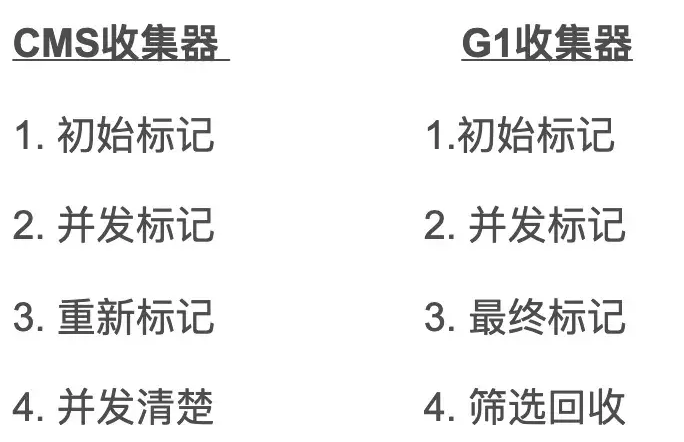

<!--toc:start-->
- [Sealed Class](#sealed-class)
  - [为什么需要密封类？](#为什么需要密封类)
  - [密封类](#密封类)
  - [密封类的子类](#密封类的子类)
<!--toc:end-->

# Sealed Class

密封类(Sealed Classes)，这个概念在许多语言中都存在。例如，在 C#中的密封类表示表明该类是最终类（不可被继承）；在 Scala 中密封类表示 case 类的子类只能限定在当前源文件中定义；在 Kotlin 中密封类要求其子类只能在当前源文件中定义。

那么密封类的密封概念就比较清晰了，即：限制类的继承。

## 为什么需要密封类？

对于面向对象语言来说，对象间的继承、实现关系是为了对类能力的扩展和增强。但是当这种增强的能力无法被原系统支持的时候，则会导致系统出现不可预见的异常逻辑。

所以为了避免开发人员错误地重用一些代码，我们需要对类的继承扩展能力进行限制，以确系统的可控。那种控制需要满足两种条件:

    我们需要对继承关系进行限制
    当我们突破限制的时候需要显示的进行，让用户知晓潜在的风险。

其中第一点是对无序扩展的限制，第二点是在需要进行扩展的时候，仍然可以基于其一种扩展能力，但是风险并不通过提供能力的组件承担，而是用进行声明的用户进行承担。

显然这两种能力中，第一种能力是必须的，第二种能力是扩展的。在第一节中的三种语言中实现的密封类都是实现了第一种控制需求，并没有对第二种进行扩展。

## 密封类

首先 Java 中密封类(Sealed Classes)的核心是: 通过 sealed 修饰符来描述某个类为密封类，同时使用 permits 关键字来制定可以继承或实现该类的类型有哪些。注意 sealed 可以修饰的是类(class)或者接口(interface)，所以 permits 关键字的位置应该在 extends 或者 implements 之后。

## 密封类的子类

密封类：

```java
public sealed class dogServiceImpl implements dogService permits moreDogService {
    @Override    public void doSomething() {    }}
```

final修饰的密封类：

```java
public final class dogServiceImpl implements dogService {
    @Override    public void doSomething() {    }}
```

使用non-sealed修饰的密封类：

```java
public non-sealed class dogServiceImpl implements dogService {
    @Override    public void doSomething() {    }
    static class bigDogExtend extends dogServiceImpl {    }}
```

首先，对于密封类来说，其子类如果仍然是密封的类，说明由下游调用方继续提供密封保障。而如果是最终态类的话，则指定类已经形成完全密封，所以满足密封保障。而第三种使用non-sealed关键字对类进行显式的声明其不进行密封，这种情况下由下游调用方承担打破密封的风险。。

从密封性的角度上来说，sealed 子类传递了密封性；final 的子类确认密封性；non-sealed 显式放弃密封性。

我们可以发现，第三种 non-sealed 类型的关键字便为用户提供了一种可以当用户认同风险的情况下突破限制的手段，所以我们认为在密封灵活性的方面 Sealed Classes 能力在保持密封特性的前提下提供了极大的扩展性。

对类的继承，子类必须为 permits 关键字声明类的直接实现类。

密封类不支持匿名类与函数式接口。

# 垃圾回收 cms和g1的区别是什么？

1. 适用范围不一样

- CMS是老年代的收集器，可以配合新生代的Serial和ParNew收集器一起使用。
- G1的收集范围是老年代和新生代，不需要结合其他收集器使用。

2. STW的时间

- CMS收集器以最小的停顿时间为目标的收集器。
- G1收集器可预测垃圾回收的停顿时间。

3. 垃圾碎片

- CMS收集器使用的是"标记-清除"算法进行的垃圾回收，容易产生内存碎片。
- G1收集器使用的是"标记-整理"算法，进行了空间整合，没有内存空间碎片。

4. 垃圾回收的过程不一样



5. CMS会产生浮动垃圾

- CMS产生浮动垃圾过多时会退化为Serial Old,效率低，因为CMS清除垃圾是并发清除的，这时候垃圾回收线程和用户线程同时工作会产生浮动垃圾，就意味着CMS垃圾回收必须预留一部分内存空间用于存放浮动垃圾。
- G1没有浮动垃圾，他的筛选回收是多个垃圾回收线程并行GC的，没有浮动垃圾的回收，在执行‘并发清理’步骤时，用户线程也会同时产生一部分可回收对象，但是这部分可回收对象只能在下次执行清理是才会被回收。如果在清理过程中预留给用户线程的内存不足就会出现‘Concurrent Mode Failure’,一旦出现此错误时便会切换到SerialOld收集方式。

# JVM内存区域

JVM运行时内存共分为虚拟机栈、堆、元空间、程序计数器、本地方法栈五个部分。还有一部分内存叫直接内存，属于操作系统的本地内存，是可以直接操作的。

## JVM的内存结构主要分为以下几部分

1. 元空间：元空间的本质和永久代类似，都是对JVM规范中方法区的实现。不过元空间与永久代之间最大的区别在于：元空间并不在虚拟机中，而是使用本地内存。

2. Java虚拟机栈：每个线程有一个私有的栈，随着线程的创建而创建。栈里面存着的是一种叫“栈帧”的东西，每个方法会创建一个栈帧，栈帧中存放了局部变量表（基本数据类型和对象引用）、操作数栈、方法出口等信息。栈的大小可以固定也可以动态扩展。

3. 本地方法栈：与虚拟机栈类似，区别是虚拟机栈执行java方法，本地方法站执行native方法。在虚拟机规范中对本地方法栈中方法使用的语言、使用方法与数据结构没有强制规定，因此虚拟机可以自由实现它。

4. 程序计数器：程序计数器可以看成是当前线程所执行的字节码的行号指示器。在任何一个确定的时刻，一个处理器（对于多内核来说是一个内核）都只会执行一条线程中的指令。因此，为了线程切换后能恢复到正确的执行位置，每条线程都需要一个独立的程序计数器，我们称这类内存区域为“线程私有”内存。

5. 堆内存：堆内存是 JVM 所有线程共享的部分，在虚拟机启动的时候就已经创建。所有的对象和数组都在堆上进行分配。这部分空间可通过 GC 进行回收。当申请不到空间时会抛出 OutOfMemoryError。堆是JVM内存占用最大，管理最复杂的一个区域。其唯一的用途就是存放对象实例：所有的对象实例及数组都在对上进行分配。jdk1.8后，字符串常量池从永久代中剥离出来，存放在堆中。

6. 直接内存：直接内存并不是虚拟机运行时数据区的一部分，也不是Java 虚拟机规范中定义的内存区域。在JDK1.4 中新加入了NIO(New Input/Output)类，引入了一种基于通道(Channel)与缓冲区（Buffer）的I/O 方式，它可以使用native 函数库直接分配堆外内存，然后通脱一个存储在Java堆中的DirectByteBuffer 对象作为这块内存的引用进行操作。这样能在一些场景中显著提高性能，因为避免了在Java堆和Native堆中来回复制数据。

# JVM的GC机制？

- Serial收集器（复制算法): 新生代单线程收集器，标记和清理都是单线程，优点是简单高效；
- ParNew收集器 (复制算法): 新生代收并行集器，实际上是Serial收集器的多线程版本，在多核CPU环境下有着比Serial更好的表现；
- Parallel Scavenge收集器 (复制算法): 新生代并行收集器，追求高吞吐量，高效利用 CPU。吞吐量 = 用户线程时间/(用户线程时间+GC线程时间)，高吞吐量可以高效率的利用CPU时间，尽快完成程序的运算任务，适合后台应用等对交互相应要求不高的场景；
- Serial Old收集器 (标记-整理算法): 老年代单线程收集器，Serial收集器的老年代版本；
- Parallel Old收集器 (标记-整理算法)：老年代并行收集器，吞吐量优先，Parallel Scavenge收集器的老年代版本；
- CMS(Concurrent Mark Sweep)收集器（标记-清除算法）：老年代并行收集器，以获取最短回收停顿时间为目标的收集器，具有高并发、低停顿的特点，追求最短GC回收停顿时间。
- G1(Garbage First)收集器 (标记-整理算法)：Java堆并行收集器，G1收集器是JDK1.7提供的一个新收集器，G1收集器基于“标记-整理”算法实现，也就是说不会产生内存碎片。此外，G1收集器不同于之前的收集器的一个重要特点是：G1回收的范围是整个Java堆(包括新生代，老年代)，而前六种收集器回收的范围仅限于新生代或老年代
