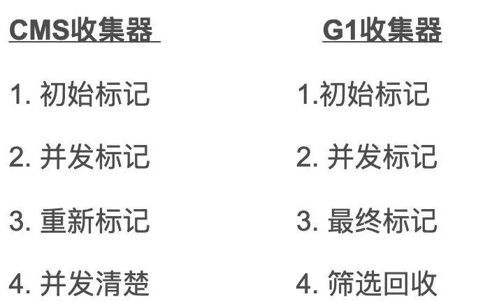

<!--toc:start-->
- [Sealed Class](#sealed-class)
  - [为什么需要密封类？](#为什么需要密封类)
  - [密封类](#密封类)
  - [密封类的子类](#密封类的子类)
<!--toc:end-->

# Sealed Class

密封类(Sealed Classes)，这个概念在许多语言中都存在。例如，在 C#中的密封类表示表明该类是最终类（不可被继承）；在 Scala 中密封类表示 case 类的子类只能限定在当前源文件中定义；在 Kotlin 中密封类要求其子类只能在当前源文件中定义。

那么密封类的密封概念就比较清晰了，即：限制类的继承。

## 为什么需要密封类？

对于面向对象语言来说，对象间的继承、实现关系是为了对类能力的扩展和增强。但是当这种增强的能力无法被原系统支持的时候，则会导致系统出现不可预见的异常逻辑。

所以为了避免开发人员错误地重用一些代码，我们需要对类的继承扩展能力进行限制，以确系统的可控。那种控制需要满足两种条件:

    我们需要对继承关系进行限制
    当我们突破限制的时候需要显示的进行，让用户知晓潜在的风险。

其中第一点是对无序扩展的限制，第二点是在需要进行扩展的时候，仍然可以基于其一种扩展能力，但是风险并不通过提供能力的组件承担，而是用进行声明的用户进行承担。

显然这两种能力中，第一种能力是必须的，第二种能力是扩展的。在第一节中的三种语言中实现的密封类都是实现了第一种控制需求，并没有对第二种进行扩展。

## 密封类

首先 Java 中密封类(Sealed Classes)的核心是: 通过 sealed 修饰符来描述某个类为密封类，同时使用 permits 关键字来制定可以继承或实现该类的类型有哪些。注意 sealed 可以修饰的是类(class)或者接口(interface)，所以 permits 关键字的位置应该在 extends 或者 implements 之后。

## 密封类的子类

密封类：

```java
public sealed class dogServiceImpl implements dogService permits moreDogService {
    @Override    public void doSomething() {    }}
```

final修饰的密封类：

```java
public final class dogServiceImpl implements dogService {
    @Override    public void doSomething() {    }}
```

使用non-sealed修饰的密封类：

```java
public non-sealed class dogServiceImpl implements dogService {
    @Override    public void doSomething() {    }
    static class bigDogExtend extends dogServiceImpl {    }}
```

首先，对于密封类来说，其子类如果仍然是密封的类，说明由下游调用方继续提供密封保障。而如果是最终态类的话，则指定类已经形成完全密封，所以满足密封保障。而第三种使用non-sealed关键字对类进行显式的声明其不进行密封，这种情况下由下游调用方承担打破密封的风险。。

从密封性的角度上来说，sealed 子类传递了密封性；final 的子类确认密封性；non-sealed 显式放弃密封性。

我们可以发现，第三种 non-sealed 类型的关键字便为用户提供了一种可以当用户认同风险的情况下突破限制的手段，所以我们认为在密封灵活性的方面 Sealed Classes 能力在保持密封特性的前提下提供了极大的扩展性。

对类的继承，子类必须为 permits 关键字声明类的直接实现类。

密封类不支持匿名类与函数式接口。

# 垃圾回收 cms和g1的区别是什么？

1. 适用范围不一样

- CMS是老年代的收集器，可以配合新生代的Serial和ParNew收集器一起使用。
- G1的收集范围是老年代和新生代，不需要结合其他收集器使用。

2. STW的时间

- CMS收集器以最小的停顿时间为目标的收集器。
- G1收集器可预测垃圾回收的停顿时间。

3. 垃圾碎片

- CMS收集器使用的是"标记-清除"算法进行的垃圾回收，容易产生内存碎片。
- G1收集器使用的是"标记-整理"算法，进行了空间整合，没有内存空间碎片。

4. 垃圾回收的过程不一样



5. CMS会产生浮动垃圾

- CMS产生浮动垃圾过多时会退化为Serial Old,效率低，因为CMS清除垃圾是并发清除的，这时候垃圾回收线程和用户线程同时工作会产生浮动垃圾，就意味着CMS垃圾回收必须预留一部分内存空间用于存放浮动垃圾。
- G1没有浮动垃圾，他的筛选回收是多个垃圾回收线程并行GC的，没有浮动垃圾的回收，在执行‘并发清理’步骤时，用户线程也会同时产生一部分可回收对象，但是这部分可回收对象只能在下次执行清理是才会被回收。如果在清理过程中预留给用户线程的内存不足就会出现‘Concurrent Mode Failure’,一旦出现此错误时便会切换到SerialOld收集方式。
