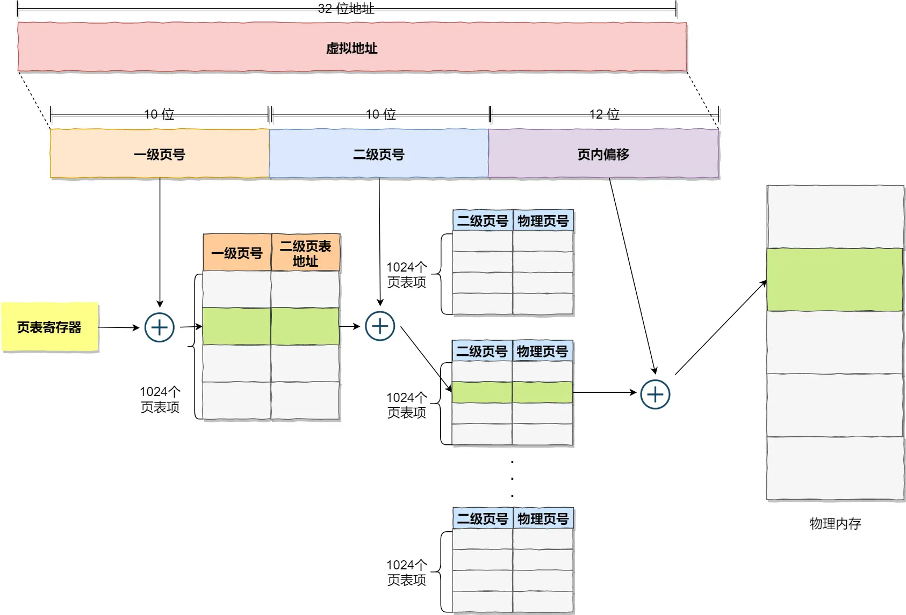
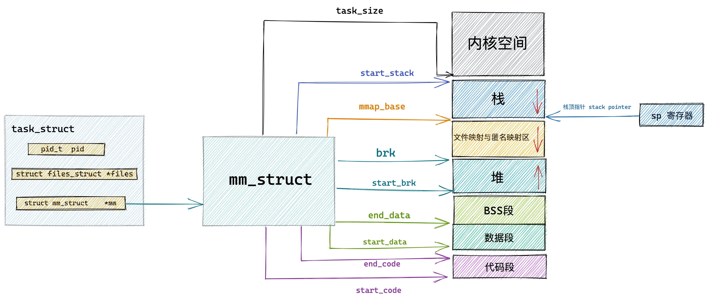

<!--toc:start-->
- [操作系统如何管理虚拟地址与物理地址之间的关系？](#操作系统如何管理虚拟地址与物理地址之间的关系)
  - [内存分段](#内存分段)
    - [分段机制下，虚拟地址和物理地址是如何映射的？](#分段机制下虚拟地址和物理地址是如何映射的)
    - [分段的缺点](#分段的缺点)
  - [内存分页](#内存分页)
    - [分页是怎么解决外部内存碎片和内存交换效率低的问题的？](#分页是怎么解决外部内存碎片和内存交换效率低的问题的)
    - [多级页表](#多级页表)
  - [段页式内存管理](#段页式内存管理)
- [什么是虚拟内存地址](#什么是虚拟内存地址)
- [为什么需要虚拟内存？](#为什么需要虚拟内存)
- [进程虚拟内存空间](#进程虚拟内存空间)
  - [Linux的虚拟内存空间](#linux的虚拟内存空间)
    - [32位环境下](#32位环境下)
    - [64位环境](#64位环境)
- [进程虚拟内存空间的管理](#进程虚拟内存空间的管理)
  - [内核如何划分用户态和内核态虚拟内存空间？](#内核如何划分用户态和内核态虚拟内存空间)
  - [内核如何管理虚拟内存区域](#内核如何管理虚拟内存区域)
  - [定义虚拟内存区域的访问权限和行为规范](#定义虚拟内存区域的访问权限和行为规范)
  - [针对虚拟内存区域的相关操作](#针对虚拟内存区域的相关操作)
  - [虚拟内存区域在内核中是如何被组织的？](#虚拟内存区域在内核中是如何被组织的)
- [编译后的二进制文件如何映射到虚拟内存空间呢？](#编译后的二进制文件如何映射到虚拟内存空间呢)
- [内核虚拟内存空间](#内核虚拟内存空间)
  - [直接映射区](#直接映射区)
    - [一些注意](#一些注意)
  - [ZONE_HIGHMEM 高端内存](#zonehighmem-高端内存)
  - [vmalloc动态映射区](#vmalloc动态映射区)
  - [永久映射区](#永久映射区)
  - [固定映射区](#固定映射区)
  - [临时映射区](#临时映射区)
- [64位的虚拟内存空间布局](#64位的虚拟内存空间布局)
<!--toc:end-->

# 操作系统如何管理虚拟地址与物理地址之间的关系？

主要通过两种方式：

- 内存分段
- 内存分页

## 内存分段

程序是由若干个逻辑分段组成的，如可由代码分段、数据分段、栈段、堆段组成。

不同的段是有不同的属性的，所以就用分段（segment）的形式把这些段分离出来。

### 分段机制下，虚拟地址和物理地址是如何映射的？

分段机制下，虚拟地址由两部分组成：段选择因子和段内偏移。


段选择因子就保存在寄存器里面，其中最重要的就是段号，用作段表的索引。段表里面保存的是这个段的基地址、段的界限和特权等级。

虚地址的段内偏移应该位于0和段界限之间，如果段内偏移是合法的，就将段基址加上段内偏移得到物理内存地址。

### 分段的缺点

1. 内存碎片
2. 内存碎片交换的效率低

## 内存分页

分段的好处就是能产生连续的内存空间，但是会出现「外部内存碎片和内存交换的空间太大」的问题。

要解决这些问题，那么就要想出能少出现一些内存碎片的办法。另外，当需要进行内存交换的时候，让需要交换写入或者从磁盘装载的数据更少一点，这样就可以解决问题了。这个办法，也就是内存分页。

分页是把整个虚拟和物理内存空间切成一段段固定尺寸的大小，。这样一个连续并且尺寸固定的内存空间，我们叫_页_。

虚拟地址和物理地址之间通过页表来进行映射（用一个mmu来翻译）。

当进程访问的虚拟地址在页表中查不到的时候，系统就会产生一个缺页异常，进入系统内核空间分配物理内存、更新进程页表，最后再返回用户空间，恢复进程的运行。

### 分页是怎么解决外部内存碎片和内存交换效率低的问题的？

内存分页由于内存空间都是预先划分好的，也就不会像内存分段一样，在段与段之间会产生间隙非常小的内存，这正是分段会产生外部内存碎片的原因。而采用了分页，页与页之间是紧密排列的，就不会有外部碎片。

但是因为分页机制最小的单位是页，即使程序没有一页大也会分配这么多，会导致内存的浪费。也就是说，每一个页内部有内部碎片的现象。

如果内存空间不够，操作系统会把其他正在运行的进程中的「最近没被使用」的内存页面给释放掉，也就是暂时写在硬盘上，称为换出。一旦需要时再被加载进来，称为换入。所以一次写入磁盘的只有少数的几个页，效率比较高。

更进一步地，分页的方式使得我们在加载程序的时候，不再需要一次性都把程序加载到物理内存中。我们完全可以在进行虚拟内存和物理内存的页之间的映射之后，并不真的把页加载到物理内存里，而是只有在程序运行中，需要用到对应虚拟内存页里面的指令和数据时，再加载到物理内存里面去。

分页机制下，虚拟地址被分为两个部分：页号和页内偏移。

页号通过一个页表转换为物理页号，这里由于进程可能非常多，导致页表很大的问题，所以就有了多级页表。

举个例子：

在 32 位的环境下，虚拟地址空间共有 4GB，假设一个页的大小是 4KB（2^12），那么就需要大约 100 万 （2^20） 个页，每个「页表项」需要 4 个字节大小来存储，那么整个 4GB 空间的映射就需要有 4MB  的内存来存储页表。

这 4MB 大小的页表，看起来也不是很大。但是要知道每个进程都是有自己的虚拟地址空间的，也就说都有自己的页表。

那么100个进程就需要400MB的内存来存储页表，这显然不现实。

### 多级页表

在前面我们知道了，对于单页表的实现方式，在 32 位和页大小 4KB  的环境下，一个进程的页表需要装下 100 多万个「页表项」，并且每个页表项是占用 4 字节大小的，于是相当于每个页表需占用 4MB 大小的空间。

我们把这个 100 多万个「页表项」的单级页表再分页，将页表（一级页表）分为 1024  个页表（二级页表），每个表（二级页表）中包含 1024  个「页表项」，形成二级分页。



## 段页式内存管理

实现方式：

- 先将程序划分为多个有逻辑意义的段，也就是前面提到的分段机制；
- 接着再把每个段划分为多个页，也就是对分段划分出来的连续空间，再划分固定大小的页；

这样，地址结构就由段号，段内页号和页内偏移组成。

用于段页式地址变换的数据结构是每一个程序一张段表，每个段又建立一张页表，段表中的地址是页表的起始地址，而页表中的地址则为某页的物理页号，如图所示：


段页式地址变换中要得到物理地址须经过三次内存访问：

1. 第一次访问段表，得到页表起始地址；
2. 第二次访问页表，得到物理页号；
3. 第三次将物理页号和页内偏移组合，得到物理地址。

# 什么是虚拟内存地址

以 Intel Core i7 处理器为例，64 位虚拟地址的格式为：全局页目录项（9位）+ 上层页目录项（9位）+ 中间页目录项（9位）+ 页表项（9位）+ 页内偏移（12位）。共 48 位组成的虚拟内存地址。

本质上前面的都是索引项。

# 为什么需要虚拟内存？

假设现在没有虚拟内存地址，我们在程序中对内存的操作全都都是使用物理内存地址，在这种情况下，程序员就需要精确的知道每一个变量在内存中的具体位置，我们需要手动对物理内存进行布局，明确哪些数据存储在内存的哪些位置，除此之外我们还需要考虑为每个进程究竟要分配多少内存？内存紧张的时候该怎么办？如何避免进程与进程之间的地址冲突？等等一系列复杂且琐碎的细节。

然而在现代操作系统中往往支持多个进程，需要处理多进程之间的协同问题，在多进程系统中直接使用物理内存地址操作内存所带来的上述问题就变得非常复杂了。

在直接使用物理内存的情况下，我们需要知道每一个变量的位置被安排在了哪里，还要注意多个进程同时运行时，不能共用同一个地址，否则会造成地址冲突。

可以利用程序局部性原理来解决这个问题。

程序局部性原理表现为：时间局部性和空间局部性。时间局部性是指如果程序中的某条指令一旦执行，则不久之后该指令可能再次被执行；如果某块数据被访问，则不久之后该数据可能再次被访问。空间局部性是指一旦程序访问了某个存储单元，则不久之后，其附近的存储单元也将被访问。

根据这个结论我们就清楚了，无论一个进程实际可以占用的内存资源有多大，根据程序局部性原理，在某一段时间内，进程真正需要的物理内存其实是很少的一部分，我们只需要为每个进程分配很少的物理内存就可以保证进程的正常执行运转。

虚拟地址就是为了解决这个问题，每个进程都拥有自己独立的地址空间，进程与进程之间的虚拟地址空间是隔离的。

这样一来就把进程之间的协同的复杂细节交给内核的内存管理模块来处理。

当CPU访问进程的虚拟地址时，经过地址翻译硬件(MMU)将虚拟地址转换为不同的物理地址，这样不同的进程运行时，虽然操作的是同样的虚拟地址，但是翻译出来的是不同的物理地址，就不会产生冲突。

# 进程虚拟内存空间

在一个二进制可执行文件载入到内存之后，会划分这样几块：

1. 数据段：在代码中赋值的全局变量/静态变量。
2. BSS段：没有指定初始值的全局变量/静态变量。
3. 堆：程序运行期间动态申请的内存存放的位置。
4. 文件映射与匿名映射区：动态链接库（包括动态链接库中的数据段、BSS段、代码段）、用于文件映射的mmap都存放在这里。
5. 代码段：存放的是编译后的机器指令，也就是程序的二进制代码，通常是只读的。
6. 栈：调用函数过程中的局部变量、函数参数也需要一块内存区域来保存。

## Linux的虚拟内存空间

### 32位环境下

在 32 位机器上，指针的寻址范围为 2^32，所能表达的虚拟内存空间为 4 GB。所以在 32 位机器上进程的虚拟内存地址范围为：0x0000 0000 - 0xFFFF FFFF。

其中用户态虚拟内存空间为 3 GB，虚拟内存地址范围为：0x0000 0000 - 0xC000 000。

内核态虚拟内存空间为 1 GB，虚拟内存地址范围为：0xC000 000 - 0xFFFF FFFF。


但是用户态虚拟内存空间中的代码段并不是从 0x0000 0000 地址开始的，而是从 0x0804 8000 地址开始。

0x0000 0000 到 0x0804 8000 这段虚拟内存地址是一段不可访问的保留区，因为在大多数操作系统中，数值比较小的地址通常被认为不是一个合法的地址，这块小地址是不允许访问的。比如在 C 语言中我们通常会将一些无效的指针设置为 NULL，指向这块不允许访问的地址。

保留区的上边就是代码段和数据段，它们是从程序的二进制文件中直接加载进内存中的，BSS 段中的数据也存在于二进制文件中，因为内核知道这些数据是没有初值的，所以在二进制文件中只会记录 BSS 段的大小，在加载进内存时会生成一段 0 填充的内存空间。

紧挨着 BSS 段的上边就是我们经常使用到的堆空间，从图中的红色箭头我们可以知道在堆空间中地址的增长方向是从低地址到高地址增长。

内核中使用 start_brk 标识堆的起始位置，brk 标识堆当前的结束位置。当堆申请新的内存空间时，只需要将 brk 指针增加对应的大小，回收地址时减少对应的大小即可。比如当我们通过 malloc 向内核申请很小的一块内存时（128K 之内），就是通过改变 brk 位置实现的。

堆空间的上边是一段待分配区域，用于扩展堆空间的使用。接下来就来到了文件映射与匿名映射区域。进程运行时所依赖的动态链接库中的代码段，数据段，BSS 段就加载在这里。还有我们调用 mmap 映射出来的一段虚拟内存空间也保存在这个区域。

注意：在文件映射与匿名映射区的地址增长方向是从高地址向低地址增长

接下来用户态虚拟内存空间的最后一块区域就是栈空间了，在这里会保存函数运行过程所需要的局部变量以及函数参数等函数调用信息。栈空间中的地址增长方向是从高地址向低地址增长。。每次进程申请新的栈地址时，其地址值是在减少的。

在内核中使用 start_stack 标识栈的起始位置，RSP 寄存器中保存栈顶指针 stack pointer，RBP 寄存器中保存的是栈基地址。

### 64位环境

事实上在目前的 64 位系统下只使用了 48 位来描述虚拟内存空间，寻址范围为  2^48 ，所能表达的虚拟内存空间为 256TB。

其中低 128 T 表示用户态虚拟内存空间，虚拟内存地址范围为：0x0000 0000 0000 0000  - 0x0000 7FFF FFFF F000 。

高 128 T 表示内核态虚拟内存空间，虚拟内存地址范围为：0xFFFF 8000 0000 0000  - 0xFFFF FFFF FFFF FFFF 。

这样一来就在用户态虚拟内存空间与内核态虚拟内存空间之间形成了一段 0x0000 7FFF FFFF F000  -  0xFFFF 8000 0000 0000  的地址空洞，我们把这个空洞叫做 canonical address 空洞。


这个空洞形成的原因就是因为64位只使用了其中的48位。

注意到在低 128T 的用户态地址空间：0x0000 0000 0000 0000 - 0x0000 7FFF FFFF F000 范围中，所以虚拟内存地址的高 16 位全部为 0 。如果一个虚拟内存地址的高 16 位全部为 0 ，那么我们就可以直接判断出这是一个用户空间的虚拟内存地址。同样的道理，在高 128T 的内核态虚拟内存空间：0xFFFF 8000 0000 0000 - 0xFFFF FFFF FFFF FFFF 范围中，所以虚拟内存地址的高 16 位全部为 1 。也就是说内核态的虚拟内存地址的高 16 位全部为 1 ，如果一个试图访问内核的虚拟地址的高 16 位不全为 1 ，则可以快速判断这个访问是非法的。

这个高 16 位的空闲地址被称为 canonical 。如果虚拟内存地址中的高 16 位全部为 0 （表示用户空间虚拟内存地址）或者全部为 1 （表示内核空间虚拟内存地址），这种地址的形式我们叫做 canonical form，对应的地址我们称作 canonical address 。


主要的三点不同：

1. 就是前边提到的由高 16 位空闲地址造成的  canonical address 空洞。在这段范围内的虚拟内存地址是不合法的，因为它的高 16 位既不全为 0 也不全为 1，不是一个 canonical address，所以称之为 canonical address 空洞。
2. 在代码段跟数据段的中间还有一段不可以读写的保护段，它的作用是防止程序在读写数据段的时候越界访问到代码段，这个保护段可以让越界访问行为直接崩溃，防止它继续往下运行。
3. 用户态虚拟内存空间与内核态虚拟内存空间分别占用 128T，其中低128T 分配给用户态虚拟内存空间，高 128T 分配给内核态虚拟内存空间。

# 进程虚拟内存空间的管理

必须要了解task\_struct这个结构体。

```c
struct task_struct{
    pid_t pid;
    pid_t tgid;
    struct file_struct *files;
    struct mm_struct *mm;
    ...
};
```

在进程描述符 task\_struct 结构中，有一个专门描述进程虚拟地址空间的内存描述符 mm\_struct 结构，这个结构体中包含了前边几个小节中介绍的进程虚拟内存空间的全部信息。

每个进程都有唯一的 mm_struct 结构体，也就是前边提到的每个进程的虚拟地址空间都是独立，互不干扰的。

当我们调用 fork() 函数创建进程的时候，表示进程地址空间的 mm_struct 结构会随着进程描述符 task_struct 的创建而创建。

注意，这里有一个版本变迁，也就是原先的\_do\_fork已经转换到了kernel\_fork函数上，并随着版本变化已经将功能整合到了kernel\_clone中。


<details>

```c
/*
 *  Ok, this is the main fork-routine.
 *
 * It copies the process, and if successful kick-starts
 * it and waits for it to finish using the VM if required.
 *
 * args->exit_signal is expected to be checked for sanity by the caller.
 */
pid_t kernel_clone(struct kernel_clone_args *args)
{
	u64 clone_flags = args->flags;
	struct completion vfork;
	struct pid *pid;
	struct task_struct *p;
	int trace = 0;
	pid_t nr;

	/*
	 * For legacy clone() calls, CLONE_PIDFD uses the parent_tid argument
	 * to return the pidfd. Hence, CLONE_PIDFD and CLONE_PARENT_SETTID are
	 * mutually exclusive. With clone3() CLONE_PIDFD has grown a separate
	 * field in struct clone_args and it still doesn't make sense to have
	 * them both point at the same memory location. Performing this check
	 * here has the advantage that we don't need to have a separate helper
	 * to check for legacy clone().
	 */
	if ((clone_flags & CLONE_PIDFD) &&
	    (clone_flags & CLONE_PARENT_SETTID) &&
	    (args->pidfd == args->parent_tid))
		return -EINVAL;

	/*
	 * Determine whether and which event to report to ptracer.  When
	 * called from kernel_thread or CLONE_UNTRACED is explicitly
	 * requested, no event is reported; otherwise, report if the event
	 * for the type of forking is enabled.
	 */
	if (!(clone_flags & CLONE_UNTRACED)) {
		if (clone_flags & CLONE_VFORK)
			trace = PTRACE_EVENT_VFORK;
		else if (args->exit_signal != SIGCHLD)
			trace = PTRACE_EVENT_CLONE;
		else
			trace = PTRACE_EVENT_FORK;

		if (likely(!ptrace_event_enabled(current, trace)))
			trace = 0;
	}

	p = copy_process(NULL, trace, NUMA_NO_NODE, args);
	add_latent_entropy();

	if (IS_ERR(p))
		return PTR_ERR(p);

	/*
	 * Do this prior waking up the new thread - the thread pointer
	 * might get invalid after that point, if the thread exits quickly.
	 */
	trace_sched_process_fork(current, p);

	pid = get_task_pid(p, PIDTYPE_PID);
	nr = pid_vnr(pid);

	if (clone_flags & CLONE_PARENT_SETTID)
		put_user(nr, args->parent_tid);

	if (clone_flags & CLONE_VFORK) {
		p->vfork_done = &vfork;
		init_completion(&vfork);
		get_task_struct(p);
	}

	if (IS_ENABLED(CONFIG_LRU_GEN_WALKS_MMU) && !(clone_flags & CLONE_VM)) {
		/* lock the task to synchronize with memcg migration */
		task_lock(p);
		lru_gen_add_mm(p->mm);
		task_unlock(p);
	}

	wake_up_new_task(p);

	/* forking complete and child started to run, tell ptracer */
	if (unlikely(trace))
		ptrace_event_pid(trace, pid);

	if (clone_flags & CLONE_VFORK) {
		if (!wait_for_vfork_done(p, &vfork))
			ptrace_event_pid(PTRACE_EVENT_VFORK_DONE, pid);
	}

	put_pid(pid);
	return nr;
}

```

其中的kernel\_clone\_args的定义在task.h中。

```c
struct kernel_clone_args {
	u64 flags;
	int __user *pidfd;
	int __user *child_tid;
	int __user *parent_tid;
	const char *name;
	int exit_signal;
	u32 kthread:1;
	u32 io_thread:1;
	u32 user_worker:1;
	u32 no_files:1;
	unsigned long stack;
	unsigned long stack_size;
	unsigned long tls;
	pid_t *set_tid;
	/* Number of elements in *set_tid */
	size_t set_tid_size;
	int cgroup;
	int idle;
	int (*fn)(void *);
	void *fn_arg;
	struct cgroup *cgrp;
	struct css_set *cset;
	unsigned int kill_seq;
};

```

</details>

重点关注的代码是copy\_mm这里，这里完成了子进程虚拟空间mm\_struct结构的创建和初始化。

```c
static int copy_mm(unsigned long clone_flags, struct task_struct *tsk)
{
	struct mm_struct *mm, *oldmm;

	tsk->min_flt = tsk->maj_flt = 0;
	tsk->nvcsw = tsk->nivcsw = 0;
#ifdef CONFIG_DETECT_HUNG_TASK
	tsk->last_switch_count = tsk->nvcsw + tsk->nivcsw;
	tsk->last_switch_time = 0;
#endif

	tsk->mm = NULL;
	tsk->active_mm = NULL;

	/*
	 * Are we cloning a kernel thread?
	 *
	 * We need to steal a active VM for that..
	 */
	oldmm = current->mm;
	if (!oldmm)
		return 0;
    // 这里针对vfork或者clone
	if (clone_flags & CLONE_VM) {
		mmget(oldmm);
		mm = oldmm;
	} else {
		mm = dup_mm(tsk, current->mm);
		if (!mm)
			return -ENOMEM;
	}

	tsk->mm = mm;
	tsk->active_mm = mm;
	sched_mm_cid_fork(tsk);
	return 0;
}
```

copy_mm  函数首先会将父进程的虚拟内存空间 current->mm 赋值给指针 oldmm。然后通过 dup_mm 函数将父进程的虚拟内存空间以及相关页表拷贝到子进程的 mm_struct 结构中。最后将拷贝出来的 mm_struct 赋值给子进程的 task_struct 结构。

而当我们通过 vfork 或者 clone 系统调用创建出的子进程，首先会设置 CLONE_VM 标识，这样来到 copy_mm 函数中就会进入代码中标记的那里，在这个分支中会将父进程的虚拟内存空间以及相关页表直接赋值给子进程。这样一来父进程和子进程的虚拟内存空间就变成共享的了。也就是说父子进程之间使用的虚拟内存空间是一样的，并不是一份拷贝。

子进程共享了父进程的虚拟内存空间，这样子进程就变成了我们熟悉的线程。是否共享地址空间几乎是进程和线程之间的本质区别。Linux 内核并不区别对待它们，线程对于内核来说仅仅是一个共享特定资源的进程而已。

内核线程和用户态线程的区别就是内核线程没有相关的内存描述符 mm\_struct ，内核线程对应的 task\_struct 结构中的 mm 域指向 Null，所以内核线程之间调度是不涉及地址空间切换的。

当一个内核线程被调度时，它会发现自己的虚拟地址空间为 Null，虽然它不会访问用户态的内存，但是它会访问内核内存，聪明的内核会将调度之前的上一个用户态进程的虚拟内存空间 mm\_struct 直接赋值给内核线程，因为内核线程不会访问用户空间的内存，它仅仅只会访问内核空间的内存，所以直接复用上一个用户态进程的虚拟地址空间就可以避免为内核线程分配 mm\_struct 和相关页表的开销，以及避免内核线程之间调度时地址空间的切换开销。

父进程与子进程、进程与线程、内核线程与用户线程在结构体上的区别就是mm_struct内的区别。

## 内核如何划分用户态和内核态虚拟内存空间？

linux kernel的内存描述符mm\_struct的task\_size变量定义了用户态地址空间和内核态地址空间之间的分界线。

<details>

```c
struct mm_struct {
	struct {
		/*
		 * Fields which are often written to are placed in a separate
		 * cache line.
		 */
		struct {
			/**
			 * @mm_count: The number of references to &struct
			 * mm_struct (@mm_users count as 1).
			 *
			 * Use mmgrab()/mmdrop() to modify. When this drops to
			 * 0, the &struct mm_struct is freed.
			 */
			atomic_t mm_count;
		} ____cacheline_aligned_in_smp;

		struct maple_tree mm_mt;

		unsigned long mmap_base;	/* base of mmap area */
		unsigned long mmap_legacy_base;	/* base of mmap area in bottom-up allocations */
#ifdef CONFIG_HAVE_ARCH_COMPAT_MMAP_BASES
		/* Base addresses for compatible mmap() */
		unsigned long mmap_compat_base;
		unsigned long mmap_compat_legacy_base;
#endif
		unsigned long task_size;	/* size of task vm space */
		pgd_t * pgd;

#ifdef CONFIG_MEMBARRIER
		/**
		 * @membarrier_state: Flags controlling membarrier behavior.
		 *
		 * This field is close to @pgd to hopefully fit in the same
		 * cache-line, which needs to be touched by switch_mm().
		 */
		atomic_t membarrier_state;
#endif

		/**
		 * @mm_users: The number of users including userspace.
		 *
		 * Use mmget()/mmget_not_zero()/mmput() to modify. When this
		 * drops to 0 (i.e. when the task exits and there are no other
		 * temporary reference holders), we also release a reference on
		 * @mm_count (which may then free the &struct mm_struct if
		 * @mm_count also drops to 0).
		 */
		atomic_t mm_users;

#ifdef CONFIG_SCHED_MM_CID
		/**
		 * @pcpu_cid: Per-cpu current cid.
		 *
		 * Keep track of the currently allocated mm_cid for each cpu.
		 * The per-cpu mm_cid values are serialized by their respective
		 * runqueue locks.
		 */
		struct mm_cid __percpu *pcpu_cid;
		/*
		 * @mm_cid_next_scan: Next mm_cid scan (in jiffies).
		 *
		 * When the next mm_cid scan is due (in jiffies).
		 */
		unsigned long mm_cid_next_scan;
		/**
		 * @nr_cpus_allowed: Number of CPUs allowed for mm.
		 *
		 * Number of CPUs allowed in the union of all mm's
		 * threads allowed CPUs.
		 */
		unsigned int nr_cpus_allowed;
		/**
		 * @max_nr_cid: Maximum number of allowed concurrency
		 *              IDs allocated.
		 *
		 * Track the highest number of allowed concurrency IDs
		 * allocated for the mm.
		 */
		atomic_t max_nr_cid;
		/**
		 * @cpus_allowed_lock: Lock protecting mm cpus_allowed.
		 *
		 * Provide mutual exclusion for mm cpus_allowed and
		 * mm nr_cpus_allowed updates.
		 */
		raw_spinlock_t cpus_allowed_lock;
#endif
#ifdef CONFIG_MMU
		atomic_long_t pgtables_bytes;	/* size of all page tables */
#endif
		int map_count;			/* number of VMAs */

		spinlock_t page_table_lock; /* Protects page tables and some
					     * counters
					     */
		/*
		 * With some kernel config, the current mmap_lock's offset
		 * inside 'mm_struct' is at 0x120, which is very optimal, as
		 * its two hot fields 'count' and 'owner' sit in 2 different
		 * cachelines,  and when mmap_lock is highly contended, both
		 * of the 2 fields will be accessed frequently, current layout
		 * will help to reduce cache bouncing.
		 *
		 * So please be careful with adding new fields before
		 * mmap_lock, which can easily push the 2 fields into one
		 * cacheline.
		 */
		struct rw_semaphore mmap_lock;

		struct list_head mmlist; /* List of maybe swapped mm's.	These
					  * are globally strung together off
					  * init_mm.mmlist, and are protected
					  * by mmlist_lock
					  */
#ifdef CONFIG_PER_VMA_LOCK
		/*
		 * This field has lock-like semantics, meaning it is sometimes
		 * accessed with ACQUIRE/RELEASE semantics.
		 * Roughly speaking, incrementing the sequence number is
		 * equivalent to releasing locks on VMAs; reading the sequence
		 * number can be part of taking a read lock on a VMA.
		 * Incremented every time mmap_lock is write-locked/unlocked.
		 * Initialized to 0, therefore odd values indicate mmap_lock
		 * is write-locked and even values that it's released.
		 *
		 * Can be modified under write mmap_lock using RELEASE
		 * semantics.
		 * Can be read with no other protection when holding write
		 * mmap_lock.
		 * Can be read with ACQUIRE semantics if not holding write
		 * mmap_lock.
		 */
		seqcount_t mm_lock_seq;
#endif


		unsigned long hiwater_rss; /* High-watermark of RSS usage */
		unsigned long hiwater_vm;  /* High-water virtual memory usage */

		unsigned long total_vm;	   /* Total pages mapped */
		unsigned long locked_vm;   /* Pages that have PG_mlocked set */
		atomic64_t    pinned_vm;   /* Refcount permanently increased */
		unsigned long data_vm;	   /* VM_WRITE & ~VM_SHARED & ~VM_STACK */
		unsigned long exec_vm;	   /* VM_EXEC & ~VM_WRITE & ~VM_STACK */
		unsigned long stack_vm;	   /* VM_STACK */
		unsigned long def_flags;

		/**
		 * @write_protect_seq: Locked when any thread is write
		 * protecting pages mapped by this mm to enforce a later COW,
		 * for instance during page table copying for fork().
		 */
		seqcount_t write_protect_seq;

		spinlock_t arg_lock; /* protect the below fields */

		unsigned long start_code, end_code, start_data, end_data;
		unsigned long start_brk, brk, start_stack;
		unsigned long arg_start, arg_end, env_start, env_end;

		unsigned long saved_auxv[AT_VECTOR_SIZE]; /* for /proc/PID/auxv */

		struct percpu_counter rss_stat[NR_MM_COUNTERS];

		struct linux_binfmt *binfmt;

		/* Architecture-specific MM context */
		mm_context_t context;

		unsigned long flags; /* Must use atomic bitops to access */

#ifdef CONFIG_AIO
		spinlock_t			ioctx_lock;
		struct kioctx_table __rcu	*ioctx_table;
#endif
#ifdef CONFIG_MEMCG
		/*
		 * "owner" points to a task that is regarded as the canonical
		 * user/owner of this mm. All of the following must be true in
		 * order for it to be changed:
		 *
		 * current == mm->owner
		 * current->mm != mm
		 * new_owner->mm == mm
		 * new_owner->alloc_lock is held
		 */
		struct task_struct __rcu *owner;
#endif
		struct user_namespace *user_ns;

		/* store ref to file /proc/<pid>/exe symlink points to */
		struct file __rcu *exe_file;
#ifdef CONFIG_MMU_NOTIFIER
		struct mmu_notifier_subscriptions *notifier_subscriptions;
#endif
#if defined(CONFIG_TRANSPARENT_HUGEPAGE) && !defined(CONFIG_SPLIT_PMD_PTLOCKS)
		pgtable_t pmd_huge_pte; /* protected by page_table_lock */
#endif
#ifdef CONFIG_NUMA_BALANCING
		/*
		 * numa_next_scan is the next time that PTEs will be remapped
		 * PROT_NONE to trigger NUMA hinting faults; such faults gather
		 * statistics and migrate pages to new nodes if necessary.
		 */
		unsigned long numa_next_scan;

		/* Restart point for scanning and remapping PTEs. */
		unsigned long numa_scan_offset;

		/* numa_scan_seq prevents two threads remapping PTEs. */
		int numa_scan_seq;
#endif
		/*
		 * An operation with batched TLB flushing is going on. Anything
		 * that can move process memory needs to flush the TLB when
		 * moving a PROT_NONE mapped page.
		 */
		atomic_t tlb_flush_pending;
#ifdef CONFIG_ARCH_WANT_BATCHED_UNMAP_TLB_FLUSH
		/* See flush_tlb_batched_pending() */
		atomic_t tlb_flush_batched;
#endif
		struct uprobes_state uprobes_state;
#ifdef CONFIG_PREEMPT_RT
		struct rcu_head delayed_drop;
#endif
#ifdef CONFIG_HUGETLB_PAGE
		atomic_long_t hugetlb_usage;
#endif
		struct work_struct async_put_work;

#ifdef CONFIG_IOMMU_MM_DATA
		struct iommu_mm_data *iommu_mm;
#endif
#ifdef CONFIG_KSM
		/*
		 * Represent how many pages of this process are involved in KSM
		 * merging (not including ksm_zero_pages).
		 */
		unsigned long ksm_merging_pages;
		/*
		 * Represent how many pages are checked for ksm merging
		 * including merged and not merged.
		 */
		unsigned long ksm_rmap_items;
		/*
		 * Represent how many empty pages are merged with kernel zero
		 * pages when enabling KSM use_zero_pages.
		 */
		atomic_long_t ksm_zero_pages;
#endif /* CONFIG_KSM */
#ifdef CONFIG_LRU_GEN_WALKS_MMU
		struct {
			/* this mm_struct is on lru_gen_mm_list */
			struct list_head list;
			/*
			 * Set when switching to this mm_struct, as a hint of
			 * whether it has been used since the last time per-node
			 * page table walkers cleared the corresponding bits.
			 */
			unsigned long bitmap;
#ifdef CONFIG_MEMCG
			/* points to the memcg of "owner" above */
			struct mem_cgroup *memcg;
#endif
		} lru_gen;
#endif /* CONFIG_LRU_GEN_WALKS_MMU */
	} __randomize_layout;

	/*
	 * The mm_cpumask needs to be at the end of mm_struct, because it
	 * is dynamically sized based on nr_cpu_ids.
	 */
	unsigned long cpu_bitmap[];
};

```

</details>

内核中用 mm_struct 结构体中的上述属性来定义上图中虚拟内存空间里的不同内存区域。

内核中用 mm_struct 结构体中的上述属性来定义上图中虚拟内存空间里的不同内存区域。

start\_data 和 end\_data 定义数据段的起始和结束位置，二进制文件中存放的全局变量和静态变量被加载进内存中就存放在这里。

后面紧挨着的是 BSS 段，用于存放未被初始化的全局变量和静态变量，这些变量在加载进内存时会生成一段 0 填充的内存区域 （BSS 段）， BSS 段的大小是固定的，下面就是 OS 堆了，在堆中内存地址的增长方向是由低地址向高地址增长， start_brk 定义堆的起始位置，brk 定义堆当前的结束位置。

接下来就是内存映射区，在内存映射区内存地址的增长方向是由高地址向低地址增长，mmap_base 定义内存映射区的起始地址。进程运行时所依赖的动态链接库中的代码段，数据段，BSS 段以及我们调用 mmap 映射出来的一段虚拟内存空间就保存在这个区域。

start_stack 是栈的起始位置在 RBP 寄存器中存储，栈的结束位置也就是栈顶指针 stack pointer 在 RSP 寄存器中存储。在栈中内存地址的增长方向也是由高地址向低地址增长。

arg\_start 和 arg\_end 是参数列表的位置， env_start 和 env_end 是环境变量的位置。它们都位于栈中的最高地址处。



当内存吃紧的时候，有些页可以换出到硬盘上，而有些页因为比较重要，不能换出。locked\_vm 就是被锁定不能换出的内存页总数，pinned\_vm  表示既不能换出，也不能移动的内存页总数。

data\_vm 表示数据段中映射的内存页数目，exec\_vm 是代码段中存放可执行文件的内存页数目，stack\_vm 是栈中所映射的内存页数目，这些变量均是表示进程虚拟内存空间中的虚拟内存使用情况。

## 内核如何管理虚拟内存区域

在上小节的介绍中，我们知道内核是通过一个 mm\_struct 结构的内存描述符来表示进程的虚拟内存空间的，并通过 task\_size 域来划分用户态虚拟内存空间和内核态虚拟内存空间。

而在划分出的这些虚拟内存空间中如上图所示，里边又包含了许多特定的虚拟内存区域，比如：代码段，数据段，堆，内存映射区，栈。那么这些虚拟内存区域在内核中又是如何表示的呢？

答案是由一个叫做vm\_area\_struct的结构体来管理。

<details>

```c
struct vm_area_struct {
	/* The first cache line has the info for VMA tree walking. */

	union {
		struct {
			/* VMA covers [vm_start; vm_end) addresses within mm */
			unsigned long vm_start;
			unsigned long vm_end;
		};
#ifdef CONFIG_PER_VMA_LOCK
		struct rcu_head vm_rcu;	/* Used for deferred freeing. */
#endif
	};

	/*
	 * The address space we belong to.
	 * Unstable RCU readers are allowed to read this.
	 */
	struct mm_struct *vm_mm;
	pgprot_t vm_page_prot;          /* Access permissions of this VMA. */

	/*
	 * Flags, see mm.h.
	 * To modify use vm_flags_{init|reset|set|clear|mod} functions.
	 */
	union {
		const vm_flags_t vm_flags;
		vm_flags_t __private __vm_flags;
	};

#ifdef CONFIG_PER_VMA_LOCK
	/*
	 * Flag to indicate areas detached from the mm->mm_mt tree.
	 * Unstable RCU readers are allowed to read this.
	 */
	bool detached;

	/*
	 * Can only be written (using WRITE_ONCE()) while holding both:
	 *  - mmap_lock (in write mode)
	 *  - vm_lock->lock (in write mode)
	 * Can be read reliably while holding one of:
	 *  - mmap_lock (in read or write mode)
	 *  - vm_lock->lock (in read or write mode)
	 * Can be read unreliably (using READ_ONCE()) for pessimistic bailout
	 * while holding nothing (except RCU to keep the VMA struct allocated).
	 *
	 * This sequence counter is explicitly allowed to overflow; sequence
	 * counter reuse can only lead to occasional unnecessary use of the
	 * slowpath.
	 */
	unsigned int vm_lock_seq;
	/* Unstable RCU readers are allowed to read this. */
	struct vma_lock *vm_lock;
#endif

	/*
	 * For areas with an address space and backing store,
	 * linkage into the address_space->i_mmap interval tree.
	 *
	 */
	struct {
		struct rb_node rb;
		unsigned long rb_subtree_last;
	} shared;

	/*
	 * A file's MAP_PRIVATE vma can be in both i_mmap tree and anon_vma
	 * list, after a COW of one of the file pages.	A MAP_SHARED vma
	 * can only be in the i_mmap tree.  An anonymous MAP_PRIVATE, stack
	 * or brk vma (with NULL file) can only be in an anon_vma list.
	 */
	struct list_head anon_vma_chain; /* Serialized by mmap_lock &
					  * page_table_lock */
	struct anon_vma *anon_vma;	/* Serialized by page_table_lock */

	/* Function pointers to deal with this struct. */
	const struct vm_operations_struct *vm_ops;

	/* Information about our backing store: */
	unsigned long vm_pgoff;		/* Offset (within vm_file) in PAGE_SIZE
					   units */
	struct file * vm_file;		/* File we map to (can be NULL). */
	void * vm_private_data;		/* was vm_pte (shared mem) */

#ifdef CONFIG_ANON_VMA_NAME
	/*
	 * For private and shared anonymous mappings, a pointer to a null
	 * terminated string containing the name given to the vma, or NULL if
	 * unnamed. Serialized by mmap_lock. Use anon_vma_name to access.
	 */
	struct anon_vma_name *anon_name;
#endif
#ifdef CONFIG_SWAP
	atomic_long_t swap_readahead_info;
#endif
#ifndef CONFIG_MMU
	struct vm_region *vm_region;	/* NOMMU mapping region */
#endif
#ifdef CONFIG_NUMA
	struct mempolicy *vm_policy;	/* NUMA policy for the VMA */
#endif
#ifdef CONFIG_NUMA_BALANCING
	struct vma_numab_state *numab_state;	/* NUMA Balancing state */
#endif
	struct vm_userfaultfd_ctx vm_userfaultfd_ctx;
} __randomize_layout;

```

</details>

这个结构体描述了VMA。

每个 vm\_area\_struct 结构对应于虚拟内存空间中的唯一虚拟内存区域 VMA，vm\_start 指向了这块虚拟内存区域的起始地址（最低地址），vm\_start 本身包含在这块虚拟内存区域内。vm\_end 指向了这块虚拟内存区域的结束地址（最高地址），而 vm\_end 本身包含在这块虚拟内存区域之外，所以 vm\_area\_struct 结构描述的是 [vm\_start，vm\_end) 这样一段左闭右开的虚拟内存区域。


## 定义虚拟内存区域的访问权限和行为规范

vm\_page\_prot 和 vm\_flags 都是用来标记 vm\_area\_struct 结构表示的这块虚拟内存区域的访问权限和行为规范。

vm\_page\_prot 偏向于定义底层内存管理架构中页这一级别的访问控制权限，它可以直接应用在底层页表中，它是一个具体的概念。

虚拟内存区域 VMA 由许多的虚拟页 (page) 组成，每个虚拟页需要经过页表的转换才能找到对应的物理页面。页表中关于内存页的访问权限就是由 vm\_page\_prot 决定的。

vm\_flags 则偏向于定于整个虚拟内存区域的访问权限以及行为规范。描述的是虚拟内存区域中的整体信息，而不是虚拟内存区域中具体的某个独立页面。它是一个抽象的概念。可以通过 vma->vm\_page\_prot = vm\_get\_page\_prot(vma->vm\_flags)实现到具体页面访问权限vm\_page\_prot的转换。

VM\_READ，VM\_WRITE，VM\_EXEC 定义了虚拟内存区域是否可以被读取，写入，执行等权限。

VM_SHARD 用于指定这块虚拟内存区域映射的物理内存是否可以在多进程之间共享，以便完成进程间通讯。

VM_IO 的设置表示这块虚拟内存区域可以映射至设备 IO 空间中。通常在设备驱动程序执行 mmap 进行 IO 空间映射时才会被设置。

VM_RESERVED 的设置表示在内存紧张的时候，这块虚拟内存区域非常重要，不能被换出到磁盘中。

VM\_SEQ\_READ 的设置用来暗示内核，应用程序对这块虚拟内存区域的读取是会采用顺序读的方式进行，内核会根据实际情况决定预读后续的内存页数，以便加快下次顺序访问速度。

VM\_RAND\_READ 的设置会暗示内核，应用程序会对这块虚拟内存区域进行随机读取，内核则会根据实际情况减少预读的内存页数甚至停止预读。

## 针对虚拟内存区域的相关操作

struct vm\_area\_struct 结构中还有一个 vm\_ops 用来指向针对虚拟内存区域 VMA 的相关操作的函数指针。

<details>

```c
struct vm_operations_struct {
	void (*open)(struct vm_area_struct * area);
	/**
	 * @close: Called when the VMA is being removed from the MM.
	 * Context: User context.  May sleep.  Caller holds mmap_lock.
	 */
	void (*close)(struct vm_area_struct * area);
	/* Called any time before splitting to check if it's allowed */
	int (*may_split)(struct vm_area_struct *area, unsigned long addr);
	int (*mremap)(struct vm_area_struct *area);
	/*
	 * Called by mprotect() to make driver-specific permission
	 * checks before mprotect() is finalised.   The VMA must not
	 * be modified.  Returns 0 if mprotect() can proceed.
	 */
	int (*mprotect)(struct vm_area_struct *vma, unsigned long start,
			unsigned long end, unsigned long newflags);
	vm_fault_t (*fault)(struct vm_fault *vmf);
	vm_fault_t (*huge_fault)(struct vm_fault *vmf, unsigned int order);
	vm_fault_t (*map_pages)(struct vm_fault *vmf,
			pgoff_t start_pgoff, pgoff_t end_pgoff);
	unsigned long (*pagesize)(struct vm_area_struct * area);

	/* notification that a previously read-only page is about to become
	 * writable, if an error is returned it will cause a SIGBUS */
	vm_fault_t (*page_mkwrite)(struct vm_fault *vmf);

	/* same as page_mkwrite when using VM_PFNMAP|VM_MIXEDMAP */
	vm_fault_t (*pfn_mkwrite)(struct vm_fault *vmf);

	/* called by access_process_vm when get_user_pages() fails, typically
	 * for use by special VMAs. See also generic_access_phys() for a generic
	 * implementation useful for any iomem mapping.
	 */
	int (*access)(struct vm_area_struct *vma, unsigned long addr,
		      void *buf, int len, int write);

	/* Called by the /proc/PID/maps code to ask the vma whether it
	 * has a special name.  Returning non-NULL will also cause this
	 * vma to be dumped unconditionally. */
	const char *(*name)(struct vm_area_struct *vma);

#ifdef CONFIG_NUMA
	/*
	 * set_policy() op must add a reference to any non-NULL @new mempolicy
	 * to hold the policy upon return.  Caller should pass NULL @new to
	 * remove a policy and fall back to surrounding context--i.e. do not
	 * install a MPOL_DEFAULT policy, nor the task or system default
	 * mempolicy.
	 */
	int (*set_policy)(struct vm_area_struct *vma, struct mempolicy *new);

	/*
	 * get_policy() op must add reference [mpol_get()] to any policy at
	 * (vma,addr) marked as MPOL_SHARED.  The shared policy infrastructure
	 * in mm/mempolicy.c will do this automatically.
	 * get_policy() must NOT add a ref if the policy at (vma,addr) is not
	 * marked as MPOL_SHARED. vma policies are protected by the mmap_lock.
	 * If no [shared/vma] mempolicy exists at the addr, get_policy() op
	 * must return NULL--i.e., do not "fallback" to task or system default
	 * policy.
	 */
	struct mempolicy *(*get_policy)(struct vm_area_struct *vma,
					unsigned long addr, pgoff_t *ilx);
#endif
	/*
	 * Called by vm_normal_page() for special PTEs to find the
	 * page for @addr.  This is useful if the default behavior
	 * (using pte_page()) would not find the correct page.
	 */
	struct page *(*find_special_page)(struct vm_area_struct *vma,
					  unsigned long addr);
};
```

</details>

1. 当指定的虚拟内存区域被加入到进程虚拟内存空间中时，open 函数会被调用
2. 当虚拟内存区域 VMA 从进程虚拟内存空间中被删除时，close 函数会被调用
3. 当进程访问虚拟内存时，访问的页面不在物理内存中，可能是未分配物理内存也可能是被置换到磁盘中，这时就会产生缺页异常，fault 函数就会被调用。
4. 当一个只读的页面将要变为可写时，page_mkwrite 函数会被调用。

## 虚拟内存区域在内核中是如何被组织的？

这个问题涉及到一个结构：vm\_are\a_struct。

<details>

```cpp
struct vm_area_struct {
	/* The first cache line has the info for VMA tree walking. */

	union {
		struct {
			/* VMA covers [vm_start; vm_end) addresses within mm */
			unsigned long vm_start;
			unsigned long vm_end;
		};
#ifdef CONFIG_PER_VMA_LOCK
		struct rcu_head vm_rcu;	/* Used for deferred freeing. */
#endif
	};

	/*
	 * The address space we belong to.
	 * Unstable RCU readers are allowed to read this.
	 */
	struct mm_struct *vm_mm;
	pgprot_t vm_page_prot;          /* Access permissions of this VMA. */

	/*
	 * Flags, see mm.h.
	 * To modify use vm_flags_{init|reset|set|clear|mod} functions.
	 */
	union {
		const vm_flags_t vm_flags;
		vm_flags_t __private __vm_flags;
	};

#ifdef CONFIG_PER_VMA_LOCK
	/*
	 * Flag to indicate areas detached from the mm->mm_mt tree.
	 * Unstable RCU readers are allowed to read this.
	 */
	bool detached;

	/*
	 * Can only be written (using WRITE_ONCE()) while holding both:
	 *  - mmap_lock (in write mode)
	 *  - vm_lock->lock (in write mode)
	 * Can be read reliably while holding one of:
	 *  - mmap_lock (in read or write mode)
	 *  - vm_lock->lock (in read or write mode)
	 * Can be read unreliably (using READ_ONCE()) for pessimistic bailout
	 * while holding nothing (except RCU to keep the VMA struct allocated).
	 *
	 * This sequence counter is explicitly allowed to overflow; sequence
	 * counter reuse can only lead to occasional unnecessary use of the
	 * slowpath.
	 */
	unsigned int vm_lock_seq;
	/* Unstable RCU readers are allowed to read this. */
	struct vma_lock *vm_lock;
#endif

	/*
	 * For areas with an address space and backing store,
	 * linkage into the address_space->i_mmap interval tree.
	 *
	 */
	struct {
		struct rb_node rb;
		unsigned long rb_subtree_last;
	} shared;

	/*
	 * A file's MAP_PRIVATE vma can be in both i_mmap tree and anon_vma
	 * list, after a COW of one of the file pages.	A MAP_SHARED vma
	 * can only be in the i_mmap tree.  An anonymous MAP_PRIVATE, stack
	 * or brk vma (with NULL file) can only be in an anon_vma list.
	 */
	struct list_head anon_vma_chain; /* Serialized by mmap_lock &
					  * page_table_lock */
	struct anon_vma *anon_vma;	/* Serialized by page_table_lock */

	/* Function pointers to deal with this struct. */
	const struct vm_operations_struct *vm_ops;

	/* Information about our backing store: */
	unsigned long vm_pgoff;		/* Offset (within vm_file) in PAGE_SIZE
					   units */
	struct file * vm_file;		/* File we map to (can be NULL). */
	void * vm_private_data;		/* was vm_pte (shared mem) */

#ifdef CONFIG_ANON_VMA_NAME
	/*
	 * For private and shared anonymous mappings, a pointer to a null
	 * terminated string containing the name given to the vma, or NULL if
	 * unnamed. Serialized by mmap_lock. Use anon_vma_name to access.
	 */
	struct anon_vma_name *anon_name;
#endif
#ifdef CONFIG_SWAP
	atomic_long_t swap_readahead_info;
#endif
#ifndef CONFIG_MMU
	struct vm_region *vm_region;	/* NOMMU mapping region */
#endif
#ifdef CONFIG_NUMA
	struct mempolicy *vm_policy;	/* NUMA policy for the VMA */
#endif
#ifdef CONFIG_NUMA_BALANCING
	struct vma_numab_state *numab_state;	/* NUMA Balancing state */
#endif
	struct vm_userfaultfd_ctx vm_userfaultfd_ctx;
} __randomize_layout;

```

</details>

在内核中其实是通过一个 struct vm_area_struct 结构的双向链表将虚拟内存空间中的这些虚拟内存区域 VMA 串联起来的。

vm_area_struct 结构中的 vm_next ，vm_prev 指针分别指向 VMA 节点所在双向链表中的后继节点和前驱节点，内核中的这个 VMA 双向链表是有顺序的，所有 VMA 节点按照低地址到高地址的增长方向排序。

双向链表中的最后一个 VMA 节点的 vm_next 指针指向 NULL，双向链表的头指针存储在内存描述符 struct mm_struct 结构中的 mmap 中，正是这个 mmap 串联起了整个虚拟内存空间中的虚拟内存区域。

pmap命令可以查看进程的虚拟内存空间布局以及其对应的内存区域。依靠遍历内核中的vm\_area\_struct双向链表来实现的。

# 编译后的二进制文件如何映射到虚拟内存空间呢？

磁盘上的文件中，每一段叫做Section，而在加载到内存后，每一段叫做Segment。

比如磁盘文件中的 .text，.rodata 等一些只读的 Section，会被映射到内存的一个只读可执行的 Segment 里（代码段）。而 .data，.bss 等一些可读写的 Section，则会被映射到内存的一个具有读写权限的 Segment 里（数据段，BSS 段）。

内核中完成这个映射过程的函数是 load_elf_binary ，这个函数的作用很大，加载内核的是它，启动第一个用户态进程 init 的是它，fork 完了以后，调用 exec 运行一个二进制程序的也是它。当 exec 运行一个二进制程序的时候，除了解析 ELF 的格式之外，另外一个重要的事情就是建立上述提到的内存映射。

# 内核虚拟内存空间

## 直接映射区

在总共大小 1G 的内核虚拟内存空间中，位于最前边有一块 896M 大小的区域，我们称之为直接映射区或者线性映射区，地址范围为 3G -- 3G + 896m 。

之所以这块 896M 大小的区域称为直接映射区或者线性映射区，是因为这块连续的虚拟内存地址会映射到 0 - 896M 这块连续的物理内存上。

也就是说 3G -- 3G + 896m 这块 896M 大小的虚拟内存会直接映射到 0 - 896M 这块 896M 大小的物理内存上，这块区域中的虚拟内存地址直接减去0xC000 0000就得到了物理内存地址。所以成为直接映射区。

在这段 896M 大小的物理内存中，前 1M 已经在系统启动的时候被系统占用，1M 之后的物理内存存放的是内核代码段，数据段，BSS 段（这些信息起初存放在 ELF格式的二进制文件中，在系统启动的时候被加载进内存）。

当我们使用 fork 系统调用创建进程的时候，内核会创建一系列进程相关的描述符，比如之前提到的进程的核心数据结构 task_struct，进程的内存空间描述符 mm_struct，以及虚拟内存区域描述符 vm_area_struct 等。

这些进程相关的数据结构也会存放在物理内存前 896M 的这段区域中，当然也会被直接映射至内核态虚拟内存空间中的 3G -- 3G + 896m 这段直接映射区域中。

当进程被创建完毕之后，在内核运行的过程中，会涉及内核栈的分配，内核会为每个进程分配一个固定大小的内核栈（一般是两个页大小，依赖具体的体系结构），每个进程的整个调用链必须放在自己的内核栈中，内核栈也是分配在直接映射区。

与进程用户空间中的栈不同的是，内核栈容量小而且是固定的，用户空间中的栈容量大而且可以动态扩展。内核栈的溢出危害非常巨大，它会直接悄无声息的覆盖相邻内存区域中的数据，破坏数据。

通过以上内容的介绍我们了解到内核虚拟内存空间最前边的这段 896M 大小的直接映射区如何与物理内存进行映射关联，并且清楚了直接映射区主要用来存放哪些内容。

### 一些注意

实际的计算机体系结构受到硬件方面的限制制约，间接导致限制了页框的使用方式。

比如在 X86 体系结构下，ISA 总线的 DMA （直接内存存取）控制器，只能对内存的前16M 进行寻址，这就导致了 ISA 设备不能在整个 32 位地址空间中执行 DMA，只能使用物理内存的前 16M 进行 DMA 操作。

因此直接映射区的前 16M 专门让内核用来为 DMA 分配内存，这块 16M 大小的内存区域我们称之为 ZONE_DMA。

*用于 DMA 的内存必须从 ZONE_DMA 区域中分配。*

而直接映射区中剩下的部分也就是从 16M 到 896M（不包含 896M）这段区域，我们称之为 ZONE_NORMAL。从字面意义上我们可以了解到，这块区域包含的就是正常的页框（使用没有任何限制）。

ZONE_NORMAL 由于也是属于直接映射区的一部分，对应的物理内存 16M 到 896M 这段区域也是被直接映射至内核态虚拟内存空间中的 3G + 16M 到 3G + 896M 这段虚拟内存上。

## ZONE_HIGHMEM 高端内存

物理内存 896M 以上的区域被内核划分为 ZONE_HIGHMEM 区域，我们称之为高端内存。

## vmalloc动态映射区

接下来 VMALLOC_START 到 VMALLOC_END 之间的这块区域成为动态映射区。采用动态映射的方式映射物理内存中的高端内存。

和用户态进程使用 malloc 申请内存一样，在这块动态映射区内核是使用 vmalloc 进行内存分配。由于之前介绍的动态映射的原因，vmalloc 分配的内存在虚拟内存上是连续的，但是物理内存是不连续的。通过页表来建立物理内存与虚拟内存之间的映射关系，从而可以将不连续的物理内存映射到连续的虚拟内存上。

由于 vmalloc 获得的物理内存页是不连续的，因此它只能将这些物理内存页一个一个地进行映射，在性能开销上会比直接映射大得多。

## 永久映射区

而在 PKMAP_BASE 到 FIXADDR_START 之间的这段空间称为永久映射区。在内核的这段虚拟地址空间中允许建立与物理高端内存的长期映射关系。比如内核通过 alloc_pages() 函数在物理内存的高端内存中申请获取到的物理内存页，这些物理内存页可以通过调用 kmap 映射到永久映射区中。

LAST_PKMAP表示永久映射区可以映射的页面个数。

## 固定映射区

内核虚拟内存空间中的下一个区域为固定映射区，区域范围为：FIXADDR_START 到 FIXADDR_TOP。

在内核虚拟内存空间的直接映射区中，直接映射区中的虚拟内存地址与物理内存前 896M 的空间的映射关系都是预设好的，一比一映射。

在固定映射区中的虚拟内存地址可以自由映射到物理内存的高端地址上，但是与动态映射区以及永久映射区不同的是，在固定映射区中虚拟地址是固定的，而被映射的物理地址是可以改变的。也就是说，有些虚拟地址在编译的时候就固定下来了，是在内核启动过程中被确定的，而这些虚拟地址对应的物理地址不是固定的。采用固定虚拟地址的好处是它相当于一个指针常量（常量的值在编译时确定），指向物理地址，如果虚拟地址不固定，则相当于一个指针变量。

那为什么会有固定映射这个概念呢 ?  比如：在内核的启动过程中，有些模块需要使用虚拟内存并映射到指定的物理地址上，而且这些模块也没有办法等待完整的内存管理模块初始化之后再进行地址映射。因此，内核固定分配了一些虚拟地址，这些地址有固定的用途，使用该地址的模块在初始化的时候，将这些固定分配的虚拟地址映射到指定的物理地址上去。

## 临时映射区

可以用来把一段内核缓冲区映射到这里。


# 64位的虚拟内存空间布局

到了 64 位体系下，内核虚拟内存空间的布局和管理就变得容易多了，因为进程虚拟内存空间和内核虚拟内存空间各自占用 128T 的虚拟内存，实在是太大了，我们可以在这里边随意翱翔，随意挥霍。

因此在 64 位体系下的内核虚拟内存空间与物理内存的映射就变得非常简单，由于虚拟内存空间足够的大，即便是内核要访问全部的物理内存，直接映射就可以了，不在需要用到动态映射。


