# 基本知识

内存数据库，常用语缓存、消息队列、分布式锁等场景。

基本数据类型：String(sds), Hash(哈希), List(列表), Set(集合), Zset(有序集合), Bitmaps(位图), HyperLogLog(基数统计), GEO(地理信息), Stream(流)，对所有数据类型的操作都是原子性的，因为执行命令都是单线程负责的，不存在并发竞争的问题。

还有事务、持久化、Lua脚本、多种集群方案、发布/订阅模式、内存淘汰机制、过期删除机制。

## 为什么不用Memcached?

Memcached只支持最简单的k-v结构。

Redis支持持久化, Memcached不支持。

Redis原生支持集群模式，Memcached只有客户端才能实现向集群中分片写入。

Redis支持发布定于、Lua脚本、事务等功能。

## 为什么用Redis作为Mysql缓存

1. Redis高性能

将上一次用户访问到的数据缓存到Redis里面，下一次再访问就可以直接从缓存中获取了。

如果Mysql对应数据发生了改变，就要同步改变Redis换从中相应的数据。

2. Redis具备高并发

单台设备Redis的QPS(Query Per Second)是Mysql的10倍，Redis单机的QPS能够轻松突破10w。

所以Redis能够承受的请求是远大于直接访问MySQL的。

# 基本类型

String: 缓存对象、常规计数、分布式锁、共享session信息等。
List：消息队列（生产者需要自行实现全局唯一ID; 不能以消费组形式消费数据）。
Hash：缓存对象、购物车等。
Set：聚合计算（并集、交集、差集）场景，类似于点赞、共同关注、抽奖活动等。
Zset：排序场景，比如排行榜、电话或者姓名排序。

BitMap：二值状态统计的场景，比如签到、判断用户登录状态、连续签到用户总数等。
HyperLogLog: 海量数据基数统计的场景，比如百万级网页UV计数。
GEO: 存储地理位置信息，比如滴滴叫车。
Stream: 消息队列，相比于基于List类型实现的消息队列，能够：自动生成全局唯一UUID, 支持以消费者组形式消费数据。

## 数据类型的实现

### String(SDS)

1. 不仅可以保存文本数据，还可以保存二进制数据。SDS使用len属性的值而不是用空字符判断字符串是否结束，并且SDS的所有API都会以二进制数据的方式来处理SDS存放在buf[]数组里的数据，所以SDS不光能存放文本数据，还能保存图片、音频、食品、压缩文件这样的二进制数据。

2. SDS获取字符串长度的时间复杂度是O(1)。C的字符串并不记录自身长度，所以获取长度的复杂度为O(n)。而在SDS中因为结构体保存了len属性，所以直接返回。

3. Redis的SDS是API安全的，拼接字符串不会造成缓冲区溢出。DFD在扩容前进行空间检查，如果空间不够就不会扩容。

### List

List底层是双向链表/压缩列表(取决于版本，老版本有压缩链表)。

3.2之前：列表元素个数小于512、每个元素值小于64字节，Redis就会用压缩列表，否则就用双向链表。

之后，底层只用quicklist实现。

### Hash类型

压缩列表/哈希表。

使用压缩列表的条件与List默认条件相同，不满足就采用哈希表。

7.0之后，压缩列表数据结构弃用了，用Listpack来实现。

### Set

哈希表/整数集合。

元素都是整数且元素个数少于512就使用整数集合，否则就用哈希表。

### ZSet

压缩列表/跳表

有序集合元素个数小于128个且每个元素值小于64字节，就用压缩列表，否则跳表。

> Redis7.0中，压缩列表ziplist已经废弃，交给listpack数据结构来实现。

# 线程模型

## Redis是单线程吗？

Redis的单线程指的是：接受客户端请求、解析请求、进行数据读写等操作、发送数据给客户端，这个过程是一个线程来完成的。

但是Redis并不是单线程的，redis在启动时会启动后台线程。

2.6: 两个后台线程，分别处理关闭文件、AOF刷入磁盘。

4.0：新增加一个后台线程，用来异步释放内存，也就是lazyfree线程，例如执行unlink key、flushdb asyc、flushall async等命令，这些删除操作会交给后台线程，好处时主线程不会卡顿。因此当我们要删除一个大key的时候，不要使用del命令，因为del命令实在主线程处理的，这样会导致Redis主线程卡顿，应该使用unlink命令来异步删除大key。

这些任务都是很耗时的，因此放置到主线程会导致线程阻塞，无法处理后续请求。

后台线程相当于一个消费者，生产者把耗时任务丢到任务队列里面，消费者不停轮询这个队列，拿出任务就去执行对应方法。

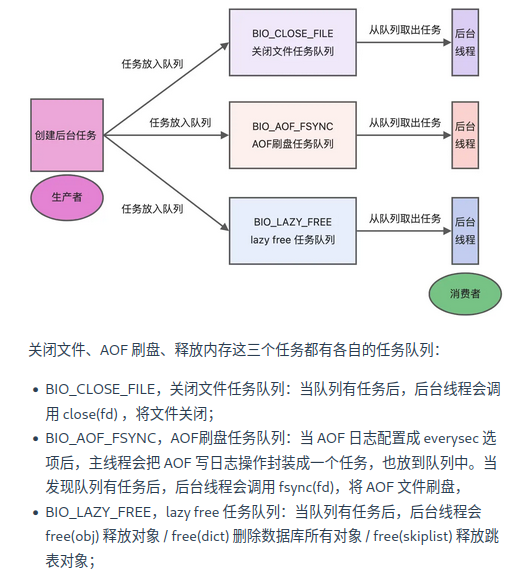

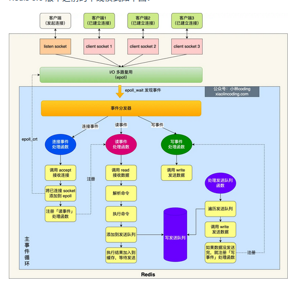

蓝色部分是事件循环，主线程负责，对于network I/O和命令处理都是单线程。

Redis初始化时：

1. 调用epoll_create()创建一个epoll对象和调用socket()创建一个服务端socket。

2. 调用bind()绑定端口和调用listen()监听该socket。

3. 调用epoll_ctl()将listen socket加入到epoll, 同时注册连接事件处理函数。

初始化之后，主线程进入到一个事件循环函数里面：

1. 调用处理发送队列函数，看发送队列里面是否有任务，如果有发送任务，则通过write函数将客户端发送缓存区里的数据发送出去，如果这一轮数据没有发送完，就会注册事件处理函数，等待epoll_wait发现可写后在处理。

2. 接着，调用epll_wait函数等待事件的到来：

如果是连接事件到来，就调用连接事件处理函数：调用accept获取已连接的socket->调用epoll_ct将已连接的socket加入到epoll->注册读事件处理函数。

如果是读事件到来，就会调用读事件处理函数：掉哟给read获取客户端发送的数据->解析命令->处理命令->将客户端对象添加到发送队列->将执行结果写到发送缓冲区等待发送。

如果是写事件到来，就会调用写事件处理函数：通过write将客户端发送缓冲区的数据发送出去，如果这一轮数据没有发送完，就会继续注册写事件函数，等待epoll_wait发现可写后再处理。

## 为什么单线程的Redis还能做到这么快？

1. Redis的大部分操作都在内存中完成，并且采用了高效的数据结构，因此Redis的瓶颈往往是内存或者网络带宽而不是CPU。

2. 单线程避免了数据竞争，省去了多线程数据切换带来的时间和性能的开销。

3. 采用I/O多路复用机制来处理大量的客户端Socket请求，内核负责监听多个socket和已连接socket, 一旦有请求到达，就会交给Redis线程处理。

## Redis 6.0之前为什么使用单线程

CPU并不是制约Redis性能表现的瓶颈所在，并且可维护性更高。

引入多线程模型会带来程序执行顺序不确定，并发读写等一系列问题，增加了系统复杂度、同时可能存在线程切换、甚至加锁解锁、死锁造成的性能损耗。

## Redis 6.0之后为什么引入了多线程？

随着网络硬件的性能提升，Redis的性能瓶颈有时候也将会出现在网络I/O上。

为了提高网络IO的并行度，对于网络IO采用多线程处理，而对于命令的执行仍然采用单线程。

默认情况下，IO多线程只针对发送相应数据，并不会以多线程的方式处理读请求。

修改redis.conf中的io-threads-do-reads配置项为yes可打开。

默认情况下，Redis会在启动时创建6个线程: Redis-server（主线程，主要负责执行命令），bio_close_file（异步处理关闭文件），bio_aof_fsync（AOF刷入磁盘），bio_lazy_free（释放内存任务）。

# Redis持久化

## Redis如何实现数据不丢失？

Redis的读写操作都是在内存里，所以性能很好，但是这涉及到重启丢失数据。

三种数据持久化的方式：

1. AOF日志：每执行一条写操作命令就把该命令以追加的方式写入到一个文件中。

2. RDB快照：将某一时刻的内存数据，以二进制的方式写入磁盘。

3. 混合持久化：Redis 4.0新增的方式，集成了AOF和RDB的优点。

## AOF日志？

redis在执行完一条命令就把这条命令追加到一个文件里，然后在redis重启时，读取该记录文件的命令然后逐一执行从而恢复数据。

*n: 表示命令有n部分，每部分以$+数字开头，后面跟的是具体命令，$后面的数字指的是有多少个字节。

### 为什么先执行再写入？

1. 避免额外的检查开销：如果命令语法有问题不进行语法检查就会在恢复时出错。

2. 不会阻塞当前写操作命令的执行：因为当写操作执行成功之后才会把命令记录到AOF日志。

风险：

1. 数据可能丢失：写操作和记录日志是两个过程，如果还没有把命令写入磁盘就崩溃就会丢失数据。

2. 可能阻塞其他操作。

## AOF写回策略？

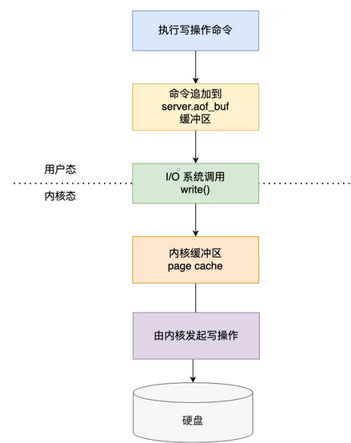

1. Redis执行完写操作命令后，会将命令追加到server.aof_buf缓冲区；

2. 通过write系统调用，将aof_buf缓冲区的数据写入到AOF文件中，此时数据并没有写入到硬盘，二十拷贝到了两内核缓冲区股page cache, 等待内核将数据写入硬盘；

3. 具体内核缓冲区的数据什么时候写入硬盘，有内核决定。

Redis提供了三种写入硬盘的策略：redis.conf的配置文件中的appendfsync参数：

1. Always: 立即同步AOF日志数据。

2. Everysec: 每秒中进行一次。

3. No: 有操作系统决定。

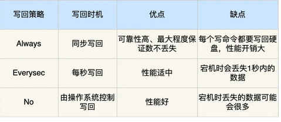

### AOF日志过大会触发什么机制？

AOF日志是一个文件，越大Redis重启就越慢。因此，Redis提供了AOF重写机制，用来压缩AOF文件。

AOF重写机制是在重写是，读取当前数据库内的所有键值对，将每个键值对用一条命令记录到新的AOF文件，等到全部记录完，就用新的AOF文件替换现有的AOF文件。

### AOF重写的过程是怎么样的？

后台子进程bgrewriteaof完成的，好处：

1. 子进程进行AOF重写期间，主进程可以继续处理命令请求，避免阻塞主进程。

2. 子进程带有主进程的数据副本，父子进程之间共享内存（除非子进程发生修改，否则不会发生写时复制）。

触发重写后，主进程就会创建重写AOF的子进程，此时父子进程共享内存，重写子进程只读内存，将所有记录转为一条命令，记录到重写日志。

但是重写过程中，主进程还有可能修改kv, 这要怎么办？

Redis为了解决这个问题设置了一个AOF缓冲区，这个缓冲区在创建bgrewriteaof子进程之后开始使用。

在重写AOF期间，当Redis执行完一个写命令之后，他会同时将这个写命令记录到AOF缓冲区和AOF重写缓冲区重写。

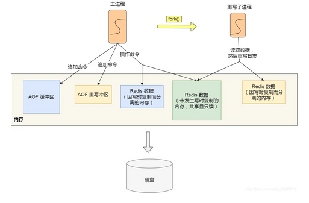

所以，在bgrewriteaof子进程执行AOF重写期间，主进程执行：

1. 执行客户端发来的命令；
2. 将执行后的写命令追加到AOF缓冲区；
3. 将执行后的写命令追加到AOF重写缓冲区；

子进程完成AOF重写后，会向主进程发送一条信号，主进程受到信号之后会调用一个信号处理函数，负责：

1. 将AOF重写缓冲区的所有内容追加到新的AOF文件中，使得新旧两个AOF文件所保存的数据库状态一致。

2. 新的AOF文件进行改名，覆盖现有的AOF文件。

# RDB快照怎么实现？

RDB其实类似于数据库的checkpoint机制，记录的是实际数据。

## RDB做快照时会阻塞线程吗？

Redis提供了save和bgsave来乘车能够rdb文件，区别就是是否在主线程里执行。

## RDB执行快照时，数据能修改吗？

可以，在bgsave是，Redis依旧可以继续处理操作命令，关键在于Copy-On-Write。

在实行bgsave时，会通过fork创建子进程，此时子进程和父进程是共享同一片内存数据的，如果主线程执行写操作，那么被修改的数据会复制一个副本，然后bgsave会把这个副本数据写入rdb文件。

## 为什么会有混合持久化？

RDB的优点是速度快，但是不好把握快照的频率。频率太低就会丢失很多数据，频率太高就会影响性能。

AOF优点是丢失数据少，但是数据恢复不快。

为了集成两者优点，4.0就提出混合恢复。

混合持久化工作在AOF日志重写时，AOF重写时fork出来的重写子进程会先将与主线程共享的数据以RDB的形式写入到AOF文件，然后主线程处理的操作命令会被记录在重写缓冲区里，重写缓冲区里的增量命令会以AOF方式写入到AOF文件，写入完成后通知主进程用新的含有RDB格式和AOF格式的AOF文件替换旧的AOF文件。

也就是说混合持久化的AOF文件前半部分是RDB格式的全量数据，后半部分是AOF的增量数据。


优点：

1. 结合了RDB和AOF的优点，减少启动时间和大量数据丢失的风险。

缺点：

1. AOF文件的可读性下降。

2. 兼容性差（版本之间）。

# Redis集群

## Redis如何实现服务高可用？

多服务节点考虑：主从复制，哨兵模式。切片集群。

### 主从复制

将从前的一台Redis服务器，同步数据到多台Redis服务器上，也就是一主多从，且主从服务器采取的是读写分离的方式。

主服务器可以进行读写操作，发生写操作酒吧写操作同步给从服务器，而从服务器一般是只读的，并接受主服务器发送过来的同步写操作命令并执行。

也就是说，数据修改只能发生在主服务器上。

命令复制是异步的。

在主从服务器命令传播阶段，主服务器收到新的写命令之后，会发送给从服务器，但是并不会等待从服务器执行完命令把结果返回，而是直接向客户端返回结果。

所以无法实现强一致性保证（主从数据时刻一致）。

### 哨兵模式

为了解决Redis主从服务器出现宕机需要手动恢复的问题，Redis增加了哨兵模式，因为哨兵模式做到了可以监控主从服务器并且提供了主从节点故障转移的功能。

### 切片集群模式

当Redis缓存数据量大到一台服务器无法缓存时，就需要用Redis切片集群方案。

数据分布在不同的服务器上，以此降低系统对单主节点的依赖，从而提高Redis服务的读写性能。

Redis 采用的是哈希槽来处理数据和节点之间的映射关系。在Redis Cluster方案中，一个切片集群共有16384个哈希槽，这些哈希槽类似于数据分区，每个键值对都会根据它的key被映射到一个哈希槽：

1. 根据键值对的key按照CRC16计算一个16bit的值。
2. 再用16bit值对16384进行取模，每个模数代表一个对应编号的哈希值。

接下来的问题：这些哈希槽怎么被映射到具体的Redis节点上呢？

1. 平均分配：在Cluster create命令创建redis集群时，Redis会自动把所有哈希槽平均分配到集群节点上。

2. 手动分配：cluster meet手动建立节点间的连接组成集群，再用cluster addslot指定每个节点上的哈希槽个数。

## 集群脑裂导致数据丢失怎么办？

当主节点发现从节点下线或者通信超时的总数量小于阈值时，那么禁止主节点进行写数据，直接把错误返回给客户端。

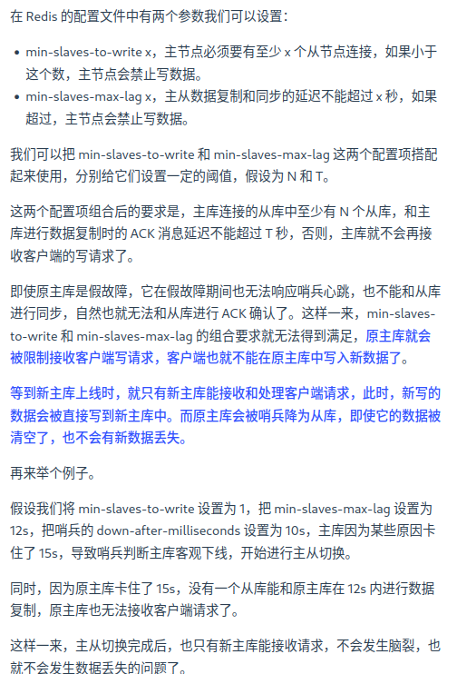

# Redis过期删除和内存淘汰

## Redis使用的过期删除策略是什么？

Redis是可以对Key设置过期时间的，因此需要有对应的机制将已经过期的键值对删除，做这个工作的就是过期键值对删除策略。

每当我们对一个Key设置了过期时间时，Redis就会把该key带上过期时间存储到一个过期字典中。

查询一个Key时，Redis首先检查该key是否存在于过期字典中：

1. 如果不在，则正常读取键值；
2. 如果存在，就会获取该key的过期时间，然后与当前系统时间进行比对，如果比系统时间大，那就没有过期，否则就判定过期。

Redis使用的过期删除策略是惰性删除+定期删除。

### 什么是惰性删除策略？

不主动删除过期键，每次从数据库访问key是判断key是否过期，如果过期就删除该key。

优点：因为每次访问时，才会检查key是否过期，所以此策略只会使用很少的系统资源，因此惰性删除策略对CPU时间最友好。

缺点：如果一个key已经过期而这个key又保存在数据库中，那么只要这个过期key没有被访问就不会释放内存，对内存不友好。

### 什么是定期删除策略？

每隔一段时间随机从数据库中抽取出一定数量的key进行检查并删除其中的过期key。

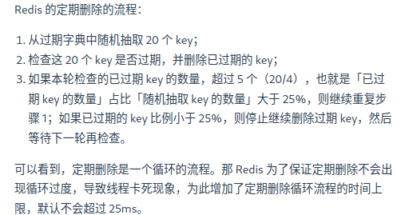

优点：通过限制删除操作执行的时长和频率，减少删除操作对CPU的影响，同时也能删除一部分过期的数据减少了过期键对空间的无效占用。

缺点：难以确定执行时长和频率：太长对CPU不友好，太少则过期key得不到及时释放。

## Redis持久化时对过期键会如何处理？

RDB文件分为两个阶段：RDB文件生成阶段和加载阶段。

1. RDB文件生成阶段：从内存状态持久化成RDB文件的时候，会对key进行过期检查，过期的键不会被保存到新的RDB文件中，因此REdis中的过期键对于新的RDB文件不会产生影响。

2. RDB加载阶段：RDB加载阶段是要看是主服务器还是从服务器：

如果是主服务器，在载入RDB文件时，程序会对文件中的过期key进行检查，过期键不会被载入到数据库中。

如果是从服务器，则不进行检查，但是由于从服务器进行数据同步时数据会被清空，所以一般也没有影响。

AOF文件分为两个阶段，AOF文件写入阶段和AOF重写阶段：

1. AOF写入阶段：当Redis1️以AOF模式持久化是，如果数据库某个过期键还没有被删除，那么AOF文件就会保留这个过期键，当此过期键被删除后，Redis会向AOF文件追加一条DEL命令显式的删除该键值对。

2. AOF重写阶段：执行AOF重写时，会对Redis中的键值对进行检查，已过期的键不会被保存到重写后的AOF文件中，因此不会对AOF重写造成任何影响。

## Redis主从模式中，如何处理过期键？

当Redis运行在主从模式下时，从库不会进行过期扫描，从库对过期的处理也是被动的。也就是说客户端访问从库，即使过期了也会返回值。

主库在key到期是会在AOF文件里面添加一条del指令，同步到所有的从库。

## Redis内存满了会发生？

Redis在运行时如果内存达到了一个阈值就会出发内存淘汰机制，叫maxmemory。

## Redis内存淘汰策略有哪些？

八种两类：

第一类：不进行数据淘汰的策略

noeviction：表示当运行内存超过最大设置内存时，不淘汰任何数据，而是不再提供服务，直接返回错误。

第二类：

还可以细分为`在设置了过期时间的数据中进行淘汰` 和 `在所有数据范围内进行淘汰`。

设置了过期时间的数据：

volatile-random: 随机淘汰设置了过期时间的任意键值。

volatile-ttl: 有限淘汰更早过期的键值。

volatile-lru: 最久未使用的键值被淘汰。

volatile-lfu: 最少使用的键值被淘汰。

所有数据范围内：

allkeys-random: 随机淘汰任意键值

allkeys-lru: 最久未使用。

allkeys-lfu: 最少使用。

### Redis如何实现LRU?

传统的LRU有两个问题：

1. 需要用链表管理所有的缓存数据，这会带来额外的空间开销。

2. 当有数据被访问时，需要在链表上把该数据移动到头端，如果有大量数据被访问，会带来很多链表移动操作，非常耗时，因而降低Redis缓存性能。

Redis实际实现的是一种近似LRU算法，目的是更好的节约内存。实现方式是在Redis的对象结构体中额外添加一个字段，用于记录此数据的最后一次访问时间。

当Redis进行内存淘汰时会采用随机采样的方式来淘汰数据（如上所说）,随机取几个值然后淘汰最久没使用的那个。

优点：不用为所有的数据维护一个大链表，节省了空间占用；不用再每次数据访问都移动链表项，提升了缓存的性能。

缺点：无法解决缓存污染问题，比如一次读取了大量数据，而这些数据只会被读取这一次，那这些键就会留存在缓存中很长一段时间，造成缓存污染。

后来引进LFU来解决这个问题。

### Redis如何实现LFU?

LFU算法相比于LRU算法的实现，多记录了数据的访问频次的信息。

Redis对象头中的lru字段在LRU算法和LFU算法下使用方式并不相同。

在LRU中，Redis对象头的24bits的lru字段是用来记录key的访问时间戳的，因此LRU模式下，redis可以根据对象头的LRU字段记录的值来比较最后一次key的访问时间长，从而淘汰最久未使用。

在LFU中，Redis对象头的24bits的lru字段分成了两部分来存储，高16bits存ldt(last decrement time)用来记录key的访问时间戳；低8bits存储logic(Logistic Counter)用来记录key的访问频次。


# Redis缓存设计

## 如何避免缓存雪崩(Cache Avalanche)、缓存击穿(Hotspot Invalid)、缓存穿透(Cache Penetration)？

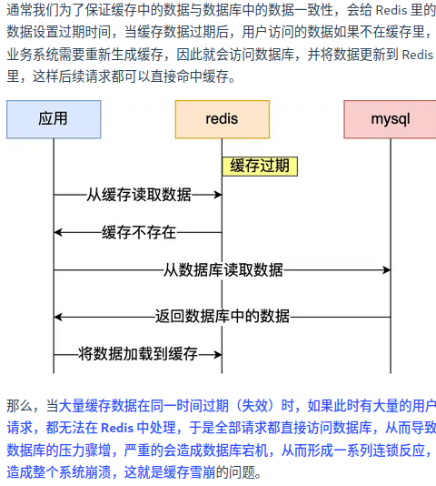

解决方案：

1. 将缓存失效时间随即打散：在原有的失效时间基础上添加一个随机值这样每个缓存的过期时间都不重复了，也就降低了缓存集体失效的概率。

2. 设置缓存不过期：通过后台服务来更新缓存数据，从而避免因为缓存失效造成的缓存雪崩，也可以在一定程度上避免缓存并发问题。


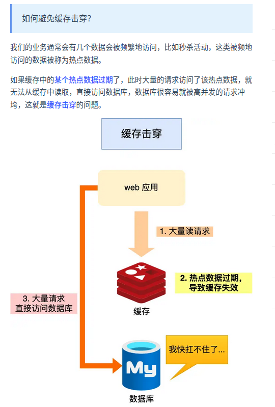

缓存击穿可以采取：

1. 互斥锁方案：Redis中使用setNX方法设置一个状态位，表示这是一种锁定状态，保证同一时间只有一个业务线程请求缓存，未能获取互斥锁的请求，要么等待锁释放后重新读取缓存，要么就返回空值或者默认值。

2. 不给热点数据设置过期时间，由后台异步更新缓存，或者在热点数据准备要过期前，提前通知后台线程更新缓存以及重新设置过期时间。


发生原因：

1. 业务误操作，缓存的数据和数据库的数据都被误删除了，导致缓存和数据库中都没有数据。

2. 恶意攻击。

应对方案：

1. 非法请求的限制。

2. 设置空值或者默认值。

3. 使用布隆过滤器快速判断数据是否存在，避免通过查询数据库来判断数据是否存在。

## 如何设计一个缓存策略，可以动态缓存热点数据呢？

由于系统只需要一部分热点数据被缓存起来，所以需要设计一个热点数据动态缓存的策略。

热点数据动态缓存策略总体思路：通过数据最新访问时间来做排名，并过滤掉不经常访问的数据，只留下经常访问的数据。

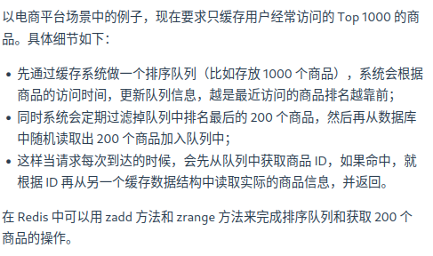

## 常见的缓存更新策略

1. 旁路缓存(Cache Aside)

2. 读穿/写穿(Read/Write Through)

3. 写回(Write Back)

### 旁路缓存

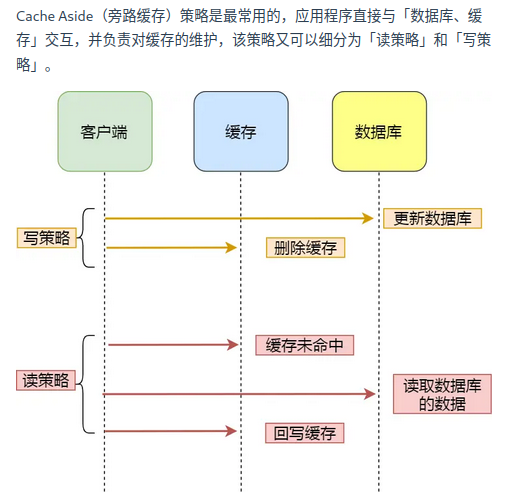

写策略：先更新数据库的数据再在删除缓存中的数据。

读策略：如果读取的数据命中了缓存就直接返回数据；否则就从数据库中读取数据然后将数据写入到缓存并返回给用户。

写策略的顺序不能反过来，否则会出现缓存和数据库不一致。

Cache Aside策略适合读多写少的场景，不适合写多的场景，因为当写入比较频繁时，缓存中的数据会被频繁的清理，这对于缓存命中率影响很大。

如果业务对于缓存命中率要求很高，有两种解决方案：

1. 更新数据时也更新缓存，只是在更新缓存前加一个分布式锁，这样在同一时间智能允许一个线程进行更新缓存，不会产生一致性问题。

2. 也是更新数据时更新缓存，只是给缓存加一个较短的过期时间，这样即使缓存不一致也会很快过期。

### 读穿/写穿

应用程序只和缓存交互，不再和数据库交互，而是由缓存和数据库交互，相当于更新数据库的操作由缓存自己代理了。

1. 读穿策略

先查询缓存是否有数据，存在就返回，否则就有缓存组件从数据库查询数据，并将结果写入到缓存数据再由缓存组件告知应用程序更新完成。

2. 写穿策略

数据更新时，先查询要写入的数据在缓存中是否已经存在；如果缓存中数据已存在就更新缓存中的数据并且由缓存组件同步更新到数据库中，然后缓存组件告知应用程序更新完成；否则就直接更新数据库然后返回。

读穿/写穿策略的特点是由缓存节点而非应用程序和数据库打交道，较少使用的原因是常见的分布式缓存组件没有提供写入数据库和自动加载数据库中的数据的功能。

### 写回策略

写回策略在更新数据时只更新缓存同时将缓存数据设置为脏的然后立马返回，并不会更新数据库。对于数据库的更新会通过批量异步更新的方式来完成。

由于Redis并没有异步更新数据库的功能，写回策略并不常用。

但是在体系结构中，比如CPU缓存、操作系统的文件系统都采用写回策略。

写回策略适合写多的场景，因为发生写操作的时候只需要更新缓存就立马返回，比如写文件的时候写入到文件系统的缓存就返回了，并不用等待写磁盘。

带来的问题就是数据不是强一致性的，会有数据丢失的风险。

# Redis实战

## 实现延迟队列

延迟队列实质把当前要做的事情往后推迟一段时间在座，使用场景：

1. 在淘宝、京东下单，超过一定时间没有付款，订单会自动取消。

2. 打车的时候，在规定时间没有车主接单，平台会自动取消订单并提醒暂时没有车主接单。

可以使用Zset来实现延迟消息队列，Zset有一个Score属性可以用来存储延迟执行的时间。

1.1 插入任务到队列

我们使用 ZADD 命令插入任务，任务的执行时间作为分数：

ZADD delay_queue <timestamp> <task_id>

例如，假设当前时间戳为 1702444800（一个未来的时间），我们想要插入一个任务 task1：

ZADD delay_queue 1702444800 "task1"

1.2 查询到期任务

使用 ZRANGEBYSCORE 获取到期任务，分数小于等于当前时间戳的任务：

ZRANGEBYSCORE delay_queue -inf <current_timestamp>

例如，如果当前时间戳是 1702444900，我们可以运行：

ZRANGEBYSCORE delay_queue -inf 1702444900

1.3 处理任务

一旦我们查询到任务，就可以对其进行处理，并且删除它：

ZREM delay_queue <task_id>

例如，删除已处理的任务 task1：

ZREM delay_queue "task1"

```java
import redis.clients.jedis.Jedis;
import redis.clients.jedis.Tuple;

import java.util.Set;

public class RedisDelayQueue {

    private static final String QUEUE_NAME = "delay_queue";
    private Jedis jedis;

    public RedisDelayQueue(Jedis jedis) {
        this.jedis = jedis;
    }

    // 向延迟队列添加任务
    public void addTask(String taskId, long delayInSeconds) {
        long executionTime = System.currentTimeMillis() / 1000 + delayInSeconds; // 当前时间戳 + 延迟秒数
        jedis.zadd(QUEUE_NAME, executionTime, taskId); // 将任务和执行时间插入 Zset
        System.out.println("Task " + taskId + " added to delay queue, scheduled at " + executionTime);
    }

    // 获取并处理到期任务
    public void processTasks() {
        long currentTime = System.currentTimeMillis() / 1000;
        // 获取所有到期的任务（分数小于等于当前时间戳）
        Set<Tuple> tasks = jedis.zrangeByScoreWithScores(QUEUE_NAME, "-inf", String.valueOf(currentTime));
        
        for (Tuple task : tasks) {
            String taskId = task.getElement();
            // 处理任务
            System.out.println("Processing task: " + taskId);
            // 删除任务
            jedis.zrem(QUEUE_NAME, taskId);
            System.out.println("Task " + taskId + " removed from queue.");
        }
    }

    public static void main(String[] args) throws InterruptedException {
        Jedis jedis = new Jedis("localhost", 6379); // 创建连接到 Redis 的 Jedis 实例
        RedisDelayQueue delayQueue = new RedisDelayQueue(jedis);

        // 向延迟队列添加任务
        delayQueue.addTask("task1", 5); // 任务将在 5 秒后执行
        delayQueue.addTask("task2", 10); // 任务将在 10 秒后执行

        // 模拟任务处理
        while (true) {
            delayQueue.processTasks();
            Thread.sleep(1000); // 每秒检查一次是否有到期任务
        }
    }
}
```

## Redis的大key怎么处理？

> 什么是大key

大key并不是说key的值很大，而是key对应的value很大。

一般而言，String类型的值大于10kb或者Hash, List, Set, Zset类型的元素的个数超过5000个。

> 大key的影响？

1. 客户端超时阻塞。

2. 引发网络阻塞。

3. 阻塞工作线程。

4. 内存分布不均。

# Redis管道

管道技术(Pipeline)是客户端提供的批处理技术，可以一次处理多个Redis命令。

管道技术可以解决多个命令执行时的网络等待。

# Redis事务支持回滚吗？

Redis没有回滚机制，虽然有Disacrd但是只能主动放弃事务执行不能起到回滚的效果。

也就是说，Redis并不保证原子性。

# 使用Redis实现分布式锁？

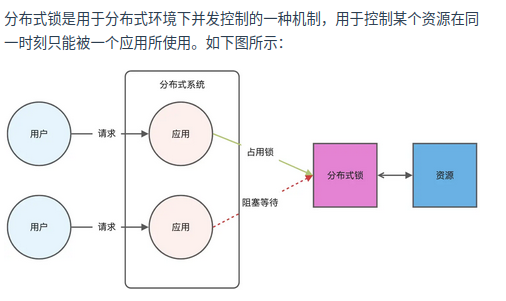

Redis本身可以被多个客户端共享访问，正好就是一个共享存储系统，可以用来表示分布式锁，而且Redis的读写性能好，可以应对高并发的锁操作场景。

Redis的SET命令可以用NX参数实现key不存在才插入，可以用它来实现分布式锁。

1. 如果key不存在则显示插入成功表示加锁成功。

2. 如果key存在则会显示插入失败可以用来表示加锁失败。

对加锁操作需要满足三个条件：

1. 包括了读取锁变量、检查锁变量和设置锁变量三个操作，这三个操作要以原子操作的方式完成，所以要用set带上NX来实现加锁。

2. 锁变量需要设置过期时间，避免客户端获得锁以后发生异常，导致锁一直无法释放。所以用SET命令加上EX/PX选项。

3. 锁的值需要能区分来自不同客户端的加锁操作，以免在释放锁的时候出现误释放。也就是说每个客户端设置的值必须是唯一值。

如下：

SET lock_key unique_value NX PX 10000

解锁就是将lock_key键删除，但不能乱删，保证执行操作的客户端就是加锁的客户端。所以解锁要判断锁的unique_value是否为加锁客户端，是的话才能解锁。

如下：

```lua
if redis.call("get",KEYS[1])==ARGV[1] then
    return redis.call("del",KEYS[1])
else
    return 0
end
```

## 基于Redis实现分布式锁的优缺点？

优点：

1. 性能高效（最核心的出发点）

2. 实现方便，很大程度是因为Redis提供了set nx 方法

3. 避免单点故障(因为Redis是跨集群部署，自然就避免了单点故障)

缺点：

1. 超时时间不好设置。（如何设置？继续续约的方式设置，先设置一个超时时间，再启动一个守护线程，守护线程一段时间之后重新设置超时时间）

2. Redis主从复制是异步的，导致分布式锁不可靠。

## 如何解决集群环境下的分布式锁的可靠性？

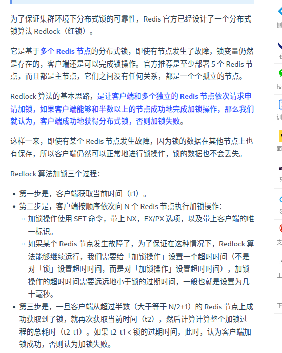

加锁成功需要满足两个条件：

1. 客户端从超过半数的Redis节点上成功获取到锁。

2. 客户端从大多数节点获取锁的总耗时小于锁设置的过期时间。

加锁成功之后，客户端需要重新计算这把锁的有效时间，计算结果是锁最初设置的过期时间-客户端从大多数节点获取锁的总耗时。如果计算结果来不及完成共享数据的操作就释放锁，避免数据操作没完成，锁就过期了。

