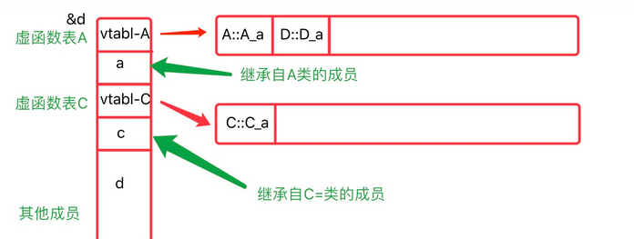

<!--toc:start-->
- [重读\<\<C++程序设计语言\>\>](#重读c程序设计语言)
  - [41 章并发](#41-章并发)
    - [P280](#p280)
- [语言标准](#语言标准)
  - [C++11的重要特性总结](#c11的重要特性总结)
  - [C++14的重要新特性](#c14的重要新特性)
  - [C++17的重要新特性](#c17的重要新特性)
  - [C++20的重要新特性](#c20的重要新特性)
  - [C++23新特性](#c23新特性)
  - [concept](#concept)
  - [std::ref](#stdref)
  - [std::cref](#stdcref)
  - [std::clamp](#stdclamp)
  - [std::ignore](#stdignore)
  - [std::move_only_function::move_only_function](#stdmoveonlyfunctionmoveonlyfunction)
  - [std::atomic](#stdatomic)
    - [基本操作](#基本操作)
    - [内存顺序](#内存顺序)
  - [std::chrono](#stdchrono)
  - [std::recursive_mutex](#stdrecursivemutex)
  - [std::chrono::high_resolution_clock](#stdchronohighresolutionclock)
  - [cxxabi abi::\_\_cxa_demangle()](#cxxabi-abicxademangle)
  - [std::bitset](#stdbitset)
  - [std::common_type](#stdcommontype)
- [一些库](#一些库)
  - [测试](#测试)
    - [doctest](#doctest)
    - [gtest](#gtest)
  - [rpc](#rpc)
    - [json-rpc-cxx](#json-rpc-cxx)
  - [neither](#neither)
- [什么是多态？](#什么是多态)
  - [Ad-hoc Polymorphism 特设多态](#ad-hoc-polymorphism-特设多态)
  - [Parametric Polymorphism 参数多态](#parametric-polymorphism-参数多态)
  - [Subtype Polymorphism 子类型多态](#subtype-polymorphism-子类型多态)
    - [C++虚函数原理](#c虚函数原理)
      - [虚函数的内存分布](#虚函数的内存分布)
      - [虚函数实现原理](#虚函数实现原理)
        - [调用过程](#调用过程)
        - [调用性能从前面虚函数的调用过程可知。当调用虚函数时过程如下（引自More Effective C++）:](#调用性能从前面虚函数的调用过程可知当调用虚函数时过程如下引自more-effective-c)
        - [空间占用](#空间占用)
      - [虚函数的应用注意事项](#虚函数的应用注意事项)
  - [Row Polymorphism（行多态）](#row-polymorphism行多态)
- [语言标准](#语言标准)
  - [for co_await](#for-coawait)
  - [字符串字面量](#字符串字面量)
  - [指针与 const](#指针与-const)
  - [右值引用](#右值引用)
  - [static](#static)
  - [类型双关](#类型双关)
  - [Dependent Names](#dependent-names)
    - [Binding Rule](#binding-rule)
    - [查找规则 (Lookup Rule)](#查找规则-lookup-rule)
    - [Two Phase Name Lookup](#two-phase-name-lookup)
    - [为什么需要两阶段查找？](#为什么需要两阶段查找)
  - [extern template (C++ 11)](#extern-template-c-11)
  - [ODR 与翻译单元](#odr-与翻译单元)
  - [虚函数一定是运行期才绑定的吗？](#虚函数一定是运行期才绑定的吗)
    - [final](#final)
  - [虚函数究竟在哪些地方变慢了？](#虚函数究竟在哪些地方变慢了)
  - [构造函数默认使用浅拷贝](#构造函数默认使用浅拷贝)
  - [PGO](#pgo)
  - [syncstream](#syncstream)
- [杂项](#杂项)
  - [forward declaration](#forward-declaration)
  - [std::swap VS xor](#stdswap-vs-xor)
  - [cbrt](#cbrt)
  - [sendto](#sendto)
  - [\_\_builtin_ffs](#builtinffs)
  - [Bitfield](#bitfield)
    - [为什么用这个东西？](#为什么用这个东西)
  - [生命周期](#生命周期)
  - [类型转换](#类型转换)
    - [Lvalue to Rvalue](#lvalue-to-rvalue)
    - [其他](#其他)
    - [整形提升](#整形提升)
      - [第一种特殊情况](#第一种特殊情况)
      - [第二种特殊情况](#第二种特殊情况)
  - [carries_dependency](#carriesdependency)
  - [offsetof](#offsetof)
  - [+[]{}](#)
  - [defer](#defer)
  - [编译器指令](#编译器指令)
  - [构造函数的参数初始化顺序](#构造函数的参数初始化顺序)
  - [Empty Base Optimization](#empty-base-optimization)
  - [结构体字节对齐](#结构体字节对齐)
- [value category](#value-category)
  - [哪些情况是lvalue](#哪些情况是lvalue)
  - [lvalue的一些属性](#lvalue的一些属性)
  - [哪些情况是prvalue](#哪些情况是prvalue)
  - [prvalue的一些属性](#prvalue的一些属性)
  - [哪些情况是xvalue](#哪些情况是xvalue)
    - [什么事move-eligible expression](#什么事move-eligible-expression)
  - [xvalue的一些属性](#xvalue的一些属性)
  - [glvalue的一些属性](#glvalue的一些属性)
  - [rvalue的一些属性](#rvalue的一些属性)
  - [特殊规则](#特殊规则)
    - [Pending member function call](#pending-member-function-call)
    - [Void expressions](#void-expressions)
    - [Bit-fields](#bit-fields)
  - [decltype的规则](#decltype的规则)
- [Initialization!](#initialization)
  - [Cast Expression](#cast-expression)
  - [Copy Elision](#copy-elision)
  - [bit_width](#bitwidth)
  - [Unsequenced modification and access to 'i'](#unsequenced-modification-and-access-to-i)
  - [shared_ptr和weak_ptr](#sharedptr和weakptr)
    - [使用场景](#使用场景)
- [工程实践](#工程实践)
<!--toc:end-->

# 重读\<\<C++程序设计语言\>\>

注：由于是重读，这里大多是一些拾遗。

采用格式：章节+页码+内容

## 41 章并发

### P280

\"还请注意，只要你不向其他线程传递局部数据的指针，你的局部数据就不存在这里讨论的诸多问题。\"

# 语言标准

## C++11的重要特性总结

1. 类型推导：

   auto：编译器可根据初始化表达式自动推导变量类型，简化代码编写。

   decltype：用于获取表达式的类型，常用于泛型编程中。

2. 右值引用和移动语义：

   引入右值引用（&&），允许对临时对象进行引用，配合移动构造函数和移动赋值运算符，可显著提高资源管理和程序性能。

3. Lambda表达式：

   支持在代码中定义匿名函数，简化回调函数的使用，增强了函数式编程的能力。

4. 智能指针：

   引入了std::shared\_ptr、std::unique\_ptr和std::weak\_ptr，用于自动管理动态分配的内存，减少内存泄漏的风险。

5. 基于范围的for循环：

   允许直接遍历容器或数组，简化循环语法，提高代码可读性。

6. nullptr关键字：

   引入了nullptr作为空指针常量，替代了原来的NULL，提高了类型安全性。

7. constexpr关键字：

   用于定义在编译期可求值的常量表达式，提升程序的运行效率。

8. std::thread和多线程支持：

   标准库中加入了对多线程的支持，包括std::thread、std::mutex、std::lock等，方便进行并发编程。

9. std::function和std::bind：

   提供了通用的函数包装器和绑定器，增强了函数对象的灵活性和可用性。

10. 初始化列表：

    引入了统一的列表初始化语法，支持使用花括号{}对变量进行初始化，简化了初始化过程。

11. std::array和std::tuple：

    std::array提供了定长数组的封装，std::tuple允许存储多个不同类型的值，增强了数据结构的表达能力。

12. enum class：

    引入了强类型枚举，避免了传统枚举可能导致的命名冲突和隐式转换问题。

13. 模板别名和可变参数模板：

    支持为模板定义别名，简化了模板的使用；可变参数模板允许模板接受任意数量的模板参数，增强了模板的灵活性。

14. override和final关键字：

    override用于显式声明重写基类的虚函数，final用于防止类或虚函数被继承或重写，增加了代码的安全性和可读性。

15. 原子操作和内存模型：

    引入了std::atomic和内存顺序模型，提供了对原子操作的支持，简化了多线程编程中的同步问题。

## C++14的重要新特性

1. 泛型Lambda表达式：

   在C++14中，Lambda表达式的参数类型可以使用auto关键字进行自动推导，使Lambda更加通用和灵活。

   示例：

```cpp
    auto add = [](auto a, auto b) { return a + b; };
    auto result = add(1, 2);       // result为3
    auto result2 = add(1.5, 2.5);  // result2为4.0
```

2. Lambda初始化捕获：

   允许在Lambda捕获列表中直接初始化新的变量，简化了在Lambda中使用外部变量的方式。

   示例：

```cpp
    int x = 10;
    auto lambda = \[y = x + 1\]() { return y * y; };
    auto result = lambda();  // result为121
```

3. 返回类型自动推导：

   C++14支持对普通函数的返回类型进行自动推导，简化了函数的声明。

   示例：

```cpp
    auto add(int a, int b) {
        return a + b;
    }
    auto result = add(3, 4);  // result为7
```

4. constexpr函数的改进：

   constexpr函数的限制有所放宽，允许包含更多的语句，如循环和条件语句，使其在编译期计算时更加灵活。

   示例：

```cpp
    constexpr int factorial(int n) {
        int result = 1;
        for (int i = 1; i <= n; ++i) {
            result *= i;
        }
        return result;
    }
    constexpr int val = factorial(5);  // val为120
```

5. 变量模板：

   引入了变量模板，允许为变量定义模板，从而创建通用的常量或变量。

   示例：

```cpp
    template<typename T>
    constexpr T pi = T(3.1415926535897932385);

    auto pi_float = pi<float>;    // pi_float为3.1415927f
    auto pi_double = pi<double>;  // pi_double为3.141592653589793
```

6. 二进制字面量和数字分隔符：

   C++14支持使用二进制字面量表示二进制数，并引入了单引号作为数字分隔符，提高了数字的可读性。

   示例：

```cpp
    auto binary = 0b101010;      // 等于42
    auto big_number = 1'000'000; // 等于1000000
```

7. std::make_unique：

   在C++14中，标准库新增了std::make_unique函数，用于创建std::unique_ptr对象，提供了与std::make_shared类似的功能，简化了动态内存管理。

   示例：

```cpp
    auto ptr = std::make_unique<int>(42);
```

8. std::shared_timed_mutex和std::shared_lock：

   引入了共享的互斥体和锁，允许多个线程同时读取共享资源，但在写入时需要独占锁，提高了多线程编程的效率。

   示例：

```cpp
    std::shared_timed_mutex mutex;
    std::shared_lock<std::shared_timed_mutex> lock(mutex);
```

9. \[\[deprecated\]\]属性：

   新增了\[\[deprecated\]\]属性，用于标记不建议使用的函数或变量，编译器在使用这些被标记的实体时会发出警告。

   示例：

```cpp
    [[deprecated("Use new_function instead")]]
    void old_function() {
        // ...
    }
```

10. std::integer_sequence和std::index_sequence：

    引入了整数序列模板，简化了在模板编程中处理参数包的操作，特别是在处理可变参数模板时。

    示例：

```cpp
template<std::size_t... Indices>
void print_indices(std::index_sequence<Indices...>) {
    ((std::cout << Indices << ' '), ...);
}
```

## C++17的重要新特性

1. 结构化绑定（Structured Bindings）：

   允许将元组、结构体或数组的成员解构为独立的变量，简化了对复合数据类型的访问。

   示例：

```cpp
    #include <tuple>
    #include <iostream>

    std::tuple<int, double, std::string> getData() {
        return {42, 3.14, "Hello"};
    }

    int main() {
        auto [id, value, name] = getData();
        std::cout << id << ", " << value << ", " << name << std::endl;
    }
```

2. if constexpr：

   引入了编译期条件判断，允许在编译时根据条件选择性地编译代码块，常用于模板元编程。

   示例：

```cpp
    template<typename T>
    void print(T value) {
        if constexpr (std::is_integral_v<T>) {
            std::cout << "Integer: " << value << std::endl;
        } else {
            std::cout << "Other type: " << value << std::endl;
        }
    }
```

3. 内联变量（Inline Variables）：

   允许在头文件中定义具有外部链接的变量，而不会导致多重定义问题，简化了常量的声明和使用。

   示例：

```cpp
    struct Config {
        inline static const int max_value = 100;
    };
```

4. 类模板参数推导（Class Template Argument Deduction）：

   编译器可以根据构造函数的参数自动推导类模板的参数类型，减少了显式指定模板参数的需要。

   示例：

```cpp
    std::pair p = {42, 3.14}; // 编译器自动推导为std::pair<int, double>
```

5. 并行算法（Parallel Algorithms）：

   标准库算法新增了并行执行策略，允许利用多核处理器并行执行算法，提高性能。

   示例：

```cpp
    #include <algorithm>
    #include <vector>
    #include <execution>

    std::vector<int> vec = {/*...*/};
    std::sort(std::execution::par, vec.begin(), vec.end());
```

6. std::optional、std::variant和std::any：

   std::optional：表示可能包含或不包含值的对象，避免使用指针表示可选值。

   std::variant：类型安全的联合体，存储多个类型中的一个值。

   std::any：可存储任意类型的值，类似于动态类型变量。

7. std::filesystem：

   引入了文件系统库，提供了跨平台的文件和目录操作功能，简化了文件操作的实现。

8. std::string_view：

   提供了对字符串的非拥有只读视图，避免了不必要的字符串拷贝，提高了性能。

9. std::invoke和std::apply：

   std::invoke：通用调用包装器，可调用函数指针、成员函数指针等。

   std::apply：将元组的元素展开作为函数的参数进行调用。

10. 折叠表达式（Fold Expressions）：

    简化了可变参数模板中参数的累积操作，支持对参数包进行折叠处理。

    示例：

```c++
template<typename... Args>
auto sum(Args... args) {
    return (args + ...);
}
```

11. std::launder

解决掉placement new和reinterpret_cast在const场景下带来的未定义行为。

```c++
struct X{const int n;};
union U {X x; float f;};
void tong(){
    U u=1;
    u.f=5.f; // 创建了u的子对象
    X *p=new (&u.x) X{2}; //创建了u的子对象
    assert(p->n==2);
    assert(*std::launder(&u.x.n)==2);
    // 未定义行为
    assert(u.x.n==2);
}
```

这里内部有const可能编译器会优化掉访问值的行为，std::launder就是为了解决掉这个场景，阻止编译器优化。

std::launder是一层阻止优化的抽象，具体实现对于不同的库来说也有不同的实现，GNU C的话有一个通过插入内联汇编的方式来阻止编译器优化。

## C++20的重要新特性

1. 概念（Concepts）：

   概念为模板参数提供了明确的约束条件，使模板编程更加直观和安全。通过使用requires关键字或标准库中的概念，可以对模板参数进行类型检查，提升代码的可读性和错误诊断能力。

   示例：

```cpp
    #include <concepts>

    template<typename T>
    requires std::integral<T> // 约束T必须是整数类型
    T add(T a, T b) {
        return a + b;
    }
```

2. 范围（Ranges）库：

   范围库提供了一种新的方式来操作和处理集合数据，支持惰性求值和管道式操作，使代码更加简洁和直观。

   示例：

```cpp
    #include <ranges>
    #include <vector>
    #include <iostream>

    int main() {
        std::vector<int> data {3, 1, 4, 1, 5, 9, 2, 6};
        auto result = data | std::views::filter([](int x) { return x % 2 == 0; })
                           | std::views::transform([](int x) { return x * 2; });
        for (int v : result) {
            std::cout << v << " ";
        }
    }
```

3. 协程（Coroutines）：

   协程引入了一种编写异步代码的新方式，允许函数在执行过程中暂停和恢复，适用于异步I/O操作、生成器等场景。

   示例：

```cpp
    #include <coroutine>
    #include <iostream>

    struct Generator {
        struct promise_type {
            int current_value;
            std::suspend_always yield_value(int value) {
                current_value = value;
                return {};
            }
            std::suspend_always initial_suspend() { return {}; }
            std::suspend_always final_suspend() noexcept { return {}; }
            Generator get_return_object() {
                return Generator{std::coroutine_handle<promise_type>::from_promise(*this)};
            }
            void return_void() {}
            void unhandled_exception() { std::terminate(); }
        };

        std::coroutine_handle<promise_type> coro;

        Generator(std::coroutine_handle<promise_type> h) : coro(h) {}
        ~Generator() { if (coro) coro.destroy(); }

        bool next() {
            coro.resume();
            return !coro.done();
        }

        int value() {
            return coro.promise().current_value;
        }
    };

    Generator counter(int max) {
        for (int i = 0; i < max; ++i)
            co_yield i;
    }

    int main() {
        auto gen = counter(5);
        while (gen.next()) {
            std::cout << gen.value() << " ";
        }
    }
```

4. 模块（Modules）：

   模块提供了一种新的代码组织和重用方式，替代了传统的头文件机制，减少了编译时间和依赖复杂度。

   示例：

```cpp
// math.ixx
export module math;

export namespace math {
    int add(int a, int b) {
        return a + b;
    }
}

    // main.cpp
    import math;
    #include <iostream>

    int main() {
        std::cout << math::add(2, 3) << std::endl;
    }
```

5. 三路比较运算符（<=>）：

   引入了“太空船操作符”，用于自动生成比较运算符，简化了对象的比较操作。

   示例：

```cpp
    #include <compare>

    struct Point {
        int x, y;
        auto operator<=>(const Point&) const = default;
    };
```

6. constexpr的增强：

   constexpr函数现在支持更复杂的操作，包括循环、分支和异常处理等，使得更多的计算可以在编译期完成。

7. Lambda表达式的改进：

   Lambda表达式现在支持模板参数和constexpr，并允许捕获[=, this]，提升了灵活性和适用性。

8. 指定初始化器（Designated Initializers）：

   允许在初始化结构体时指定成员名称，增强了可读性和维护性。

   示例：

```cpp
    struct Point {
        int x;
        int y;
    };

    Point p = {.x = 1, .y = 2};
```

9. std::span：

   std::span提供了一种对连续内存序列的视图，类似于指针，但具有更丰富的接口和更好的安全性，适用于处理数组和容器的片段。

## C++23新特性

1. deducing this: 新的声明非静态成员函数的方式。通常我们调用一个C++的类成员函数，我们会隐式地传入一个this指针而不会出现在参数列表里面，现在可以自行制定如何传入。
```c++
#include <vector>

class MyResources {
   public:
    // 对象是左值，返回左值引用
    std::vector<int> &getResources(this MyResources &self) {
        return self.m_resource;
    }
    // 对象是右值，资源可以被移动走
    std::vector<int> &&getResources(this MyResources &&self) {
        return std::move(self.m_resource);
    }

   private:
    std::vector<int> m_resource;
};
```

## concept

例子：

```cpp
template <typename Lock>
concept is_lockable=requires(Lock &&lock){
  lock.lock();
  lock.unlock();
  {lock.try_lock()}->std::convertible_to<bool>;
};
```

is_lockable 概念可以用来限制模板，使得只有那些具备 lock()、unlock() 和
try_lock() 成员函数，并且 try_lock() 返回类型可以转换为 bool
的类型才可以作为模板参数传递。这个概念通常用于多线程编程中，以确保模板只接受那些具有锁定功能的类型，比如
std::mutex 或 std::recursive_mutex。

## std::ref

std::ref 相当于告诉编译器这里要使用引用而不是按值传递，比如 boost::asio::context 就需要按引用。

std::ref 的作用是显式地告诉编译器传递引用，而不是尝试通过值传递。

asio::io_context的拷贝构造函数被删除，不能被拷贝，只能通过引用或指针传递。

通过 std::ref，你成功避免了编译器试图调用已删除的拷贝构造函数。

## std::cref

用于生成一个 std::reference_wrapper`<const T>` 对象，类似于
std::ref，但它为常量对象创建引用。

std::cref 允许你创建对 const 类型对象的引用包装器。

这个包装器可以用于那些期望传递对象而实际上需要传递常量引用的场景。

## std::clamp

一个工具函数：

```c++
int result=std::clamp(x,low,high);
//等价于
int result=x<low?low:(x>high?high:x);
```

## std::ignore

可用来忽略返回值，cppref 解释：

1.  An object such that any value can be assigned to it with no effect.
2.  The type of std::ignore.

```cpp
#include <iostream>
#include <set>
#include <string>
#include <tuple>

[[nodiscard]] int dontIgnoreMe()
{
    return 42;
}

int main()
{
    std::ignore = dontIgnoreMe();

    std::set<std::string> set_of_str;
    if (bool inserted{false};
        std::tie(std::ignore, inserted) = set_of_str.insert("Test"),
        inserted)
        std::cout << "Value was inserted successfully.\n";
}
```

## std::move_only_function::move_only_function

## std::atomic

C++标准库中提供的原子类型模板，允许你对某些基本数据类型进行原子操作，确保在多线程环境中对这些变量的操作不会产生竞争条件（race
condition）。std::atomic 提供了一系列原子操作，避免了对锁（如
std::mutex）的依赖，从而提高了并发性能。

### 基本操作

- load()：读取变量的值。
- store()：存储一个新值。
- exchange()：交换变量值并返回旧值。
- fetch_add() 和 fetch_sub()：原子加减操作。
- compare_exchange_strong() 和 compare_exchange_weak()：比较并交换值。

> compare_exchange_strong 和 compare_exchange_weak
> 用于原子的比较并交换操作。它们的用途是当且仅当原子的当前值与给定的预期值相等时，才更新为新值。否则，不做更新。

### 内存顺序

std::atomic
操作可以指定内存顺序，以控制操作的内存可见性。这些顺序包括：\
std::memory_order_relaxed：无同步或顺序保证。\
std::memory_order_acquire：确保此操作之前的所有读操作都不会被重排序。\
std::memory_order_release：确保此操作之后的所有写操作都不会被重排序。\
std::memory_order_acq_rel：结合了 acquire 和 release 的保证。\
std::memory_order_seq_cst：最强的内存顺序，提供全局顺序保证。

## std::chrono

获取当前时间点：system_clock::now() 返回当前的时间点，类型为
std::chrono::system_clock::time_point。

计算时间差：time_since_epoch()
返回自系统纪元以来到当前时间点的持续时间，类型为
system_clock::duration，表示的时长单位可能是秒、毫秒、微秒等。

时间单位转换：duration_cast`<microseconds>`{=html}(d) 将时间差 d
转换为以微秒为单位的持续时间。duration_cast
是一个模板函数，用于将时间持续时间转换为另一种时间单位。

获取微秒数：.count() 返回以 microseconds 表示的数值。

## std::recursive_mutex

允许同一线程多次对互斥量加锁而不会导致死锁。它的主要用途是在递归函数或涉及到多次调用同一资源锁定的场景中。

典型用途：

递归函数中需要加锁的场景：
如果一个递归函数需要对某个共享资源进行加锁，而递归调用过程中又需要再次加锁，这时使用普通的
std::mutex 会导致死锁，而使用 std::recursive_mutex 则可以避免这种情况。

对象方法互相调用的场景：
如果类的多个方法之间相互调用，并且这些方法都需要对某些共享资源进行加锁，使用
std::recursive_mutex
可以避免同一线程在调用链中多次锁定同一互斥量时出现死锁。

## std::chrono::high_resolution_clock

std::chrono::high_resolution_clock 是 C++ 标准库中的一个时钟类型，定义在
`<chrono>`
头文件中。它用于测量时间点，并提供高分辨率的时间精度，通常用于精确的时间测量，比如计算代码执行时间、性能分析等。

特点：

高分辨率：它通常提供比 system_clock
更高的精度，可以用于测量短时间间隔，如纳秒或微秒级的时间。

非系统时钟：high_resolution_clock
不是一个与系统时间同步的时钟，因此它通常不用于显示当前日期和时间，而是用于测量时间间隔。

实现细节：在不同的系统上，high_resolution_clock
可能映射到不同的实现。例如：

在某些实现中，它可能是
steady_clock，这意味着它不会受到系统时间调整的影响（如系统时间更新或闰秒）。

在其他实现中，它可能是 system_clock 的高精度版本。

用途：high_resolution_clock
常用于需要高精度的性能分析和时间测量。例如，测量一段代码执行的时间、计算函数的延迟等。

## cxxabi abi::\_\_cxa_demangle()

abi::\_\_cxa_demangle() 是一个 GCC 和 Clang 提供的函数，用于将 C++
编译器修饰过的名称（mangled name）还原为可读的、未修饰的函数名。

如果 abi::\_\_cxa_demangle() 成功，还原后的名称会存储在返回的指针 v 中。

如果解析成功，函数将这个可读的函数名返回；否则返回原始字符串。

## std::bitset

bitset 存储二进制数位。

bitset 就像一个 bool 类型的数组一样，但是有空间优化------bitset 中的一个元素一般只占 1
bit，相当于一个 char 元素所占空间的八分之一。

bitset 中的每个元素都能单独被访问，例如对于一个叫做 foo 的 bitset，表达式 foo\[3\]访问了它的第 4 个元素，就像数组一样。

bitset 有一个特性：整数类型和布尔数组都能转化成 bitset。

bitset 的大小在编译时就需要确定。如果你想要不确定长度的 bitset，请使用（奇葩的）vector`<bool>`。

## std::common_type

确定多个类型之间的公共类型。也就是给定类型之间转换结果最合适的类型。

规则：

1. 如果所有类型 T1, T2, ..., Tn 是同一种类型，那么公共类型就是该类型。

2. 如果可以找到一个类型 T，使得所有 T1, T2, ..., Tn 都可以隐式转换为 T，那么公共类型是 T。

3. 如果前两条规则都失败，并且用户没有为类型定义隐式转换或者重载操作符，std::common_type 将导致编译错误。

# 一些库

## 测试

### doctest

single-header, 开箱即用

### gtest

功能丰富

## rpc

### json-rpc-cxx

学习 ing, 功能相对简单，依赖简单。

## neither

一个基于 Either Type 的函数式库，设计思路有点意思。

# 什么是多态？

不针对 C++，而是一种类型论的概念。

## Ad-hoc Polymorphism 特设多态

特设多态通过函数重载和运算符重载来实现，同一函数或运算符在不同的类型上有不同的行为。

C++中的运算符重载/函数重载，Haskell，都有这个机制。

## Parametric Polymorphism 参数多态

参数多态允许函数或数据类型对任何类型的参数进行操作，而不依赖于具体的类型。在参数多态中，类型是参数化的，常用于泛型编程。

经典：C++的模板特殊化这样的类型多态（type polymorphism）表面上类似于参数多态并同时引入了特设多态。

## Subtype Polymorphism 子类型多态

子类型多态，也称为包含多态，是指对象的某种子类型可以替代父类型使用。这通常涉及继承和接口，允许基于父类的接口调用子类的实现。

有点像里氏替换原则。

### C++虚函数原理

c++作为面向对象的语言，主要有三大特性：继承、封装、多态。关于多态，简而言之就是用父类型的指针指向其子类的实例，然后通过父类的指针调用实际子类的成员函数。这种技术可以让父类的指针有“多种形态”，这是一种泛型技术。所谓泛型技术，说白了就是试图使用不变的代码来实现可变的算法。比如：模板技术，RTTI技术，虚函数技术，要么是试图做到在编译时绑定，要么试图做到运行时绑定。因此C++的多态分为静态多态（编译时多态）和动态多态（运行时多态）两大类。静态多态通过重载、模板来实现；动态多态就是通过本文的主角虚函数来体现的。

#### 虚函数的内存分布

对C++ 了解的人都应该知道虚函数（Virtual Function）是通过一张虚函数表（Virtual Table）来实现的。简称为V-Table。在这个表中，主是要一个类的虚函数的地址表，这张表解决了继承、覆盖的问题，保证其容真实反应实际的函数。这样，在有虚函数的类的实例中这个表被分配在了这个实例的内存中，所以，当我们用父类的指针来操作一个子类的时候，这张虚函数表就显得由为重要了，它就像一个地图一样，指明了实际所应该调用的函数。因此有必要知道虚函数在内存中的分布。

这样的一个类：

```cpp
class A {
  public:
    virtual void v_a(){}
    virtual ~A(){}
    int64_t _m_a;
};

int main(){
    A* a = new A();
    return 0;
}

```

如以上代码所示，在C++中定义一个对象 A，那么在内存中的分布大概是如下图这个样子。

- 首先在主函数的栈帧上有一个 A 类型的指针指向堆里面分配好的对象 A 实例。
- 对象 A 实例的头部是一个 vtable 指针，紧接着是 A 对象按照声明顺序排列的成员变量。（当我们创建一个对象时，便可以通过实例对象的地址，得到该实例的虚函数表，从而获取其函数指针。）
- vtable 指针指向的是代码段中的 A 类型的虚函数表中的第一个虚函数起始地址。
- 虚函数表的结构其实是有一个头部的，叫做 vtable_prefix ，紧接着是按照声明顺序排列的虚函数。
- 注意到这里有两个虚析构函数，因为对象有两种构造方式，栈构造和堆构造，所以对应的，对象会有两种析构方式，其中堆上对象的析构和栈上对象的析构不同之处在于，栈内存的析构不需要执行 delete 函数，会自动被回收。
- typeinfo 存储着 A 的类基础信息，包括父类与类名称，C++关键字 typeid 返回的就是这个对象。
- typeinfo 也是一个类，对于没有父类的 A 来说，当前 tinfo 是 class_type_info 类型的，从虚函数指针指向的vtable 起始位置可以看出。


Virtual table（虚表）只实现了虚拟函数的一半机制,如果只有这些是没有用的。只有用某种方法指出每个对象对应的 vtbl 时,它们才能使用。这是 virtual table pointer 的工作,它来建立这种联系。

每个声明了虚函数的对象都带有它,它是一个看不见的数据成员,指向对应类的virtual table。这个看不见的数据成员也称为 vptr,被编译器加在对象里,位置只有才编译器知道。

#### 虚函数实现原理

##### 调用过程

调用一个虚函数时，首先通过对象内存中的vptr找到虚函数表vtbl，接着通过vtbl找到对应虚函数的实现区域并进行调用。其中被执行的代码必须和调用函数的对象的动态类型相一致。编译器需要做的就是如何高效的实现提供这种特性。不同编译器实现细节也不相同。大多数编译器通过虚表vtbl（virtual table）和虚表指针vptr（virtual table pointer）来实现的。 当一个类声明了虚函数或者继承了虚函数，这个类就会有自己的vtbl。vtbl核心就是一个函数指针数组，有的编译器用的是链表，不过方法都是差不多。vtbl数组中的每一个元素对应一个函数指针指向该类的一个虚函数，同时该类的每一个对象都会包含一个vptr，vptr指向该vtbl的地址。 在有继承关系时(子类相对于其直接父类)

- 一般继承时，子类的虚函数表中先将父类虚函数放在前，再放自己的虚函数指针。
- 如果子类覆盖了父类的虚函数，将被放到了虚表中原来父类虚函数的位置。
- 在多继承的情况下，每个父类都有自己的虚表，子类的成员函数被放到了第一个父类的表中。，也就是说当类在多重继承中时，其实例对象的内存结构并不只记录一个虚函数表指针。基类中有几个存在虚函数，则子类就会保存几个虚函数表指针

例如：

```cpp
class A{
private:
    uint64_t a;
public:
    virtual void A_a(){std::cout << __func__;}
};
class C{
private:
    uint64_t c;
public:
    virtual void C_a(){std::cout << __func__;}
};

class D:public A,public C{
private:
    uint64_t d;
public:
    virtual void D_a(){std::cout << __func__;}
};

```



##### 调用性能从前面虚函数的调用过程可知。当调用虚函数时过程如下（引自More Effective C++）:

- 通过对象的 vptr 找到类的 vtbl。

  这是一个简单的操作,因为编译器知道在对象内 哪里能找到 vptr(毕竟是由编译器放置的它们)。因此这个代价只是一个偏移调整(以得到 vptr)和一个指针的间接寻址(以得到 vtbl)。

- 找到对应 vtbl 内的指向被调用函数的指针。
  这也是很简单的, 因为编译器为每个虚函数在 vtbl 内分配了一个唯一的索引。这步的代价只是在 vtbl 数组内的一个偏移。

- 调用第二步找到的的指针所指向的函数。
  1. 在单继承的情况下

  调用虚函数所需的代价基本上和非虚函数效率一样，在大多数计算机上它多执行了很少的一些指令，所以有很多人一概而论说虚函数性能不行是不太科学的。2. 在多继承的情况

  由于会根据多个父类生成多个vptr，在对象里为寻找 vptr 而进行的偏移量计算会变得复杂一些，但这些并不是虚函数的性能瓶颈。虚函数运行时所需的代价主要是虚函数不能是内联函数。这也是非常好理解的，是因为内联函数是指在编译期间用被调用的函数体本身来代替函数调用的指令，但是虚函数的“虚”是指“直到运行时才能知道要调用的是哪一个函数。”但虚函数的运行时多态特性就是要在运行时才知道具体调用哪个虚函数，所以没法在编译时进行内联函数展开。当然如果通过对象直接调用虚函数它是可以被内联，但是大多数虚函数是通过对象的指针或引用被调用的，这种调用不能被内联。 因为这种调用是标准的调用方式，所以虚函数实际上不能被内联。

##### 空间占用

在上面的虚函数实现原理部分，可以看到为了实现运行时多态机制，编译器会给每一个包含虚函数或继承了虚函数的类自动建立一个虚函数表，所以虚函数的一个代价就是会增加类的体积。在虚函数接口较少的类中这个代价并不明显，虚函数表vtbl的体积相当于几个函数指针的体积，如果你有大量的类或者在每个类中有大量的虚函数,你会发现 vtbl 会占用大量的地址空间。但这并不是最主要的代价，主要的代价是发生在类的继承过程中，在上面的分析中，可以看到，当子类继承父类的虚函数时，子类会有自己的vtbl，如果子类只覆盖父类的一两个虚函数接口，子类vtbl的其余部分内容会与父类重复。如果存在大量的子类继承，且重写父类的虚函数接口只占总数的一小部分的情况下，会造成大量地址空间浪费。在一些GUI库上这种大量子类继承自同一父类且只覆盖其中一两个虚函数的情况是经常有的，这样就导致UI库的占用内存明显变大。 由于虚函数指针vptr的存在，虚函数也会增加该类的每个对象的体积。在单继承或没有继承的情况下，类的每个对象会多一个vptr指针的体积，也就是4个字节；在多继承的情况下，类的每个对象会多N个（N＝包含虚函数的父类个数）vptr的体积，也就是4N个字节。当一个类的对象体积较大时，这个代价不是很明显，但当一个类的对象很轻量的时候，如成员变量只有4个字节，那么再加上4（或4N）个字节的vptr，对象的体积相当于翻了1（或N）倍，这个代价是非常大的。

#### 虚函数的应用注意事项

- 内联函数 (inline)

  虚函数用于实现运行时的多态，或者称为晚绑定或动态绑定。而内联函数用于提高效率。内联函数的原理是，在编译期间，对调用内联函数的地方的代码替换成函数代码。内联函数对于程序中需要频繁使用和调用的小函数非常有用。默认地，类中定义的所有函数，除了虚函数之外，会隐式地或自动地当成内联函数(注意：内联只是对于编译器的一个建议，编译器可以自己决定是否进行内联).

  无论何时，使用基类指针或引用来调用虚函数，它都不能为内联函数(因为调用发生在运行时)。但是，无论何时，使用类的对象(不是指针或引用)来调用时，可以当做是内联，因为编译器在编译时确切知道对象是哪个类的。

- 静态成员函数 (static)

  static成员不属于任何类对象或类实例，所以即使给此函数加上virutal也是没有任何意义的。此外静态与非静态成员函数之间有一个主要的区别，那就是静态成员函数没有this指针，从而导致两者调用方式不同。虚函数依靠vptr和vtable来处理。vptr是一个指针，在类的构造函数中创建生成，并且只能用this指针来访问它，因为它是类的一个成员，并且vptr指向保存虚函数地址的vtable。虚函数的调用关系：this -> vptr -> vtable ->virtual function，对于静态成员函数，它没有this指针，所以无法访问vptr. 这就是为何static函数不能为virtual。

- 构造函数 (constructor)

  虚函数基于虚表vtable（内存空间），构造函数 (constructor) 如果是virtual的，调用时也需要根据vtable寻找，但是constructor是virtual的情况下是找不到的，因为constructor自己本身都不存在了，创建不到class的实例，没有实例class的成员（除了public static/protected static for friend class/functions，其余无论是否virtual）都不能被访问了。此外构造函数不仅不能是虚函数。而且在构造函数中调用虚函数，实际执行的是父类的对应函数，因为自己还没有构造好,多态是被disable的。

- 析构函数 (deconstructor)

  对于可能作为基类的类的析构函数要求就是virtual的。因为如果不是virtual的，派生类析构的时候调用的是基类的析构函数，而基类的析构函数只要对基类部分进行析构，从而可能导致派生类部分出现内存泄漏问题。

-纯虚函数

    析构函数可以是纯虚的，但纯虚析构函数必须有定义体，因为析构函数的调用是在子类中隐含的。

## Row Polymorphism（行多态）

Row Polymorphism 是一种较为特殊的多态形式，通常用于记录类型（record
types）或类似结构中。它允许在具有不完全相同字段的记录类型之间进行操作。不同于参数多态，Row
Polymorphism
能够处理部分类型，即它允许记录类型的子集作为参数，而不要求记录类型完全匹配。

Row Polymorphism 允许函数作用于多个具有相同字段的记录类型，即使它们有额外的字段。

# 语言标准

## for co_await

已经被移除标准：

The wording for co_await statement makes assumptions of what future asynchronous generator interface will be. Remove it for now as not to constraint the design space for asynchronous generators.

## 字符串字面量

对于一个字符串字面量，其类型为 char\[\]，长度编译期可知。

字符串字面量是静态分配的，因此函数返回字符串字面量是很安全的行为。

C++提供了原始字符串，也就是 R\'str\'。

## 指针与 const

constexpr 提供的是（尽可能）编译期求值，只是或确保在编译期求值。

const 提供的是当前作用域内值不发生改变，主要任务是规定接口的不可修改性。

使用 const会改变一种类型，所谓的改变并不是改变了常量的分配方式，而是限制了他的使用方式。

c++允许通过显示类型转换的方式显式地除掉对于指针指向常量的限制。

注意，const 变量的存储是一个 implementation detail.

GCC Compiler 会把 read-only 变量，常数和跳转表放置在.text 段中。

在局部 const 变量的情况下，存储在 stack segment （栈区）的写保护区。

对于全局初始化 const 变量，存储在 data segment 部分。

对于全局未初始化 const 变量，存放在 BSS segment（存放未初始化的全局/静态变量）。

## 右值引用

C++之所以设计了几种不同形式的引用，是为了支持对象的不同用法：

1.非 const 左值引用所引用的对象可以由用户写入内容。

2.const 左值引用所引用的对象从用户的角度来看是不可修改的。

3.右值引用对应一个临时对象，用户可以修改这个对象，并且认定这个对象以后不会被用到了。

## static

静态局部变量只在第一次调用时初始化，后续的函数调用会保留其值，而不会再次初始化。因此，这里涉及到函数的执行顺序和静态变量的特性。

## 类型双关

在 C++ 中，通过 union 实现类型双关（type punning）来将一种枚举类型转换为另一种，是一种不安全的做法，因为在 C++ 中，这种写法可能导致未定义行为。为实现安全的类型转换，推荐使用 static_cast 或其他显式转换方式。

## Dependent Names

在一个模板中，一些类型可能会依赖于模板参数，例如这样：

```cpp
template<typename T>
struct X : B<T> // “B<T>” is dependent on T
{
    typename T::A* pa; // “T::A” is dependent on T
                       // (see below for the meaning of this use of “typename”)

    void f(B<T>* pb)
    {
        static int i = B<T>::i; // “B<T>::i” is dependent on T
        pb->j++; // “pb->j” is dependent on T
    }
};
```

### Binding Rule

非依赖/限定的名称会在模板定义时就被查找和绑定，如下：

```cpp
#include <iostream>

void g(double) { std::cout << "g(double)\n"; }

template<class T>
struct S
{
    void f() const
    {
        g(1); // “g” is a non-dependent name, bound now
    }
};

void g(int) { std::cout << "g(int)\n"; }

int main()
{
    g(1);  // calls g(int)

    S<int> s;
    s.f(); // calls g(double)
}
```

如果非依赖名称的含义在定义上下文和模板特化的实例化点之间发生变化，则程序格式不正确，无需进行诊断。以下情况下可能会出现这种情况：

1. 非依赖名称中使用的类型在定义时不完整，但在实例化时完整。
2. 在模板定义中查找名称时发现了使用声明，但在实例化中相应范围的查找未找到任何声明，因为使用声明是包扩展，而相应的包为空。
3. 实例化使用在定义时未定义的默认参数或默认模板参数。
4. 实例化点处的常量表达式使用整型或无作用域枚举类型的 const 对象的值、constexpr 对象的值、引用的值或 constexpr 函数的定义(自 C++11 起)，并且该对象/引用/函数(自 C++11 起)在定义点未定义。
5. 模板在实例化时使用非依赖类模板特化或变量模板特化（自 C++14 起），并且它使用的这个模板要么是从定义时未定义的部分特化实例化，要么命名在定义时未声明的显式特化。

依赖名称的绑定被推迟，直到查找发生为止。

### 查找规则 (Lookup Rule)

模板中使用的依赖名称的查找被推迟，直到模板参数已知，此时:

1. 非 ADL 查找检查模板定义上下文中可见的具有外部链接的函数声明
2. DL检查具有外部链接的函数声明，这些声明在模板定义上下文或模板实例化上下文中可见（换句话说，在模板定义后添加新的函数声明不会使其可见，除非通过 ADL）。

此规则的目的是帮助防止违反模板实例的ODR ：

```cpp
// an external library
namespace E
{
    template<typename T>
    void writeObject(const T& t)
    {
        std::cout << "Value = " << t << '\n';
    }
}

// translation unit 1:
// Programmer 1 wants to allow E::writeObject to work with vector<int>
namespace P1
{
    std::ostream& operator<<(std::ostream& os, const std::vector<int>& v)
    {
        for (int n : v)
            os << n << ' ';
        return os;
    }

    void doSomething()
    {
        std::vector<int> v;
        E::writeObject(v); // Error: will not find P1::operator<<
    }
}

// translation unit 2:
// Programmer 2 wants to allow E::writeObject to work with vector<int>
namespace P2
{
    std::ostream& operator<<(std::ostream& os, const std::vector<int>& v)
    {
        for (int n : v)
            os << n << ':';
        return os << "[]";
    }

    void doSomethingElse()
    {
        std::vector<int> v;
        E::writeObject(v); // Error: will not find P2::operator<<
    }
}
```

在上面的例子中，如果operator<<允许从实例化上下文中进行非 ADL 查找，则实例化E :: writeObject < vector <int> >​会有两个不同的定义：一个使用P1 ::操作符<<和一个使用P2 ::操作符<<. 链接器可能无法检测到此类 ODR 违规，从而导致在两种情况下都使用其中一个。

如果嵌套类派生自其封闭类模板，则基类可以是当前实例。属于依赖类型但不是当前实例的基类是依赖基类:

```cpp
template<class T>
struct A
{
    typedef int M;

    struct B
    {
        typedef void M;

        struct C;
    };
};

template<class T>
struct A<T>::B::C : A<T>
{
    M m; // OK, A<T>::M
};
```

如果名称满足以下条件，则将其归类为当前实例的成员：

1. 在当前实例或其非依赖基中通过非限定查找找到的非限定名称。
2. 限定名称，如果限定符（ 左侧的名称::）命名当前实例，并且查找在当前实例或其非依赖基中找到该名称
3. 类成员访问表达式中使用的名称（是在x. y或者xp- > y​），其中对象表达式（十或者\*经验值）是当前实例，并且查找在当前实例或其非依赖基中找到名称

```cpp
template<class T>
class A
{
    static const int i = 5;

    int n1[i];       // i refers to a member of the current instantiation
    int n2[A::i];    // A::i refers to a member of the current instantiation
    int n3[A<T>::i]; // A<T>::i refers to a member of the current instantiation

    int f();
};

template<class T>
int A<T>::f()
{
    return i; // i refers to a member of the current instantiation
}
```

当前实例的成员可能既是依赖的，又是非依赖的。

如果在实例化点和定义点之间查找当前实例化的成员时得到不同的结果，则该查找是不明确的。但请注意，当使用成员名称时，它不会自动转换为类成员访问表达式，只有显式成员访问表达式才能指示当前实例化的成员：

```cpp
struct A { int m; };
struct B { int m; };

template<typename T>
struct C : A, T
{
    int f() { return this->m; } // finds A::m in the template definition context
    int g() { return m; }       // finds A::m in the template definition context
};

template int C<B>::f(); // error: finds both A::m and B::m
 //在 f() 中使用 this->m 时，编译器会在模板定义上下文（即模板未实例化时）查找 m。此时，编译器只看到 A::m，所以它不会报错。但在模板实例化时（C<B>::f()），this->m 需要确定具体的 m 是来自 A 还是 B，结果发现 A::m 和 B::m 都存在，产生二义性（Ambiguity），因此报错。
template int C<B>::g(); // OK: transformation to class member access syntax
                        // does not occur in the template definition context
//在 g() 中直接使用 m，编译器会先进行 非限定名称（Unqualified Name）查找，并且它在 模板定义上下文 会把 m 当作类成员的可能候选，等到模板实例化时才解析具体的 m。在实例化时，m 会被编译器转换为 this->m，但这时它的语法规则已经不同了，不会再查找两个不同的 m，因此编译成功。
```

### Two Phase Name Lookup

这个机制的目的是区分模板定义阶段和模板实例化阶段，以便正确解析名称。C++ 编译器在解析模板时，会分为 两个阶段 来查找名称：第一阶段（模板定义阶段）和 第二阶段（模板实例化阶段）。

1. 第一阶段：模板定义阶段
   在模板定义阶段，编译器只根据模板的定义来解析名称。在此阶段，编译器不知道模板参数的类型，因此它只能查找模板本身的成员或依赖于模板参数的名称，但不会依赖于实例化的类型。

在模板定义阶段，编译器会查看模板本身的内容，并对非依赖名称（non-dependent names）进行查找。非依赖名称指的是模板定义中直接可以解析的名称，这些名称不依赖于模板参数（类型或非类型参数）。

    非依赖名称的查找：例如，int x; 中的 x，编译器可以直接在模板定义中查找。
    依赖名称的查找：例如，模板中使用了 T::m，由于编译器无法在模板定义阶段知道 T 的具体类型，它只能在后续实例化时进行查找。

2. 第二阶段：模板实例化阶段
   在模板实例化阶段，模板会根据特定类型的参数进行实例化。这时，编译器将根据实例化后的类型查找名称并解析相关内容。

当模板被实例化时，编译器会根据实例化的类型或非类型参数来查找和解析名称。这时，模板的依赖名称才会被解析。

依赖名称（Dependent Name）是指在模板中，名称的解析依赖于模板参数的类型或非类型参数。只有当模板实例化时，编译器才能知道模板参数的具体类型，并解析这些名称。
关键点：

    模板定义阶段，依赖名称无法完全解析，因为模板参数的类型尚未确定。
    在模板实例化阶段，编译器会根据实例化的类型（或者非类型参数）来解析依赖名称。

### 为什么需要两阶段查找？

C++ 的名称查找是基于 作用域规则 的。在模板定义时，模板参数的类型尚未确定，所以不能立即解析依赖名称。两阶段查找机制通过区分模板定义和实例化阶段，允许编译器正确地解析模板中的依赖名称。

## extern template (C++ 11)

同一个模板，在不同的翻译单元中，会被重复实例化，这就会导致 C++编译出来的体积膨胀（符号变多），如果使用 extern template xxx 的形式，就可以控制模板实例化的发生位置，使得模板只在一个翻译单元中实例化，而其他地方只声明它，避免重复实例化。

在一个 lib 里面，一个模板只定义一次，其他地方只需要声明就可以了。

## ODR 与翻译单元

在 C++中， 一个翻译单元由一个实现文件及其直接或间接包含的所有标头组成。 实现文件通常具有文件扩展名 .cpp 或 .cxx。 头文件通常具有扩展名 .h 或 .hpp。 每个翻译单元由编译器独立编译。 编译完成后，链接器会将编译后的翻译单元合并到单个程序中。

static 这个关键字是一个局部的 definition，只在自己的这个.cpp 里有用。这样也不会造成重定义。

在 C++17 的 inline 变量出现前，要想在多个 cpp 中用同一个变量，我们需要 extern 声明变量+只有一个定义。

由于 inline 现在的作用其实和内联没什么关系了，他是为了让多个翻译单元可以共用一个变量，c++17 后对 inline 的解释是“允许重复定义”。而内敛与否完全是编译器的优化行为了。

如果有多个编译单元拒绝了内联，就会生成多份函数/变量定义，为了在链接时不报错，由 inline 修饰的函数会生成弱符号，所以 inline 帮助我们在多个翻译单元中可以重复定义，帮助我们突破了 ODR 规则。

inline 要起作用（指内联）,必须要与函数定义放在一起，而不是函数的声明

虚函数其实最主要的性能开销在于它阻碍了编译器内联函数和各种函数级别的优化，导致性能开销较大，在普通函数中log(10)会被优化掉，它就只会被计算一次，而如果使用虚函数，log(10)不会被编译器优化，它就会被计算多次。如果代码中使用了更多的虚函数，编译器能优化的代码就越少，性能就越低。

## 虚函数一定是运行期才绑定的吗？

虚函数运行期绑定的性质只有在指针或者引用下能用，通过值调用的虚函数是编译器静态绑定，是没有运行期绑定的性质的。

在使用限定名字查找时，即使是通过指针或者引用，虚函数也不表现多态性。

### final

(since C++11) final 对虚函数的多态性具有向下阻断作用。经 final 修饰的虚函数或经 final 修饰的类的所有虚函数，自该级起，不再具有多态性。

## 虚函数究竟在哪些地方变慢了？

1. 函数调用多一层
2. 编译器难以优化
3. Cache Miss
4. 分支预测失败

## 构造函数默认使用浅拷贝

如下代码：

```cpp
struct Test {
  int* i;
};

int main() {
  Test t1;
  t1.i = new int(1);
  Test t2 = t1;
  *t2.i = 3;

  std::cout << *t1.i; // 3
}
```

如果是被定义好的构造函数，就要看构造函数使用的是哪一个。

## PGO

PGO是指的程序运行过程中利用采集到的profile数据重新编译程序以达到优化效果的post-link优化技术。

通过采集数据+重新构建的方式可以做到这一点。

## syncstream

C++20实现了osyncstream的相关功能，提供了线程安全的输出。

# 杂项

## forward declaration

为什么 c/c++需要我们在调用前声明呢？

比如说:

```c++
void foo();
void test(){
foo();
}
void foo(){
xxx
}
```

这是历史问题，c/c++编译器被设计为 single-pass,当编译器需要链接符号时必须知道这个符号链接的对象是谁。

对于 C#, java 这样的 two pass compiler 来说，就不需要前向声明（但是仍然有两个包互相依赖的问题）

## std::swap VS xor

由于现代处理器上的 Tomasulo\'s
algorithm 算法的实现，std::swap 的性能往往更佳。

该算法与之前同样用于实现指令流水线动态调度的计分板不同在于它使用了寄存器重命名机制。指令之间具有数据相关性（例如后条指令的源寄存器恰好是前条指令要写入的目标寄存器），进行动态调度时必须避免三类冒险：写后读（Read-after-Write,RAW）、写后写（Write-after-Write, WAW）、读后写（Write-after-Read, WAR）。第一种冒险也被称为真数据相关（true data dependence），而后两种冒险则并没有那么致命，它们可以由寄存器重命名来予以解决。 托马苏洛算法使用了一个共享数据总线（common data bus,CDB）将已计算出的值广播给所有需要这个值作为指令源操作数的保留站。该算法尽可能降低了使用计分板技术导致的流水线停顿，从而改善了并行计算的效率。

在指令的发射（issue）阶段，如果操作数和保留站都准备就绪，那么指令就可以直接发射并执行。如果操作数未就绪，则进入保留站的指令会跟踪即将产生这个所需操作数的那个功能单元。如果连可用的保留站功能单元都已经不够用，那么该指令必须被停顿。为了化解读后写（WAR）和写后写（WAW）冲突，需要在该阶段进行指令的寄存器重命名。从指令队列中取出下一条指令，如果其所用到的操作数目前位于寄存器中，那么如果与指令匹配的功能单元（这类处理器通常具有多个功能单元以发挥指令级并行的优势）当前可用，则发射该指令；否则，由于没有可用的功能单元，指令被停顿，直到保留站或缓存可用。尽管执行时可能并未按照指令代码的先后顺序，但是它们在发射过程还是按照原先的顺序。这是为了确保指令顺序执行时的一些现象，例如处理器异常，能够以顺序执行时的同样顺序出现。下一个阶段为执行阶段。在该阶段，指令对应的操作被执行。执行前需要保证所有操作数可用，同时写后读（RAW）冲突已经被化解。系统通过计算有效地址来避免存储区的冲突，从而保证程序的正确性。最后的阶段为写结果阶段，算术逻辑单元（ALU）的计算结果被写回到寄存器，以及任何正在等待该结果的保留站中，如果是存储（store）指令，则写回到存储器中。

但是注意，这并不是绝对优势的。这里还要考虑指令重排带来的优化与影响（函数先后位置）。所以，编写简单的代码更重要

## cbrt

cube root,开立方根。

## sendto

sys/socket.h 中的函数，用来将消息发送到 dest_addr。被用于实现 ping。

## \_\_builtin_ffs

\_\_builtin_ffs返回输入数的二进制表示的最低非零位的下标

## Bitfield

C++允许使用Bitfield的方式来让用户自行定义变量在内存中的布局。

```c++
#include <iostream>
#include <iomanip>

// 使用位域定义一个日期时间结构体，类似于嵌入式系统中的RTC寄存器
struct DateTime {
    // 日期部分
    unsigned int second : 6;    // 0-59 (需要6位)
    unsigned int minute : 6;    // 0-59 (需要6位)
    unsigned int hour   : 5;    // 0-23 (需要5位)
    unsigned int day    : 5;    // 1-31 (需要5位)
    unsigned int month  : 4;    // 1-12 (需要4位)
    unsigned int year   : 6;    // 0-63 (表示2000-2063年，需要6位)

    // 状态标志
    unsigned int is_dst     : 1;  // 夏令时标志
    unsigned int is_leap    : 1;  // 闰年标志
    unsigned int alarm_set  : 1;  // 闹钟设置标志
    unsigned int power_low  : 1;  // 低电量标志

    // 显示日期时间的方法
    void print() const {
        std::cout << "日期: "
                  << std::setfill('0') << std::setw(2) << (2000 + year) << "-"
                  << std::setfill('0') << std::setw(2) << month << "-"
                  << std::setfill('0') << std::setw(2) << day << " "
                  << std::setfill('0') << std::setw(2) << hour << ":"
                  << std::setfill('0') << std::setw(2) << minute << ":"
                  << std::setfill('0') << std::setw(2) << second << std::endl;

        std::cout << "状态: "
                  << "夏令时=" << is_dst
                  << ", 闰年=" << is_leap
                  << ", 闹钟=" << alarm_set
                  << ", 低电量=" << power_low << std::endl;
    }
};

int main() {
    DateTime now{30, 45, 15, 6, 5, 23, 1, 0, 1, 0};  // 2023-05-06 15:45:30

    std::cout << "DateTime 大小: " << sizeof(DateTime) << " 字节" << std::endl;
    now.print();

    // 修改时间
    now.hour = 16;
    now.minute = 20;
    now.power_low = 1;

    std::cout << "\n更新后:" << std::endl;
    now.print();

    return 0;
}
```

### 为什么用这个东西？

C++中是有一种机制叫做内存对齐的，也就是说，C++中的struct/class默认会按照一个字节的标准进行填充，对于内存来说就有了浪费。

## 生命周期

```c++
Before the lifetime of an object has started but after the storage which the object will occupy has been
allocated38 or, after the lifetime of an object has ended and before the storage which the object occupied is
reused or released, any pointer that refers to the storage location where the object will be or was located
may be used but only in limited ways. For an object under construction or destruction, see 12.7. Otherwise,
such a pointer refers to allocated storage (3.7.4.2), and using the pointer as if the pointer were of type void*,
is well-defined. Such a pointer may be dereferenced but the resulting lvalue may only be used in limited
ways, as described below. The program has undefined behavior if:
— the object will be or was of a class type with a non-trivial destructor and the pointer is used as the
operand of a delete-expression,
— the pointer is used to access a non-static data member or call a non-static member function of the
object, or
— the pointer is implicitly converted (4.10) to a pointer to a base class type, or
— the pointer is used as the operand of a static_cast (5.2.9) (except when the conversion is to void*,
or to void* and subsequently to char*, or unsigned char*), or
— the pointer is used as the operand of a dynamic_cast (5.2.7). [ Example:
#include <cstdlib>
struct B {
virtual void f();
void mutate();
virtual ~B();
};
struct D1 : B { void f(); };
struct D2 : B { void f(); };
void B::mutate() {
new (this) D2; // reuses storage — ends the lifetime of *this
f(); // undefined behavior
... = this; // OK, this points to valid memory
}
void g() {
void* p = std::malloc(sizeof(D1) + sizeof(D2));
B* pb = new (p) D1;
pb->mutate();
&pb; void* q = pb; pb->f(); // OK: pb points to valid memory
// OK: pb points to valid memory
// undefined behavior, lifetime of *pb has ended
}

```

这段代码里面，ph->mutate()的调用在this上构造了新的D2对象，这就导致了\*this的生命周期的结束。

## 类型转换

### Lvalue to Rvalue

glvalue也就是非函数、非数组的值可以被转换为prvalue。

当lvalue-to-rvalue转换发生在未求值表达式（如 sizeof, decltype, typeid, noexcept 的操作数）或其子表达式中时，被引用对象中的值不会被访问。
也就是说，编译器只关心类型，不会真正读取对象的值。

如果glvalue是类类型，转换时会用该glvalue拷贝初始化一个临时对象，转换结果是一个指向这个临时对象的prvalue。

### 其他

数组到指针是一个合法转换，指针指向第一个元素。

函数到指针需要注意重载的情况。

函数类型永远不是CV-Qualified的。

### 整形提升

对于除了bool, char16_t, char32_t和wchar_t之外的类型，每种整数类型有一个“转换等级（rank）”，int 的rank比 char、short 等要高。

只有rank低于int的类型（如char、short）才适用这条规则。

如果 int 能表示源类型的所有值，则将其提升为 int 类型。
例如：char、short 一般都能被 int 表示，所以会提升为 int。
否则（即 int 不能表示源类型的所有值），则提升为 unsigned int。
这通常发生在某些罕见的实现中，比如 unsigned short 的取值范围大于 int。

#### 第一种特殊情况

char16_t, char32_t和wchar_t的整形提升规则：这些类型通常用于Unicode字符编码（如UTF-16、UTF-32），它们的底层类型和大小由实现决定（比如2字节、4字节）。

步骤1：查找能容纳所有值的类型

编译器会按顺序检查以下类型：
int
unsigned int
long int
unsigned long int
long long int
unsigned long long int
找到第一个能表示char16_t、char32_t或wchar_t所有可能值的类型，就把它转换成该类型。

步骤2：如果都不行

如果上面这些类型都不能表示原类型的所有值（理论上极少见），则转换为其底层类型（underlying type）。

#### 第二种特殊情况

这里是C++中未限定作用域的枚举类型（unscoped enum）在进行整型提升（integer promotion）时的规则，尤其是底层类型未固定时的情况。

未限定作用域：

```c++
enum Color { Red, Green, Blue };
```

没有enum class/struct修饰的就是未限定作用域。

枚举类型有一组可能的值（bmin到bmax）。
编译器按顺序检查下面这些类型，找到第一个能够表示所有枚举值的类型，就提升为这种类型：
int
unsigned int
long int
unsigned long int
long long int
unsigned long long int
例如：如果所有枚举值都在int范围内，就提升为int；如果不行就尝试unsigned int，依此类推。

如果上面6种类型都无法容纳所有枚举值（极为罕见，除非枚举值特别大或小），
就提升为比long long还大的实现定义的扩展整型类型（extended integer type），
选取rank最低（即最小的）且能容纳所有枚举值的类型，
如果有一个有符号、一个无符号都满足，则选有符号类型。

对于Bitfield来说：

```c++
struct S {
    int a : 3;   // a 是一个3位宽的有符号整型位域
    unsigned int b : 5; // b 是一个5位宽的无符号整型位域
};
```

如果int不能表示所有位域的值（比如某些无符号大位宽的位域），那么如果unsigned int可以表示所有的值，就提升为 unsigned int。

## carries_dependency

carries_dependency是C++11引入的一个属性，用于内存序(memory order)优化，特别是在处理依赖关系链(dependency chain)时。它主要与memory_order_consume加载操作一起使用，用于指示编译器保留数据依赖关系，防止编译器优化破坏这些依赖关系。

当我们在多线程编程中使用原子操作时，memory_order_consume允许我们利用数据依赖关系来减少同步开销。carries_dependency属性告诉编译器某个函数参数或返回值携带了这种依赖关系，应该保留而不是优化掉。

```c++
#include <atomic>
#include <iostream>

void print(int* val)
{
    std::cout << *val << std::endl;
}

void print2(int* val [[carries_dependency]])
{
    std::cout << *val << std::endl;
}

int main()
{
    int x{42};
    std::atomic<int*> p = &x;
    int* local = p.load(std::memory_order_consume);

    if (local)
    {
        // The dependency is explicit, so the compiler knows that local is
        // dereferenced, and that it must ensure that the dependency chain
        // is preserved in order to avoid a fence (on some architectures).
        std::cout << *local << std::endl;
    }

    if (local)
    {
        // The definition of print is opaque (assuming it is not inlined),
        // so the compiler must issue a fence in order to ensure that
        // reading *p in print returns the correct value.
        print(local);
    }

    if (local)
    {
        // The compiler can assume that although print2 is also opaque then
        // the dependency from the parameter to the dereferenced value is
        // preserved in the instruction stream, and no fence is necessary (on
        // some architectures). Obviously, the definition of print2 must actually
        // preserve this dependency, so the attribute will also impact the
        // generated code for print2.
        print2(local);
    }
}
```

此attribute已经在C++26标准被移除。

## offsetof

C++中有一个函数可以获得一个成员在一个结构体的偏移量，这个函数就是offsetof，接受两个参数，第一个参数是结构体名字，第二个参数是结构体中的变量名。

## +[]{}

C++ 11 spec:

> The closure type for a lambda-expression with no lambda-capture has a public non-virtual non-explicit const conversion function to pointer to function having the same parameter and return types as the closure type’s function call operator. The value returned by this conversion function shall be the address of a function that, when invoked, has the same effect as invoking the closure type’s function call operator.

也就是说，对于没有捕获变量的Lambda Expression，可以通过+符号完成从lambda expression到function pointer的转变。

## defer

C++本身没有defer，但是可以利用RAII机制实现defer。

```cpp
#ifndef defer
struct defer_dummy {};
template <class F> struct deferrer { F f; ~deferrer() { f(); } };
template <class F> deferrer<F> operator*(defer_dummy, F f) { return {f}; }
#define DEFER_(LINE) zz_defer##LINE
#define DEFER(LINE) DEFER_(LINE)
#define defer auto DEFER(__LINE__) = defer_dummy{} *[&]()
#endif // defer
```

## 编译器指令

#pragma pack 是一个编译器指令，用于控制结构体（struct）和联合体（union）的内存对齐方式。

## 构造函数的参数初始化顺序

cppreference原文：

```txt
Initialization order
The order of member initializers in the list is irrelevant, the actual order of initialization is as follows:
1) If the constructor is for the most-derived class, virtual bases are initialized in the order in which they appear in depth-first left-to-right traversal of the base class declarations (left-to-right refers to the appearance in base-specifier lists).
2) Then, direct bases are initialized in left-to-right order as they appear in this class's base-specifier list.
3) Then, non-static data member are initialized in order of declaration in the class definition.
4) Finally, the body of the constructor is executed.
(Note: if initialization order was controlled by the appearance in the member initializer lists of different constructors, then the destructor wouldn't be able to ensure that the order of destruction is the reverse of the order of construction.)
```

根据cppreference文档，对于最派生类的构造函数，虚基类按照它们在继承层次中出现的顺序初始化。

对于成员：

- 类体中成员对象的顺序是关键的
- 构造函数初始化列表中初始化器的顺序是无关的
- _成员按声明顺序初始化，但错误的顺序可能导致垃圾值_
- 成员变量的初始化顺序就是它们在类中的声明顺序

## Empty Base Optimization

在空类被用作基类时，如果不给它分配内存并不会导致它被存储到与同类型对象（包括子类对象）相同的地址上，那么就可以不给它分配内存。换句话说，BaseEmpty作为空基类时，下面两种情况，编译器不会为BaseEmpty对象在子类中分配内存：

- 子类单继承，比如类DerivedDeeperEmpty。
- 子类在多继承、选择第二个基类时，没有继续选择BaseEmpty及BaseEmpty的子类作为父类，那么BaseEmpty是不会被分配内存的。

在空类A作为基类时，空类B继承A，空类C继承B，如果要触发编译器的EBCO机制，那么空类C不能再继承A及其子类。

## 结构体字节对齐

规则0：整个结构体必须按照其中最大成员的对齐要求对齐！

```c++
struct Test1{
    int a;
    char b;
};
```

这里面最大的是int 4字节，就是4对齐。

```c++
struct Test2{
    double a;
    char b;
};
```

最大的是double 8字节，就是8对齐。

规则1：成员对齐
每个成员都必须对齐到其自然对齐边界：

```c++
struct Example1 {
    char a;     // offset 0, size 1
    int b;      // offset 4, size 4 (需要3字节padding)
    char c;     // offset 8, size 1
};

// 内存布局：
// [a][pad][pad][pad][b][b][b][b][c][pad][pad][pad]
//  0   1   2   3   4  5  6  7  8   9  10  11
// sizeof(Example1) = 12 (最后还需要padding到结构体对齐边界)
```

规则2：结构体整体对齐
结构体的对齐要求是其最大成员的对齐要求：

```c++
#include <iostream>

struct AlignmentDemo {
    char a;      // 1 byte, align 1
    int b;       // 4 bytes, align 4
    short c;     // 2 bytes, align 2
};

int main() {
    std::cout << "sizeof(AlignmentDemo): " << sizeof(AlignmentDemo) << std::endl;
    std::cout << "alignof(AlignmentDemo): " << alignof(AlignmentDemo) << std::endl;

    // 查看成员偏移
    AlignmentDemo demo;
    std::cout << "offset of a: " << (char*)&demo.a - (char*)&demo << std::endl;
    std::cout << "offset of b: " << (char*)&demo.b - (char*)&demo << std::endl;
    std::cout << "offset of c: " << (char*)&demo.c - (char*)&demo << std::endl;

    return 0;
}
```

成员偏移计算：

```txt
// 对于结构体成员，其偏移量必须是其对齐要求的倍数
offset = (previous_offset + previous_size + align - 1) & ~(align - 1)

// 等价于：
offset = ⌊(previous_offset + previous_size + align - 1) / align⌋ * align
```

# value category

在C++中，一个表达式只有lvalue或者rvalue两种类别，但是可以继续细分为：

1. glvalue(generalized lvalue): 泛左值。glvalue是一种表达式，当对它求值时，能够确定一个对象或函数的身份（即内存中的位置或标识）。
2. prvalue(pure rvalue): 纯右值。其求值是：计算内置运算符操作数的值、初始化一个对象、结果对象的类型、被丢弃的表达式。
3. xvalue(expiring value): 资源可以被使用的左值。
4. lvalue：不是xvalue的glvalue。

其中，prvalue和rvalue组成了rvalue。

```c++
#include <type_traits>
#include <utility>

template <class T> struct is_prvalue : std::true_type {};
template <class T> struct is_prvalue<T&> : std::false_type {};
template <class T> struct is_prvalue<T&&> : std::false_type {};

template <class T> struct is_lvalue : std::false_type {};
template <class T> struct is_lvalue<T&> : std::true_type {};
template <class T> struct is_lvalue<T&&> : std::false_type {};

template <class T> struct is_xvalue : std::false_type {};
template <class T> struct is_xvalue<T&> : std::false_type {};
template <class T> struct is_xvalue<T&&> : std::true_type {};

int main()
{
    int a{42};
    int& b{a};
    int&& r{std::move(a)};

    // Expression `42` is prvalue
    static_assert(is_prvalue<decltype((42))>::value);

    // Expression `a` is lvalue
    static_assert(is_lvalue<decltype((a))>::value);

    // Expression `b` is lvalue
    static_assert(is_lvalue<decltype((b))>::value);

    // Expression `std::move(a)` is xvalue
    static_assert(is_xvalue<decltype((std::move(a)))>::value);

    // Type of variable `r` is rvalue reference
    static_assert(std::is_rvalue_reference<decltype(r)>::value);

    // Type of variable `b` is lvalue reference
    static_assert(std::is_lvalue_reference<decltype(b)>::value);

    // Expression `r` is lvalue
    static_assert(is_lvalue<decltype((r))>::value);
}
```

注意，这样的一个表达式a++对其求值是一个纯右值！

## 哪些情况是lvalue

这里记录一些比较特殊的情况。

1. p->m, the built-in member of pointer expression, except where m is a member enumerator or a non-static member function;就是说如果m是一个成员，且m不是一个enum或者非静态成员函数，就是一个左值。
2. a.\*mp, the pointer to member of object expression, where a is an lvalue and mp is a pointer to data member;
3. p->\*mp, the built-in pointer to member of pointer expression, where mp is a pointer to data member;
4. a string literal, such as "Hello, world!";
5. a constant template parameter of an lvalue reference type;

注意，compound literal，即复合字面量也是左值：复合字面量是形如 (T){ ... } 形式的字面量，其中我们最为关心的是当 T 为数组时的形式：(int[]) { 1, 2, 3 }，该表达式在 C 语言中是一个左值。


## lvalue的一些属性

1. Address of an lvalue may be taken by built-in address-of operator: &++i[1] and &std::hex are valid expressions.
2. A modifiable lvalue may be used as the left-hand operand of the built-in assignment and compound assignment operators.
3. An lvalue may be used to initialize an lvalue reference; this associates a new name with the object identified by the expression.

其他的和glvalue一致。

## 哪些情况是prvalue

1. a function call or an overloaded operator expression, whose return type is non-reference, such as str.substr(1, 2), str1 + str2, or it++;
2. a++ and a--, the built-in post-increment and post-decrement expressions;
3. a.m, the member of object expression, where m is a member enumerator or a non-static member function;
4. a.\*mp, the pointer to member of object expression, where mp is a pointer to member function;
5. the this pointer;
6. a lambda expression, such as \[\]\(int x\){ return x \* x; };
7. a specialization of a concept, such as std::equality_comparable\<int\>.
8. a requires-expression, such as requires (T i) { typename T::type; }

## prvalue的一些属性

1. A prvalue cannot be polymorphic: the dynamic type of the object it denotes is always the type of the expression.
2. A non-class non-array prvalue cannot be cv-qualified, unless it is materialized in order to be bound to a reference to a cv-qualified type(since C++17). (Note: a function call or cast expression may result in a prvalue of non-class cv-qualified type, but the cv-qualifier is generally immediately stripped out.)
3. A prvalue cannot have incomplete type (except for type void, see below, or when used in decltype specifier).
4. A prvalue cannot have abstract class type or an array thereof.

其他的和rvalue保持一致。

## 哪些情况是xvalue

1. a.\*mp, the pointer to member of object expression, where a is an rvalue and mp is a pointer to data member;
2. a function call or an overloaded operator expression, whose return type is rvalue reference to object, such as std::move(x);
3. a[n], the built-in subscript expression, where one operand is an array rvalue;
4. a cast expression to rvalue reference to object type, such as static_cast<char&&>(x);
5. any expression that designates a temporary object, after temporary materialization;
6. a move-eligible expression.

此规则的效果是具名右值引用被视为左值，而对对象的不具名右值引用被视为亡值；无论是否具名，对函数的右值引用都被视为左值。

临时量实质化转换（temporary materialization conversion）是一个专用术语，专门用于描述任何完整类型 T 的纯右值，可转换成同类型 T 的亡值这一概念。

临时量实质化转换最常见的发生情景是将纯右值绑定到 const 限定的左值引用上：

```c++
#include <iostream>

class Test {
   public:
    Test(int value) { p = new int(value); }
    // 注：其实本例中不涉及拷贝构造函数，因为 C++17 会进行强制的复制消除
    Test(const Test &other) { p = new int(*other.p); }
    ~Test() {
        delete p;
        p = nullptr;
    }

    int *p;
};

Test return_prvalue() { return Test(11514); }

int main() {
    const Test &ref = return_prvalue();
    std::cout << "What will happen if I access ref.p: " << *ref.p << std::endl;
}
```

### 什么事move-eligible expression

1. a return statement
2. a co_return statement
3. a throw expression
4. If an expression is move-eligible, it is treated either as an rvalue or as an lvalue(until C++23)as an rvalue(since C++23) for the purpose of overload resolution (thus it may select the move constructor).

## xvalue的一些属性

In particular, like all rvalues, xvalues bind to rvalue references, and like all glvalues, xvalues may be polymorphic, and non-class xvalues may be cv-qualified.

其他的和glvalue/rvalue一致。

## glvalue的一些属性

1. A glvalue may be implicitly converted to a prvalue with lvalue-to-rvalue, array-to-pointer, or function-to-pointer implicit conversion.
2. A glvalue may be polymorphic: the dynamic type of the object it identifies is not necessarily the static type of the expression
3. A glvalue can have incomplete type, where permitted by the expression.

## rvalue的一些属性

1. Address of an rvalue cannot be taken by built-in address-of operator: &int(), &i++[3], &42, and &std::move(x) are invalid.
2. Address of an rvalue cannot be taken by built-in address-of operator: &int(), &i++[3], &42, and &std::move(x) are invalid.
3. An rvalue can't be used as the left-hand operand of the built-in assignment or compound assignment operators.
4. An rvalue may be used to initialize a const lvalue reference, in which case the lifetime of the temporary object identified by the rvalue is extended until the scope of the reference ends.
5. An rvalue may be used to initialize an rvalue reference, in which case the lifetime of the temporary object identified by the rvalue is extended until the scope of the reference ends.
6. When used as a function argument and when two overloads of the function are available, one taking rvalue reference parameter and the other taking lvalue reference to const parameter, an rvalue binds to the rvalue reference overload (thus, if both copy and move constructors are available, an rvalue argument invokes the move constructor, and likewise with copy and move assignment operators).

## 特殊规则

### Pending member function call

The expressions a.mf and p->mf, where mf is a non-static member function, and the expressions a.*pmf and p->*pmf, where pmf is a pointer to member function, are classified as prvalue expressions, but they cannot be used to initialize references, as function arguments, or for any purpose at all, except as the left-hand argument of the function call operator, e.g. (p->\*pmf)(args).

待决成员函数调用：

1. a.mf - 对象a的成员函数mf
2. p->mf - 指针p指向的对象的成员函数mf
3. a.\*pmf - 对象a的成员函数指针pmf所指向的函数
4. p->\*pmf - 指针p指向的对象的成员函数指针pmf所指向的函数

这些表达式都被分类为纯右值(prvalue)，但它们有一个重要的限制：它们只能作为函数调用运算符的左侧参数使用。

举个例子：

```c++
class MyClass {
public:
    void foo() { std::cout << "foo called\n"; }
    int bar(int x) { return x * 2; }
};

int main() {
    MyClass obj;
    MyClass* ptr = &obj;

    // 直接成员函数调用
    obj.foo();       // 正确：直接调用
    ptr->bar(5);     // 正确：直接调用

    // 使用待决成员函数调用表达式
    (obj.foo)();     // 正确：作为函数调用运算符的左侧参数
    (ptr->bar)(5);   // 正确：作为函数调用运算符的左侧参数

    // 成员函数指针
    void (MyClass::*pmf)() = &MyClass::foo;
    int (MyClass::*pmf2)(int) = &MyClass::bar;

    // 使用成员函数指针的待决调用
    (obj.*pmf)();    // 正确：作为函数调用运算符的左侧参数
    (ptr->*pmf2)(5); // 正确：作为函数调用运算符的左侧参数

    // 以下用法都是错误的
    // auto x = obj.foo;           // 错误：不能用于初始化变量
    // void (*fp)() = obj.foo;     // 错误：不能赋值给函数指针
    // void (*fp2)() = obj.*pmf;   // 错误：不能赋值给函数指针
    // someFunction(obj.foo);      // 错误：不能作为函数参数
    // someFunction(obj.*pmf);     // 错误：不能作为函数参数
}
```

### Void expressions

重点：

> Void expressions have no result object.

Function call expressions returning void, cast expressions to void, and throw-expressions are classified as prvalue expressions, but they cannot be used to initialize references or as function arguments. They can be used in discarded-value contexts (e.g. on a line of its own, as the left-hand operand of the comma operator, etc.) and in the return statement in a function returning void. In addition, throw-expressions may be used as the second and the third operands of the conditional operator ?:.

### Bit-fields

An expression that designates a bit-field (e.g. a.m, where a is an lvalue of type struct A { int m: 3; }) is a glvalue expression: it may be used as the left-hand operand of the assignment operator, but its address cannot be taken and a non-const lvalue reference cannot be bound to it. A const lvalue reference or rvalue reference can be initialized from a bit-field glvalue, but a temporary copy of the bit-field will be made: it won't bind to the bit-field directly.

## decltype的规则

1. 标识符或类成员访问表达式: 如果 decltype 的参数是一个不带括号的标识符或类成员访问表达式，则 decltype 产生该实体的声明类型。
2. 其他表达式: 如果 decltype 的参数是任何其他表达式（包括带括号的标识符），则 decltype 根据表达式的值类别产生类型：如果表达式是左值，结果是左值引用类型 (T&); 如果表达式是亡值，结果是右值引用类型 (T&&); 如果表达式是纯右值，结果是非引用类型 (T)

重点：当我们有const int&& a=1;时，decltype((a))得到左值引用的原因是：命名的右值引用是左值。

# Initialization!

先来看这么一段代码吧

```c++
auto test=std::string("a new string");
```

这段代码里面发生的事情很值得细究，因为它既包含了初始化又包含了类型转换。

## Cast Expression

C++规定了形如：“type-id (expression)”的表达式为一个functional-style cast。

在这段代码里面，因为std::string是一个type-id而"a new string"是一个expression，故为一个prvalue的类型转换表达式。

而在auto test=...这里，在不同版本的C++中发生的行为也是不同的。

## Copy Elision

1. 在C++17之前，copy elision存在但是在这里不保证。这里的行为就会是：prvalue被通过metialization成为一个xvalue（一个临时对象），然后在auto test=这里面发生一个移动构造/拷贝构造，取决于构造函数实现，一般而言使用移动构造。
2. 在C++17开始，prvalue的materialization这一步的发生被尽可能地延迟（因为"guaranteed copy elision"），特别是在处理函数返回值时，目的是避免不必要的移动和复制操作。即使 prvalue 的值最终被丢弃不用，它最终也必须被具体化（变成一个真实的对象）。因此，推迟具体化只能消除复制构造函数和移动构造函数的调用，而不能消除其他构造函数的调用。那么在这里，当test的类型被推断出来之后，这里的test就可以直接作为构造函数参数初始化test。

## bit_width

约等于:

```c++
sizeof(decltype(x))*8-__builtin_clz(x)
```

就是求一个变量的二进制的长度

## Unsequenced modification and access to 'i'

这是项目中遇到的一个报错，这个报错是因为在同一个完整表达式里，C++ 标准没有规定 i 的修改（i++）和 i 的访问（例如用在函数参数里）谁先发生。

也就是说，编译器可以选择不同的执行顺序，于是产生了 未定义行为 (undefined behavior, UB)。

## shared_ptr和weak_ptr

std::shared\_ptr 通过引用计数决定对象的释放时机：计数归零时析构对象。
如果两个对象彼此持有 shared\_ptr，就会出现计数永远大于 0，对象无法析构。

这里有一个weak\_ptr的特性，即：

1. 不增加引用计数：它只**观察（observe）**对象。
2. 不影响对象生命周期：weak_ptr 本身不拥有对象。
3. 可安全判断对象是否仍存在：通过 expired() 或 lock()。

在“互相指向”的关系中，至少一方用 weak\_ptr 替代 shared\_ptr。

### 使用场景

父子对象：父对象用 shared\_ptr 管理子对象，子对象回指父对象用 weak\_ptr。

观察者模式：被观察者用 weak\_ptr 记录观察者，避免观察者和被观察者互相锁死。

# 工程实践

1. 我们不认为有任何合理的工程上的理由让 移动构造函数（move constructor） 抛出异常。——来自Abseil。

2. Asio signal\_set应该用在程序最外层co\_spawn，这样能更好地管理。
