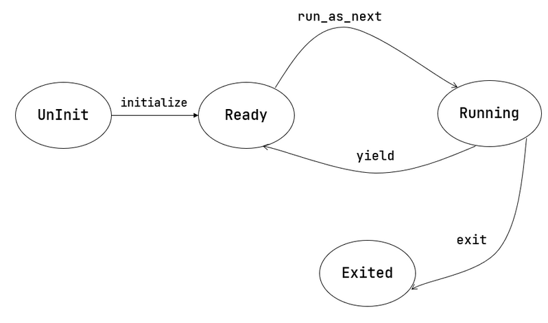

# 多道程序放置

在第二章中，内核让所有应用都共享同一个固定的起始地址。 正因如此，内存中同时最多只能驻留一个应用，

要一次加载运行多个程序，就要求每个用户程序被内核加载到内存中的起始地址都不同。 为此，我们编写脚本 user/build.py 为每个应用定制各自的起始地址。 它的思路很简单，对于每一个应用程序，使用 cargo rustc 单独编译， 用 -Clink-args=-Ttext=xxxx 选项指定链接时 .text 段的地址为 0x80400000 + app_id * 0x20000 。

## 多道程序加载

在第二章中负责应用加载和执行的子模块 batch 被拆分为 loader 和 task ， 前者负责启动时加载应用程序，后者负责切换和调度。

其中， loader 模块的 load_apps 函数负责将所有用户程序在内核初始化的时一并加载进内存。

```rs 
pub fn load_apps() {
    extern "C" {
        fn _num_app();
    }
    let num_app_ptr = _num_app as usize as *const usize;
    let num_app = get_num_app();
    let app_start = unsafe { core::slice::from_raw_parts(num_app_ptr.add(1), num_app + 1) };
    // clear i-cache first
    unsafe {
        asm!("fence.i");
    }
    // load apps
    for i in 0..num_app {
        let base_i = get_base_i(i);
        // clear region
        (base_i..base_i + APP_SIZE_LIMIT)
            .for_each(|addr| unsafe { (addr as *mut u8).write_volatile(0) });
        // load app from data section to memory
        let src = unsafe {
            core::slice::from_raw_parts(app_start[i] as *const u8, app_start[i + 1] - app_start[i])
        };
        let dst = unsafe { core::slice::from_raw_parts_mut(base_i as *mut u8, src.len()) };
        dst.copy_from_slice(src);
    }
}
```

第 个应用被加载到以物理地址 base_i 开头的一段物理内存上，而 base_i 的计算方式如下：

```rs 
fn get_base_i(app_id: usize) -> usize {
    APP_BASE_ADDRESS + app_id * APP_SIZE_LIMIT
}
```

我们可以在 config 子模块中找到这两个常数， APP_BASE_ADDRESS 被设置为 0x80400000 ， 而 APP_SIZE_LIMIT 和上一章一样被设置为 0x20000 。这种放置方式与 user/build.py 的实现一致。

# 任务切换

任务切换 ， 即应用在运行中主动或被动地交出 CPU 的使用权，内核可以选择另一个程序继续执行。 内核需要保证用户程序两次运行期间，任务上下文（如寄存器、栈等）保持一致。

## 任务切换的设计与实现

任务切换与上一章提及的 Trap 控制流切换相比，有如下异同：

    与 Trap 切换不同，它不涉及特权级切换，部分由编译器完成；

    与 Trap 切换相同，它对应用是透明的。

事实上，任务切换是来自两个不同应用在内核中的 Trap 控制流之间的切换。 当一个应用 Trap 到 S 态 OS 内核中进行进一步处理时， 其 Trap 控制流可以调用一个特殊的 __switch 函数。 在 __switch 返回之后，Trap 控制流将继续从调用该函数的位置继续向下执行。 而在调用 __switch 之后到返回前的这段时间里， 原 Trap 控制流 A 会先被暂停并被切换出去， CPU 转而运行另一个应用的 Trap 控制流 B 。 __switch 返回之后，原 Trap 控制流 A 才会从某一条 Trap 控制流 C 切换回来继续执行。

我们需要在 __switch 中保存 CPU 的某些寄存器，它们就是 任务上下文 (Task Context)。

下面我们给出 __switch 的实现：

```asm 
.altmacro
.macro SAVE_SN n
    sd s\n, (\n+2)*8(a0)
.endm
.macro LOAD_SN n
    ld s\n, (\n+2)*8(a1)
.endm
    .section .text
    .globl __switch
__switch:
    # __switch(
    #     current_task_cx_ptr: *mut TaskContext,
    #     next_task_cx_ptr: *const TaskContext
    # )
    # save kernel stack of current task
    sd sp, 8(a0)
    # save ra & s0~s11 of current execution
    sd ra, 0(a0)
    .set n, 0
    .rept 12
        SAVE_SN %n
        .set n, n + 1
    .endr
    # restore ra & s0~s11 of next execution
    ld ra, 0(a1)
    .set n, 0
    .rept 12
        LOAD_SN %n
        .set n, n + 1
    .endr
    # restore kernel stack of next task
    ld sp, 8(a1)
    ret 
```

它的两个参数分别是当前和即将被切换到的 Trap 控制流的 task_cx_ptr ，从 RISC-V 调用规范可知，它们分别通过寄存器 a0/a1 传入。

内核先把 current_task_cx_ptr 中包含的寄存器值逐个保存，再把 next_task_cx_ptr 中包含的寄存器值逐个恢复。

TaskContext 里包含的寄存器有：

```rs 
#[repr(C)]
/// task context structure containing some registers
pub struct TaskContext {
    /// Ret position after task switching
    ra: usize,
    /// Stack pointer
    sp: usize,
    /// s0-11 register, callee saved
    s: [usize; 12],
}
```

s0~s11 是被调用者保存寄存器， __switch 是用汇编编写的，编译器不会帮我们处理这些寄存器。 保存 ra 很重要，它记录了 __switch 函数返回之后应该跳转到哪里继续执行。

我们将这段汇编代码 __switch 解释为一个 Rust 函数：

```rs 
global_asm!(include_str!("switch.S"));

extern "C" {
    /// Switch to the context of `next_task_cx_ptr`, saving the current context
    /// in `current_task_cx_ptr`.
    pub fn __switch(current_task_cx_ptr: *mut TaskContext, next_task_cx_ptr: *const TaskContext);
}
```

我们会调用该函数来完成切换功能，而不是直接跳转到符号 __switch 的地址。 因此在调用前后，编译器会帮我们保存和恢复调用者保存寄存器。

# 管理多道程序

而内核为了管理任务，需要维护任务信息，相关内容包括：


任务运行状态：未初始化、准备执行、正在执行、已退出


任务控制块：维护任务状态和任务上下文


任务相关系统调用：程序主动暂停 sys_yield 和主动退出 sys_exit


## yield调用

```rs 
pub fn sys_yield() -> isize {
    syscall(SYSCALL_YIELD, [0, 0, 0])
}
// yield 是 Rust 的关键字
pub fn yield_() -> isize { sys_yield() }
```

## 任务控制块与任务运行状态

任务运行状态暂包括如下几种：

```rs 
/// The status of a task
#[derive(Copy, Clone, PartialEq)]
pub enum TaskStatus {
    /// uninitialized
    UnInit,
    /// ready to run
    Ready,
    /// running
    Running,
    /// exited
    Exited,
}
```

任务状态外和任务上下文一并保存在名为 任务控制块 (Task Control Block) 的数据结构中：

```rs 
#[derive(Copy, Clone)]
pub struct TaskControlBlock {
    /// The task status in it's lifecycle
    pub task_status: TaskStatus,
    /// The task context
    pub task_cx: TaskContext,
}
```

## 任务管理器

内核需要一个全局的任务管理器来管理这些任务控制块：

```rs 
pub struct TaskManager {
    /// total number of tasks
    num_app: usize,
    /// use inner value to get mutable access
    inner: UPSafeCell<TaskManagerInner>,
}

/// Inner of Task Manager
pub struct TaskManagerInner {
    /// task list
    tasks: [TaskControlBlock; MAX_APP_NUM],
    /// id of current `Running` task
    current_task: usize,
}
```

这里用到了变量与常量分离的编程风格：字段 num_app 表示应用数目，它在 TaskManager 初始化后将保持不变； 而包裹在 TaskManagerInner 内的任务控制块数组 tasks，以及正在执行的应用编号 current_task 会在执行过程中变化。

初始化 TaskManager 的全局实例 TASK_MANAGER：

```rs 
lazy_static! {
    /// Global variable: TASK_MANAGER
    pub static ref TASK_MANAGER: TaskManager = {
        let num_app = get_num_app();
        let mut tasks = [TaskControlBlock {
            task_cx: TaskContext::zero_init(),
            task_status: TaskStatus::UnInit,
        }; MAX_APP_NUM];
        for (i, task) in tasks.iter_mut().enumerate() {
            task.task_cx = TaskContext::goto_restore(init_app_cx(i));
            task.task_status = TaskStatus::Ready;
        }
        TaskManager {
            num_app,
            inner: unsafe {
                UPSafeCell::new(TaskManagerInner {
                    tasks,
                    current_task: 0,
                })
            },
        }
    };
}
```

第 5 行：调用 loader 子模块提供的 get_num_app 接口获取链接到内核的应用总数；

第 10~12 行：依次对每个任务控制块进行初始化，将其运行状态设置为 Ready ，并在它的内核栈栈顶压入一些初始化 上下文，然后更新它的 task_cx 。一些细节我们会稍后介绍。

从第 14 行开始：创建 TaskManager 实例并返回。


## 实现sys_yield和sys_exit

sys_yield 的实现用到了 task 子模块提供的 suspend_current_and_run_next 接口，这个接口如字面含义，就是暂停当前的应用并切换到下个应用。

```rs 
/// current task gives up resources for other tasks
pub fn sys_yield() -> isize {
    trace!("kernel: sys_yield");
    suspend_current_and_run_next();
    0
}
```

sys_exit 基于 task 子模块提供的 exit_current_and_run_next 接口，它的含义是退出当前的应用并切换到下个应用：

```rs 
use crate::task::exit_current_and_run_next;

pub fn sys_exit(exit_code: i32) -> ! {
    println!("[kernel] Application exited with code {}", exit_code);
    exit_current_and_run_next();
    panic!("Unreachable in sys_exit!");
}
```

那么 suspend_current_and_run_next 和 exit_current_and_run_next 各是如何实现的呢？

```rs 
/// Suspend the current 'Running' task and run the next task in task list.
pub fn suspend_current_and_run_next() {
    mark_current_suspended();
    run_next_task();
}

/// Exit the current 'Running' task and run the next task in task list.
pub fn exit_current_and_run_next() {
    mark_current_exited();
    run_next_task();
}
```

它们都是先修改当前应用的运行状态，然后尝试切换到下一个应用。修改运行状态比较简单，实现如下：

```rs 
impl TaskManager{
    /// Change the status of current `Running` task into `Ready`.
    fn mark_current_suspended(&self) {
        let mut inner = self.inner.exclusive_access();
        let current = inner.current_task;
        inner.tasks[current].task_status = TaskStatus::Ready;
    }
}
```

以 mark_current_suspended 为例。首先获得里层 TaskManagerInner 的可变引用，然后修改任务控制块数组 tasks 中当前任务的状态。

再看 run_next_task 的实现：

```rs 
    /// Find next task to run and return task id.
    ///
    /// In this case, we only return the first `Ready` task in task list.
    fn find_next_task(&self) -> Option<usize> {
        let inner = self.inner.exclusive_access();
        let current = inner.current_task;
        (current + 1..current + self.num_app + 1)
            .map(|id| id % self.num_app)
            .find(|id| inner.tasks[*id].task_status == TaskStatus::Ready)
    }

    /// Switch current `Running` task to the task we have found,
    /// or there is no `Ready` task and we can exit with all applications completed
    fn run_next_task(&self) {
        if let Some(next) = self.find_next_task() {
            let mut inner = self.inner.exclusive_access();
            let current = inner.current_task;
            inner.tasks[next].task_status = TaskStatus::Running;
            inner.current_task = next;
            let current_task_cx_ptr = &mut inner.tasks[current].task_cx as *mut TaskContext;
            let next_task_cx_ptr = &inner.tasks[next].task_cx as *const TaskContext;
            drop(inner);
            // before this, we should drop local variables that must be dropped manually
            unsafe {
                __switch(current_task_cx_ptr, next_task_cx_ptr);
            }
            // go back to user mode
        } else {
            panic!("All applications completed!");
        }
    }
```
run_next_task 会调用 find_next_task 方法尝试寻找一个运行状态为 Ready 的应用并获得其 ID 。 如果找不到， 说明所有应用都执行完了， find_next_task 将返回 None ，内核 panic 退出。 如果能够找到下一个可运行应用，我们就调用 __switch 切换任务。

切换任务之前，我们要手动 drop 掉我们获取到的 TaskManagerInner 可变引用。 因为函数还没有返回， inner 不会自动销毁。我们只有令 TASK_MANAGER 的 inner 字段回到未被借用的状态，下次任务切换时才能再借用。

我们可以总结一下应用的运行状态变化图：



## 第一次进入用户态

我们在第二章中介绍过 CPU 第一次从内核态进入用户态的方法，只需在内核栈上压入构造好的 Trap 上下文， 然后 __restore 即可。本章要在此基础上做一些扩展。

在初始化任务控制块时，我们是这样做的：

```rs 
        for (i, task) in tasks.iter_mut().enumerate() {
            task.task_cx = TaskContext::goto_restore(init_app_cx(i));
            task.task_status = TaskStatus::Ready;
        }
```

init_app_cx 在 loader 子模块中定义，它向内核栈压入了一个 Trap 上下文，并返回压入 Trap 上下文后 sp 的值。 这个 Trap 上下文的构造方式与第二章相同。

goto_restore 保存传入的 sp，并将 ra 设置为 __restore 的入口地址，构造任务上下文后返回。这样，任务管理器中各个应用的任务上下文就得到了初始化。
```rs
impl TaskContext {
    /// Create a new empty task context
    pub fn zero_init() -> Self {
        Self {
            ra: 0,
            sp: 0,
            s: [0; 12],
        }
    }
    /// Create a new task context with a trap return addr and a kernel stack pointer
    pub fn goto_restore(kstack_ptr: usize) -> Self {
        extern "C" {
            fn __restore();
        }
        Self {
            ra: __restore as usize,
            sp: kstack_ptr,
            s: [0; 12],
        }
    }
}
```

在 rust_main 中我们调用 task::run_first_task 来执行第一个应用：

```rs 
    fn run_first_task(&self) -> ! {
        let mut inner = self.inner.exclusive_access();
        let task0 = &mut inner.tasks[0];
        task0.task_status = TaskStatus::Running;
        let next_task_cx_ptr = &task0.task_cx as *const TaskContext;
        drop(inner);
        let mut _unused = TaskContext::zero_init();
        // before this, we should drop local variables that must be dropped manually
        unsafe {
            __switch(&mut _unused as *mut TaskContext, next_task_cx_ptr);
        }
        panic!("unreachable in run_first_task!");
    }
```

我们显式声明了一个 _unused 变量，并将它的地址作为第一个参数传给 __switch ， 声明此变量的意义仅仅是为了避免其他数据被覆盖。

在 __switch 中恢复 sp 后， sp 将指向 init_app_cx 构造的 Trap 上下文，后面就回到第二章的情况了。 此外， __restore 的实现需要做出变化：它 不再需要 在开头 mv sp, a0 了。因为在 __switch 之后，sp 就已经正确指向了我们需要的 Trap 上下文地址。


