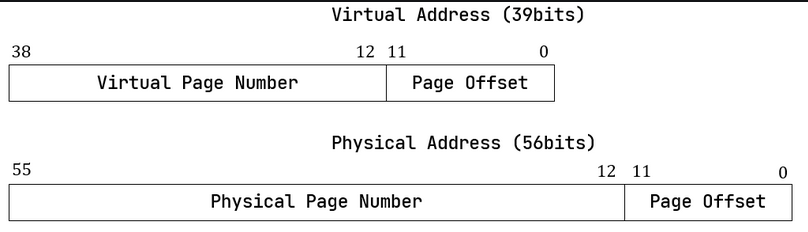
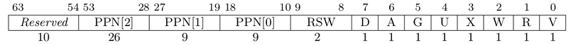
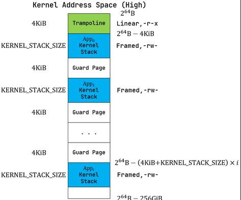
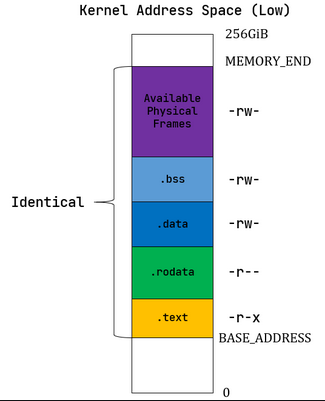

# 虚拟地址和物理地址

## 内存控制相关的CSR寄存器

默认情况下 MMU 未被使能，此时无论 CPU 处于哪个特权级，访存的地址都将直接被视作物理地址。 可以通过修改 S 特权级的 satp CSR 来启用分页模式，此后 S 和 U 特权级的访存地址会被视为虚拟地址，经过 MMU 的地址转换获得对应物理地址，再通过它来访问物理内存。

当MODE设置为0时，所有访存被视为物理地址；而设置为8时，SV39分页机制被启用，所有S/U特权级的访存被视为一个39位的虚拟地址，MMU会将其转换为56位的物理地址；转换失败就触发异常。



采用分页管理，单个页面大小设置为4KiB, 每个虚拟页面和物理页帧都按4KB对齐。

4KiB需要用12位字节地址来表示，因此虚拟地址和物理地址都被分成两部分：低12位被称为业内偏移。虚拟地址的高27位，也就是[38:12为他的虚拟页号VPN；物理地址的高44位，也就是[55:12]为他的物理页号PPN。页号用来定位一个虚拟/物理地址数据哪一个虚拟页面/物理页帧。

地址转换是以页为单位进行的，转换前后地址页内偏移部分不变。MMU 只是从虚拟地址中取出 27 位虚拟页号， 在页表中查到其对应的物理页号，如果找到，就将得到的 44 位的物理页号与 12 位页内偏移拼接到一起，形成 56 位物理地址。

### RV64 架构中虚拟地址为何只有 39 位？

虚拟地址长度确实应该和位宽一致为 64 位，但是在启用 SV39 分页模式下，只有低 39 位是真正有意义的。 SV39 分页模式规定 64 位虚拟地址的

这 25 位必须和第 38 位相同，否则 MMU 会直接认定它是一个 不合法的虚拟地址。。

也就是说，所有
个虚拟地址中，只有最低的 （当第 38 位为 0 时） 以及最高的 （当第 38 位为 1 时）是可能通过 MMU 检查的。

## 地址相关的数据结构抽象与类型定义

```rust
/// physical address
#[derive(Copy, Clone, Ord, PartialOrd, Eq, PartialEq)]
pub struct PhysAddr(pub usize);
/// virtual address
#[derive(Copy, Clone, Ord, PartialOrd, Eq, PartialEq)]
pub struct VirtAddr(pub usize);
/// physical page number
#[derive(Copy, Clone, Ord, PartialOrd, Eq, PartialEq)]
pub struct PhysPageNum(pub usize);
/// virtual page number
#[derive(Copy, Clone, Ord, PartialOrd, Eq, PartialEq)]
pub struct VirtPageNum(pub usize);
```

上面分别给出了物理地址、虚拟地址、物理页号、虚拟页号的 Rust 类型声明，它们都是 usize 的一种简单包装。 将它们各自抽象出来而不是直接使用 usize，是为了在 Rust 编译器的帮助下进行多种方便且安全的 类型转换 (Type Convertion) 。

这些类型本身可以和 usize 之间互相转换，地址和页号之间也可以相互转换。

```rust
// os/src/mm/address.rs

impl PhysAddr {
    pub fn page_offset(&self) -> usize { self.0 & (PAGE_SIZE - 1) }
}

impl From<PhysAddr> for PhysPageNum {
    fn from(v: PhysAddr) -> Self {
        assert_eq!(v.page_offset(), 0);
        v.floor()
    }
}

impl From<PhysPageNum> for PhysAddr {
    fn from(v: PhysPageNum) -> Self { Self(v.0 << PAGE_SIZE_BITS) }
}
```

其中 PAGE_SIZE 为 ， PAGE_SIZE_BITS 为 ，它们均定义在 config 子模块 中，分别表示每个页面的大小和页内偏移的位宽。从物理页号到物理地址的转换只需左移

位即可，但是物理地址需要 保证它与页面大小对齐才能通过右移转换为物理页号。

对于不对齐的情况，物理地址不能通过 From/Into 转换为物理页号，而是需要通过它自己的 floor 或 ceil 方法来 进行下取整或上取整的转换。

```rust
impl PhysAddr {
    /// Get the (floor) physical page number
    pub fn floor(&self) -> PhysPageNum {
        PhysPageNum(self.0 / PAGE_SIZE)
    }
    /// Get the (ceil) physical page number
    pub fn ceil(&self) -> PhysPageNum {
        PhysPageNum((self.0 - 1 + PAGE_SIZE) / PAGE_SIZE)
    }
    /// Get the page offset of physical address
    pub fn page_offset(&self) -> usize {
        self.0 & (PAGE_SIZE - 1)
    }
    /// Check if the physical address is aligned by page size
    pub fn aligned(&self) -> bool {
        self.page_offset() == 0
    }
}
```

## 页表项的数据结构抽象与类型定义

![SV39分页模式下的页表项]
## 页表项的数据结构抽象与类型定义

![SV39分页模式下的页表项]
## 页表项的数据结构抽象与类型定义



上图为 SV39 分页模式下的页表项，其中 这 位是物理页号，最低的 位

则是标志位，它们的含义如下：

    仅当 V(Valid) 位为 1 时，页表项才是合法的；

    R/W/X 分别控制索引到这个页表项的对应虚拟页面是否允许读/写/取指；

    U 控制索引到这个页表项的对应虚拟页面是否在 CPU 处于 U 特权级的情况下是否被允许访问；

    G 我们不理会；

    A(Accessed) 记录自从页表项上的这一位被清零之后，页表项的对应虚拟页面是否被访问过；

    D(Dirty) 则记录自从页表项上的这一位被清零之后，页表项的对应虚拟页表是否被修改过。

先实现页表项的标志位PTEFlags: 

我们的OS运行在Sv39 RISC-V上面，对于运行在64位的虚拟地址仅仅使用其低39位，高25位是未被使用的；虚拟地址使用低39位中的高27位去索引页表去找到页表项（PTE: Page Table Entry）。其中每个页表项包含一个44位的物理页号（PPN）和一些标志位。

当OS通过PTE找到PPN后，根据其PPN去寻找其物理页号，随后根据2级索引再去找到对应的PTE提取其PPN。在经过三级索引后，我们发现最终的物理页号并将其与我们虚拟地址的低12位偏移量（offset）拼接起来成为真正的物理地址。 

```rust
// os/src/main.rs

#[macro_use]
extern crate bitflags;

// os/src/mm/page_table.rs

use bitflags::*;

bitflags! {
    pub struct PTEFlags: u8 {
        const V = 1 << 0;
        const R = 1 << 1;
        const W = 1 << 2;
        const X = 1 << 3;
        const U = 1 << 4;
        const G = 1 << 5;
        const A = 1 << 6;
        const D = 1 << 7;
    }
}
```

bitflags 是一个 Rust 中常用来比特标志位的 crate 。它提供了 一个 bitflags! 宏，如上面的代码段所展示的那样，可以将一个 u8 封装成一个标志位的集合类型，支持一些常见的集合 运算。

接着实现页表项PageTableEntry: 

```rust
#[derive(Copy, Clone)]
#[repr(C)]
/// page table entry structure
pub struct PageTableEntry {
    /// bits of page table entry
    pub bits: usize,
}

impl PageTableEntry {
    /// Create a new page table entry
    pub fn new(ppn: PhysPageNum, flags: PTEFlags) -> Self {
        PageTableEntry {
            bits: ppn.0 << 10 | flags.bits as usize,
        }
    }
    /// Create an empty page table entry
    pub fn empty() -> Self {
        PageTableEntry { bits: 0 }
    }
    /// Get the physical page number from the page table entry
    pub fn ppn(&self) -> PhysPageNum {
        (self.bits >> 10 & ((1usize << 44) - 1)).into()
    }
    /// Get the flags from the page table entry
    pub fn flags(&self) -> PTEFlags {
        PTEFlags::from_bits(self.bits as u8).unwrap()
    }
    /// The page pointered by page table entry is valid?
    pub fn is_valid(&self) -> bool {
        (self.flags() & PTEFlags::V) != PTEFlags::empty()
    }
    /// The page pointered by page table entry is readable?
    pub fn readable(&self) -> bool {
        (self.flags() & PTEFlags::R) != PTEFlags::empty()
    }
    /// The page pointered by page table entry is writable?
    pub fn writable(&self) -> bool {
        (self.flags() & PTEFlags::W) != PTEFlags::empty()
    }
    /// The page pointered by page table entry is executable?
    pub fn executable(&self) -> bool {
        (self.flags() & PTEFlags::X) != PTEFlags::empty()
    }
}
```
    第 10 行使得我们可以从一个物理页号 PhysPageNum 和一个页表项标志位 PTEFlags 生成一个页表项 PageTableEntry 实例；而第 20 行和第 23 行则分别可以从一个页表项将它们两个取出。

    第 15 行中，我们也可以通过 empty 方法生成一个全零的页表项，注意这隐含着该页表项的 V 标志位为 0 ， 因此它是不合法的。

后面我们还为 PageTableEntry 实现了一些辅助函数(Helper Function)，可以快速判断一个页表项的 V/R/W/X 标志位是否为 1，以 V 标志位的判断为例，实现了is_valid函数。相当于判断两个集合的交集是否为空。

## 物理页帧管理

### 可用物理页的分配与回收

首先，我们需要知道物理内存的哪一部分是可用的。在 os/src/linker.ld 中，我们用符号 ekernel 指明了 内核数据的终止物理地址，在它之后的物理内存都是可用的。而在 config 子模块中：

```rust
/// the physical memory end
pub const MEMORY_END: usize = 0x88000000;
```

我们硬编码整块物理内存的终止物理地址为 0x80800000 。 而物理内存的起始物理地址为 0x80000000 ， 意味着我们将可用内存大小设置为

，当然也可以设置的更大一点。

用一个左闭右开的物理页号区间来表示可用的物理内存，则：

    区间的左端点应该是 ekernel 的物理地址以上取整方式转化成的物理页号；

    区间的右端点应该是 MEMORY_END 以下取整方式转化成的物理页号。

这个区间将被传给我们后面实现的物理页帧管理器用于初始化。

我们声明一个FrameAllocator Trait来描述一个物理页帧管理器要提供哪些功能：
```rust
trait FrameAllocator {
    fn new() -> Self;
    fn alloc(&mut self) -> Option<PhysPageNum>;
    fn dealloc(&mut self, ppn: PhysPageNum);
}
```

最简单的栈式物理页帧管理策略StackFrameAllocator: 

```rust
/// an implementation for frame allocator
pub struct StackFrameAllocator {
    current: usize,
    end: usize,
    recycled: Vec<usize>,
}
```

其中各字段的含义是：物理页号区间 此前均 从未 被分配出去过，而向量 recycled 以后入先出的方式保存了被回收的物理页号。

初始化非常简单。在通过 FrameAllocator 的 new 方法创建实例的时候，只需将区间两端均设为 ， 然后创建一个新的向量；而在它真正被使用起来之前，需要调用 init 方法将自身的 初始化为可用物理页号区间：
```rust
impl FrameAllocator for StackFrameAllocator {
    fn new() -> Self {
        Self {
            current: 0,
            end: 0,
            recycled: Vec::new(),
        }
    }
}
impl StackFrameAllocator {
    pub fn init(&mut self, l: PhysPageNum, r: PhysPageNum) {
        self.current = l.0;
        self.end = r.0;
        // trace!("last {} Physical Frames.", self.end - self.current);
    }
}
```

核心的物理页帧和分配怎么实现：

```rust
impl FrameAllocator for StackFrameAllocator {
    fn alloc(&mut self) -> Option<PhysPageNum> {
        if let Some(ppn) = self.recycled.pop() {
            Some(ppn.into())
        } else {
            if self.current == self.end {
                None
            } else {
                self.current += 1;
                Some((self.current - 1).into())
            }
        }
    }
    fn dealloc(&mut self, ppn: PhysPageNum) {
        let ppn = ppn.0;
        // validity check
        if ppn >= self.current || self.recycled
            .iter()
            .find(|&v| {*v == ppn})
            .is_some() {
            panic!("Frame ppn={:#x} has not been allocated!", ppn);
        }
        // recycle
        self.recycled.push(ppn);
    }
}
```

在分配 alloc 的时候，首先会检查栈 recycled 内有没有之前回收的物理页号，如果有的话直接弹出栈顶并返回； 否则的话我们只能从之前从未分配过的物理页号区间

上进行分配，我们分配它的 左端点 current ，同时将管理器内部维护的 current 加一代表 current 此前已经被分配过了。在即将返回 的时候，我们使用 into 方法将 usize 转换成了物理页号 PhysPageNum 。

注意极端情况下可能出现内存耗尽分配失败的情况：即 recycled 为空且

。 为了涵盖这种情况， alloc 的返回值被 Option 包裹，我们返回 None 即可。

在回收 dealloc 的时候，我们需要检查回收页面的合法性，然后将其压入 recycled 栈中。回收页面合法有两个 条件：

    该页面之前一定被分配出去过，因此它的物理页号一定 

        ；

        该页面没有正处在回收状态，即它的物理页号不能在栈 recycled 中找到。

    我们通过 recycled.iter() 获取栈上内容的迭代器，然后通过迭代器的 find 方法试图 寻找一个与输入物理页号相同的元素。其返回值是一个 Option ，如果找到了就会是一个 Option::Some ， 这种情况说明我们内核其他部分实现有误，直接报错退出。

之后创建 StackFrameAllocator 的全局实例 FRAME_ALLOCATOR，并在正式分配物理页帧之前将 FRAME_ALLOCATOR 初始化，见 os/src/mm/frame_allocator.rs。

### 分配/回收物理页帧的接口

公开给其他子模块调用的分配/回收物理页帧的接口：
```rust
pub fn frame_alloc() -> Option<FrameTracker> {
    FRAME_ALLOCATOR
        .exclusive_access()
        .alloc()
        .map(FrameTracker::new)
}

fn frame_dealloc(ppn: PhysPageNum) {
    FRAME_ALLOCATOR.exclusive_access().dealloc(ppn);
}
```

可以发现， frame_alloc 的返回值类型并不是 FrameAllocator 要求的物理页号 PhysPageNum ，而是将其 进一步包装为一个 FrameTracker ，其定义如下。 FrameTracker 被创建时，需要从 FRAME_ALLOCATOR 中分配一个物理页帧：
```rust
pub struct FrameTracker {
    pub ppn: PhysPageNum,
}

impl FrameTracker {
    pub fn new(ppn: PhysPageNum) -> Self {
        // page cleaning
        let bytes_array = ppn.get_bytes_array();
        for i in bytes_array {
            *i = 0;
        }
        Self { ppn }
    }
}
```

我们将分配来的物理页帧的物理页号作为参数传给 FrameTracker 的 new 方法来创建一个 FrameTracker 实例。由于这个物理页帧之前可能被分配过并用做其他用途，我们在这里直接将这个物理页帧上的所有字节清零。这一过程并不 那么显然，我们后面再详细介绍。

当一个 FrameTracker 生命周期结束被编译器回收的时候，我们需要将它控制的物理页帧回收掉 FRAME_ALLOCATOR 中：

```rs
impl Drop for FrameTracker {
    fn drop(&mut self) {
        frame_dealloc(self.ppn);
    }
}
```

这里我们只需为 FrameTracker 实现 Drop Trait 即可。当一个 FrameTracker 实例被回收的时候，它的 drop 方法会自动被编译器调用，通过之前实现的 frame_dealloc 我们就将它控制的物理页帧回收以供后续使用了。

最后做一个小结：从其他模块的视角看来，物理页帧分配的接口是调用 frame_alloc 函数得到一个 FrameTracker （如果物理内存还有剩余），它就代表了一个物理页帧，当它的生命周期结束之后它所控制的物理页帧将被自动回收。

### 多级页表实现

#### 页表基本数据结构与访问接口

SV39 多级页表是以节点为单位进行管理的。每个节点恰好存储在一个物理页帧中，它的位置可以用一个物理页号来表示。

```rust
/// page table structure
pub struct PageTable {
    root_ppn: PhysPageNum,
    frames: Vec<FrameTracker>,
}

/// Assume that it won't oom when creating/mapping.
impl PageTable {
    /// Create a new page table
    pub fn new() -> Self {
        let frame = frame_alloc().unwrap();
        PageTable {
            root_ppn: frame.ppn,
            frames: vec![frame],
        }
    }
}
```

每个应用的地址空间都对应一个不同的多级页表，这也就意味这不同页表的起始地址（即页表根节点的地址）是不一样的。 因此 PageTable 要保存它根节点的物理页号 root_ppn 作为页表唯一的区分标志。此外， 向量 frames 以 FrameTracker 的形式保存了页表所有的节点（包括根节点）所在的物理页帧。这与物理页帧管理模块 的测试程序是一个思路，即将这些 FrameTracker 的生命周期进一步绑定到 PageTable 下面。当 PageTable 生命周期结束后，向量 frames 里面的那些 FrameTracker 也会被回收，也就意味着存放多级页表节点的那些物理页帧 被回收了。

当我们通过 new 方法新建一个 PageTable 的时候，它只需有一个根节点。为此我们需要分配一个物理页帧 FrameTracker 并挂在向量 frames 下，然后更新根节点的物理页号 root_ppn 。

多级页表并不是被创建出来之后就不再变化的，为了 MMU 能够通过地址转换正确找到应用地址空间中的数据实际被内核放在内存中 位置，操作系统需要动态维护一个虚拟页号到页表项的映射，支持插入/删除键值对，其方法签名如下：

```rust
    /// set the map between virtual page number and physical page number
    #[allow(unused)]
    pub fn map(&mut self, vpn: VirtPageNum, ppn: PhysPageNum, flags: PTEFlags) {
        let pte = self.find_pte_create(vpn).unwrap();
        assert!(!pte.is_valid(), "vpn {:?} is mapped before mapping", vpn);
        *pte = PageTableEntry::new(ppn, flags | PTEFlags::V);
    }
    /// remove the map between virtual page number and physical page number
    #[allow(unused)]
    pub fn unmap(&mut self, vpn: VirtPageNum) {
        let pte = self.find_pte(vpn).unwrap();
        assert!(pte.is_valid(), "vpn {:?} is invalid before unmapping", vpn);
        *pte = PageTableEntry::empty();
    }
```


我们通过 map 方法来在多级页表中插入一个键值对，注意这里我们将物理页号 ppn 和页表项标志位 flags 作为 不同的参数传入而不是整合为一个页表项；

相对的，我们通过 unmap 方法来删除一个键值对，在调用时仅需给出作为索引的虚拟页号即可。

在这些操作的过程中，我们自然需要访问或修改多级页表节点的内容。每个节点都被保存在一个物理页帧中，在多级页表的架构中，我们以 一个节点被存放在的物理页帧的物理页号作为指针指向该节点，这意味着，对于每个节点来说，一旦我们知道了指向它的物理页号，我们 就能够修改这个节点的内容。

这就需要我们提前扩充多级页表维护的映射，使得对于每一个对应于某一特定物理页帧的物理页号 ppn ，均存在一个虚拟页号 vpn 能够映射到它，而且要能够较为简单的针对一个 ppn 找到某一个能映射到它的 vpn 。这里我们采用一种最 简单的 恒等映射 (Identical Mapping) ，也就是说对于物理内存上的每个物理页帧，我们都在多级页表中用一个与其 物理页号相等的虚拟页号映射到它。当我们想针对物理页号构造一个能映射到它的虚拟页号的时候，也只需使用一个和该物理页号 相等的虚拟页号即可。

#### 内核访问物理页帧的方法

在内核中应如何访问一个特定的物理页帧：

```rust
impl PhysPageNum {
    pub fn get_pte_array(&self) -> &'static mut [PageTableEntry] {
        let pa: PhysAddr = self.clone().into();
        unsafe {
            core::slice::from_raw_parts_mut(pa.0 as *mut PageTableEntry, 512)
        }
    }
    pub fn get_bytes_array(&self) -> &'static mut [u8] {
        let pa: PhysAddr = self.clone().into();
        unsafe {
            core::slice::from_raw_parts_mut(pa.0 as *mut u8, 4096)
        }
    }
    pub fn get_mut<T>(&self) -> &'static mut T {
        let pa: PhysAddr = self.clone().into();
        unsafe {
            (pa.0 as *mut T).as_mut().unwrap()
        }
    }
}
```

我们构造可变引用来直接访问一个物理页号 PhysPageNum 对应的物理页帧，不同的引用类型对应于物理页帧上的一种不同的 内存布局，如 get_pte_array 返回的是一个页表项定长数组的可变引用，可以用来修改多级页表中的一个节点；而 get_bytes_array 返回的是一个字节数组的可变引用，可以以字节为粒度对物理页帧上的数据进行访问，前面进行数据清零 就用到了这个方法； get_mut 是个泛型函数，可以获取一个恰好放在一个物理页帧开头的类型为 T 的数据的可变引用。

在实现方面，都是先把物理页号转为物理地址 PhysAddr ，然后再转成 usize 形式的物理地址。接着，我们直接将它 转为裸指针用来访问物理地址指向的物理内存。在分页机制开启前，这样做自然成立；而开启之后，虽然裸指针被视为一个虚拟地址， 但是上面已经提到这种情况下虚拟地址会映射到一个相同的物理地址，因此在这种情况下也成立。注意，我们在返回值类型上附加了 静态生命周期泛型 'static ，这是为了绕过 Rust 编译器的借用检查，实质上可以将返回的类型也看成一个裸指针，因为 它也只是标识数据存放的位置以及类型。但与裸指针不同的是，无需通过 unsafe 的解引用访问它指向的数据，而是可以像一个 正常的可变引用一样直接访问。

#### 建立和拆除虚实地址映射关系

接下来介绍建立和拆除虚实地址映射关系的 map 和 unmap 方法是如何实现的。它们都依赖于一个很重要的过程， 也即在多级页表中找到一个虚拟地址对应的页表项。找到之后，只要修改页表项的内容即可完成键值对的插入和删除。 在寻找页表项的时候，可能出现页表的中间级节点还未被创建的情况，这个时候我们需要手动分配一个物理页帧来存放这个节点， 并将这个节点接入到当前的多级页表的某级中。

```rust
//address.rs
impl VirtPageNum {
    /// Get the indexes of the page table entry
    pub fn indexes(&self) -> [usize; 3] {
        let mut vpn = self.0;
        let mut idx = [0usize; 3];
        for i in (0..3).rev() {
            idx[i] = vpn & 511;
            vpn >>= 9;
        }
        idx
    }
}
//page_table.rs
impl PageTable{
    /// Find PageTableEntry by VirtPageNum, create a frame for a 4KB page table if not exist
    fn find_pte_create(&mut self, vpn: VirtPageNum) -> Option<&mut PageTableEntry> {
        let idxs = vpn.indexes();
        let mut ppn = self.root_ppn;
        let mut result: Option<&mut PageTableEntry> = None;
        for (i, idx) in idxs.iter().enumerate() {
            let pte = &mut ppn.get_pte_array()[*idx];
            if i == 2 {
                result = Some(pte);
                break;
            }
            if !pte.is_valid() {
                let frame = frame_alloc().unwrap();
                *pte = PageTableEntry::new(frame.ppn, PTEFlags::V);
                self.frames.push(frame);
            }
            ppn = pte.ppn();
        }
        result
    }
}
```

VirtPageNum 的 indexes 可以取出虚拟页号的三级页索引，并按照从高到低的顺序返回。注意它里面包裹的 usize 可能有 位，也有可能有 位，但这里我们是用来在多级页表上进行遍历，因此 只取出低 位。

PageTable::find_pte_create 在多级页表找到一个虚拟页号对应的页表项的可变引用方便后续的读写。如果在 遍历的过程中发现有节点尚未创建则会新建一个节点。

变量 ppn 表示当前节点的物理页号，最开始指向多级页表的根节点。随后每次循环通过 get_pte_array 将 取出当前节点的页表项数组，并根据当前级页索引找到对应的页表项。如果当前节点是一个叶节点，那么直接返回这个页表项 的可变引用；否则尝试向下走。走不下去的话就新建一个节点，更新作为下级节点指针的页表项，并将新分配的物理页帧移动到 向量 frames 中方便后续的自动回收。注意在更新页表项的时候，不仅要更新物理页号，还要将标志位 V 置 1， 不然硬件在查多级页表的时候，会认为这个页表项不合法，从而触发 Page Fault 而不能向下走。

于是， map/unmap 就非常容易实现了：

```rust
// os/src/mm/page_table.rs

impl PageTable {
    pub fn map(&mut self, vpn: VirtPageNum, ppn: PhysPageNum, flags: PTEFlags) {
        let pte = self.find_pte_create(vpn).unwrap();
        assert!(!pte.is_valid(), "vpn {:?} is mapped before mapping", vpn);
        *pte = PageTableEntry::new(ppn, flags | PTEFlags::V);
    }
    pub fn unmap(&mut self, vpn: VirtPageNum) {
        let pte = self.find_pte_create(vpn).unwrap();
        assert!(pte.is_valid(), "vpn {:?} is invalid before unmapping", vpn);
        *pte = PageTableEntry::empty();
    }
}
```

只需根据虚拟页号找到页表项，然后修改或者直接清空其内容即可。

为了方便后面的实现，我们还需要 PageTable 提供一种不经过 MMU 而是手动查页表的方法：
```rust
impl PageTable{
    /// Temporarily used to get arguments from user space.
    pub fn from_token(satp: usize) -> Self {
        Self {
            root_ppn: PhysPageNum::from(satp & ((1usize << 44) - 1)),
            frames: Vec::new(),
        }
    }
    /// Find PageTableEntry by VirtPageNum
    fn find_pte(&self, vpn: VirtPageNum) -> Option<&mut PageTableEntry> {
        let idxs = vpn.indexes();
        let mut ppn = self.root_ppn;
        let mut result: Option<&mut PageTableEntry> = None;
        for (i, idx) in idxs.iter().enumerate() {
            let pte = &mut ppn.get_pte_array()[*idx];
            if i == 2 {
                result = Some(pte);
                break;
            }
            if !pte.is_valid() {
                return None;
            }
            ppn = pte.ppn();
        }
        result
    }
    /// get the page table entry from the virtual page number
    pub fn translate(&self, vpn: VirtPageNum) -> Option<PageTableEntry> {
        self.find_pte(vpn).map(|pte| *pte)
    }
}
```

第 5 行的 from_token 可以临时创建一个专用来手动查页表的 PageTable ，它仅有一个从传入的 satp token 中得到的多级页表根节点的物理页号，它的 frames 字段为空，也即不实际控制任何资源；

第 11 行的 find_pte 和之前的 find_pte_create 不同之处在于它不会试图分配物理页帧。一旦在多级页表上遍历 遇到空指针它就会直接返回 None 表示无法正确找到传入的虚拟页号对应的页表项；

第 28 行的 translate 调用 find_pte 来实现，如果能够找到页表项，那么它会将页表项拷贝一份并返回，否则就 返回一个 None 。

## 内核与应用的地址空间

### 实现地址空间抽象

#### 逻辑段：一段连续地址的虚拟内存

我们以逻辑段 MapArea 为单位描述一段连续地址的虚拟内存。所谓逻辑段，就是指地址区间中的一段实际可用（即 MMU 通过查多级页表 可以正确完成地址转换）的地址连续的虚拟地址区间，该区间内包含的所有虚拟页面都以一种相同的方式映射到物理页帧，具有可读/可写/可执行等属性。

```rust
pub struct MapArea {
    vpn_range: VPNRange,
    data_frames: BTreeMap<VirtPageNum, FrameTracker>,
    map_type: MapType,
    map_perm: MapPermission,
}
```

MapType 描述该逻辑段内的所有虚拟页面映射到物理页帧的同一种方式，它是一个枚举类型，在内核当前的实现中支持两种方式：

```rust
/// map type for memory set: identical or framed
pub enum MapType {
    Identical,
    Framed,
}
```

其中 Identical 表示之前也有提到的恒等映射，用于在启用多级页表之后仍能够访问一个特定的物理地址指向的物理内存；而 Framed 则表示对于每个虚拟页面都需要映射到一个新分配的物理页帧。

当逻辑段采用 MapType::Framed 方式映射到物理内存的时候， data_frames 是一个保存了该逻辑段内的每个虚拟页面 和它被映射到的物理页帧 FrameTracker 的一个键值对容器 BTreeMap 中，这些物理页帧被用来存放实际内存数据而不是 作为多级页表中的中间节点。和之前的 PageTable 一样，这也用到了 RAII 的思想，将这些物理页帧的生命周期绑定到它所在的逻辑段 MapArea 下，当逻辑段被回收之后这些之前分配的物理页帧也会自动地同时被回收。

MapPermission 表示控制该逻辑段的访问方式，它是页表项标志位 PTEFlags 的一个子集，仅保留 U/R/W/X 四个标志位，因为其他的标志位仅与硬件的地址转换机制细节相关，这样的设计能避免引入错误的标志位。

```rust
// os/src/mm/memory_set.rs

bitflags! {
    pub struct MapPermission: u8 {
        const R = 1 << 1;
        const W = 1 << 2;
        const X = 1 << 3;
        const U = 1 << 4;
    }
}
```

#### 地址空间：一系列有关联的逻辑段

地址空间是一系列有关联的逻辑段，这种关联一般是指这些逻辑段属于一个运行的程序（目前把一个运行的程序称为任务，后续会称为进程）。 用来表明正在运行的应用所在执行环境中的可访问内存空间，在这个内存空间中，包含了一系列的不一定连续的逻辑段。 这样我们就有任务的地址空间、内核的地址空间等说法了。地址空间使用 MemorySet 类型来表示：

```rust
// os/src/mm/memory_set.rs

pub struct MemorySet {
    page_table: PageTable,
    areas: Vec<MapArea>,
}
```
它包含了该地址空间的多级页表 page_table 和一个逻辑段 MapArea 的向量 areas 。注意 PageTable 下 挂着所有多级页表的节点所在的物理页帧，而每个 MapArea 下则挂着对应逻辑段中的数据所在的物理页帧，这两部分 合在一起构成了一个地址空间所需的所有物理页帧。这同样是一种 RAII 风格，当一个地址空间 MemorySet 生命周期结束后， 这些物理页帧都会被回收。

地址空间 MemorySet 的方法如下：
```rust
// os/src/mm/memory_set.rs

impl MemorySet {
    pub fn new_bare() -> Self {
        Self {
            page_table: PageTable::new(),
            areas: Vec::new(),
        }
    }
    fn push(&mut self, mut map_area: MapArea, data: Option<&[u8]>) {
        map_area.map(&mut self.page_table);
        if let Some(data) = data {
            map_area.copy_data(&mut self.page_table, data);
        }
        self.areas.push(map_area);
    }
    /// Assume that no conflicts.
    pub fn insert_framed_area(
        &mut self,
        start_va: VirtAddr, end_va: VirtAddr, permission: MapPermission
    ) {
        self.push(MapArea::new(
            start_va,
            end_va,
            MapType::Framed,
            permission,
        ), None);
    }
    pub fn new_kernel() -> Self;
    /// Include sections in elf and trampoline and TrapContext and user stack,
    /// also returns user_sp and entry point.
    pub fn from_elf(elf_data: &[u8]) -> (Self, usize, usize);
}
```

第 4 行， new_bare 方法可以新建一个空的地址空间；

第 10 行， push 方法可以在当前地址空间插入一个新的逻辑段 map_area ，如果它是以 Framed 方式映射到 物理内存，还可以可选地在那些被映射到的物理页帧上写入一些初始化数据 data ；

第 18 行， insert_framed_area 方法调用 push ，可以在当前地址空间插入一个 Framed 方式映射到 物理内存的逻辑段。注意该方法的调用者要保证同一地址空间内的任意两个逻辑段不能存在交集，从后面即将分别介绍的内核和 应用的地址空间布局可以看出这一要求得到了保证；

第 29 行， new_kernel 可以生成内核的地址空间，而第 32 行的 from_elf 则可以应用的 ELF 格式可执行文件 解析出各数据段并对应生成应用的地址空间。它们的实现我们将在后面讨论。

在实现 push 方法在地址空间中插入一个逻辑段 MapArea 的时候，需要同时维护地址空间的多级页表 page_table 记录的虚拟页号到页表项的映射关系，也需要用到这个映射关系来找到向哪些物理页帧上拷贝初始数据。这用到了 MapArea 提供的另外几个方法：

```rust
// os/src/mm/memory_set.rs

impl MapArea {
    pub fn new(
        start_va: VirtAddr,
        end_va: VirtAddr,
        map_type: MapType,
        map_perm: MapPermission
    ) -> Self {
        let start_vpn: VirtPageNum = start_va.floor();
        let end_vpn: VirtPageNum = end_va.ceil();
        Self {
            vpn_range: VPNRange::new(start_vpn, end_vpn),
            data_frames: BTreeMap::new(),
            map_type,
            map_perm,
        }
    }
    pub fn map(&mut self, page_table: &mut PageTable) {
        for vpn in self.vpn_range {
            self.map_one(page_table, vpn);
        }
    }
    pub fn unmap(&mut self, page_table: &mut PageTable) {
        for vpn in self.vpn_range {
            self.unmap_one(page_table, vpn);
        }
    }
    /// data: start-aligned but maybe with shorter length
    /// assume that all frames were cleared before
    pub fn copy_data(&mut self, page_table: &mut PageTable, data: &[u8]) {
        assert_eq!(self.map_type, MapType::Framed);
        let mut start: usize = 0;
        let mut current_vpn = self.vpn_range.get_start();
        let len = data.len();
        loop {
            let src = &data[start..len.min(start + PAGE_SIZE)];
            let dst = &mut page_table
                .translate(current_vpn)
                .unwrap()
                .ppn()
                .get_bytes_array()[..src.len()];
            dst.copy_from_slice(src);
            start += PAGE_SIZE;
            if start >= len {
                break;
            }
            current_vpn.step();
        }
    }
}
```


    第 4 行的 new 方法可以新建一个逻辑段结构体，注意传入的起始/终止虚拟地址会分别被下取整/上取整为虚拟页号并传入 迭代器 vpn_range 中；

    第 19 行的 map 和第 24 行的 unmap 可以将当前逻辑段到物理内存的映射从传入的该逻辑段所属的地址空间的 多级页表中加入或删除。可以看到它们的实现是遍历逻辑段中的所有虚拟页面，并以每个虚拟页面为单位依次在多级页表中进行 键值对的插入或删除，分别对应 MapArea 的 map_one 和 unmap_one 方法，我们后面将介绍它们的实现；

    第 31 行的 copy_data 方法将切片 data 中的数据拷贝到当前逻辑段实际被内核放置在的各物理页帧上，从而 在地址空间中通过该逻辑段就能访问这些数据。调用它的时候需要满足：切片 data 中的数据大小不超过当前逻辑段的 总大小，且切片中的数据会被对齐到逻辑段的开头，然后逐页拷贝到实际的物理页帧。

    从第 36 行开始的循环会遍历每一个需要拷贝数据的虚拟页面，在数据拷贝完成后会在第 48 行通过调用 step 方法，该 方法来自于 os/src/mm/address.rs 中为 VirtPageNum 实现的 StepOne Trait，感兴趣的读者可以阅读 代码确认其实现。

    每个页面的数据拷贝需要确定源 src 和目标 dst 两个切片并直接使用 copy_from_slice 完成复制。当确定 目标切片 dst 的时候，第 39 行从传入的当前逻辑段所属的地址空间的多级页表中手动查找迭代到的虚拟页号被映射 到的物理页帧，并通过 get_bytes_array 方法获取能够真正改写该物理页帧上内容的字节数组型可变引用，最后再获取它 的切片用于数据拷贝。

接下来介绍对逻辑段中的单个虚拟页面进行映射/解映射的方法 map_one 和 unmap_one 。显然它们的实现取决于当前 逻辑段被映射到物理内存的方式：

```rust
// os/src/mm/memory_set.rs

impl MapArea {
    pub fn map_one(&mut self, page_table: &mut PageTable, vpn: VirtPageNum) {
        let ppn: PhysPageNum;
        match self.map_type {
            MapType::Identical => {
                ppn = PhysPageNum(vpn.0);
            }
            MapType::Framed => {
                let frame = frame_alloc().unwrap();
                ppn = frame.ppn;
                self.data_frames.insert(vpn, frame);
            }
        }
        let pte_flags = PTEFlags::from_bits(self.map_perm.bits).unwrap();
        page_table.map(vpn, ppn, pte_flags);
    }
    pub fn unmap_one(&mut self, page_table: &mut PageTable, vpn: VirtPageNum) {
        if self.map_type == MapType::Framed {
            self.data_frames.remove(&vpn);
        }
        page_table.unmap(vpn);
    }
}
```


对于第 4 行的 map_one 来说，在虚拟页号 vpn 已经确定的情况下，它需要知道要将一个怎么样的页表项插入多级页表。 页表项的标志位来源于当前逻辑段的类型为 MapPermission 的统一配置，只需将其转换为 PTEFlags ；而页表项的 物理页号则取决于当前逻辑段映射到物理内存的方式：

当以恒等映射 Identical 方式映射的时候，物理页号就等于虚拟页号；

当以 Framed 方式映射的时候，需要分配一个物理页帧让当前的虚拟页面可以映射过去，此时页表项中的物理页号自然就是 这个被分配的物理页帧的物理页号。此时还需要将这个物理页帧挂在逻辑段的 data_frames 字段下。

当确定了页表项的标志位和物理页号之后，即可调用多级页表 PageTable 的 map 接口来插入键值对。

对于第 19 行的 unmap_one 来说，基本上就是调用 PageTable 的 unmap 接口删除以传入的虚拟页号为键的 键值对即可。然而，当以 Framed 映射的时候，不要忘记同时将虚拟页面被映射到的物理页帧 FrameTracker 从 data_frames 中移除，这样这个物理页帧才能立即被回收以备后续分配。


### 内核地址空间

在本章之前，内核和应用代码的访存地址都被视为一个物理地址直接访问物理内存，而在分页模式开启之后，它们都需要通过 MMU 的 地址转换变成物理地址再交给 CPU 的访存单元去访问物理内存。

地址空间抽象的重要意义在于 隔离 (Isolation) ，当我们 在执行每个应用的代码的时候，内核需要控制 MMU 使用这个应用地址空间的多级页表进行地址转换。由于每个应用地址空间在创建 的时候也顺带设置好了多级页表使得只有那些存放了它的数据的物理页帧能够通过该多级页表被映射到，这样它就只能访问自己的数据 而无法触及其他应用或是内核的数据。

启用分页模式下，内核代码的访存地址也会被视为一个虚拟地址并需要经过 MMU 的地址转换，因此我们也需要为内核对应构造一个 地址空间，它除了仍然需要允许内核的各数据段能够被正常访问之后，还需要包含所有应用的内核栈以及一个 跳板 (Trampoline) 。



可以看到，跳板放在最高的一个虚拟页面中。接下来则是从高到低放置每个应用的内核栈，内核栈的大小由 config 子模块的 KERNEL_STACK_SIZE 给出。它们的映射方式为 MapPermission 中的 rw 两个标志位，意味着这个逻辑段仅允许 CPU 处于内核态访问，且只能读或写。

注意相邻两个内核栈之间会预留一个 保护页面 (Guard Page) ，它是内核地址空间中的空洞，多级页表中并不存在与它相关的映射。 它的意义在于当内核栈空间不足（如调用层数过多或死递归）的时候，代码会尝试访问 空洞区域内的虚拟地址，然而它无法在多级页表中找到映射，便会触发异常，此时控制权会交给 trap handler 对这种情况进行 处理。



四个逻辑段 .text/.rodata/.data/.bss 被恒等映射到物理内存，这使得我们在无需调整内核内存布局 os/src/linker.ld 的情况下就仍能和启用页表机制之前那样访问内核的各数据段。注意我们借用页表机制对这些逻辑段的访问方式做出了限制，这都是为了 在硬件的帮助下能够尽可能发现内核中的 bug ，在这里：

    四个逻辑段的 U 标志位均未被设置，使得 CPU 只能在处于 S 特权级（或以上）时访问它们；

    代码段 .text 不允许被修改；

    只读数据段 .rodata 不允许被修改，也不允许从它上面取指；

    .data/.bss 均允许被读写，但是不允许从它上面取指。

### 应用地址空间

在前面的章节中，我们直接将丢弃所有符号的应用二进制镜像链接到内核，在初始化的时候 内核仅需将他们加载到正确的初始物理地址就能使它们正确执行。但本章中，我们希望效仿内核地址空间的设计，同样借助页表机制 使得应用地址空间的各个逻辑段也可以有不同的访问方式限制，这样可以提早检测出应用的错误并及时将其终止以最小化它对系统带来的 恶劣影响。

在第三章中，每个应用链接脚本中的起始地址被要求是不同的，这样它们的代码和数据存放的位置才不会产生冲突。但是这是一种对于应用开发者 极其不友好的设计。现在，借助地址空间的抽象，我们终于可以让所有应用程序都使用同样的起始地址，这也意味着所有应用可以使用同一个链接脚本了(usr/src/linler.ld)

我们将起始地址 BASE_ADDRESS 设置为 ，显然它只能是一个地址空间中的虚拟地址而非物理地址。 事实上由于我们将入口汇编代码段放在最低的地方，这也是整个应用的入口点。 我们只需清楚这一事实即可，而无需像之前一样将其硬编码到代码中。此外，在 .text 和 .rodata 中间以及 .rodata 和 .data 中间我们进行了页面对齐，因为前后两个逻辑段的访问方式限制是不同的，由于我们只能以页为单位对这个限制进行设置， 因此就只能将下一个逻辑段对齐到下一个页面开始放置。相对的， .data 和 .bss 两个逻辑段由于限制相同，它们中间 则无需进行页面对齐。

在 os/src/build.rs 中，我们不再将丢弃了所有符号的应用二进制镜像链接进内核，而是直接使用 ELF 格式的可执行文件， 因为在前者中内存布局中各个逻辑段的位置和访问限制等信息都被裁剪掉了。而 loader 子模块也变得极其精简：

```rust
// os/src/loader.rs

pub fn get_num_app() -> usize {
    extern "C" { fn _num_app(); }
    unsafe { (_num_app as usize as *const usize).read_volatile() }
}

pub fn get_app_data(app_id: usize) -> &'static [u8] {
    extern "C" { fn _num_app(); }
    let num_app_ptr = _num_app as usize as *const usize;
    let num_app = get_num_app();
    let app_start = unsafe {
        core::slice::from_raw_parts(num_app_ptr.add(1), num_app + 1)
    };
    assert!(app_id < num_app);
    unsafe {
        core::slice::from_raw_parts(
            app_start[app_id] as *const u8,
            app_start[app_id + 1] - app_start[app_id]
        )
    }
}
```

它仅需要提供两个函数： get_num_app 获取链接到内核内的应用的数目，而 get_app_data 则根据传入的应用编号 取出对应应用的 ELF 格式可执行文件数据。它们和之前一样仍是基于 build.rs 生成的 link_app.S 给出的符号来 确定其位置，并实际放在内核的数据段中。 loader 模块中原有的内核和用户栈则分别作为逻辑段放在内核和用户地址空间中，我们无需再去专门为其定义一种类型。

在创建应用地址空间的时候，我们需要对 get_app_data 得到的 ELF 格式数据进行解析，找到各个逻辑段所在位置和访问 限制并插入进来，最终得到一个完整的应用地址空间：

```rust
// os/src/mm/memory_set.rs

impl MemorySet {
    /// Include sections in elf and trampoline and TrapContext and user stack,
    /// also returns user_sp and entry point.
    pub fn from_elf(elf_data: &[u8]) -> (Self, usize, usize) {
        let mut memory_set = Self::new_bare();
        // map trampoline
        memory_set.map_trampoline();
        // map program headers of elf, with U flag
        let elf = xmas_elf::ElfFile::new(elf_data).unwrap();
        let elf_header = elf.header;
        let magic = elf_header.pt1.magic;
        assert_eq!(magic, [0x7f, 0x45, 0x4c, 0x46], "invalid elf!");
        let ph_count = elf_header.pt2.ph_count();
        let mut max_end_vpn = VirtPageNum(0);
        for i in 0..ph_count {
            let ph = elf.program_header(i).unwrap();
            if ph.get_type().unwrap() == xmas_elf::program::Type::Load {
                let start_va: VirtAddr = (ph.virtual_addr() as usize).into();
                let end_va: VirtAddr = ((ph.virtual_addr() + ph.mem_size()) as usize).into();
                let mut map_perm = MapPermission::U;
                let ph_flags = ph.flags();
                if ph_flags.is_read() { map_perm |= MapPermission::R; }
                if ph_flags.is_write() { map_perm |= MapPermission::W; }
                if ph_flags.is_execute() { map_perm |= MapPermission::X; }
                let map_area = MapArea::new(
                    start_va,
                    end_va,
                    MapType::Framed,
                    map_perm,
                );
                max_end_vpn = map_area.vpn_range.get_end();
                memory_set.push(
                    map_area,
                    Some(&elf.input[ph.offset() as usize..(ph.offset() + ph.file_size()) as usize])
                );
            }
        }
        // map user stack with U flags
        let max_end_va: VirtAddr = max_end_vpn.into();
        let mut user_stack_bottom: usize = max_end_va.into();
        // guard page
        user_stack_bottom += PAGE_SIZE;
        let user_stack_top = user_stack_bottom + USER_STACK_SIZE;
        memory_set.push(MapArea::new(
            user_stack_bottom.into(),
            user_stack_top.into(),
            MapType::Framed,
            MapPermission::R | MapPermission::W | MapPermission::U,
        ), None);
        // map TrapContext
        memory_set.push(MapArea::new(
            TRAP_CONTEXT.into(),
            TRAMPOLINE.into(),
            MapType::Framed,
            MapPermission::R | MapPermission::W,
        ), None);
        (memory_set, user_stack_top, elf.header.pt2.entry_point() as usize)
    }
}
```

第 11 行，我们使用外部 crate xmas_elf 来解析传入的应用 ELF 数据并可以轻松取出各个部分。 此前 我们简要介绍过 ELF 格式的布局。第 14 行，我们取出 ELF 的魔数来判断 它是不是一个合法的 ELF 。

第 15 行，我们可以直接得到 program header 的数目，然后遍历所有的 program header 并将合适的区域加入 到应用地址空间中。这一过程的主体在第 17~39 行之间。第 19 行我们确认 program header 的类型是 LOAD ， 这表明它有被内核加载的必要，此时不必理会其他类型的 program header 。接着通过 ph.virtual_addr() 和 ph.mem_size() 来计算这一区域在应用地址空间中的位置，通过 ph.flags() 来确认这一区域访问方式的 限制并将其转换为 MapPermission 类型（注意它默认包含 U 标志位）。最后我们在第 27 行创建逻辑段 map_area 并在第 34 行 push 到应用地址空间。在 push 的时候我们需要完成数据拷贝，当前 program header 数据被存放的位置可以通过 ph.offset() 和 ph.file_size() 来找到。 注意当 存在一部分零初始化的时候， ph.file_size() 将会小于 ph.mem_size() ，因为这些零出于缩减可执行 文件大小的原因不应该实际出现在 ELF 数据中。

我们从第 40 行开始处理用户栈。注意在前面加载各个 program header 的时候，我们就已经维护了 max_end_vpn 记录目前涉及到的最大的虚拟页号，只需紧接着在它上面再放置一个保护页面和用户栈即可。

第 53 行则在应用地址空间中映射次高页面来存放 Trap 上下文。

第 59 行返回的时候，我们不仅返回应用地址空间 memory_set ，也同时返回用户栈虚拟地址 user_stack_top 以及从解析 ELF 得到的该应用入口点地址，它们将被我们用来创建应用的任务控制块。

# 基于地址空间的分时多任务

## 建立并开启基于分页模式的虚拟地址空间

当 SBI 实现（本项目中基于 RustSBI）初始化完成后， CPU 将跳转到内核入口点并在 S 特权级上执行，此时还并没有开启分页模式 ，内核的每一次访存仍被视为一个物理地址直接访问物理内存。而在开启分页模式之后，内核的代码在访存的时候只能看到内核地址空间， 此时每次访存将被视为一个虚拟地址且需要通过 MMU 基于内核地址空间的多级页表的地址转换。这两种模式之间的过渡在内核初始化期间 完成。


### 创建内核地址空间

我们创建内核地址空间的全局实例：

```rust
// os/src/mm/memory_set.rs

lazy_static! {
    pub static ref KERNEL_SPACE: Arc<UPSafeCell<MemorySet>> = Arc::new(unsafe {
        UPSafeCell::new(MemorySet::new_kernel()
    )});
}
```

从之前对于 lazy_static! 宏的介绍可知， KERNEL_SPACE 在运行期间它第一次被用到时才会实际进行初始化，而它所 占据的空间则是编译期被放在全局数据段中。 Arc<UPSafeCell<_>> 同时带来 Arc<T> 提供的共享 引用，和 UPSafeCell<T> 提供的互斥访问。

在 rust_main 函数中，我们首先调用 mm::init 进行内存管理子系统的初始化：

```rust
// os/src/mm/mod.rs

pub use memory_set::KERNEL_SPACE;

pub fn init() {
    heap_allocator::init_heap();
    frame_allocator::init_frame_allocator();
    KERNEL_SPACE.exclusive_access().activate();
}
```

可以看到，我们最先进行了全局动态内存分配器的初始化，因为接下来马上就要用到 Rust 的堆数据结构。接下来我们初始化物理页帧 管理器（内含堆数据结构 Vec<T> ）使能可用物理页帧的分配和回收能力。最后我们创建内核地址空间并让 CPU 开启分页模式， MMU 在地址转换的时候使用内核的多级页表，这一切均在一行之内做到：

    首先，我们引用 KERNEL_SPACE ，这是它第一次被使用，就在此时它会被初始化，调用 MemorySet::new_kernel 创建一个内核地址空间并使用 Arc<UPSafeCell<T>> 包裹起来；

    最然后，我们调用 MemorySet::activate ：

```rust
// os/src/mm/page_table.rs

pub fn token(&self) -> usize {
    8usize << 60 | self.root_ppn.0
}

// os/src/mm/memory_set.rs

impl MemorySet {
    pub fn activate(&self) {
        let satp = self.page_table.token();
        unsafe {
            satp::write(satp);
            core::arch::asm!("sfence.vma");
        }
    }
}
```

PageTable::token 会按照 satp CSR 格式要求 构造一个无符号 64 位无符号整数，使得其 分页模式为 SV39（参见上述第一部分SV39页表机制，当satp字段分布中的MODE设置为8时，SV39分页机制被启用） ，且将当前多级页表的根节点所在的物理页号填充进去。在 activate 中，我们将这个值写入当前 CPU 的 satp CSR ，从这一刻开始 SV39 分页模式就被启用了，而且 MMU 会使用内核地址空间的多级页表进行地址转换。

我们必须注意切换 satp CSR 是否是一个 平滑 的过渡：其含义是指，切换 satp 的指令及其下一条指令这两条相邻的指令的 虚拟地址是相邻的（由于切换 satp 的指令并不是一条跳转指令， pc 只是简单的自增当前指令的字长）， 而它们所在的物理地址一般情况下也是相邻的，但是它们所经过的地址转换流程却是不同的——切换 satp 导致 MMU 查的多级页表 是不同的。这就要求前后两个地址空间在切换 satp 的指令 附近 的映射满足某种意义上的连续性。

幸运的是，我们做到了这一点。这条写入 satp 的指令及其下一条指令都在内核内存布局的代码段中，在切换之后是一个恒等映射， 而在切换之前是视为物理地址直接取指，也可以将其看成一个恒等映射。这完全符合我们的期待：即使切换了地址空间，指令仍应该 能够被连续的执行。

注意到在 activate 的最后，我们插入了一条汇编指令 sfence.vma ，它又起到什么作用呢？

让我们再来回顾一下多级页表：它相比线性表虽然大量节约了内存占用，但是却需要 MMU 进行更多的隐式访存。如果是一个线性表， MMU 仅需单次访存就能找到页表项并完成地址转换，而多级页表（以 SV39 为例，不考虑大页）最顺利的情况下也需要三次访存。这些 额外的访存和真正访问数据的那些访存在空间上并不相邻，加大了多级缓存的压力，一旦缓存缺失将带来巨大的性能惩罚。如果采用 多级页表实现，这个问题会变得更为严重，使得地址空间抽象的性能开销过大。

为了解决性能问题，一种常见的做法是在 CPU 中利用部分硬件资源额外加入一个 快表 (TLB, Translation Lookaside Buffer) ， 它维护了部分虚拟页号到页表项的键值对。当 MMU 进行地址转换的时候，首先 会到快表中看看是否匹配，如果匹配的话直接取出页表项完成地址转换而无需访存；否则再去查页表并将键值对保存在快表中。一旦 我们修改了 satp 切换了地址空间，快表中的键值对就会失效，因为它还表示着上个地址空间的映射关系。为了 MMU 的地址转换 能够及时与 satp 的修改同步，我们可以选择立即使用 sfence.vma 指令将快表清空，这样 MMU 就不会看到快表中已经 过期的键值对了。


## 跳板的实现

上一小节我们看到无论是内核还是应用的地址空间，最高的虚拟页面都是一个跳板。同时应用地址空间的次高虚拟页面还被设置为用来 存放应用的 Trap 上下文。那么跳板究竟起什么作用呢？为何不直接把 Trap 上下文仍放到应用的内核栈中呢？

回忆曾在第二章介绍过的，当一个应用 Trap 到内核的时候， sscratch 已经指出了该应用内核栈的栈顶，我们用一条指令即可从用户栈切换到内核栈，然后直接将 Trap 上下文压入内核栈 栈顶。当 Trap 处理完毕返回用户态的时候，将 Trap 上下文中的内容恢复到寄存器上，最后将保存着应用用户栈顶的 sscratch 与 sp 进行交换，也就从内核栈切换回了用户栈。在这个过程中， sscratch 起到了非常关键的作用，它使得我们可以在不破坏 任何通用寄存器的情况下完成用户栈和内核栈顶的 Trap 上下文这两个工作区域之间的切换。

然而，一旦使能了分页机制，一切就并没有这么简单了，我们必须在这个过程中同时完成地址空间的切换。 具体来说，当 __alltraps 保存 Trap 上下文的时候，我们必须通过修改 satp 从应用地址空间切换到内核地址空间， 因为 trap handler 只有在内核地址空间中才能访问； 同理，在 __restore 恢复 Trap 上下文的时候，我们也必须从内核地址空间切换回应用地址空间，因为应用的代码和 数据只能在它自己的地址空间中才能访问，内核地址空间是看不到的。 进而，地址空间的切换不能影响指令的连续执行，这就要求应用和内核地址空间在切换地址空间指令附近是平滑的。

我们为何将应用的 Trap 上下文放到应用地址空间的次高页面而不是内核地址空间中的内核栈中呢？原因在于，假如我们将其放在内核栈 中，在保存 Trap 上下文之前我们必须先切换到内核地址空间，这就需要我们将内核地址空间的 token 写入 satp 寄存器，之后我们 还需要有一个通用寄存器保存内核栈栈顶的位置，这样才能以它为基址保存 Trap 上下文。在保存 Trap 上下文之前我们必须完成这 两项工作。然而，我们无法在不破坏任何一个通用寄存器的情况下做到这一点。因为事实上我们需要用到内核的两条信息：内核地址空间 的 token 还有应用内核栈顶的位置，硬件却只提供一个 sscratch 可以用来进行周转。所以，我们不得不将 Trap 上下文保存在 应用地址空间的一个虚拟页面中以避免切换到内核地址空间才能保存。

为了方便实现，我们在 Trap 上下文中包含更多内容（和我们关于上下文的定义有些不同，它们在初始化之后便只会被读取而不会被写入 ，并不是每次都需要保存/恢复）：

```rust
// os/src/trap/context.rs

#[repr(C)]
pub struct TrapContext {
    pub x: [usize; 32],
    pub sstatus: Sstatus,
    pub sepc: usize,
    pub kernel_satp: usize,
    pub kernel_sp: usize,
    pub trap_handler: usize,
}
```

在多出的三个字段中：

    kernel_satp 表示内核地址空间的 token ；

    kernel_sp 表示当前应用在内核地址空间中的内核栈栈顶的虚拟地址；

    trap_handler 表示内核中 trap handler 入口点的虚拟地址。

它们在应用初始化的时候由内核写入应用地址空间中的 TrapContext 的相应位置，此后就不再被修改。

让我们来看一下现在的 __alltraps 和 __restore 各是如何在保存和恢复 Trap 上下文的同时也切换地址空间的：

```asm
    .section .text.trampoline
    .globl __alltraps
    .globl __restore
    .align 2
__alltraps:
    csrrw sp, sscratch, sp
    # now sp->*TrapContext in user space, sscratch->user stack
    # save other general purpose registers
    sd x1, 1*8(sp)
    # skip sp(x2), we will save it later
    sd x3, 3*8(sp)
    # skip tp(x4), application does not use it
    # save x5~x31
    .set n, 5
    .rept 27
        SAVE_GP %n
        .set n, n+1
    .endr
    # we can use t0/t1/t2 freely, because they have been saved in TrapContext
    csrr t0, sstatus
    csrr t1, sepc
    sd t0, 32*8(sp)
    sd t1, 33*8(sp)
    # read user stack from sscratch and save it in TrapContext
    csrr t2, sscratch
    sd t2, 2*8(sp)
    # load kernel_satp into t0
    ld t0, 34*8(sp)
    # load trap_handler into t1
    ld t1, 36*8(sp)
    # move to kernel_sp
    ld sp, 35*8(sp)
    # switch to kernel space
    csrw satp, t0
    sfence.vma
    # jump to trap_handler
    jr t1

__restore:
    # a0: *TrapContext in user space(Constant); a1: user space token
    # switch to user space
    csrw satp, a1
    sfence.vma
    csrw sscratch, a0
    mv sp, a0
    # now sp points to TrapContext in user space, start restoring based on it
    # restore sstatus/sepc
    ld t0, 32*8(sp)
    ld t1, 33*8(sp)
    csrw sstatus, t0
    csrw sepc, t1
    # restore general purpose registers except x0/sp/tp
    ld x1, 1*8(sp)
    ld x3, 3*8(sp)
    .set n, 5
    .rept 27
        LOAD_GP %n
        .set n, n+1
    .endr
    # back to user stack
    ld sp, 2*8(sp)
    sret
```

当应用 Trap 进入内核的时候，硬件会设置一些 CSR 并在 S 特权级下跳转到 __alltraps 保存 Trap 上下文。此时 sp 寄存器仍指向用户栈，但 sscratch 则被设置为指向应用地址空间中存放 Trap 上下文的位置，实际在次高页面。 随后，就像之前一样，我们 csrrw 交换 sp 和 sscratch ，并基于指向 Trap 上下文位置的 sp 开始保存通用 寄存器和一些 CSR ，这个过程在第 28 行结束。到这里，我们就全程在应用地址空间中完成了保存 Trap 上下文的工作。

接下来该考虑切换到内核地址空间并跳转到 trap handler 了。第 30 行我们将内核地址空间的 token 载入到 t0 寄存器中， 第 32 行我们将 trap handler 入口点的虚拟地址载入到 t1 寄存器中，第 34 行我们直接将 sp 修改为应用内核栈顶的地址。 这三条信息均是内核在初始化该应用的时候就已经设置好的。第 36~37 行我们将 satp 修改为内核地址空间的 token 并使用 sfence.vma 刷新快表，这就切换到了内核地址空间。最后在第 39 行我们通过 jr 指令跳转到 t1 寄存器所保存的 trap handler 入口点的地址。注意这里我们不能像之前的章节那样直接 call trap_handler ，原因稍后解释。

当内核将 Trap 处理完毕准备返回用户态的时候会 调用 __restore ，它有两个参数：第一个是 Trap 上下文在应用 地址空间中的位置，这个对于所有的应用来说都是相同的，由调用规范在 a0 寄存器中传递；第二个则是即将回到的应用的地址空间 的 token ，在 a1 寄存器中传递。由于 Trap 上下文是保存在应用地址空间中的，第 44~45 行我们先切换回应用地址空间。第 46 行我们将传入的 Trap 上下文位置保存在 sscratch 寄存器中，这样 __alltraps 中才能基于它将 Trap 上下文 保存到正确的位置。第 47 行我们将 sp 修改为 Trap 上下文的位置，后面基于它恢复各通用寄存器和 CSR。最后在第 64 行， 我们通过 sret 指令返回用户态。

接下来还需要考虑切换地址空间前后指令能否仍能连续执行。可以看到我们将 trap.S 中的整段汇编代码放置在 .text.trampoline 段，并在调整内存布局的时候将它对齐到代码段的一个页面中：

```asm
    stext = .;
    .text : {
        *(.text.entry)
        . = ALIGN(4K);
        strampoline = .;
        *(.text.trampoline);
        . = ALIGN(4K);
        *(.text .text.*)
    }
```

这样，这段汇编代码放在一个物理页帧中，且 __alltraps 恰好位于这个物理页帧的开头，其物理地址被外部符号 strampoline 标记。在开启分页模式之后，内核和应用代码都只能看到各自的虚拟地址空间，而在它们的视角中，这段汇编代码 被放在它们地址空间的最高虚拟页面上，由于这段汇编代码在执行的时候涉及到地址空间切换，故而被称为跳板页面。

那么在产生trap前后的一小段时间内会有一个比较 极端 的情况，即刚产生trap时，CPU已经进入了内核态（即Supervisor Mode）， 但此时执行代码和访问数据还是在应用程序所处的用户态虚拟地址空间中，而不是我们通常理解的内核虚拟地址空间。在这段特殊的时间内，CPU指令 为什么能够被连续执行呢？这里需要注意：无论是内核还是应用的地址空间，跳板的虚拟页均位于同样位置，且它们也将会映射到同一个实际存放这段 汇编代码的物理页帧。也就是说，在执行 __alltraps 或 __restore 函数进行地址空间切换的时候， 应用的用户态虚拟地址空间和操作系统内核的内核态虚拟地址空间对切换地址空间的指令所在页的映射方式均是相同的， 这就说明了这段切换地址空间的指令控制流仍是可以连续执行的。

现在可以说明我们在创建用户/内核地址空间中用到的 map_trampoline 是如何实现的了：

```rust
/// the virtual addr of trapoline
pub const TRAMPOLINE: usize = usize::MAX - PAGE_SIZE + 1;
impl MemorySet{
    /// Mention that trampoline is not collected by areas.
    fn map_trampoline(&mut self) {
        self.page_table.map(
            VirtAddr::from(TRAMPOLINE).into(),
            PhysAddr::from(strampoline as usize).into(),
            PTEFlags::R | PTEFlags::X,
        );
    }
}
```

这里我们为了实现方便并没有新增逻辑段 MemoryArea 而是直接在多级页表中插入一个从地址空间的最高虚拟页面映射到 跳板汇编代码所在的物理页帧的键值对，访问方式限制与代码段相同，即 RX 。

最后可以解释为何我们在 __alltraps 中需要借助寄存器 jr 而不能直接 call trap_handler 了。因为在 内存布局中，这条 .text.trampoline 段中的跳转指令和 trap_handler 都在代码段之内，汇编器（Assembler） 和链接器（Linker）会根据 linker.ld 的地址布局描述，设定电子指令的地址，并计算二者地址偏移量 并让跳转指令的实际效果为当前 pc 自增这个偏移量。但实际上我们知道由于我们设计的缘故，这条跳转指令在被执行的时候， 它的虚拟地址被操作系统内核设置在地址空间中的最高页面之内，加上这个偏移量并不能正确的得到 trap_handler 的入口地址。

问题的本质可以概括为：跳转指令实际被执行时的虚拟地址和在编译器/汇编器/链接器进行后端代码生成和链接形成最终机器码时设置此指令的地址是不同的。

## 加载和执行应用程序

### 扩展任务控制块

为了让应用在运行时有一个安全隔离且符合编译器给应用设定的地址空间布局的虚拟地址空间，操作系统需要对任务进行更多的管理，所以任务控制块相比第三章也包含了更多内容：

```rust
/// The task control block (TCB) of a task.
pub struct TaskControlBlock {
    /// Save task context
    pub task_cx: TaskContext,

    /// Maintain the execution status of the current process
    pub task_status: TaskStatus,

    /// Application address space
    pub memory_set: MemorySet,

    /// The phys page number of trap context
    pub trap_cx_ppn: PhysPageNum,

    /// The size(top addr) of program which is loaded from elf file
    pub base_size: usize,

    /// Heap bottom
    pub heap_bottom: usize,

    /// Program break
    pub program_brk: usize,
}
```

除了应用的地址空间 memory_set 之外，还有位于应用地址空间次高页的 Trap 上下文被实际存放在物理页帧的物理页号 trap_cx_ppn ，它能够方便我们对于 Trap 上下文进行访问。此外， base_size 统计了应用数据的大小，也就是 在应用地址空间中从 开始到用户栈结束一共包含多少字节。它后续还应该包含用于应用动态内存分配的 堆空间的大小，但我们暂不支持。

### 更新对任务控制块的管理

```rust
// os/src/config.rs

/// Return (bottom, top) of a kernel stack in kernel space.
pub fn kernel_stack_position(app_id: usize) -> (usize, usize) {
    let top = TRAMPOLINE - app_id * (KERNEL_STACK_SIZE + PAGE_SIZE);
    let bottom = top - KERNEL_STACK_SIZE;
    (bottom, top)
}

// os/src/task/task.rs

impl TaskControlBlock {
    pub fn new(elf_data: &[u8], app_id: usize) -> Self {
        // memory_set with elf program headers/trampoline/trap context/user stack
        let (memory_set, user_sp, entry_point) = MemorySet::from_elf(elf_data);
        let trap_cx_ppn = memory_set
            .translate(VirtAddr::from(TRAP_CONTEXT).into())
            .unwrap()
            .ppn();
        let task_status = TaskStatus::Ready;
        // map a kernel-stack in kernel space
        let (kernel_stack_bottom, kernel_stack_top) = kernel_stack_position(app_id);
        KERNEL_SPACE
            .exclusive_access()
            .insert_framed_area(
                kernel_stack_bottom.into(),
                kernel_stack_top.into(),
                MapPermission::R | MapPermission::W,
        );
        let task_control_block = Self {
            task_status,
            task_cx: TaskContext::goto_trap_return(kernel_stack_top),
            memory_set,
            trap_cx_ppn,
            base_size: user_sp,
            heap_bottom: user_sp,
            program_brk: user_sp,
        };
        // prepare TrapContext in user space
        let trap_cx = task_control_block.get_trap_cx();
        *trap_cx = TrapContext::app_init_context(
            entry_point,
            user_sp,
            KERNEL_SPACE.exclusive_access().token(),
            kernel_stack_top,
            trap_handler as usize,
        );
        task_control_block
    }
}
```


    第 15 行，我们解析传入的 ELF 格式数据构造应用的地址空间 memory_set 并获得其他信息；

    第 16 行，我们从地址空间 memory_set 中查多级页表找到应用地址空间中的 Trap 上下文实际被放在哪个物理页帧；

    第 22 行，我们根据传入的应用 ID app_id 调用在 config 子模块中定义的 kernel_stack_position 找到 应用的内核栈预计放在内核地址空间 KERNEL_SPACE 中的哪个位置，并通过 insert_framed_area 实际将这个逻辑段 加入到内核地址空间中；

    我们在 goto_trap_return 中标记任务上下文为跳转到 trap_return 而不是 __restore ， 这主要是为了能够支持对该应用的启动并顺利切换到用户地址空间执行。在构造方式上，只是将 ra 寄存器的值设置为 trap_return 的地址。 trap_return 是我们后面要介绍的新版的 Trap 处理的一部分。

    初始化该应用的 Trap 上下文，由于它是在应用地址空间而不是在内核地址空间中，我们只能手动查页表找到 Trap 上下文实际被放在的物理页帧，再获得在用户空间的 Trap 上下文的可变引用用于初始化：

```rust
// os/src/task/task.rs

impl TaskControlBlock {
    pub fn get_trap_cx(&self) -> &'static mut TrapContext {
        self.trap_cx_ppn.get_mut()
    }
}
```

此处需要说明的是，返回 'static 的可变引用和之前一样可以看成一个绕过 unsafe 的裸指针；而 PhysPageNum::get_mut 是一个泛型函数，由于我们已经声明了总体返回 TrapContext 的可变引用，则Rust编译器会给 get_mut 泛型函数针对具体类型 TrapContext 的情况生成一个特定版本的 get_mut 函数实现。在 get_trap_cx 函数中则会静态调用``get_mut`` 泛型函数的特定版本实现。

```rust
impl TrapContext {
    /// put the sp(stack pointer) into x\[2\] field of TrapContext
    pub fn set_sp(&mut self, sp: usize) {
        self.x[2] = sp;
    }
    /// init the trap context of an application
    pub fn app_init_context(
        entry: usize,
        sp: usize,
        kernel_satp: usize,
        kernel_sp: usize,
        trap_handler: usize,
    ) -> Self {
        let mut sstatus = sstatus::read();
        // set CPU privilege to User after trapping back
        sstatus.set_spp(SPP::User);
        let mut cx = Self {
            x: [0; 32],
            sstatus,
            sepc: entry,  // entry point of app
            kernel_satp,  // addr of page table
            kernel_sp,    // kernel stack
            trap_handler, // addr of trap_handler function
        };
        cx.set_sp(sp); // app's user stack pointer
        cx // return initial Trap Context of app
    }
}
```

和之前相比 TrapContext::app_init_context 需要补充上让应用在 __alltraps 能够顺利进入到内核地址空间 并跳转到 trap handler 入口点的相关信息。

在内核初始化的时候，需要将所有的应用加载到全局应用管理器中：

```rust
// os/src/task/mod.rs

struct TaskManagerInner {
    tasks: Vec<TaskControlBlock>,
    current_task: usize,
}

lazy_static! {
    pub static ref TASK_MANAGER: TaskManager = {
        info!("init TASK_MANAGER");
        let num_app = get_num_app();
        info!("num_app = {}", num_app);
        let mut tasks: Vec<TaskControlBlock> = Vec::new();
        for i in 0..num_app {
            tasks.push(TaskControlBlock::new(get_app_data(i), i));
        }
        TaskManager {
            num_app,
            inner: unsafe {
                UPSafeCell::new(TaskManagerInner {
                    tasks,
                    current_task: 0,
                })
            },
        }
    };
}
```

可以看到，在 TaskManagerInner 中我们使用向量 Vec 来保存任务控制块。在全局任务管理器 TASK_MANAGER 初始化的时候，只需使用 loader 子模块提供的 get_num_app 和 get_app_data 分别获取链接到内核的应用 数量和每个应用的 ELF 文件格式的数据，然后依次给每个应用创建任务控制块并加入到向量中即可。我们还将 current_task 设置 为 0 ，于是将从第 0 个应用开始执行。

回过头来介绍一下应用构建器 os/build.rs 的改动：


    首先，我们在 .incbin 中不再插入清除全部符号的应用二进制镜像 *.bin ，而是将构建得到的 ELF 格式文件直接链接进来；

    其次，在链接每个 ELF 格式文件之前我们都加入一行 .align 3 来确保它们对齐到 8 字节，这是由于如果不这样做， xmas-elf crate 可能会在解析 ELF 的时候进行不对齐的内存读写，例如使用 ld 指令从内存的一个没有对齐到 8 字节的地址加载一个 64 位的值到一个通用寄存器。

为了方便后续的实现，全局任务管理器还需要提供关于当前应用与地址空间有关的一些信息。通过 current_user_token 和 current_trap_cx 分别可以获得当前正在执行的应用的地址空间的 token 和可以在 内核地址空间中修改位于该应用地址空间中的 Trap 上下文的可变引用。

## 改进trap处理的实现

为了能够支持地址空间，让我们来看现在 trap_handler 的改进实现：

```rust
// os/src/trap/mod.rs

fn set_kernel_trap_entry() {
    unsafe {
        stvec::write(trap_from_kernel as usize, TrapMode::Direct);
    }
}

#[no_mangle]
pub fn trap_from_kernel() -> ! {
    panic!("a trap from kernel!");
}

#[no_mangle]
pub fn trap_handler() -> ! {
    set_kernel_trap_entry();
    let cx = current_trap_cx();
    let scause = scause::read();
    let stval = stval::read();
    match scause.cause() {
        ...
    }
    trap_return();
}
```
由于应用的 Trap 上下文不在内核地址空间，因此我们调用 current_trap_cx 来获取当前应用的 Trap 上下文的可变引用 而不是像之前那样作为参数传入 trap_handler 。至于 Trap 处理的过程则没有发生什么变化。

注意到，在 trap_handler 的开头还调用 set_kernel_trap_entry 将 stvec 修改为同模块下另一个函数 trap_from_kernel 的地址。这就是说，一旦进入内核后再次触发到 S 的 Trap，则会在硬件设置一些 CSR 之后跳过寄存器 的保存过程直接跳转到 trap_from_kernel 函数，在这里我们直接 panic 退出。这是因为内核和应用的地址空间分离 之后，从 U 还是从 S Trap 到 S 的 Trap 上下文保存与恢复实现方式和 Trap 处理逻辑有很大差别，我们不得不实现两遍而 不太可能将二者整合起来。这里简单起见我们弱化了从 S 到 S 的 Trap ，省略了 Trap 上下文保存过程而直接 panic 。

在 trap_handler 完成 Trap 处理之后，我们需要调用 trap_return 返回用户态：

```rust
fn set_user_trap_entry() {
    unsafe {
        stvec::write(TRAMPOLINE as usize, TrapMode::Direct);
    }
}
#[no_mangle]
/// return to user space
/// set the new addr of __restore asm function in TRAMPOLINE page,
/// set the reg a0 = trap_cx_ptr, reg a1 = phy addr of usr page table,
/// finally, jump to new addr of __restore asm function
pub fn trap_return() -> ! {
    set_user_trap_entry();
    let trap_cx_ptr = TRAP_CONTEXT_BASE;
    let user_satp = current_user_token();
    extern "C" {
        fn __alltraps();
        fn __restore();
    }
    let restore_va = __restore as usize - __alltraps as usize + TRAMPOLINE;
    // trace!("[kernel] trap_return: ..before return");
    unsafe {
        asm!(
            "fence.i",
            "jr {restore_va}",         // jump to new addr of __restore asm function
            restore_va = in(reg) restore_va,
            in("a0") trap_cx_ptr,      // a0 = virt addr of Trap Context
            in("a1") user_satp,        // a1 = phy addr of usr page table
            options(noreturn)
        );
    }
}
```


第 11 行，在 trap_return 的开头我们调用 set_user_trap_entry 来让应用 Trap 到 S 的时候可以跳转到 __alltraps 。注意我们把 stvec 设置为内核和应用地址空间共享的跳板页面的起始地址 TRAMPOLINE 而不是 编译器在链接时看到的 __alltraps 的地址，因为启用分页模式之后我们只能通过跳板页面上的虚拟地址来实际取得 __alltraps 和 __restore 的汇编代码。

之前介绍的时候提到过 __restore 需要两个参数：分别是 Trap 上下文在应用地址空间中的虚拟地址和要继续执行的应用 地址空间的 token 。第 12 和第 13 行则分别准备好这两个参数。

最后我们需要跳转到 __restore 切换到应用地址空间从 Trap 上下文中恢复通用寄存器并 sret 继续执行应用。它的 关键在于如何找到 __restore 在内核/应用地址空间中共同的虚拟地址。第 18 行我们展示了计算它的过程：由于 __alltraps 是对齐到地址空间跳板页面的起始地址 TRAMPOLINE 上的， 则 __restore 的虚拟地址只需在 TRAMPOLINE 基础上加上 __restore 相对于 __alltraps 的偏移量即可。这里 __alltraps 和 __restore 都是指编译器在链接时看到的内核内存布局中的地址。我们使用 jr 指令完成了跳转的任务。

在开始执行应用之前，我们需要使用 fence.i 指令清空指令缓存 i-cache 。这是因为，在内核中进行的一些操作 可能导致一些原先存放某个应用代码的物理页帧如今用来存放数据或者是其他应用的代码，i-cache 中可能还保存着该物理页帧的 错误快照。因此我们直接将整个 i-cache 清空避免错误。

## 改进sys_write的实现

同样由于内核和应用地址空间的隔离， sys_write 不再能够直接访问位于应用空间中的数据，而需要手动查页表才能知道那些 数据被放置在哪些物理页帧上并进行访问。

为此，页表模块 page_table 提供了将应用地址空间中一个缓冲区转化为在内核空间中能够直接访问的形式的辅助函数：

```rust
/// Translate&Copy a ptr[u8] array with LENGTH len to a mutable u8 Vec through page table
pub fn translated_byte_buffer(token: usize, ptr: *const u8, len: usize) -> Vec<&'static mut [u8]> {
    let page_table = PageTable::from_token(token);
    let mut start = ptr as usize;
    let end = start + len;
    let mut v = Vec::new();
    while start < end {
        let start_va = VirtAddr::from(start);
        let mut vpn = start_va.floor();
        let ppn = page_table.translate(vpn).unwrap().ppn();
        vpn.step();
        let mut end_va: VirtAddr = vpn.into();
        end_va = end_va.min(VirtAddr::from(end));
        if end_va.page_offset() == 0 {
            v.push(&mut ppn.get_bytes_array()[start_va.page_offset()..]);
        } else {
            v.push(&mut ppn.get_bytes_array()[start_va.page_offset()..end_va.page_offset()]);
        }
        start = end_va.into();
    }
    v
}
```

参数中的 token 是某个应用地址空间的 token ， ptr 和 len 则分别表示该地址空间中的一段缓冲区的起始地址 和长度。 translated_byte_buffer 会以向量的形式返回一组可以在内核空间中直接访问的字节数组切片，具体实现在这里 不再赘述。

进而完成对sys_write系统调用的改造：
```rust
pub fn sys_write(fd: usize, buf: *const u8, len: usize) -> isize {
    match fd {
        FD_STDOUT => {
            let buffers = translated_byte_buffer(current_user_token(), buf, len);
            for buffer in buffers {
                print!("{}", core::str::from_utf8(buffer).unwrap());
            }
            len as isize
        },
        _ => {
            panic!("Unsupported fd in sys_write!");
        }
    }
}
```
我们尝试将每个字节数组切片转化为字符串 &str 然后输出即可。


