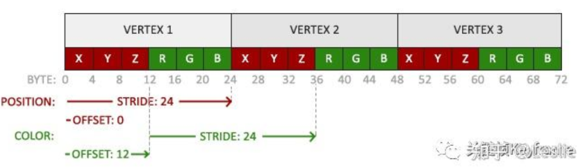

<!--toc:start-->
- [记录一些可能会用得到的八股](#记录一些可能会用得到的八股)
  - [OpenGL 是按照什么架构设计的？](#opengl-是按照什么架构设计的)
  - [什么是渲染上下文（Context）？](#什么是渲染上下文context)
  - [什么是离屏渲染？](#什么是离屏渲染)
  - [为什么离屏渲染会造成性能损耗？](#为什么离屏渲染会造成性能损耗)
  - [什么是 OpenGL 渲染管线（Pipeline）？](#什么是-opengl-渲染管线pipeline)
  - [OpenGL 渲染管线主要包含哪些部分？](#opengl-渲染管线主要包含哪些部分)
  - [为什么说 OpenGL 渲染管线中的着色器（Shader）是可编程管线？](#为什么说-opengl-渲染管线中的着色器shader是可编程管线)
  - [有哪些着色器可以由程序员进行编程？](#有哪些着色器可以由程序员进行编程)
  - [什么是 VBO、EBO 和 VAO？](#什么是-vboebo-和-vao)
  - [Vertex Buffer Object 的布局格式是怎样的？](#vertex-buffer-object-的布局格式是怎样的)
- [渲染管线](#渲染管线)
- [什么是depth buffer](#什么是depth-buffer)
- [提前深度测试](#提前深度测试)
- [phong和billin-phong](#phong和billin-phong)
- [前向渲染和延迟渲染的区别](#前向渲染和延迟渲染的区别)
  - [前向渲染](#前向渲染)
  - [延迟渲染](#延迟渲染)
- [透明物体和不透明物体渲染顺序](#透明物体和不透明物体渲染顺序)
- [如何优化shader计算量优化](#如何优化shader计算量优化)
- [shader中的if会造成性能影响以及如何优化](#shader中的if会造成性能影响以及如何优化)
- [顶点着色器到片元着色器中间流程](#顶点着色器到片元着色器中间流程)
- [几何着色器的作用，顶点着色器传输给几何着色器什么数据](#几何着色器的作用顶点着色器传输给几何着色器什么数据)
- [EBO存储的数据是什么，有什么好处](#ebo存储的数据是什么有什么好处)
- [G-Buffer的底层结构](#g-buffer的底层结构)
- [Drawcall 原理以及如何减少DrawCall](#drawcall-原理以及如何减少drawcall)
- [光栅化的作用？](#光栅化的作用)
- [实时阴影如何实现、生成](#实时阴影如何实现生成)
- [shadow map](#shadow-map)
- [PCF(Percentage Closer Filtering)](#pcfpercentage-closer-filtering)
- [shadowmap实现原理](#shadowmap实现原理)
- [如何渲染半透明物体](#如何渲染半透明物体)
- [为什么要用FrameBuffer](#为什么要用framebuffer)
- [纹理坐标？双线性插值怎么做的](#纹理坐标双线性插值怎么做的)
- [mipmap有什么缺点](#mipmap有什么缺点)
- [LOD怎么做的](#lod怎么做的)
- [Bloom怎么做的](#bloom怎么做的)
- [动态模糊怎么做的](#动态模糊怎么做的)
- [opengl与openglES](#opengl与opengles)
- [后处理了吗解](#后处理了吗解)
- [数学相关](#数学相关)
  - [MVP矩阵空间变换过程模型变换M、视图变换V、投影变换P，统称MVP](#mvp矩阵空间变换过程模型变换m视图变换v投影变换p统称mvp)
  - [M矩阵中旋转、平移、缩放顺序，分别在M矩阵的哪个部分](#m矩阵中旋转平移缩放顺序分别在m矩阵的哪个部分)
  - [四元数的理解，如何从两个向量判断四元数（四个参数的代表内容）](#四元数的理解如何从两个向量判断四元数四个参数的代表内容)
  - [变换矩阵里每一列代表什么](#变换矩阵里每一列代表什么)
  - [为什么MVP矩阵是 4*4](#为什么mvp矩阵是-44)
  - [点乘叉乘几何意义，用处](#点乘叉乘几何意义用处)
  - [点到平面的距离如何计算](#点到平面的距离如何计算)
  - [几何阶段的矩阵变换都有哪些](#几何阶段的矩阵变换都有哪些)
  - [如何判断一个点是否在一个凸多边形内](#如何判断一个点是否在一个凸多边形内)
  - [旋转有哪几种方式？欧拉角会有什么问题？讲一下四元数](#旋转有哪几种方式欧拉角会有什么问题讲一下四元数)
    - [欧拉旋转](#欧拉旋转)
    - [矩阵旋转](#矩阵旋转)
    - [四元数旋转](#四元数旋转)
  - [为什么使用齐次坐标](#为什么使用齐次坐标)
  - [AABB包围盒如何判断相交与分离](#aabb包围盒如何判断相交与分离)
<!--toc:end-->

# 记录一些可能会用得到的八股

## OpenGL 是按照什么架构设计的？

OpenGL 的渲染架构是 Client/Server 模式：Client（客户端）指的是我们在 CPU 上运行的一些代码，比如我们会编写 OC/C++/Java 代码调用 OpenGL 的一些 API；而 Server（服务端）则对应的是图形渲染管线，会调用 GPU 芯片。我们开发的过程就是不断用 Client 通过 OpenGL 提供的通道去向 Server 端传输渲染指令，来间接的操作 GPU 芯片。

## 什么是渲染上下文（Context）？

OpenGL 自身是一个巨大的状态机（State Machine）：一系列的变量描述 OpenGL 此刻应当如何运行。OpenGL 的状态通常被称为 OpenGL 上下文（Context）。我们通过改变上下文中的状态来改变接下来绘画的属性和操作的缓冲对象，然后 OpenGL 利用当前的上下文（Context）的状态去渲染。因此状态的改变要非常小心，因为是状态是全局，会影响接下来的所有渲染操作。

## 什么是离屏渲染？

GPU 渲染机制：CPU 计算好显示内容提交到 GPU，GPU 渲染完成后将渲染结果放入帧缓冲区，随后屏幕控制器会按照 VSync 信号逐行读取帧缓冲区的数据，经过可能的数模转换传递给显示器显示。

当前屏幕渲染，指的是 GPU 的渲染操作是在当前用于显示的屏幕缓冲区中进行。

离屏渲染，指的是 GPU 在当前屏幕缓冲区以外新开辟一个缓冲区进行渲染操作。

特殊的离屏渲染：如果将不在 GPU 的当前屏幕缓冲区中进行的渲染都称为离屏渲染，那么就还有另一种特殊的离屏渲染方式：CPU 渲染。

## 为什么离屏渲染会造成性能损耗？

当使用离屏渲染的时候会很容易造成性能消耗，因为离屏渲染会单独在内存中创建一个屏幕外缓冲区并进行渲染，而屏幕外缓冲区跟当前屏幕缓冲区上下文切换是很耗性能的。
由于垂直同步的机制，如果在一个 VSync 时间内，CPU 或者 GPU 没有完成内容提交，则那一帧就会被丢弃，等待下一次机会再显示，而这时显示屏会保留之前的内容不变。这就是界面卡顿的原因。

## 什么是 OpenGL 渲染管线（Pipeline）？

OpenGL 渲染管线就是 OpenGL 的工作流程，指的是一堆原始图形数据途经一个输送管道，期间经过各种变化处理最终出现在屏幕的过程。

图形渲染管线可以大致被划分为两个主要部分：第一部分把你的 3D 坐标转换为 2D 坐标；第二部分是把 2D 坐标转变为实际的有颜色的像素。

## OpenGL 渲染管线主要包含哪些部分？

OpenGL 的渲染管线其实也是类似的一个过程，它的工序包括：顶点着色器 → 图元装配 → 几何着色器 → 光栅化 → 片段着色器 → 测试与混合。

## 为什么说 OpenGL 渲染管线中的着色器（Shader）是可编程管线？

OpenGL 渲染管线中着色器允许开发者自己配置，这样我们就可以使用 GLSL（OpenGL Shading Language）来编写自己的着色器替换默认的着色器，从而更细致地控制图形渲染管线中的特定部分。

## 有哪些着色器可以由程序员进行编程？

可编程的着色器有：顶点着色器（Vertex Shader）、几何着色器（Geometry Shader）、片段着色器（Fragment Shader）。常用的是顶点着色器和片段着色器。

## 什么是 VBO、EBO 和 VAO？

可以认为它们是在 OpenGL 中处理数据的三大类缓冲内存对象。

VBO（Vertex Buffer Objects）顶点缓冲区对象，指的是在 GPU 显存里面存储的顶点数据（位置、颜色）。

EBO（Element Buffer Object）图元索引缓冲区对象，指的是为了更高效的利用数据，存储索引来达到减少重复数据的索引数据。

VAO（Vertex Array Object）顶点数组对象，主要作用是用于管理 VBO 或 EBO，减少 glBindBuffer、glEnableVertexAttribArray、glVertexAttribPointer 这些调用操作，高效地实现在顶点数组配置之间切换。

## Vertex Buffer Object 的布局格式是怎样的？

当我们的 Vertex Shader 如下：

```c
#version 330 core
layout (location = 0) in vec3 position; // 位置变量的属性位置值为 0
layout (location = 1) in vec3 color;    // 颜色变量的属性位置值为 1

out vec3 ourColor; // 向片段着色器输出一个颜色

void main()
{
   gl_Position = vec4(position, 1.0);
   ourColor = color; // 将ourColor设置为我们从顶点数据那里得到的输入颜色
}
```

Fragment Shader 如下：

```c
#version 330 core
in vec3 ourColor;
out vec4 color;

void main()
{
   color = vec4(ourColor, 1.0f);
}
```

创建 VBO 的代码如下：

```c
GLfloat vertices[] = {
   // 位置              // 颜色
    0.5f, -0.5f, 0.0f,  1.0f, 0.0f, 0.0f,   // 右下
   -0.5f, -0.5f, 0.0f,  0.0f, 1.0f, 0.0f,   // 左下
    0.0f,  0.5f, 0.0f,  0.0f, 0.0f, 1.0f    // 顶部
};

GLuint VBO;
glGenBuffers(1, &VBO);
glBindBuffer(GL_ARRAY_BUFFER, VBO);
glBufferData(GL_ARRAY_BUFFER, sizeof(vertices), vertices, GL_STATIC_DRAW);
```

这时候，对应的 VBO 布局格式如下图所示：




# 渲染管线

1. 渲染管线就是一堆原始图形数据经过各种变化处理最终出现在屏幕的过程。渲染管线可分为三个阶段，应用程序阶段，几何阶段，和光栅化阶段。
2. 应用程序阶段由CPU主要负责。CPU将GPU渲染需要的灯光、模型准备好，并设置好渲染状态，为GPU渲染做好准备。
3. 几何阶段把输入的3D数据转换成2D数据。包括顶点着色器、图元装置、裁剪和屏幕映射几个过程。顶点着色器主要进行顶点坐标变换。将输入的模型空间顶点坐标变换到裁剪空间顶点坐标。图元装配将顶点装配成指定图元的形状。几何着色器改变图元。通过产生新顶点构造出新的图元来生成其他形状。
4. 光栅化阶段把图元映射为最终屏幕上显示的颜色。包括光栅化，片段着色，深度测试和混合。光栅化将顶点转为屏幕上的像素。片段着色器计算每个像素的最终颜色。深度测试通过深度信息判断像素的遮挡关系。混合阶段通过透明度将像素进行混合。
5. 最终渲染好的颜色先被送入后置缓冲，随后再替换前置缓冲，显示在屏幕上。

# 什么是depth buffer

深度缓冲也称z-buffer，用来存储深度值以及在深度测试时确定一个片段是否被其他片段遮挡。深度缓冲由窗口系统自动创建并将其深度值存储为 16、 24 或 32 位浮点数。在大多数系统中深度缓冲区为24位。

当深度测试启用的时候，如果此测试通过，深度缓冲内的值将被设为新的深度值。如果深度测试失败，则丢弃该片段。

#  提前深度测试

提前深度测试(Early depth testing)是一个由图形硬件支持的功能。

提前深度测试允许深度测试在片段着色器之前运行。可以更早地踢掉一些片段永远可见的片元，节省GPU资源 。

# phong和billin-phong

Phong光照模型将光照分为三部分：环境光(Ambient)、漫反射光(Diffuse)和镜面(Specular)光照。环境光即来自其它物体，而非直接光源的光照。在Phong模型中是一个常数。漫反射即粗糙物体表面均匀的反射光线到各个方向所产生的光照效果。镜面光照也称高光反射，由光滑物体表面平行地向一个方向反射出来的光照效果。Phong光照模型中，视线向量和反射向量的角度不允许大于90度。如果大于90度的话，点乘的结果就会是负数，镜面的贡献成分就会变成0。

Blinn-Phong镜面反射的计算引入了半程向量（halfway vector）向量，半程向量是视线方向和反射向量之间的夹角。通过测量法线和半程向量之间的角度计算镜面反射。

# 前向渲染和延迟渲染的区别

## 前向渲染

对于每一个需要渲染的物体，都要逐光源渲染，每个光源都会带来一定的渲染成本。延迟渲染将计算量非常大的渲染(如光照)延时到后期进行处理。包含两个处理阶段(Pass)：在几何处理阶段中，先渲染场景一次，之后获取对象的各种几何信息，并储存在G缓冲(G-buffer)的纹理中。随后在光照处理阶段中使用G缓冲内的纹理数据对每一个片段计算场景的光照。

## 延迟渲染

延迟渲染只需要对每一个像素执行一次光照运算，能够渲染大量的光源而不消耗大量的性能。延迟渲染不能进行混合(Blending)，因为G缓冲中所有的数据都是从一个单独的片段中来的，而混合需要对多个片段的组合进行操作。延迟渲染需要大内存开销，没有MSAA。延迟渲染对小且没有很多的光源的场景，并不一定会更快。

延迟渲染不支持半透明物体渲染。

# 透明物体和不透明物体渲染顺序

先渲染所有的不透明物体，开启深度写入和深度测试

再渲染半透明物体，按由远到近排序，先渲染远处的物体，再渲染近处的。开启深度测试，开启混合，关闭深度写入。

# 如何优化shader计算量优化

将计算从像素着色器移动到顶点着色器在脚本中计算并传递给着色器，使用纹理读取的方式减轻运算量。

代码优化尽量使用系统自带的内建函数，因为很多是硬件支持的简单的重复不多的计算，不应该将这种计算封装成函数，直接用代码计算即可选择合适的数据精度，尽量使用低精度。

尽量不要使用if分支语句，可以使用step函数替代。

# shader中的if会造成性能影响以及如何优化

if的效率问题是会导致多个分支重复执行。在大多数没有标明关键字的情况下，编译器默认生成的是 flatten 形式的指令，flatten 把分支所有侧的逻辑都执行一遍，根据判断条件舍弃掉错误结果，选择其中一个结果。优化：从关系运算符和逻辑运算符两个角度，进行分支合并，转换为非分支形式。或者使用内置指令代替内置指令替代。

# 顶点着色器到片元着色器中间流程

顶点着色器到片元（片段）着色器需要经过：图元装配、几何着色器、光栅化图元装配：将顶点装配成指定图元的形状（如三角形）。几何着色器：改变图元。通过产生新顶点构造出新的图元来生成其他形状。外壳着色器和域着色器可编程，镶嵌器是由硬件管理。

光栅化：把图元映射为最终屏幕上相应的像素（把三角型切分成一个个像素）。

# 几何着色器的作用，顶点着色器传输给几何着色器什么数据

几何着色器在顶点和片段着色器之间，是一个可选的可编程的着色器。它能够将顶点变换为完全不同的图元，并且还能生成比原来更多的顶点。

以一个或多个表示为一个单独基本图形的顶点作为输入，如一个点、线、或三角形。

# EBO存储的数据是什么，有什么好处

索引缓冲对象(Element Buffer Object，EBO，也叫Index Buffer Object，IBO），专门存储顶点的索引。

EBO节省了顶点数组的size，减少了重复保存顶点数据。

#  G-Buffer的底层结构

G缓冲(G-buffer)是对所有用来储存光照相关的数据，并在最后的光照处理阶段中使用的所有纹理的总称。本质就算一个帧缓冲对象。

# Drawcall 原理以及如何减少DrawCall

DrawCall是对底层图形绘制接口的调用命令，调用GPU进行渲染。CPU往GPU发送渲染命令，GPU接受并执行相对应的渲染命令。

优化：

UI方面：使用图集，批渲染将一些渲染状态一致的物体合成一个大物体，把图集转移到一张大图片，一次提交给gpu进行绘制。

模型方面：

每一帧把可以进行批处理的模型网格进行合并，再把合并后模型数据传递给GPU，然后使用同一个材质对其渲染。

# 光栅化的作用？

光栅化是把顶点数据转换成片元的过程，即将几何图元变成二维图像的过程，将三维场景投影到二维平面。

# 实时阴影如何实现、生成

阴影有硬阴影和软阴影。实时硬阴算法为shadowmap及其变种CSM、SSSM。实时软阴影算法包括PCF、PCSS、VSSM、SDF阴影。

# shadow map

将深度信息渲染到深度图上，并在运行时通过深度对比检测物体是否在阴影中的算法。

shadow map是一个2-pass的算法

pass1：从Light视角看向场景，记录每个像素的最浅深度，输出一个深度纹理图。

pass2：从camera视角出发，检测当前物体深度是否大于深度纹理中深度值，判断是否在阴影里shadow map会产生自遮挡和走样现象。

# PCF(Percentage Closer Filtering)

PCF能解决shadow map的锯齿块和硬边问题，产生柔和软阴影。核心思想是从深度贴图中多次采样，每一次采样的纹理坐标都稍有不同（比如采样像素周围一圈范围）。每个独立的样本可能在也可能不在阴影中。所有的次生结果接着结合在一起，最终通过样本的总数目将深度结果平均化。

# shadowmap实现原理

shadow map将深度信息渲染到深度图上，并在运行时通过深度对比检测物体是否在阴影中的算法。

shadow map是一个2-pass的算法

pass1：从Light视角看向场景，记录每个像素的最浅深度，输出一个深度纹理图

pass2：从camera视角出发，检测当前物体深度是否大于深度纹理中深度值，判断是否在阴影里

# 如何渲染半透明物体

先在CPU中对需要渲染的半透明物体进行距离排序，然后与相机距离由远及近逐个物体渲染、像素混合。

# 为什么要用FrameBuffer

帧缓冲能够实现很多后期处理效果。

# 纹理坐标？双线性插值怎么做的

纹理坐标(Texture Coordinate)，用来标明该从纹理图像的哪个部分采样，纹理坐标在x和y轴上，范围为0到1之间。

双线性插值基于纹理坐标附近的纹理像素，计算出一个插值，近似出这些纹理像素之间的颜色。一个纹理像素的中心距离纹理坐标越近，那么这个纹理像素的颜色对最终的样本颜色的贡献越大。

# mipmap有什么缺点

占用显存。

# LOD怎么做的

静态Lod：在预处理过程中产生一个物体的几个离散的不同Lod模型。实时绘制时根据特定的标准选择合适的Lod模型来表示物体。

动态Lod：在动态Lod算法中生成一个数据结构，在实时绘制时可以从这个数据结构中抽取出所需的Lod模型。从这个数据结构中可以得到大量不同分辨率的Lod模型。

# Bloom怎么做的

Bloom和HDR结合使用。先渲染一个有光场景，提取出场景的HDR颜色缓冲以及只有这个场景明亮区域可见的图片。再将提取的带有亮度的图片模糊处理。

最后将结果添加到HDR场景上面。

# 动态模糊怎么做的

先将图片进行最大程度的模糊处理，再将原图放置在模糊后的图片上面，通过不断改变原图的透明度(Alpha值）来实现动态模糊效果。

# opengl与openglES

OpenGL ES是OpenGL的嵌入式设备版本，OpenGL ES相对OpenGL删减了一切低效能的操作方式没有double型数据类型，但加入了高性能的定点小数数据类型。没有glBegin/glEnd/glVertex。

没有实时将非压缩图片数据转成压缩贴图的功能。

# 后处理了吗解

后期处理是在3D渲染完成后，在输出最终效果之前，对渲染完成的图像再进行一定的处理。

# 数学相关

## MVP矩阵空间变换过程模型变换M、视图变换V、投影变换P，统称MVP

MVP 变换将3维模型映射到屏幕2维坐标中， 参与 MVP 变换的信息包括点、矢量、法线、切线等

模型变换（Model）：物体本身的平移、旋转、缩放，将模型空间转换到世界空间

观察变换（View）：将世界空间转换到观察空间

投影变换（Projection）：将观察空间转换到裁剪空间

最后要获取屏幕坐标还需要一步：屏幕映射，获取对应屏幕的 2D 坐标，又叫视口变换

## M矩阵中旋转、平移、缩放顺序，分别在M矩阵的哪个部分

模型变换不同顺序有不同的结果，一般地，先进行线性变换，再进行非线性变换，即缩放-> 平移-> 旋转

平移对应第四列，缩放对应主对角线，旋转对应前三行三列

## 四元数的理解，如何从两个向量判断四元数（四个参数的代表内容）

四元数是四维空间中一个超球上面的点，满足w²+x²+y²+z²=1，将三维空间无法解决的问题就映射到四维空间。

常用于解决3D旋转问题，如欧拉角产生的万向节死锁

## 变换矩阵里每一列代表什么

前三列代表缩放和旋转，最后一列代表平移

## 为什么MVP矩阵是 4*4

多一个w分量，可以很方便的在3D向量上进行位移

## 点乘叉乘几何意义，用处

点乘是向量的内积，结果是一个实数，表示两个向量的长度与它们夹角余弦的积。即一个向量在另一个向量方向上的投影，也用于判断两个向量是否同向。

叉乘是向量的外积，结果是一个向量，用于生成第三个垂直于a，b的法向量，或者构建坐标系。也等于向量a和向量b构成的平行四边形的面积

## 点到平面的距离如何计算

需要给定平面上一点P，过P做平面的发向量，该点与P的连线向法向量投影，距离即为投影长度

## 几何阶段的矩阵变换都有哪些

MVP

##  如何判断一个点是否在一个凸多边形内

方法很多：

（1）面积和判别法：判断目标点与多边形的每条边组成的三角形面积和是否等于该多边形，相等则在多边形内部。

（2）夹角和判别法：判断目标点与所有边的夹角和是否为360度，为360度则在多边形内部。

（3）引射线法：从目标点出发引一条射线，看这条射线和多边形所有边的交点数目。如果有奇数个交点，则说明在内部，如果有偶数个交点，则说明在外部。

## 旋转有哪几种方式？欧拉角会有什么问题？讲一下四元数

欧拉旋转、矩阵旋转、四元数旋转

### 欧拉旋转

优点：很容易理解，形象直观；表示更方便，只需要3个值（分别对应x、y、z轴的旋转角度）；但按我的理解，它还是转换到了3个3*3的矩阵做变换，效率不如四元数；

缺点：之前提到过这种方法是要按照一个固定的坐标轴的顺序旋转的，因此不同的顺序会造成不同的结果；会造成万向节锁（GimbalLock）的现象。这种现象的发生就是由于上述固定坐标轴旋转顺序造成的。理论上，欧拉旋转可以靠这种顺序让一个物体指到任何一个想要的方向，但如果在旋转中不幸让某些坐标轴重合了就会发生万向节锁，这时就会丢失一个方向上的旋转能力，也就是说在这种状态下我们无论怎么旋转（当然还是要原先的顺序）都不可能得到某些想要的旋转效果，除非我们打破原先的旋转顺序或者同时旋转3个坐标轴。

### 矩阵旋转

优点：很容易理解，形象直观；表示更方便，只需要3个值（分别对应x、y、z轴的旋转角度）；但按我的理解，它还是转换到了3个3*3的矩阵做变换，效率不如四元数；

缺点：之前提到过这种方法是要按照一个固定的坐标轴的顺序旋转的，因此不同的顺序会造成不同的结果；会造成万向节锁（GimbalLock）的现象。这种现象的发生就是由于上述固定坐标轴旋转顺序造成的。理论上，欧拉旋转可以靠这种顺序让一个物体指到任何一个想要的方向，但如果在旋转中不幸让某些坐标轴重合了就会发生万向节锁，这时就会丢失一个方向上的旋转能力，也就是说在这种状态下我们无论怎么旋转（当然还是要原先的顺序）都不可能得到某些想要的旋转效果，除非我们打破原先的旋转顺序或者同时旋转3个坐标轴。

### 四元数旋转

优点：可以避免万向节锁现象；只需要一个4维的四元数就可以执行绕任意过原点的向量的旋转，方便快捷，在某些实现下比旋转矩阵效率更高；可以提供平滑插值；

缺点：比欧拉旋转稍微复杂了一点点，因为多了一个维度；理解更困难，不直观；

## 为什么使用齐次坐标

在MVP矩阵变换中为了将线性变换和非线性变换统一成一个线性变换

在3维到2维的过程中用于支持投影矩阵

## AABB包围盒如何判断相交与分离

两个AABB包围盒a和b的中心位置pos的距离小于两个的两个包围盒半长的和的时候则相交.
