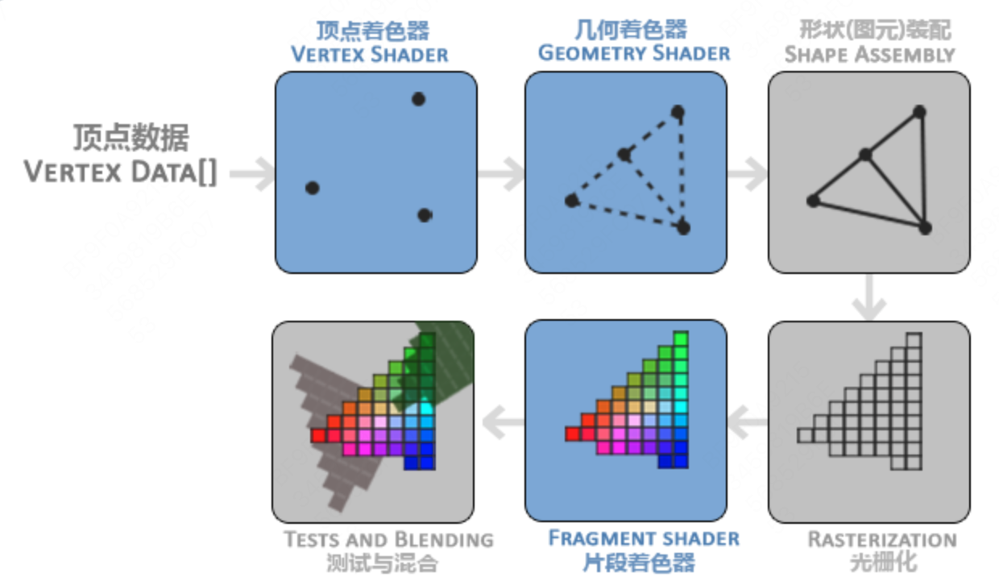

<!--toc:start-->
- [OpenGL相关](#opengl相关)
  - [OpenGL](#opengl)
    - [核心模式和立即渲染模式](#核心模式和立即渲染模式)
    - [拓展](#拓展)
    - [状态机](#状态机)
    - [对象](#对象)
    - [创建窗口](#创建窗口)
      - [视口](#视口)
      - [准备好渲染](#准备好渲染)
        - [双缓冲](#双缓冲)
      - [输入](#输入)
      - [渲染](#渲染)
    - [你好，三角形](#你好三角形)
      - [每个部分的工作方式](#每个部分的工作方式)
      - [顶点输入](#顶点输入)
      - [顶点着色器](#顶点着色器)
      - [片段着色器](#片段着色器)
      - [着色器程序](#着色器程序)
    - [链接顶点属性](#链接顶点属性)
      - [顶点对象数组](#顶点对象数组)
      - [总结](#总结)
      - [元素缓冲对象](#元素缓冲对象)
  - [OepnGL ES开发](#oepngl-es开发)
  - [基本概念](#基本概念)
<!--toc:end-->
# OpenGL相关

## OpenGL

### 核心模式和立即渲染模式

早期的OpenGL使用立即渲染模式（Immediate mode，也就是固定渲染管线），这个模式下绘制图形很方便。OpenGL的大多数功能都被库隐藏起来，开发者很少有控制OpenGL如何进行计算的自由。而开发者迫切希望能有更多的灵活性。

因此从OpenGL3.2开始，规范文档开始废弃立即渲染模式，并鼓励开发者在OpenGL的核心模式(Core-profile)下进行开发，这个分支的规范完全移除了旧的特性。

### 拓展

OpenGL的一大特性就是对扩展(Extension)的支持，当一个显卡公司提出一个新特性或者渲染上的大优化，通常会以扩展的方式在驱动中实现。如果一个程序在支持这个扩展的显卡上运行，开发者可以使用这个扩展提供的一些更先进更有效的图形功能。

### 状态机

OpenGL自身是一个巨大的状态机(State Machine)：一系列的变量描述OpenGL此刻应当如何运行。OpenGL的状态通常被称为OpenGL上下文(Context)。我们通常使用如下途径去更改OpenGL状态：设置选项，操作缓冲。最后，我们使用当前OpenGL上下文来渲染。

当使用OpenGL的时候，我们会遇到一些状态设置函数(State-changing Function)，这类函数将会改变上下文。以及状态使用函数(State-using Function)，这类函数会根据当前OpenGL的状态执行一些操作。只要你记住OpenGL本质上是个大状态机，就能更容易理解它的大部分特性。

### 对象

OpenGL库是用C语言写的，同时也支持多种语言的派生，但其内核仍是一个C库。由于C的一些语言结构不易被翻译到其它的高级语言，因此OpenGL开发的时候引入了一些抽象层。“对象(Object)”就是其中一个。

在OpenGL中一个对象是指一些选项的集合，它代表OpenGL状态的一个子集。比如，我们可以用一个对象来代表绘图窗口的设置，之后我们就可以设置它的大小、支持的颜色位数等等。

### 创建窗口

GLFW是一个C库，能够提供渲染物体所需的最低限度的接口，允许用户创建OpenGL上下文、定义窗口参数和处理用户输入。

首先需要glfwInit来初始化GLFW。

接下来我们创建一个窗口对象，这个窗口对象存放了所有和窗口相关的数据，而且会被GLFW的其他函数频繁地用到。

```c++
GLFWwindow* window = glfwCreateWindow(800, 600, "LearnOpenGL", NULL, NULL);
if (window == NULL)
{
    std::cout << "Failed to create GLFW window" << std::endl;
    glfwTerminate();
    return -1;
}
glfwMakeContextCurrent(window);
```

glfwCreateWindow函数需要窗口的宽和高作为它的前两个参数。第三个参数表示这个窗口的名称（标题），这里我们使用"LearnOpenGL"，当然你也可以使用你喜欢的名称。最后两个参数我们暂时忽略。这个函数将会返回一个GLFWwindow对象，我们会在其它的GLFW操作中使用到。创建完窗口我们就可以通知GLFW将我们窗口的上下文设置为当前线程的主上下文了。注意，在创建了上下文之后，应该去初始化GLAD。

#### 视口

在我们开始渲染之前还有一件重要的事情要做，我们必须告诉OpenGL渲染窗口的尺寸大小，即视口(Viewport)，这样OpenGL才只能知道怎样根据窗口大小显示数据和坐标。我们可以通过调用glViewport函数来设置视口的尺寸(Dimension)：

```c++
glViewport(0, 0, 800, 600);
```

glViewport函数前两个参数控制窗口左下角的位置。第三个和第四个参数控制渲染窗口的宽度和高度（像素）。

然而，当用户改变窗口的大小的时候，视口也应该被调整。我们可以对窗口注册一个回调函数(Callback Function)，它会在每次窗口大小被调整的时候被调用。这个回调函数的原型如下：

```c++
void framebuffer_size_callback(GLFWwindow* window, int width, int height);
```
这个帧缓冲大小函数需要一个GLFWwindow作为它的第一个参数，以及两个整数表示窗口的新维度。每当窗口改变大小，GLFW会调用这个函数并填充相应的参数供你处理

```c++
void framebuffer_size_callback(GLFWwindow* window, int width, int height)
{
    glViewport(0, 0, width, height);
}
```

#### 准备好渲染

我们可不希望只绘制一个图像之后我们的应用程序就立即退出并关闭窗口。我们希望程序在我们主动关闭它之前不断绘制图像并能够接受用户输入。因此，我们需要在程序中添加一个while循环，我们可以把它称之为渲染循环(Render Loop)，它能在我们让GLFW退出前一直保持运行。下面几行的代码就实现了一个简单的渲染循环：

```c++
while(!glfwWindowShouldClose(window))
{
    glfwSwapBuffers(window);
    glfwPollEvents();
}
```

- glfwWindowShouldClose函数在我们每次循环的开始前检查一次GLFW是否被要求退出，如果是的话，该函数返回true，渲染循环将停止运行，之后我们就可以关闭应用程序。
- glfwPollEvents函数检查有没有触发什么事件（比如键盘输入、鼠标移动等）、更新窗口状态，并调用对应的回调函数（可以通过回调方法手动设置）。
- glfwSwapBuffers函数会交换颜色缓冲（它是一个储存着GLFW窗口每一个像素颜色值的大缓冲），它在这一迭代中被用来绘制，并且将会作为输出显示在屏上。

##### 双缓冲

应用程序使用单缓冲绘图时可能会存在图像闪烁的问题。 这是因为生成的图像不是一下子被绘制出来的，而是按照从左到右，由上而下逐像素地绘制而成的。最终图像不是在瞬间显示给用户，而是通过一步一步生成的，这会导致渲染的结果很不真实。为了规避这些问题，我们应用双缓冲渲染窗口应用程序。前缓冲保存着最终输出的图像，它会在屏幕上显示；而所有的的渲染指令都会在后缓冲上绘制。当所有的渲染指令执行完毕后，我们交换(Swap)前缓冲和后缓冲，这样图像就立即呈显出来，之前提到的不真实感就消除了。

#### 输入

我们同样也希望能够在GLFW中实现一些输入控制，这可以通过使用GLFW的几个输入函数来完成。我们将会使用GLFW的glfwGetKey函数，它需要一个窗口以及一个按键作为输入。这个函数将会返回这个按键是否正在被按下。我们将创建一个processInput函数来让所有的输入代码保持整洁。

#### 渲染

我们要把所有的渲染(Rendering)操作放到渲染循环中，因为我们想让这些渲染指令在每次渲染循环迭代的时候都能被执行。代码将会是这样的：
```c++
while(!glfwWindowShouldClose(window))
{
    // 输入
    processInput(window);

    // 渲染指令
    ...

    // 检查并调用事件，交换缓冲
    glfwPollEvents();
    glfwSwapBuffers(window);
}
```

我们可以通过调用glClear函数来清空屏幕的颜色缓冲，它接受一个缓冲位(Buffer Bit)来指定要清空的缓冲，可能的缓冲位有GL_COLOR_BUFFER_BIT，GL_DEPTH_BUFFER_BIT和GL_STENCIL_BUFFER_BIT。由于现在我们只关心颜色值，所以我们只清空颜色缓冲。

### 你好，三角形

- 顶点数组对象：Vertex Array Object，VAO
- 顶点缓冲对象：Vertex Buffer Object，VBO
- 元素缓冲对象：Element Buffer Object，EBO 或 索引缓冲对象 Index Buffer Object，IBO

在OpenGL中，任何事物都在3D空间中，而屏幕和窗口却是2D像素数组，这导致OpenGL的大部分工作都是关于把3D坐标转变为适应你屏幕的2D像素。3D坐标转为2D坐标的处理过程是由OpenGL的图形渲染管线（Graphics Pipeline，大多译为管线，实际上指的是一堆原始图形数据途经一个输送管道，期间经过各种变化处理最终出现在屏幕的过程）管理的。图形渲染管线可以被划分为两个主要部分：第一部分把你的3D坐标转换为2D坐标，第二部分是把2D坐标转变为实际的有颜色的像素。

图形渲染管线接受一组3D坐标，然后把它们转变为你屏幕上的有色2D像素输出。图形渲染管线可以被划分为几个阶段，每个阶段将会把前一个阶段的输出作为输入。所有这些阶段都是高度专门化的（它们都有一个特定的函数），并且很容易并行执行。正是由于它们具有并行执行的特性，当今大多数显卡都有成千上万的小处理核心，它们在GPU上为每一个（渲染管线）阶段运行各自的小程序，从而在图形渲染管线中快速处理你的数据。这些小程序叫做着色器(Shader)。

有些着色器可以由开发者配置，因为允许用自己写的着色器来代替默认的，所以能够更细致地控制图形渲染管线中的特定部分了。因为它们运行在GPU上，所以节省了宝贵的CPU时间。OpenGL着色器是用OpenGL着色器语言(OpenGL Shading Language, GLSL)写成的。



#### 每个部分的工作方式

1. 首先，我们以数组的形式传递3个3D坐标作为图形渲染管线的输入，用来表示一个三角形，这个数组叫做顶点数据(Vertex Data)；顶点数据是一系列顶点的集合。一个顶点(Vertex)是一个3D坐标的数据的集合。而这样一个顶点的数据是用顶点属性(Vertex Attribute)表示的，它可以包含任何我们想用的数据，但是简单起见，我们还是假定每个顶点只由一个3D位置和一些颜色值组成的吧。
2. 图形渲染管线的第一个部分是顶点着色器(Vertex Shader)，它把一个单独的顶点作为输入。顶点着色器主要的目的是把3D坐标转为另一种3D坐标（后面会解释），同时顶点着色器允许我们对顶点属性进行一些基本处理。
3. 顶点着色器阶段的输出可以选择性地传递给几何着色器(Geometry Shader)。几何着色器将一组顶点作为输入，这些顶点形成图元，并且能够通过发出新的顶点来形成新的(或其他)图元来生成其他形状。在这个例子中，它从给定的形状中生成第二个三角形。
4. 图元装配(Primitive Assembly)阶段将顶点着色器（或几何着色器）输出的所有顶点作为输入（如果是GL_POINTS，那么就是一个顶点），并将所有的点装配成指定图元的形状；本节例子中是两个三角形。
5. 图元装配阶段的输出会被传入光栅化阶段(Rasterization Stage)，这里它会把图元映射为最终屏幕上相应的像素，生成供片段着色器(Fragment Shader)使用的片段(Fragment)。在片段着色器运行之前会执行裁切(Clipping)。裁切会丢弃超出你的视图以外的所有像素，用来提升执行效率。
> OpenGL中的一个片段是OpenGL渲染一个像素所需的所有数据。

6. 片段着色器的主要目的是计算一个像素的最终颜色，这也是所有OpenGL高级效果产生的地方。通常，片段着色器包含3D场景的数据（比如光照、阴影、光的颜色等等），这些数据可以被用来计算最终像素的颜色。
7. 在所有对应颜色值确定以后，最终的对象将会被传到最后一个阶段，我们叫做Alpha测试和混合(Blending)阶段。这个阶段检测片段的对应的深度（和模板(Stencil)）值（后面会讲），用它们来判断这个像素是其它物体的前面还是后面，决定是否应该丢弃。这个阶段也会检查alpha值（alpha值定义了一个物体的透明度）并对物体进行混合(Blend)。所以，即使在片段着色器中计算出来了一个像素输出的颜色，在渲染多个三角形的时候最后的像素颜色也可能完全不同。


_在现代OpenGL中，我们必须定义至少一个顶点着色器和一个片段着色器（因为GPU中没有默认的顶点/片段着色器）。出于这个原因，刚开始学习现代OpenGL的时候可能会非常困难，因为在你能够渲染自己的第一个三角形之前已经需要了解一大堆知识了。_

#### 顶点输入

开始绘制图形之前，我们需要先给OpenGL输入一些顶点数据。OpenGL是一个3D图形库，所以在OpenGL中我们指定的所有坐标都是3D坐标（x、y和z）。OpenGL不是简单地把所有的3D坐标变换为屏幕上的2D像素；OpenGL仅当3D坐标在3个轴（x、y和z）上-1.0到1.0的范围内时才处理它。所有在这个范围内的坐标叫做标准化设备坐标(Normalized Device Coordinates)，此范围内的坐标最终显示在屏幕上（在这个范围以外的坐标则不会显示）。

由于我们希望渲染一个三角形，我们一共要指定三个顶点，每个顶点都有一个3D位置。我们会将它们以标准化设备坐标的形式（OpenGL的可见区域）定义为一个float数组。

```c++
float vertices[] = {
    -0.5f, -0.5f, 0.0f,
     0.5f, -0.5f, 0.0f,
     0.0f,  0.5f, 0.0f
};
```

由于OpenGL是在3D空间中工作的，而我们渲染的是一个2D三角形，我们将它顶点的z坐标设置为0.0。这样子的话三角形每一点的深度(Depth)都是一样的，从而使它看上去像是2D的。

> 通常深度可以理解为z坐标，它代表一个像素在空间中和你的距离，如果离你远就可能被别的像素遮挡，你就看不到它了，它会被丢弃，以节省资源。

一旦你的顶点坐标已经在顶点着色器中处理过，它们就应该是标准化设备坐标了，标准化设备坐标是一个x、y和z值在-1.0到1.0的一小段空间。任何落在范围外的坐标都会被丢弃/裁剪，不会显示在你的屏幕上。

通过使用由glViewport函数提供的数据，进行视口变换(Viewport Transform)，标准化设备坐标(Normalized Device Coordinates)会变换为屏幕空间坐标(Screen-space Coordinates)。所得的屏幕空间坐标又会被变换为片段输入到片段着色器中。 定义这样的顶点数据以后，我们会把它作为输入发送给图形渲染管线的第一个处理阶段：顶点着色器。它会在GPU上创建内存用于储存我们的顶点数据，还要配置OpenGL如何解释这些内存，并且指定其如何发送给显卡。顶点着色器接着会处理我们在内存中指定数量的顶点。

我们通过顶点缓冲对象(Vertex Buffer Objects, VBO)管理这个内存，它会在GPU内存（通常被称为显存）中储存大量顶点。使用这些缓冲对象的好处是我们可以一次性的发送一大批数据到显卡上，而不是每个顶点发送一次。从CPU把数据发送到显卡相对较慢，所以只要可能我们都要尝试尽量一次性发送尽可能多的数据。当数据发送至显卡的内存中后，顶点着色器几乎能立即访问顶点，这是个非常快的过程。

顶点缓冲对象是我们在OpenGL教程中第一个出现的OpenGL对象。就像OpenGL中的其它对象一样，这个缓冲有一个独一无二的ID，所以我们可以使用glGenBuffers函数生成一个带有缓冲ID的VBO对象：

```c++
unsigned int VBO;
glGenBuffers(1, &VBO);
```

OpenGL有很多缓冲对象类型，顶点缓冲对象的缓冲类型是GL_ARRAY_BUFFER。OpenGL允许我们同时绑定多个缓冲，只要它们是不同的缓冲类型。我们可以使用glBindBuffer函数把新创建的缓冲绑定到GL_ARRAY_BUFFER目标上：

```c++
glBindBuffer(GL_ARRAY_BUFFER, VBO);
```

从这一刻起，我们使用的任何（在GL_ARRAY_BUFFER目标上的）缓冲调用都会用来配置当前绑定的缓冲(VBO)。然后我们可以调用glBufferData函数，它会把之前定义的顶点数据复制到缓冲的内存中：

```c++
glBufferData(GL_ARRAY_BUFFER, sizeof(vertices), vertices, GL_STATIC_DRAW);
```

glBufferData是一个专门用来把用户定义的数据复制到当前绑定缓冲的函数。它的第一个参数是目标缓冲的类型：顶点缓冲对象当前绑定到GL_ARRAY_BUFFER目标上。第二个参数指定传输数据的大小(以字节为单位)；用一个简单的sizeof计算出顶点数据大小就行。第三个参数是我们希望发送的实际数据。

第四个参数指定了我们希望显卡如何管理给定的数据。它有三种形式：

- GL_STATIC_DRAW ：数据不会或几乎不会改变。
- GL_DYNAMIC_DRAW：数据会被改变很多。
- GL_STREAM_DRAW ：数据每次绘制时都会改变。

三角形的位置数据不会改变，每次渲染调用时都保持原样，所以它的使用类型最好是GL_STATIC_DRAW。如果，比如说一个缓冲中的数据将频繁被改变，那么使用的类型就是GL_DYNAMIC_DRAW或GL_STREAM_DRAW，这样就能确保显卡把数据放在能够高速写入的内存部分。

#### 顶点着色器

顶点着色器(Vertex Shader)是几个可编程着色器中的一个。如果我们打算做渲染的话，现代OpenGL需要我们至少设置一个顶点和一个片段着色器。

为了设置顶点着色器的输出，我们必须把位置数据赋值给预定义的gl_Position变量，它在幕后是vec4类型的。在main函数的最后，我们将gl_Position设置的值会成为该顶点着色器的输出。由于我们的输入是一个3分量的向量，我们必须把它转换为4分量的。

#### 片段着色器

片段着色器所做的是计算像素最后的颜色输出。

片段着色器只需要一个输出变量，这个变量是一个4分量向量，它表示的是最终的输出颜色，我们应该自己将其计算出来。声明输出变量可以使用out关键字，这里我们命名为FragColor。

#### 着色器程序

着色器程序对象(Shader Program Object)是多个着色器合并之后并最终链接完成的版本。如果要使用刚才编译的着色器我们必须把它们链接(Link)为一个着色器程序对象，然后在渲染对象的时候激活这个着色器程序。已激活着色器程序的着色器将在我们发送渲染调用的时候被使用。

当链接着色器至一个程序的时候，它会把每个着色器的输出链接到下个着色器的输入。当输出和输入不匹配的时候，你会得到一个连接错误。

### 链接顶点属性

顶点着色器允许我们指定任何以顶点属性为形式的输入。这使其具有很强的灵活性的同时，它还的确意味着我们必须手动指定输入数据的哪一个部分对应顶点着色器的哪一个顶点属性。所以，我们必须在渲染前指定OpenGL该如何解释顶点数据。

#### 顶点对象数组

顶点数组对象(Vertex Array Object, VAO)可以像顶点缓冲对象那样被绑定，任何随后的顶点属性调用都会储存在这个VAO中。这样的好处就是，当配置顶点属性指针时，你只需要将那些调用执行一次，之后再绘制物体的时候只需要绑定相应的VAO就行了。这使在不同顶点数据和属性配置之间切换变得非常简单，只需要绑定不同的VAO就行了。刚刚设置的所有状态都将存储在VAO中。

#### 总结

绘制出一个三角形的流程：
1. GLFW初始化和创建窗口。
2. 准备着色器程序（创建并编译顶点着色器、片段着色器，创建着色器程序并链接着色器，删除已经链接的着色器）。
3. 准备顶点数据（位置坐标）。
4. 设置顶点缓冲和顶点数组对象。（VAO和VBO）。
5. 渲染循环（激活着色程序，绑定VAO）。


#### 元素缓冲对象

Element Buffer Object(EBO)，也叫做索引缓冲对象(Index Buffer Object)，以一个矩形为例子。
```c++
float vertices[] = {
    // 第一个三角形
    0.5f, 0.5f, 0.0f,   // 右上角
    0.5f, -0.5f, 0.0f,  // 右下角
    -0.5f, 0.5f, 0.0f,  // 左上角
    // 第二个三角形
    0.5f, -0.5f, 0.0f,  // 右下角
    -0.5f, -0.5f, 0.0f, // 左下角
    -0.5f, 0.5f, 0.0f   // 左上角
};
```

可以看到，有几个顶点叠加了。我们指定了右下角和左上角两次！一个矩形只有4个而不是6个顶点，这样就产生50%的额外开销。当我们有包括上千个三角形的模型之后这个问题会更糟糕，这会产生一大堆浪费。更好的解决方案是只储存不同的顶点，并设定绘制这些顶点的顺序。

## OepnGL ES开发

🐭🐭我啊，竟然开始搞客户端了捏...

EGL启动！

## 基本概念

在开始任何渲染之前，任何OpenGL ES应用程序都需要使用EGL执行以下任务：
- 查询设备上可用的显示器并初始化它们。例如，翻盖手机可能有两个LCD面板，我们可能使用OpenGL ES渲染到可以显示在一个或两个面板上的表面。
- 创建一个渲染表面。在EGL中创建的曲面可以分为屏幕表面或屏幕外表面。屏幕表面附加到本机窗口系统，而屏幕外表面是像素缓冲区，不会显示，但可以用作渲染表面。这些表面可用于渲染成纹理，并且可以在多个Khronos API之间共享。
- 创建渲染上下文。创建OpenGL ES渲染上下文需要EGL。在实际开始渲染之前，需要将此上下文附加到适当的表面上。
