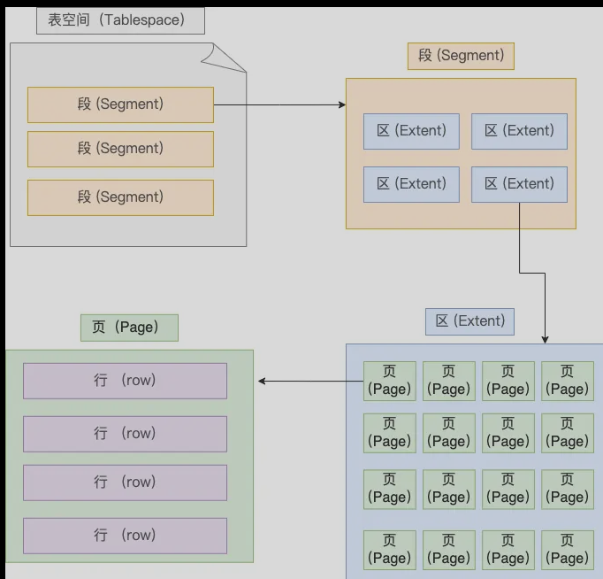

<!--toc:start-->
- [Mysql执行流程](#mysql执行流程)
  - [Server](#server)
  - [Storage Engine](#storage-engine)
  - [连接器](#连接器)
  - [长连接](#长连接)
    - [减少内存占用](#减少内存占用)
  - [查询缓存](#查询缓存)
  - [解析SQL](#解析sql)
    - [预处理阶段](#预处理阶段)
    - [优化阶段](#优化阶段)
    - [执行器](#执行器)
- [数据库文件](#数据库文件)
  - [表空间文件的结构](#表空间文件的结构)
  - [行的格式](#行的格式)
    - [变长字段长度列表](#变长字段长度列表)
      - [为什么变长字段长度列表的信息要按照逆序存放？](#为什么变长字段长度列表的信息要按照逆序存放)
      - [每个数据库表的行格式都有变长字段字节数列表吗？](#每个数据库表的行格式都有变长字段字节数列表吗)
    - [NULL值列表](#null值列表)
      - [数据库的每个行格式都有NULL值列表吗？](#数据库的每个行格式都有null值列表吗)
      - [NULL值列表是固定1字节空间吗？如果是这样的话，一个记录有9个字段值为NULL,这时候怎么表示？](#null值列表是固定1字节空间吗如果是这样的话一个记录有9个字段值为null这时候怎么表示)
    - [记录头信息](#记录头信息)
    - [记录的真实数据](#记录的真实数据)
    - [varchar(n)中n的最大取值](#varcharn中n的最大取值)
    - [行溢出后，MySQL怎么处理？](#行溢出后mysql怎么处理)
- [数据库三范式](#数据库三范式)
- [MySQL建表的约束条件有哪些？](#mysql建表的约束条件有哪些)
- [覆盖索引](#覆盖索引)
- [前缀索引](#前缀索引)
- [自适应哈希索引](#自适应哈希索引)
- [事务](#事务)
  - [ACID](#acid)
    - [事务的特性 ACID](#事务的特性-acid)
  - [事务的实现原理](#事务的实现原理)
- [Undo Log](#undo-log)
  - [1. 如何理解Undo日志](#1-如何理解undo日志)
  - [2. Undo日志的作用](#2-undo日志的作用)
  - [3. undo的存储结构](#3-undo的存储结构)
  - [4. undo的类型](#4-undo的类型)
- [MVCC](#mvcc)
    - [MVCC 实现原理](#mvcc-实现原理)
      - [隐藏字段主要包含:](#隐藏字段主要包含)
      - [版本链](#版本链)
      - [ReadView](#readview)
<!--toc:end-->

# Mysql执行流程

## Server

建立连接、分析和执行sql。

## Storage Engine

负责数据的存储和提取。

## 连接器

Mysql/Postgres这些数据库都采用Client/Server的架构，因此想要连接数据库都需要客户端进行连接。

## 长连接

Mysql当中与HTTP一样，有长连接，好处是减少了建立/销毁连接的开销，代价是内存占用变大。

### 减少内存占用

1. 定期断开长连接

2. 客户端主动重置连接

## 查询缓存

如果客户端发送的SQL是查询语句，那么Mysql就会先去到缓存当中查询，如果命中就返回，否则就进入到执行器当中。

在Mysql8.0就直接删除了查询缓存。

## 解析SQL

每一条SQL语句的流程是这样的：

1. prepare阶段

2. optimize阶段

3. execute阶段

### 预处理阶段

1. 检查SQL查询语句对应的表是否存在

2. 将select \*中的\*符号拓展

### 优化阶段

确定SQL语句的执行方案。

优化器会基于查询成本的考虑，来决定使用那个索引。

如果没有索引可以选择，那么就会进行全表查询，效率是最低的。

如果有主键索引以及其他类型的索引（二级索引），再去执行时，就会有这样的问题：需要决定使用哪一个索引。

这里有一个知识点：_什么是覆盖索引？_

覆盖索引就是说，索引所拥有的全部列的数据全部都查询出来了，就完全可以用索引来进行查询，从而避免回表的开销。

### 执行器

在执行器当中，有三种方式的执行过程：

1. 主键索引查询

2. 全表扫描

3. 索引下推

假定有一个表Product, 其结构如下：

+-----+-----+-----+
|id   |  product_no   |  name   |
+-----+-----+-----+
| 1    |  0001   | apple    |
+-----+-----+-----+
|  2   |  0002   |   banana  |
+-----+-----+-----+

其中，id被设置为主键索引，name被设置为普通索引。

假如执行这条语句：

```sql
    select id from product where id = 1;
```

这里是主键+等值查询，所以优化器会选择const类型查询，也就是使用主键索引查询一条记录。流程如下：
- 执行器第一次查询，会调用read\_first\_record函数指针指向的函数，因为优化器设置为const类型的查询,这个函数指针就会被设置为innodb引擎索引查询的接口，把条件id=1交给引擎层面，让存储引擎来定位符合记录的第一条记录。

- 存储引擎通过B+树结构定位到第一个记录，如果记录不存在，就会向执行器上报找不到的错误，然后结束查询；否则就返回给执行器。

- 执行器从存储引擎读到记录后，接着判断记录是否符合查询条件，如果符合就会发送给客户端，否则就跳过。

- 如果还要继续查询，就会在调用read_record的接口，但是因为优化器将类型设置为const，所以这个函数指针被指向一个永远返回-1的函数，所以执行到这里就停止了。

如果不存在索引，就会发生全表扫描，优化器选择的类型为ALL。

例如：

```sql
    select * from product where name="apple";
```

如果不在name上创建索引，就不会有覆盖索引，此时的流程是这样的：

- 执行器第一次查询，调用read\_first\_record函数接口，因为查询类型被设置为ALL，所以指针指向的是InnoDB的全扫描的接口，让存储引擎读取其中的第一条记录。

- 执行器会判断读到的这条记录的name是否符合条件，是的话就直接发送到客户端（客户端等待查询完毕才会将结果输出）。
- 之后继续查询，就会调用read\_record函数指针指向的函数，因为优化器选择的访问类型为all，所以read\_record指向的还是InnoDB全扫描的接口，接着向存储引擎曾要求继续读刚才那条记录的下一条记录，存储引擎把下一条记录取出来以后将其返回给执行器，执行器继续处理。
- 知道所有记录读取完毕，然后向执行器返回读取完毕的信息。

这里有一个索引下推的点

索引下推能减少二级索引在查询时的回表操作，提高查询的效率，因为它将Server层部分负责的事情下放到存储引擎层做。
|-----|----|-----|-----|
| id | name | age | reward |
|-----|-----|-----|-----|
| 1 | John | 21 | 1000 |
| 2 | Mike | 33 | 3000 |


假如在上面的表里面，对age和reward字段建立联合索引，并有下面的查询语句：
```sql
select * from t_user where age > 30 and reward = 1000;
```

当联合索引遇到范围查询(>,<)时就会停止匹配，也就是age字段能用联合索引，但是reward字段就不能用到了。

不用索引下推的话，在每一次从二级索引中定位到这条记录都会获取n主键值，然后进行回表操作，将完整的记录返回给Server层，然后再Server层判断记录是否等于1000，如果满足就发送给客户端，否则跳过。

也就是说，*在没有索引下推时，每查询到一条二级索引记录，都要进行回表操作，然后将记录返回给Server，由Server判断该记录的rewardo是否等于1000*

在使用了索引下推之后，判断记录的reward是否为1000的工作交给了存储引擎层，过程如下：
Server层调用存储引擎接口找到满足查询条件的第一条二级索引记录，然后先不执行回表操作二十先判断该索引包含的列(reward列)的条件i是否成立。如果条件不成立，则直接跳过二级索引；如果成立，再把结果返回给Server层。

可以看到，*在使用了索引下推之后，虽然reward列不能使用联合索引，但是因为他在联合索引内，所以直接在存储引擎过滤满足reward=1000的记录后才执行回表操作获取整个记录。比起没有索引下推，节省了很多回表操作*

# 数据库文件

## 表空间文件的结构

表由段(segment)、区(extent)、页(page)、行(row)组成。

InnoDB的逻辑存储结构如下：



1. 行

所有记录都是按行来存放的，每行记录根据不同的行格式，有不同的存储结构。

2. 页

记录是按照行存放的，但是数据库的读取是按照页来读写的，每个页的默认大小为16KB，也就是最多保证16kb的连续存储空间。

页是InnoDB管理内存的最小单元，也就是说每次数据库读写都是以16kb为单位的，一次最少从磁盘中读取16kb的内容到内存中，一次最少把内存的16kb内容刷新到磁盘中。

3. 区

InnoDB中的数据组织方式是B+树，B+树每一层都通过双向链表连接起来，如果是以页为单位来分配存储空间，那么链表相邻的两个页之间的物理位置并不是连续的，那么磁盘查询时就会有大量的随机分配IO，带来非常大的延迟。

怎么解决呢？*在表中数据量大的时候，为某个索引分配空间的时候就不再按照页为分配单位了，而是按照区为单位分配，每个区大小为1MB，对于16kb的页就是连续的64个页划为一个区，这样就使得相邻的页的物理位置也相邻，能够使用顺序IO*

4. 段

表空间是由多个段组成的，段是由多个区组成的，段一般分为数据段、索引段、回滚段等。

索引段：存放B+树的非叶子节点的区的集合；

数据段：存放B+树的叶子节点的区的集合；

回滚段：存放的是回滚数据的区的集合，这里与MVCC机制有关。

## 行的格式
InnoDB中有四种行：Redundant, Compact, Dynamic和Compressed。

Compact行格式：

| 变长字段长度 | NULL值列表 | 记录头信息 | row\_id | trx\_id | roll\_ptr | 列1值 | 列2值 | 列n值 |
| ------------ | ---------- | ---------- | ------- | ------- | --------- | ----- | ----- | ----- |

前三个是记录的额外信息，后面的是记录的真实数据。

### 变长字段长度列表

varchar(n) 和 char(n) 的区别是什么，char 是定长的，varchar 是变长的，变长字段实际存储的数据的长度（大小）不固定的。

在变长字段长度列表里面，读取数据的时候根据这个列表去读取对应长度的数据，其他的TEXT, BLOB这样的变长字段也是这样的实现的。

变长字段在真实数据占用的字节数会按照列的顺序逆序存放。

#### 为什么变长字段长度列表的信息要按照逆序存放？

因为记录头信息中指向下一个记录的指针指向的是下一条记录的记录头信息和真实数据之间的位置，这样的号炊具是向左读就是记录头信息，向右读就是真实数据。

为什么要逆序存放呢？这样就可以使位置靠前的记录的真实数据和数据对应的字段长度信息可以同时在一个CPU Cache Line中，可以提高CPU Cache的命中率。
#### 每个数据库表的行格式都有变长字段字节数列表吗？
当数据表没有变长字段的时候，比如全部都是 int 类型的字段，这时候表里的行格式就不会有「变长字段长度列表」了

### NULL值列表

表中的某些列可能会存储 NULL 值，如果把这些 NULL 值都放到记录的真实数据中会比较浪费空间，所以 Compact 行格式把这些值为 NULL 的列存储到 NULL值列表中。

如果存在允许 NULL 值的列，则每个列对应一个二进制位（bit），二进制位按照列的顺序逆序排列。
- 二进制位的值为1是，代表该列的值为NULL。
- 0时，表示不为NULL。

另外，NULL 值列表必须用整数个字节的位表示（1字节8位），如果使用的二进制位个数不足整数个字节，则在字节的高位补 0。
#### 数据库的每个行格式都有NULL值列表吗？

也不是必须的。

当数据库的字段都定义成NOT NULL的时候，表里面的行格式就不会用NULL值列表。

所以在设计数据库表的时候，通常都是建议将字段设置为  NOT NULL，这样可以至少节省 1 字节的空间（NULL 值列表至少占用 1 字节空间）。

#### NULL值列表是固定1字节空间吗？如果是这样的话，一个记录有9个字段值为NULL,这时候怎么表示？

NULL值列表不是固定1字节的。当一个记录9个字段值都为NULL, 就会创建2字节空间的NULL值列表。

### 记录头信息

重点：
1. delete_mask: 标识此条数据是否被删除。
2. next_record: 下一条记录的位置。
3. record_type: 当前记录的类型。


### 记录的真实数据

记录真实数据的字段还有三个隐藏字段：row\_id, trx\_id, roll\_pointer。
| row\_id | trx\_id | roll\_ptr | column 1 value | column 2 value | column n value |
| --- | --- | --- | --- | --- | --- |

如果建表时指定主键/唯一约束，就不会有row\_id隐藏字段了。

trx\_id是用于处理事务的，占用6个字节。

roll\_pointer 用于记录上一个版本的指针，占用7个字节，必需。
### varchar(n)中n的最大取值

MySQL规定了TEXT、BLOB这种大对象类型之外，其他所有的列（不包含隐藏列和记录头信息）占用的字节长度加起来不能超过65535字节。

就是说，一行记录除了TEXT、BLOBs的列，限制最大为65535个字节（一行，不是一列）。

varchar(n)中的n代表的是最多存储的字符数量，不是字节大小。

要计算最大能存储的字节数，还需要看字符集。如果是ASCII字符集，一个字符占用一个字节，那varchar(100)意味着最大能允许存储100字节的数据。

### 行溢出后，MySQL怎么处理？

如果一个数据页存不了一条记录，InnoDB存储引擎会自动把溢出的数据存放到移除页中。

Compact行格式针对行溢出的处理：当行溢出发生时，在记录的真实数据处只会保存该列的一部分数据，而把剩余的数据放在溢出页中，然后真实数据处用20字节存储指向溢出页的地址，从而可以找到剩余数据所在的页。

Compressed 和 Dynamic 这两种格式采用完全的行溢出方式，记录的真实数据处不会存储该列的一部分数据，只存储 20 个字节的指针来指向溢出页。而实际的数据都存储在溢出页中。

# 数据库三范式

- **第一范式**
强调列的原子性, 数据库表的每一列都是不可分割的原子数据项
- **第二范式**
属性完全依赖于主键. 不能存在仅依赖主关键字一部分的属性.
- **第三范式**
确保每列都和主键列直接相关, 属性不依赖于其他非主属性.

# MySQL建表的约束条件有哪些？

- 主键约束（Primay Key Coustraint） 唯一性，非空性
- 唯一约束 （Unique Counstraint）唯一性，可以空，但只能有一个
- 检查约束 (Check Counstraint) 对该列数据的范围、格式的限制
- 默认约束 (Default Counstraint) 该数据的默认值
- 外键约束 (Foreign Key Counstraint) 需要建立两表间的关系并引用主表的列

# 覆盖索引

如果执行了语句 `SELECT id FROM t WHERE k between 3 and 5` 时, 只需要查询 id 的值, 而 id 已经在 k 的索引树上, 所以不需要再回表去查询整行, 直接返回查询结果, 索引 k 已经覆盖了这条SQL查询的需求, 被称为 **覆盖索引**. 覆盖索引能够减少树的搜索次数, 不需要再次回表查询整行, 所以是一个常用的性能优化手段。

覆盖索引（Covering Index） 指的是 索引本身就包含了查询所需的所有列，使得数据库可以直接从索引中获取数据，而无需访问数据表（回表）。这样可以减少 I/O 操作，提高查询性能。

- 覆盖索引的特点：
1. 索引包含所有查询字段（SELECT 需要的字段 + WHERE 过滤的字段）。
2. 查询可以完全从索引中获取数据，无需回表（减少磁盘 I/O）。
3. 适用于 B+ 树索引（如 MySQL 的 InnoDB），但不适用于哈希索引（哈希索引不存储数据）。

# 前缀索引

在对字符串创建索引, 如INDEX(name)中, 若字符串非常大, 那么响应的空间使用和维护开销也非常大, 就可以**使用字符串从左开始的部分字符创建索引**, 减少空间和维护的成本, 但是也会降低索引的选择性. **索引的选择性**指的是 : 不重复的索引值和数据表的记录总数(#T)的比值, 范围为 1/#T 到 1 之间, 索引选择性越高则查询效率越高. 对于BLOB, TEXT, VARCHAR等类型的列, 必须使用前缀索引, MySQL不允许索引这些列的完整长度.

1. 先计算完整列的选择性 `SELECT COUNT(DISTINCT name)/COUNT(1) FROM t`
2. 在计算不同前缀长度N的选择性 `SELECT COUNT(DISCTINCT LEFT(name, N)) / COUNT(1) FROM t`
3. 看哪个N更靠近1, 进行索引的创建

# 自适应哈希索引

InnoDB中不存在哈希索引, 但是哈希索引确实有利于快速查找, 于是InnoDB引入了"**自适应哈希索引**", 在某些索引值被使用的非常频繁时, InnoDB会在内存中的B+树结构之上创建一个哈希索引, 用于这些频繁使用的索引值的快速查找, 索引相关高频面试题。

# 事务

**事务**：一组逻辑操作单元，使数据从一种状态变换到另一种状态。

**事务处理的原则**：保证所有事务都作为 一个工作单元 来执行，即使出现了故障，都不能改变这种执行方式。当在一个事务中执行多个操作时，要么所有的事务都被提交( commit )，那么这些修改就 永久 地保存下来；要么数据库管理系统将 放弃 所作的所有 修改 ，整个事务回滚( rollback )到最初状态。

## ACID

### 事务的特性 ACID

- **原子性**：原子性是指事务是一个不可分割的工作单位，要么全部提交，要么全部失败回滚。
- **一致性**：根据定义，一致性是指事务执行前后，数据从一个 合法性状态 变换到另外一个 合法性状态 。这种状态是 语义上 的而不是语法上的，跟具体的业务有关。

那什么是合法的数据状态呢？满足 预定的约束 的状态就叫做合法的状态。通俗一点，这状态是由你自己来定义的（比如满足现实世界中的约束）。满足这个状态，数据就是一致的，不满足这个状态，数据就是不一致的！如果事务中的某个操作失败了，系统就会自动撤销当前正在执行的事务，返回到事务操作之前的状态。

- **隔离性**：事务的隔离性是指一个事务的执行 不能被其他事务干扰 ，即一个事务内部的操作及使用的数据对 并发 的其他事务是隔离的，并发执行的各个事务之间不能互相干扰。
- **持久性：**持久性是指一个事务一旦被提交，它对数据库中数据的改变就是 永久性的 ，接下来的其他操作和数据库故障不应该对其有任何影响。

持久性是通过 事务日志 来保证的。日志包括了 重做日志 和 回滚日志 。当我们通过事务对数据进行修改的时候，首先会将数据库的变化信息记录到重做日志中，然后再对数据库中对应的行进行修改。这样做的好处是，即使数据库系统崩溃，数据库重启后也能找到没有更新到数据库系统中的重做日志，重新执行，从而使事务具有持久性。

## 事务的实现原理

事务是基于重做日志文件(redo log)和回滚日志(undo log)实现的。

每提交一个事务必须先将该事务的所有日志写入到重做日志文件进行持久化，数据库就可以通过重做日志来保证事务的原子性和持久性。

每当有修改事务时，还会产生 undo log，如果需要回滚，则根据 undo log 的反向语句进行逻辑操作，比如 insert 一条记录就 delete 一条记录。undo log 主要实现数据库的一致性。

# Undo Log
## 1. 如何理解Undo日志
事务需要保证 原子性 ，也就是事务中的操作要么全部完成，要么什么也不做。但有时候事务执行到一半会出现一些情况，比如：

- 情况一：事务执行过程中可能遇到各种错误，比如 服务器本身的错误 ， 操作系统错误 ，甚至是突然 断电 导致的错误。
- 情况二：程序员可以在事务执行过程中手动输入 ROLLBACK 语句结束当前事务的执行。

以上情况出现，我们需要把数据改回原先的样子，这个过程称之为 回滚 ，这样就可以造成一个假象：这个事务看起来什么都没做，所以符合 原子性 要求。

## 2. Undo日志的作用

- 作用1：回滚数据
- 作用2：MVCC
## 3. undo的存储结构

1. 回滚段与undo页
InnoDB对undo log的管理采用段的方式，也就是 回滚段（rollback segment） 。每个回滚段记录了1024 个 undo log segment ，而在每个undo log segment段中进行 undo页 的申请。
- 在 InnoDB1.1版本之前 （不包括1.1版本），只有一个rollback segment，因此支持同时在线的事务限制为 1024 。虽然对绝大多数的应用来说都已经够用。
- 从1.1版本开始InnoDB支持最大 128个rollback segment ，故其支持同时在线的事务限制提高到了 128*1024 。
```sql
mysql> show variables like 'innodb_undo_logs';
+------------------+-------+
| Variable_name | Value |
+------------------+-------+
| innodb_undo_logs | 128 |
+------------------+-------+
```

2. 回滚段与事务
   1. 每个事务只会使用一个回滚段，一个回滚段在同一时刻可能会服务于多个事务。
   2. 当一个事务开始的时候，会制定一个回滚段，在事务进行的过程中，当数据被修改时，原始的数据会被复制到回滚段。
   3. 在回滚段中，事务会不断填充盘区，直到事务结束或所有的空间被用完。如果当前的盘区不够用，事务会在段中请求扩展下一个盘区，如果所有已分配的盘区都被用完，事务会覆盖
   4. 回滚段存在于undo表空间中，在数据库中可以存在多个undo表空间，但同一时刻只能使用一个undo表空间。
   5. 当事务提交时，InnoDB存储引擎会做以下两件事情：
      将undo log放入列表中，以供之后的purge操作

      判断undo log所在的页是否可以重用，若可以分配给下个事务使用
3. 回滚段中的数据分类
>    1. 未提交的回滚数据(uncommitted undo information)
>    2. 已经提交但未过期的回滚数据(committed undo information)
>    3. 事务已经提交并过期的数据(expired undo information)


## 4. undo的类型
在InnoDB存储引擎中，undo log分为：

- insert undo log
- update undo log

# MVCC

### MVCC 实现原理

MVCC是通过保存数据在某个时间点的快照来实现的. 根据事务开始的时间不同, 每个事务对同一张表, 同一时刻看到数据可能是不一样的.

MVCC实现依赖于: **隐藏字段**, **Read View**, **undo log**

#### 隐藏字段主要包含:

- ROW ID : 隐藏的自增ID, 如果表没有主键, InnoDB 会自动按 ROW ID 产生一个聚簇索引树
- 事务 ID : 记录最后一次修改该记录的事务ID
- 回滚指针 : 指向这条记录的上一个版本

InnoDB 每行数据都有一个隐藏的回滚指针, 用于指向该行数据修改前的最后一个历史版本, 这个历史版本会存放在 undo log 中. 如果要执行更新操作, 会将原记录放入 undo log 中, 并通过隐藏指针指向 undo log 中的原记录. 其他事务此时需要查询时, 就是查询 undo log 中这行数据的最后一个历史版本.

但是 undo log 总不可能一直保留. 在不需要的时候它应该被删除, 这时就交由系统自动判断, 即当系统没有比这个 undo log 更早的 read-view 的时候. 所以尽量不要使用长事务, 长事务意味着系统里会存在非常古老的事务视图. 由于这些事务随时可能访问数据库中任何数据, 所以这个事务提交前, 数据库里它可能使用到的 undo log 都必须保存, 导致占用大量存储空间.
#### 版本链
Innodb 中行记录的存储格式，有一些额外的字段：**DATA_TRX_ID **和 **DATA_ROLL_PTR**。

- **DATA_TRX_ID**：数据行版本号。用来标识最近对本行记录做修改的事务 id。
- **DATA_ROLL_PTR**：指向该行回滚段的指针。该行记录上所有旧版本，在 undo log 中都通过链表的形式组织。
> undo log : 记录数据被修改之前的日志，后面会详细说。


#### ReadView
在每一条 SQL 开始的时候被创建，有几个重要属性：

**trx_ids: **当前系统活跃(未提交)事务版本号集合。
**low_limit_id:** 创建当前 read view 时“当前系统最大事务版本号+1”。
**up_limit_id:** 创建当前read view 时“系统正处于活跃事务最小版本号”
**creator_trx_id: **创建当前read view的事务版本号；

**开始查询**
现在开始查询，一个 select 过来了，找到了一行数据。

- **DATA_TRX_ID <up_limit_id ：说明数据在当前事务之前就存在了，显示。**
- **DATA_TRX_ID >= low_limit_id：**说明该数据是在当前read view 创建后才产生的，数据不显示。
   - 不显示怎么办，根据 DATA_ROLL_PTR 从 undo log 中找到历史版本，找不到就空。
- ** up_limit_id <DATA_TRX_ID <low_limit_id ：**就要看隔离级别了。
