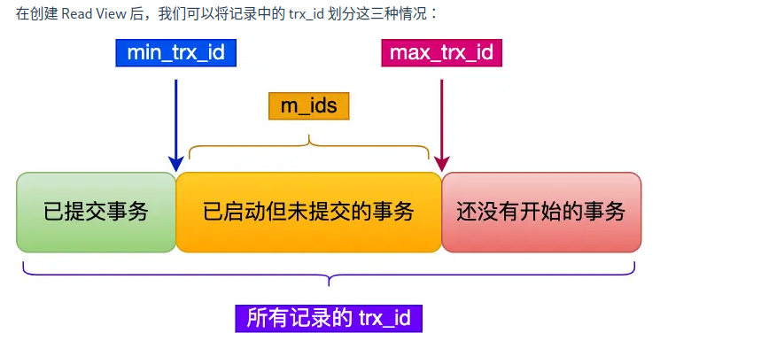

<!--toc:start-->
- [事务](#事务)
  - [ACID](#acid)
  - [脏读](#脏读)
  - [不可重复读](#不可重复读)
  - [幻读](#幻读)
- [事务隔离级别](#事务隔离级别)
  - [MySQL默认的隔离级别是可重复读（不能完全避免幻读），那他的解决方案呢？](#mysql默认的隔离级别是可重复读不能完全避免幻读那他的解决方案呢)
  - [实现](#实现)
  - [ReadView如何在MVCC中工作？](#readview如何在mvcc中工作)
  - [可重复读如何工作？](#可重复读如何工作)
  - [读提交如何工作？](#读提交如何工作)
<!--toc:end-->

# 事务

## ACID

原子、一致、隔离、持久。

## 脏读

一个事务读到了另一个未提交事务修改过的数据，就意味着发生了脏读现象。

## 不可重复读

一个事务内多次读取到同一个数据，如果前后两次读到的数据不一样，就意味着发生了不可重复读的现象。

## 幻读

一个事务内多次查询符合某个查询条件的记录数量，如果出现前后两次查询到的记录数量不一样的情况就意味着幻读。

# 事务隔离级别

在「读未提交」隔离级别下，可能发生脏读、不可重复读和幻读现象；

在「读提交」隔离级别下，可能发生不可重复读和幻读现象，但是不可能发生脏读现象；

在「可重复读」隔离级别下，可能发生幻读现象，但是不可能脏读和不可重复读现象；

在「串行化」隔离级别下，脏读、不可重复读和幻读现象都不可能会发生。

## MySQL默认的隔离级别是可重复读（不能完全避免幻读），那他的解决方案呢？

1. 针对快照读（普通select语句）：

通过MVCC机制解决，因为在可重复读隔离级别下，事务执行过程中看到的数据，一直跟这个事务是一致的，即使中途有其他事务插入了一条数据也是看不到这个数据的，因此就避免了幻读。

2. 针对当前读（select ... for update语句）：

采用Next-Key Lock的方式，执行这条语句的时候，会在这个范围内加一个锁，其他事务要在锁范围内修改数据，就会被阻塞。

## 实现

1. 对于读未提交的事务：因为可以读到未提交事务修改的数据，就直接读取最新的数据。
2. 对于串行化事务：通过加读写锁的方式来避免并行访问。
3. 对于读可提交和可重复读的事务来说：通过Read View来实现，区别在于创建的时机不同。

读提交隔离级别是在每个语句执行前都会重新生成一个ReadView，而可重复读隔离级别是启动事务时生成一个ReadView，然后整个事务期间都在用这个ReadView。

## ReadView如何在MVCC中工作？

ReadView有四个重要字段：

1. m_ids: 指的是创建ReadView时，当前数据库中活跃事务的事务id列表，活跃事务指的是启动了但是还没提交的事务。
2. min\_trx\_id：在创建ReadView时，当前数据库中活跃事务中事务id最小的事务，也就是m_ids最小值。
3. max\_trx\_id：创建ReadView时，当前数据库应该给下一个事务的id值，也就是全局事务中最大的事务id值+1。
4. creator\_trx\_id：创建该ReadView的事务的事务id。

对于使用InnoDB的数据库表，他的聚簇索引记录中包含两个隐藏列：

1. trx\_id: 当一个事务对某条聚簇索引记录进行改动时，就会把该事务的事务id记录在trx\_id隐藏列里；
2. roll\_pointer: 每次对某条聚簇索引记录进行改动时，都会把旧版本的记录写入到undo日志里，然后这个隐藏列是一个指针，指向每一个旧版本记录。

当一个事务去访问记录的时候，除了自己的更新记录总是可见之外，还有这几种情况：

- 如果记录的trx\_id值小于ReadView中的min\_trx\_id值，表示这个版本的记录实在创建ReadView之前已经提交的事务生成的，所以该版本中的记录总是对当前事务可见。
- 如果记录的trx\_id值大于等于生成的ReadView中的max\_trx\_id值，表示这个版本的记录是在创建ReadView后才启动的事务生成的，所以该版本的记录对当前事务不可见。
- 如果记录的trx\_id值在ReaView的min\_trx\_id和max\_trx\_id之间，需要判断trx\_id是否在m\_ids列表之中。
1. 如果记录的trx\_id在m\_ids列表中，表示生成该版本记录的活跃事务依然活跃（没有提交），所以对i当前事务不可见。
2. 如果不再，表示生成该版本记录的活跃事务已经被提交，所以该版本的记录对当前事务可见。

这种用版本链来控制并发事务访问统计一个记录时的行为就叫做MVCC（多版本并发控制）。

## 可重复读如何工作？

可重复读隔离级别是启动事务时生成一个ReadView，然后再整个事务期间都使用这个ReadView。

## 读提交如何工作？

每次读取数据时，生成一个ReadView。
