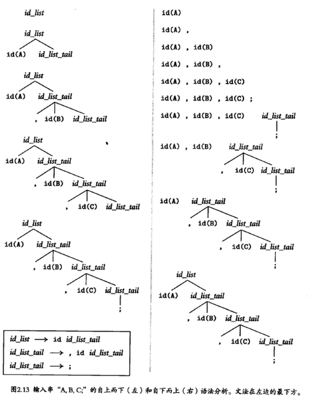

<!--toc:start-->
- [记录一些文法相关知识](#记录一些文法相关知识)
  - [正则语言](#正则语言)
  - [LR文法](#lr文法)
  - [LL文法](#ll文法)
  - [LALR](#lalr)
    - [工作方式](#工作方式)
      - [规约](#规约)
  - [Earley Parser](#earley-parser)
<!--toc:end-->

# 记录一些文法相关知识

## 正则语言

正则语言使用拼接、选择和kleene闭包来定义，并由扫描器识别。

## LR文法

自左向右，最右推导，最大的特点是，扫描的过程中，匹配到一个pattern就移入森林中，直到有一个pattern满足了产生式的右侧，才将其规约到对应的左部。

自下而上查找。

LR文法进行移进和规约，具体体现在从输入流（输入缓冲区）读取下一个符号并推入（Shift）栈中，同时移动输入指针。

规约则是对满足产生式右侧，用该产生式的左侧非终结符替换它们。

## LL文法

自左向右，最左推导，也就是预测式地匹配，顺着分析树向下，追溯出这棵树边缘的最左推导。

自上而下查找。

LL文法有左递归和公共前缀的问题，公共前缀可以用左因子分解的技术来解决。

## LALR

Look-ahead left reversed rightmost derivation.

解析器代码使用 LALR 算法从左到右处理词条流,尝试按照它们出现的顺序和格式在 parse.y 中匹配某条或多条语法规则。解析器代码在需要确定匹配哪条语法规则的时候,也需要向前查看(look ahead)。

### 工作方式

先看LR的部分：

Left指的是解析器从左向右来处理词条流。

R指的是reversed rightmost derivation反向最右推导。

指解析器按照自底向上的策略,使用移位(shift)或规约(reduce)技术,去查找和匹配语法规则。

#### 规约

解析器使用了单个匹配规则替换了一对词条，这时候解析器会仔细检查可用的规则，在能规约的时候就规约，否则就在单个词条上应用匹配规则。

## Earley Parser

基于动态规划的图解析器。

最差的时间复杂度为O(n^3)。
