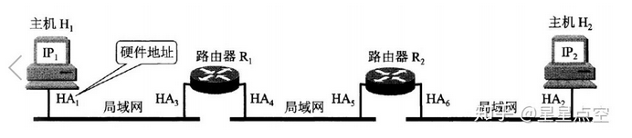

# ARP协议

ARP协议属于网络层的协议，主要作用是实现从IP地址转换为MAC地址。在每个主机或者路由器中都建有一个ARP缓存表，表中有IP地址及IP地址对应的MAC地址。先来看一下什么时IP地址和MAC地址。

- IP地址：IP地址是指互联网协议地址，IP地址是IP协议提供的一种统一的地址格式，它为互联网上的每一个网络和每一台主机分配一个逻辑地址，以此来屏蔽物理地址的差异。
- MAC地址：MAC地址又称物理地址，由网络设备制造商生产时写在硬件内部，不可更改，并且每个以太网设备的MAC地址都是唯一的。

TCP报文在网络层会被封装成IP数据报，在数据链路层被封装成MAC帧，然后在通信链路中传输。在网络层使用的是IP地址，在数据据链路层使用的是MAC地址。MAC帧在传送时的源地址和目的地址使用的都是MAC地址，在通信链路上的主机或路由器也都是根据MAC帧首部的MAC地址接收MAC帧。并且在数据链路层是看不到IP地址的，只有当数据传到网络层时去掉MAC帧的首部和尾部时才能在IP数据报的首部中找到源IP地址和目的地址。

网络层实现的是主机之间的通信，而链路层实现的是链路之间的通信，所以从下图可以看出，在数据传输过程中，IP数据报的源地址(IP1)和目的地址(IP2)是一直不变的，而MAC地址(硬件地址)却一直随着链路的改变而改变。

## 重点

### ARP的工作流程

1. 在局域网内，主机A要向主机B发送IP数据报时，首先会在主机A的ARP缓存表中查找是否有IP地址及其对应的MAC地址，如果有，则将MAC地址写入到MAC帧的首部，并通过局域网将该MAC帧发送到MAC地址所在的主机B。
2. 如果主机A的ARP缓存表中没有主机B的IP地址及所对应的MAC地址，主机A会在局域网内广播发送一个ARP请求分组。局域网内的所有主机都会收到这个ARP请求分组。
3. 主机B在看到主机A发送的ARP请求分组中有自己的IP地址，会像主机A以单播的方式发送一个带有自己MAC地址的响应分组。
4. 主机A收到主机B的ARP响应分组后，会在ARP缓存表中写入主机B的IP地址及其IP地址对应的MAC地址。
5. 如果主机A和主机B不在同一个局域网内，即使知道主机B的MAC地址也是不能直接通信的，必须通过路由器转发到主机B的局域网才可以通过主机B的MAC地址找到主机B。并且主机A和主机B已经可以通信的情况下，主机A的ARP缓存表中存的并不是主机B的IP地址及主机B的MAC地址，而是主机B的IP地址及该通信链路上的下一跳路由器的MAC地址。这就是上图中的源IP地址和目的IP地址一直不变，而MAC地址却随着链路的不同而改变。
6. 如果主机A和主机B不在同一个局域网，参考上图中的主机H1和主机H2，这时主机H1需要先广播找到路由器R1的MAC地址，再由R1广播找到路由器R2的MAC地址，最后R2广播找到主机H2的MAC地址，建立起通信链路。
