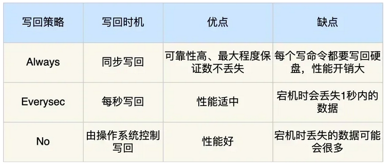

# Redis的大Key问题是什么?

Redis大key问题指的是某个key对应的value值所占的内存空间比较大，导致Redis的性能下降、内存不足、数据不均衡以及主从同步延迟等问题。

## 到底多大的数据量才算是大key？

没有固定的判别标准，通常认为字符串类型的key对应的value值占用空间大于1M，或者集合类型的k元素数量超过1万个，就算是大key。

Redis大key问题的定义及评判准则并非一成不变，而应根据Redis的实际运用以及业务需求来综合评估。

例如，在高并发且低延迟的场景中，仅10kb可能就已构成大key；然而在低并发、高容量的环境下，大key的界限可能在100kb。因此，在设计与运用Redis时，要依据业务需求与性能指标来确立合理的大key阈值。

# 大Key的缺点

- 内存占用过高。大Key占用过多的内存空间，可能导致可用内存不足，从而触发内存淘汰策略。在极端情况下，可能导致内存耗尽，Redis实例崩溃，影响系统的稳定性。
- 性能下降。大Key会占用大量内存空间，导致内存碎片增加，进而影响Redis的性能。对于大Key的操作，如读取、写入、删除等，都会消耗更多的CPU时间和内存资源，进一步降低系统性能。
- 阻塞其他操作。某些对大Key的操作可能会导致Redis实例阻塞。例如，使用DEL命令删除一个大Key时，可能会导致Redis实例在一段时间内无法响应其他客户端请求，从而影响系统的响应时间和吞吐量。
- 网络拥塞。每次获取大key产生的网络流量较大，可能造成机器或局域网的带宽被打满，同时波及其他服务。例如：一个大key占用空间是1MB，每秒访问1000次，就有1000MB的流量。
- 主从同步延迟。当Redis实例配置了主从同步时，大Key可能导致主从同步延迟。由于大Key占用较多内存，同步过程中需要传输大量数据，这会导致主从之间的网络传输延迟增加，进而影响数据一致性。
- 数据倾斜。在Redis集群模式中，某个数据分片的内存使用率远超其他数据分片，无法使数据分片的内存资源达到均衡。另外也可能造成Redis内存达到maxmemory参数定义的上限导致重要的key被逐出，甚至引发内存溢出。

# aof的写入策略，按时间写入和每次都写入的区别？优缺点。

# AOF和RDB的优缺点？

## AOF

1. 优点：首先，AOF提供了更好的数据安全性，因为他默认每接收到一个写命令就追加到文件末尾。即使Redis服务器宕机，也只会丢失最后一次写入前的数据；其次，AOF支持多种同步策略(Always, Everysec, No)，可以根据需要调整数据安全性和性能之间的平衡。同时，AOF文件在Redis启动时可以通过重写机制优化，减少文件体积，加快恢复速度。并且，即使文件发生损坏，AOF还是提供了redis-check-aof工具来修复损坏的文件。
2. 缺点：因为记录了每一个写操作，所以AOF文件通常比RDB文件更大，消耗更多的磁盘空间。并且，频繁的磁盘IO操作（尤其是同步策略设置为always时）可能会对Redis的写入性能造成一定影响。而且，当单个文件体积过大时，AOF会进行重写操作，AOF如果没有开启AOF重写或者重写频率较低，恢复过程可能较慢，因为它需要重放所有的操作命令。

## RDB

1. 优点: RDB通过快照的形式保存某一时刻的数据状态，文件体积小，备份和恢复的速度非常快。并且，RDB是在主线程之外通过fork子进程来进行的，不会阻塞服务器处理命令请求，对Redis服务的性能影响较小。最后，由于是定期快照，RDB文件通常比AOF文件小得多。
2. 缺点: RDB方式在两次快照之间，如果Redis服务器发生故障，这段时间的数据将会丢失。并且，如果在RDB创建快照到恢复期间有写操作，恢复后的数据可能与故障前的数据不完全一致
