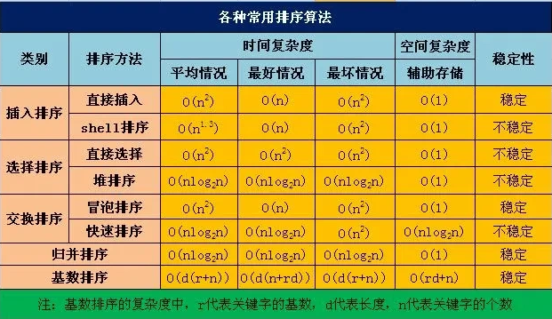

<!--toc:start-->
- [排序算法，以及排序算法的时间/空间复杂度？有序性？](#排序算法以及排序算法的时间空间复杂度有序性)
- [LRU数据结构的缺点？](#lru数据结构的缺点)
<!--toc:end-->

# 排序算法，以及排序算法的时间/空间复杂度？有序性？

- 插入排序：将待排序的元素逐个插入到已排序序列的合适位置，形成有序序列。最好时间复杂度为O(n)，最坏情况下为O(n^2)，平均为O(n^2)，原地交换。
- 选择排序：通过不断选择为排序部分的最小元素，将其放置在已排序部分的末尾。最坏/最好/平均时间复杂度都是O(n^2)。
- 堆排序：通过将带排序元素构建成一个最大堆/最小堆，然后将堆顶的元素与末尾元素交换，再重新调整堆，重复该过程知道排序完成。最好时间复杂度O(n log(n))，最坏O(n log(n))，平均为O(n lon(n))。
- 冒泡排序：通过相邻元素的比较和交换，每次将最大或者最小的元素冒泡到最后/最前。
- 快速排序：通过选择一个基准元素，将数组划分为两个子数组，使得左子数组的元素都小于（或等于）基准元素，右侧的则是都大于基准元素，然后对子数组进行排序。
- 基数排序：基数排序是一种非比较型整数排序算法，它通过按位分配和收集元素来实现排序。基数排序通常用于对整数或字符串进行排序。

当待排序的关键字是随机分布时，快速排序的平均时间最短；

排序稳定指的是在排序过程中，对于具有相同排序关键字的元素，在排序后它们的相对位置保持不变。

# LRU数据结构的缺点？

1. 预读失效导致缓存命中率下降。
2. 缓存污染导致缓存命中率下降。
