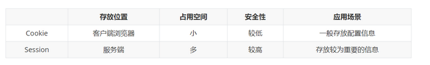

<!--toc:start-->
- [可能会问到的题目](#可能会问到的题目)
  - [请你讲一下TCP的三次握手](#请你讲一下tcp的三次握手)
  - [请你讲一下TCP的四次挥手](#请你讲一下tcp的四次挥手)
  - [请你讲一下TCP中的拥塞控制机制](#请你讲一下tcp中的拥塞控制机制)
  - [请你讲一下TCP中的重传机制](#请你讲一下tcp中的重传机制)
  - [HTTP的无状态体现在哪？](#http的无状态体现在哪)
  - [Cookie和Session的区别](#cookie和session的区别)
- [计算机网络的各层协议及作用？](#计算机网络的各层协议及作用)
- [实际问到过的](#实际问到过的)
  - [请你讲述一下浏览器中输入一个链接会发生什么事情？](#请你讲述一下浏览器中输入一个链接会发生什么事情)
  - [TCP和UDP的区别？](#tcp和udp的区别)
  - [TCP协议如何保证可靠传输？](#tcp协议如何保证可靠传输)
  - [TCP四次挥手](#tcp四次挥手)
  - [为什么客户端发出第四次挥手的确认报文后要等2MSL的时间才能释放TCP连接？](#为什么客户端发出第四次挥手的确认报文后要等2msl的时间才能释放tcp连接)
- [Session、Cookie、Token的主要区别？](#sessioncookietoken的主要区别)
  - [Cookie](#cookie)
  - [Session](#session)
  - [Token](#token)
    - [Cookie 和 Session 的区别](#cookie-和-session-的区别)
- [HTTPS怎么确认收到的包就是服务器发来的？](#https怎么确认收到的包就是服务器发来的)
- [TIME_WAIT状态是什么？](#timewait状态是什么)
- [长连接与短连接](#长连接与短连接)
  - [优缺点](#优缺点)
- [长轮询短轮询](#长轮询短轮询)
  - [区别](#区别)
- [四次挥手中收到乱序的 FIN 包会如何处理？](#四次挥手中收到乱序的-fin-包会如何处理)
<!--toc:end-->

# 可能会问到的题目

## 请你讲一下TCP的三次握手

## 请你讲一下TCP的四次挥手

## 请你讲一下TCP中的拥塞控制机制

## 请你讲一下TCP中的重传机制

## HTTP的无状态体现在哪？

体现在每个请求之间相互独立，服务器不会保留之前请求的状态信息。每次客户端向服务器发送请求时，服务器都会独立处理该请求，不会记住之前的请求信息或状态。

这意味着服务器无法知道两次请求是否来自同一个客户端，也无法知道客户端的历史状态，需要通过其他机制（Cookie，Session）来维护和管理状态信息。

Cookie通过在请求和响应报文中写入Cookie信息来控制客户端状态。

## Cookie和Session的区别

- 存储位置：Cookie存储在客户端中，而Session存储在服务器端。
- 安全性：由于Cookie存储在客户端，容易受到安全攻击，例如XSS和XSRF。而Session存储在服务器端，对客户端不可见，相对来说更安全。
- 存储容量：Cookie存储有限，通常为4KB。

# 计算机网络的各层协议及作用？

- 应用层
应用层的任务是通过应用进程之间的交互来完成特定的网络作用，常见的应用层协议有域名系统DNS，HTTP协议等。
- 表示层
表示层的主要作用是数据的表示、安全、压缩。可确保一个系统的应用层所发送的信息可以被另一个系统的应用层读取。
- 会话层
会话层的主要作用是建立通信链接，保持会话过程通信链接的畅通，同步两个节点之间的对话，决定通信是否被中断以及通信中断时决定从何处重新发送。。
- 传输层
传输层的主要作用是负责向两台主机进程之间的通信提供数据传输服务。传输层的协议主要有传输控制协议TCP和用户数据协议UDP。
- 网络层
网络层的主要作用是选择合适的网间路由和交换结点，确保数据及时送达。常见的协议有IP协议。
- 数据链路层
数据链路层的作用是在物理层提供比特流服务的基础上，建立相邻结点之间的数据链路，通过差错控制提供数据帧（Frame）在信道上无差错的传输，并进行各电路上的动作系列。 常见的协议有SDLC、HDLC、PPP等。
- 物理层
物理层的主要作用是实现相邻计算机结点之间比特流的透明传输，并尽量屏蔽掉具体传输介质和物理设备的差异。

# 实际问到过的

## 请你讲述一下浏览器中输入一个链接会发生什么事情？

## TCP和UDP的区别？

- 首部
- 是否面向连接
- 可靠性
- 传输形式
- 效率
- 资源消耗
- 应用场景

## TCP协议如何保证可靠传输？

主要有校验和、序列号、超时重传、流量控制及拥塞避免等几种方法。

- 校验和：在发送端和接收端分别计算数据的校验和，如果两者不一致，则说明数据在传输过程中出现了差错，TCP将丢弃和不确认此报文段。
- 序列号：TCP会对每一个发送的字节进行编号，接收方接到数据后，会对发送方发送确认应答(ACK报文)，并且这个ACK报文中带有相应的确认编号，告诉发送方，下一次发送的数据从编号多少开始发。如果发送方发送相同的数据，接收端也可以通过序列号判断出，直接将数据丢弃。
- 超时重传：在上面说了序列号的作用，但如果发送方在发送数据后一段时间内（可以设置重传计时器规定这段时间）没有收到确认序号ACK，那么发送方就会重新发送数据。这里发送方没有收到ACK可以分两种情况，如果是发送方发送的数据包丢失了，接收方收到发送方重新发送的数据包后会马上给发送方发送ACK；如果是接收方之前接收到了发送方发送的数据包，而返回给发送方的ACK丢失了，这种情况，发送方重传后，接收方会直接丢弃发送方冲重传的数据包，然后再次发送ACK响应报文。如果数据被重发之后还是没有收到接收方的确认应答，则进行再次发送。此时，等待确认应答的时间将会以2倍、4倍的指数函数延长，直到最后关闭连接。
- 流量控制：如果发送端发送的数据太快，接收端来不及接收就会出现丢包问题。为了解决这个问题，TCP协议利用了滑动窗口进行了流量控制。在TCP首部有一个16位字段大小的窗口，窗口的大小就是接收端接收数据缓冲区的剩余大小。接收端会在收到数据包后发送ACK报文时，将自己的窗口大小填入ACK中，发送方会根据ACK报文中的窗口大小进而控制发送速度。如果窗口大小为零，发送方会停止发送数据。
- 拥塞控制：如果网络出现拥塞，则会产生丢包等问题，这时发送方会将丢失的数据包继续重传，网络拥塞会更加严重，所以在网络出现拥塞时应注意控制发送方的发送数据，降低整个网络的拥塞程度。拥塞控制主要有四部分组成：慢开始、拥塞避免、快重传、快恢复。

这里的发送方会维护一个拥塞窗口的状态变量，它和流量控制的滑动窗口是不一样的，滑动窗口是根据接收方数据缓冲区大小确定的，而拥塞窗口是根据网络的拥塞情况动态确定的，一般来说发送方真实的发送窗口为滑动窗口和拥塞窗口中的最小值。

        慢开始：为了避免一开始发送大量的数据而产生网络阻塞，会先初始化cwnd为1，当收到ACK后到下一个传输轮次，cwnd为2，以此类推成指数形式增长。
        拥塞避免：因为cwnd的数量在慢开始是指数增长的，为了防止cwnd数量过大而导致网络阻塞，会设置一个慢开始的门限值ssthresh，当cwnd>=ssthresh时，进入到拥塞避免阶段，cwnd每个传输轮次加1。但网络出现超时，会将门限值ssthresh变为出现超时cwnd数值的一半，cwnd重新设置为1，如上图，在第12轮出现超时后，cwnd变为1，ssthresh变为12。
        快重传：在网络中如果出现超时或者阻塞，则按慢开始和拥塞避免算法进行调整。但如果只是丢失某一个报文段，如下图(图片来源于网络)，则使用快重传算法。
        快恢复：从上上图圈4可以看到，当发送收到三个重复的ACK，会进行快重传和快恢复。快恢复是指将ssthresh设置为发生快重传时的cwnd数量的一半，而cwnd不是设置为1而是设置为为门限值ssthresh，并开始拥塞避免阶段。

## TCP四次挥手

- 第一次挥手：客户端向服务端发送的数据完成后，向服务端发起释放连接报文，报文包含标志位FIN=1，序列号seq=u。此时客户端只能接收数据，不能向服务端发送数据。
- 第二次挥手：服务端收到客户端的释放连接报文后，向客户端发送确认报文，包含标志位ACK=1，序列号seq=v，确认号ack=u+1。此时客户端到服务端的连接已经释放掉，客户端不能像服务端发送数据，服务端也不能向客户端发送数据。但服务端到客户端的单向连接还能正常传输数据。
- 第三次挥手：服务端发送完数据后向客户端发出连接释放报文，报文包含标志位FIN=1，标志位ACK=1，序列号seq=w，确认号ack=u+1。
- 第四次挥手：客户端收到服务端发送的释放连接请求，向服务端发送确认报文，包含标志位ACK=1，序列号seq=u+1，确认号ack=w+1。

## 为什么客户端发出第四次挥手的确认报文后要等2MSL的时间才能释放TCP连接？
- 客户端发送第四次挥手中的报文后，再经过2MSL，可使本次TCP连接中的所有报文全部消失，不会出现在下一个TCP连接中。
- 考虑丢包问题，如果第四挥手发送的报文在传输过程中丢失了，那么服务端没收到确认ack报文就会重发第三次挥手的报文。如果客户端发送完第四次挥手的确认报文后直接关闭，而这次报文又恰好丢失，则会造成服务端无法正常关闭。

# Session、Cookie、Token的主要区别？

HTTP协议是无状态的，即服务器无法判断用户身份。Session和Cookie可以用来进行身份辨认。

## Cookie
    Cookie是保存在客户端一个小数据块，其中包含了用户信息。当客户端向服务端发起请求，服务端会像客户端浏览器发送一个Cookie，客户端会把Cookie存起来，当下次客户端再次请求服务端时，会携带上这个Cookie，服务端会通过这个Cookie来确定身份。

首先产生了 cookie 这门技术来解决这个问题，cookie 是 http 协议的一部分，它的处理分为如下几步：

服务器向客户端发送 cookie。

通常使用 HTTP 协议规定的 set-cookie 头操作。

规范规定 cookie 的格式为 name = value 格式，且必须包含这部分。

浏览器将 cookie 保存。

每次请求浏览器都会将 cookie 发向服务器。

cookie机制是采用在客户端保持状态的方案（cookie的作用就是为了解决HTTP协议无状态的缺陷所作的努力）。cookie是保存在本地终端的数据。cookie由服务器生成，发送给浏览器，浏览器把cookie以kv形式保存到某个目录下的文本文件内，下一次请求同一网站时, 按照一定的原则在后台自动把该cookie发送给服务器(浏览器检查所有存储的cookie，如果某个cookie所声明的作用范围大于等于将要请求的资源所在的位置，则把该cookie附在请求资源的HTTP请求头上发送给服务器)。由于cookie是存在客户端上的，所以浏览器加入了一些限制确保cookie不会被恶意使用，同时不会占据太多磁盘空间，所以每个域的cookie数量是有限的。

## Session
    Session是通过Cookie实现的，和Cookie不同的是，Session是存在服务端的。当客户端浏览器第一次访问服务器时，服务器会为浏览器创建一个sessionid，将sessionid放到Cookie中，存在客户端浏览器。比如浏览器访问的是购物网站，将一本《图解HTTP》放到了购物车，当浏览器再次访问服务器时，服务器会取出Cookie中的sessionid，并根据sessionid获取会话中的存储的信息，确认浏览器的身份是上次将《图解HTTP》放入到购物车那个用户。

session的中文翻译是“会话”，当用户打开某个web应用时，便与web服务器产生一次session。服务器使用session把用户的信息临时保存在了服务器上，用户离开网站后session会被销毁。这种用户信息存储方式相对cookie来说更安全，可是session有一个缺陷：如果web服务器做了负载均衡，那么下一个操作请求到了另一台服务器的时候session会丢失。

session机制是一种服务器端的机制，服务器使用一种类似于散列表的结构（也可能就是使用散列表）来保存信息。

当程序需要为某个客户端的请求创建一个session时，服务器首先检查这个客户端的请求里是否已包含了一个session标识（称为session id），如果已包含则说明以前已经为此客户端创建过session,服务器就按照session id把这个session检索出来使用（检索不到，会新建一个），如果客户端请求不包含session id，则为此客户端创建一个session并且生成一个与此session相关联的session id，session id的值应该是一个既不会重复，又不容易被找到规律以伪造的字符串，这个session id将被 在本次响应中返回给客户端保存。保存这个session id的方式可以采用cookie，这样在交互过程中浏览器 可以自动的按照规则把这个标识发送给服务器。一般这个cookie的名字就是类似于SESSIONID。

## Token
    客户端在浏览器第一次访问服务端时，服务端生成的一串字符串作为Token发给客户端浏览器，下次浏览器在访问服务端时携带token即可无需验证用户名和密码，省下来大量的资源开销。

### Cookie 和 Session 的区别

1. cookie数据存放在客户的浏览器上，session数据放在服务器上。

2. cookie不是很安全，别人可以分析存放在本地的COOKIE并进行COOKIE欺骗
考虑到安全应当使用session。

3. session会在一定时间内保存在服务器上。当访问增多，会比较占用你服务器的性能
考虑到减轻服务器性能方面，应当使用COOKIE。

4. 单个cookie保存的数据不能超过4K，很多浏览器都限制一个站点最多保存20个cookie。

# HTTPS怎么确认收到的包就是服务器发来的？

https对端口和ip不加密，建立通信之后，后续的包就知道是服务器发来的了。

也就是回答TLS/SSL的内容。

# TIME_WAIT状态是什么？

- 防止具有相同四元组的旧数据包被受到。
- 保证被动关闭连接的一方能够正确关闭。

# 长连接与短连接

在HTTP/1.0中默认使用短连接。也就是说，客户端和服务器每进行一次HTTP操作，就建立一次连接，任务结束就中断连接。当客户端浏览器访问的某个HTMLweb或其他类型的JavaScriptCSS页中包含有其他的Web资源（如文件、图像文件、文件等），每遇到这样一个Web资源，浏览器就会重新建立一个HTTP会话。·

而从HTTP/1.1起，默认使用长连接，用以保持连接特性。使用长连接的HTTP协议，会在响应头加入这行代码：

Connection:keep-alive

在使用长连接的情况下，当一个网页打开完成后，客户端和服务器之间用于传输HTTP数据的TCP连接不会关闭，客户端再次访问这个服务器时，会继续使用这一条已经建立的连接。Keep-Alive不会永久保持连接，它有一个保持时间，可以在不同的服务器软件（如Apache）中设定这个时间。实现长连接需要客户端和服务端都支持长连接。

HTTP协议的长连接和短连接，实质上是TCP协议的长连接和短连接。

## 优缺点

长连接可以省去较多的TCP建立和关闭的操作，减少浪费，节约时间。对于频繁请求资源的客户端适合使用长连接。在长连接的应用场景下，client端一般不会主动关闭连接，当client与server之间的连接一直不关闭，随着客户端连接越来越多，server会保持过多连接。这时候server端需要采取一些策略，如关闭一些长时间没有请求发生的连接，这样可以避免一些恶意连接导致server端服务受损；如果条件允许则可以限制每个客户端的最大长连接数，这样可以完全避免恶意的客户端拖垮整体后端服务。

短连接对于服务器来说管理较为简单，存在的连接都是有用的连接，不需要额外的控制手段。但如果客户请求频繁，将在TCP的建立和关闭操作上浪费较多时间和带宽。

长连接和短连接的产生在于client和server采取的关闭策略。不同的应用场景适合采用不同的策略。

# 长轮询短轮询

长轮询本身不是一种真正的推送技术，而只是传统轮询技术的一个变种。然而，其能够在真正推送技术无法实现时模拟推送机制。

在长轮询机制中，客户端像传统轮询一样从服务器请求数据。然而，如果服务器没有可以立即返回给客户端的数据，则不会立刻返回一个空结果，而是保持这个请求等待数据到来（或者恰当的超时），之后将数据作为结果返回给客户端。

例如，BOSH是一个常见的、长久的、在TCP困难或无法实现的情况下（如在使用浏览器的情况下）使用长轮询模拟TCP的技术。这也是一种XMPP中隐含的技术，苹果公司将其用于iCloud推送支持。

## 区别

- 短轮询：重复发送Http请求，查询目标事件是否完成，优点：编写简单，缺点：浪费带宽和服务器资源
- 长轮询：在服务端hold住Http请求（死循环或者sleep等等方式），等到目标时间发生，返回Http响应。优点：在无消息的情况下不会频繁的请求，缺点：编写复杂

# 四次挥手中收到乱序的 FIN 包会如何处理？

在 FINWAIT2 状态时，如果收到乱序的 FIN 报文，那么就被会加入到「乱序队列」，并不会进入到
TIME_WAIT 状态。

等再次收到前面被网络延迟的数据包时，会判断乱序队列有没有数据，然后会检测乱序队列中是否
可用的数据，如果能在乱序队列中找到与当前报文的序列号保持的顺序的报文，就会看该报文是否有FIN 标志，如果发现有 FIN 标志，这时才会进入 TIME_WAIT 状态。
